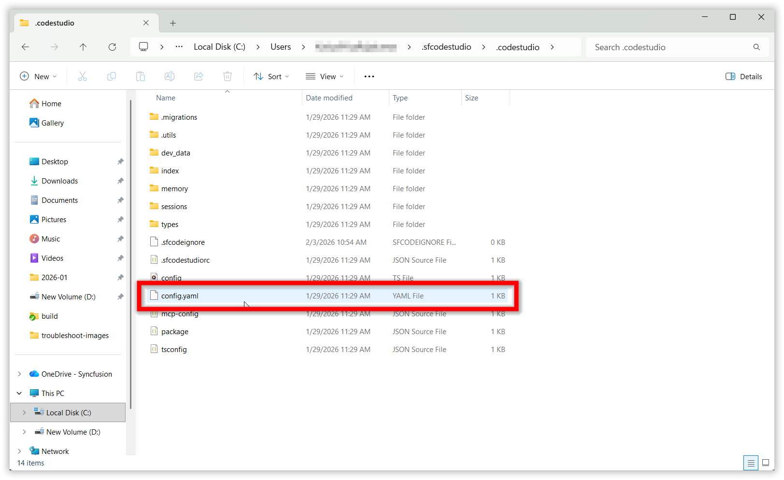

# How to remove cache folders of Code Studio to resolve the app corruption.

This guide explains how to delete the Code Studio cache folders when you encounter application corruption issues.

## Problem Summary

This procedure helps you reset Syncfusion Code Studio to its default state by clearing cache files and configuration data. This process helps restore the application to its default state.

## Possible Causes

- **Auto update issues**: Incomplete or interrupted automatic updates may require cache clearing to ensure proper functionality
- **Configuration reset needed**: The `config.yaml` file requires restoration to default settings
- **Routine maintenance**: Application cache folders benefit from periodic clearing
- **System configuration updates**: Changes in system settings may necessitate cache refresh
- **Performance optimization**: Regular cache clearing maintains optimal application performance

## Resolution Steps: Steps to Delete the Cache Folders

### Step 1: Delete the config.yaml File

The `config.yaml` file stores application configuration settings. Deleting this file will reset the configuration to defaults.

#### Windows

Delete the `config.yaml` file located at:

```
C:\Users\YourName\.sfcodestudio\.codestudio\config.yaml
```


#### macOS

Delete the `config.yaml` file located at:

```
/Users/YourName/.sfcodestudio/.codestudio/config.yaml
```


### Step 2: Delete the Syncfusion Code Studio Folders

After removing the configuration file, you need to delete the main application folders to completely clear the cache.

#### Windows

Delete the Syncfusion Code Studio folders at these locations:

**Program Files:**
```
C:\Program Files\Syncfusion Code Studio
```


**AppData Roaming:**
```
C:\Users\YourName\AppData\Roaming\Syncfusion Code Studio
```


#### macOS

Delete the Syncfusion Code Studio folders at these locations:

**Application Support:**
```
/Users/YourName/Library/Application Support/Syncfusion Code Studio
```


**Applications:**
```
/Applications/Syncfusion Code Studio
```


## After Deleting Cache Folders

Once you've completed both steps:

1. Restart your computer to ensure all files are properly released
2. Reinstall Syncfusion Code Studio, refer to the [Syncfusion Code Studio Install and Configure](https://help.syncfusion.com/code-studio/getting-started/install-and-configuration) 
3. Launch the application - it will create fresh configuration files and cache

**Notes**: Backup Recommendation - If you have custom configurations you want to preserve, consider backing up the folders before deleting them.
