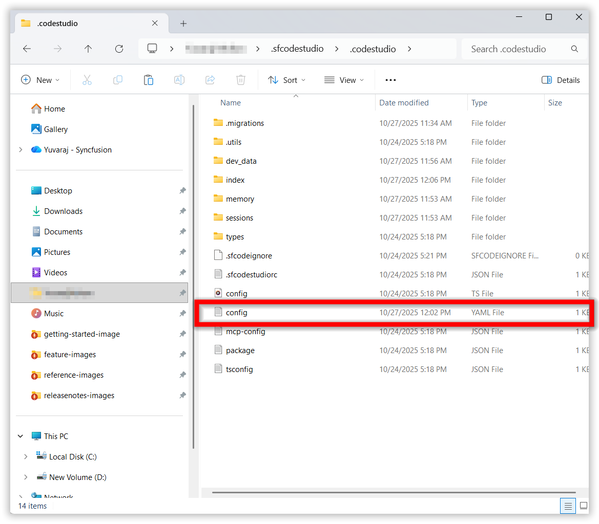
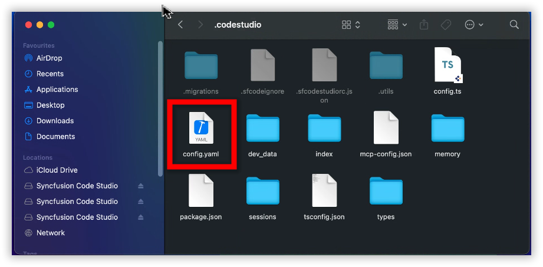
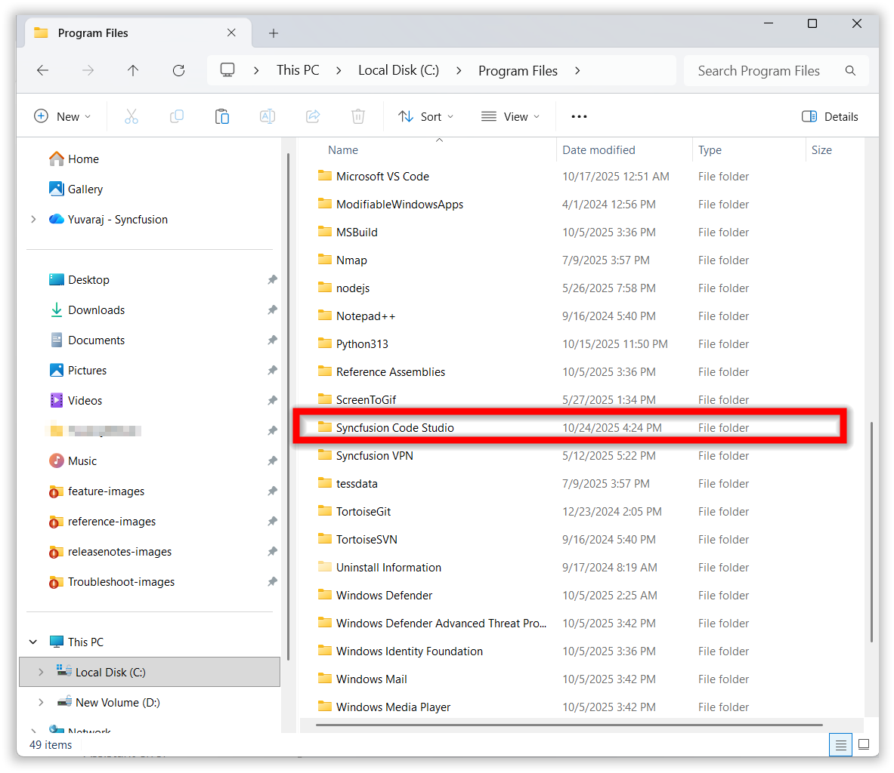
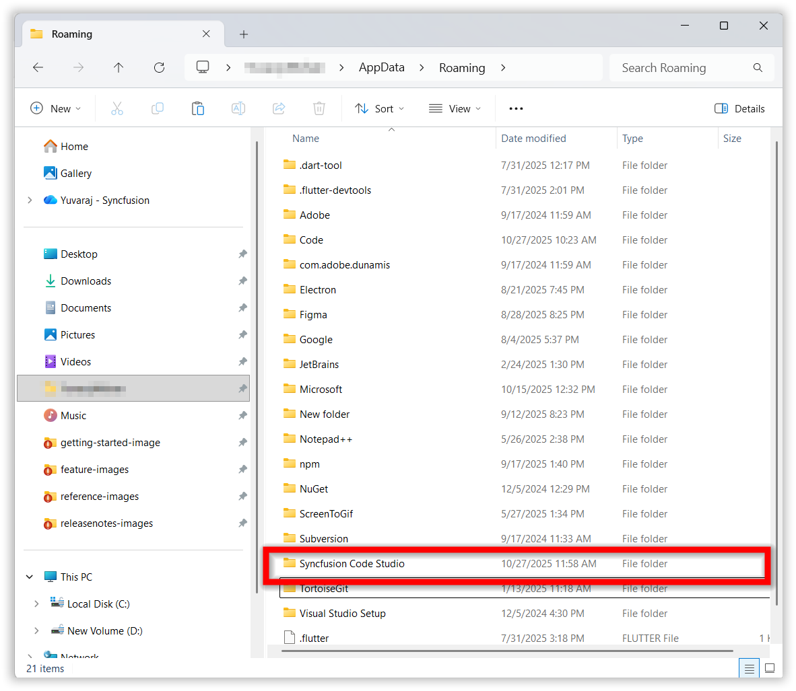
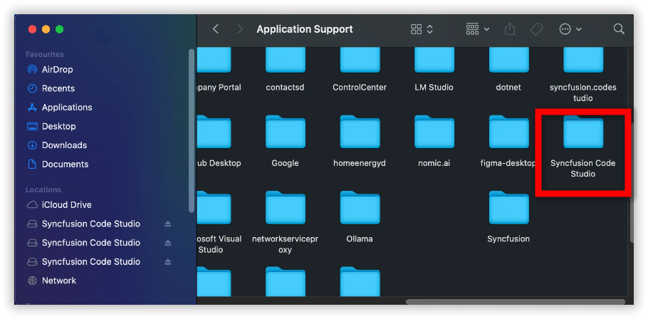
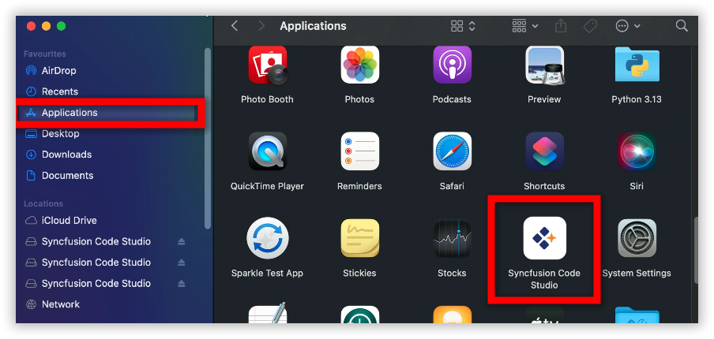

# How to remove cache folders of code studio to resolve the app corruption.

This guide explains how to delete the Code Studio cache folders when you encounter application corruption issues.

## Steps to Delete the Cache Folders

### step 1: Delete the config.yaml file 
### WINDOWS 

Delete the config.yaml file in this location "C:\Users\YourName\.sfcodestudio\.codestudio\config.yaml"

### MAC
Delete the config.yaml file in this location "Users\syncfusion\.sfcodestudio\.codestudio\config.yaml"

### step 2: Delete the Syncfusion Code studio folders
### WINDOWS
Delete the Syncfusion Code Studio folder in these locations "C:\Program Files\Syncfusion Code Studio" and "C:\Users\YourName\AppData\Roaming\Syncfusion Code Studio"

### MAC
Delete the Syncfusion Code Studio folder in these locations "Users\syncfusion\Library\Application Support\Syncfusion Code Studio" and "Applications\Syncfusion Code Studio"

