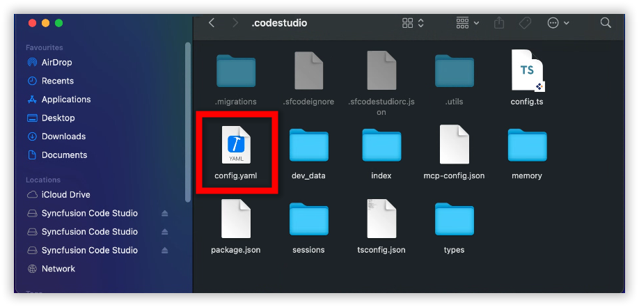

# Overview
This guide explains how to delete **Syncfusion Code Studio cache folders** when you encounter application corruption issues.

## When to Use
Use this cleanup process if:

- **Syncfusion Code Studio** is crashing, freezing, or behaving unexpectedly.
- You suspect **corrupted configuration or cache files** are affecting performance.
- You need to **reset the app environment without reinstalling the entire IDE**.

## Steps to Delete the Cache Folders

### Step 1: Delete the config.yaml file 
### WINDOWS 

Delete the config.yaml file in this location "C:\Users\YourName\ .sfcodestudio\ .codestudio\config.yaml"

### MAC
Delete the config.yaml file in this location "Users\syncfusion\ .sfcodestudio\ .codestudio\config.yaml"

### Step 2: Delete the Syncfusion Code Studio folders
### WINDOWS
Delete the Syncfusion Code Studio folder in this locations "C:\Users\YourName\AppData\Roaming\Syncfusion Code Studio"

### MAC
Delete the Syncfusion Code Studio folder in this locations "Users\syncfusion\Library\Application Support\Syncfusion Code Studio".

##  Validation
- Relaunch **Syncfusion Code Studio** and confirm it starts with **default settings**.
- Check that previous corruption symptoms (e.g., crashes, UI glitches) are resolved.
- Verify that **new configuration files** are generated after relaunch.

