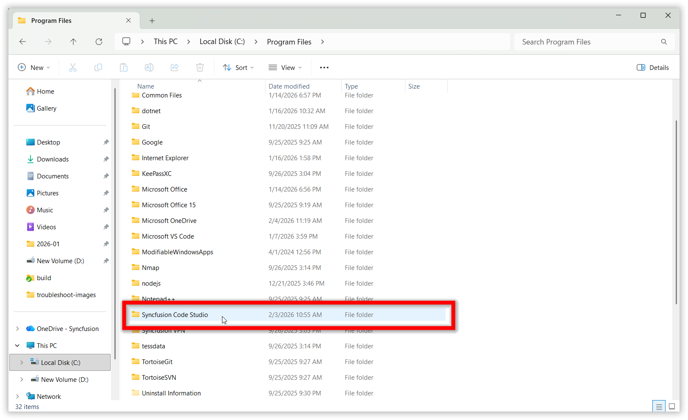
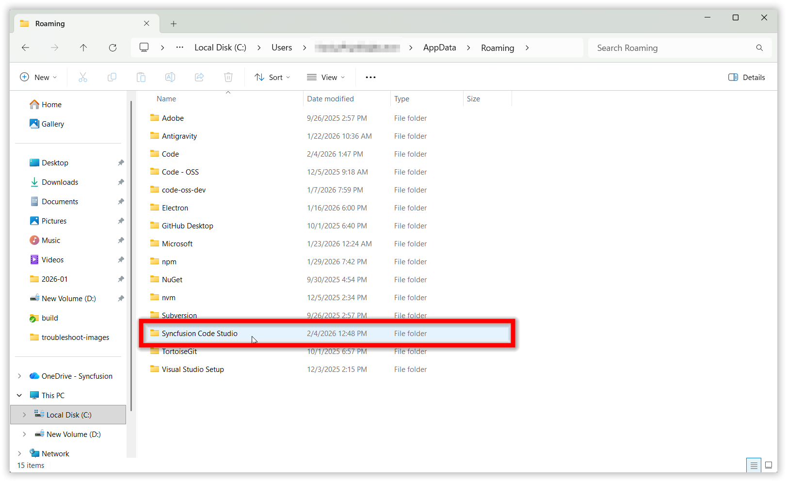
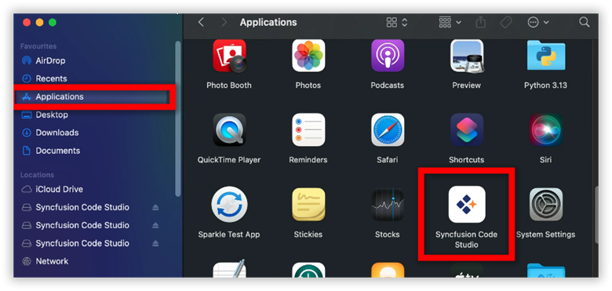
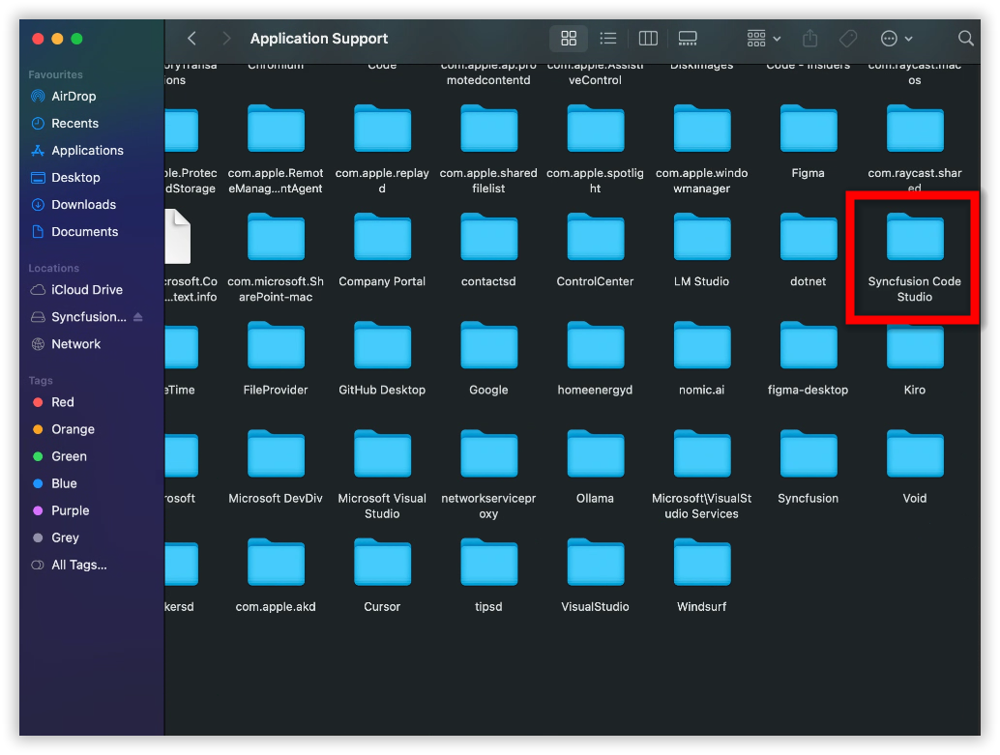

# How to resolve Code Studio app corruption.

When Syncfusion Code Studio becomes corrupted or stops functioning correctly, a full reset of the application may be required. This guide explains how to completely remove Code Studio's program files and configuration data so you can reinstall with a clean state.

## Problem Summary

Application corruption can occur when essential Code Studio files—such as installation components, configuration data, or cache folders—become damaged or inconsistent. These issues may prevent the IDE from launching, updating, or functioning normally. This guide explains how to fully remove all relevant directories so that a clean reinstallation can rebuild fresh, working files and resolve corruption‑related problems.

## Possible Causes

- **Auto update issues**: Incomplete or interrupted automatic updates can sometimes affect application stability clearing the cache helps refresh the IDE and resolve update-related behavior.
- **System configuration updates**: Recent changes to your operating system settings may require a cache refresh to ensure compatibility.
- **Performance optimization**: Regularly clearing the cache helps maintain smooth and optimal application performance over time.

## Resolution Steps

### Step 1: Backup Custom Configurations

If you have [custom agents](/code-studio/reference/configure-properties/custom-agents) or settings, backup before proceeding.

### Step 2: Delete Application Folders

You need to delete the main application folders to completely resolve the issue.

#### Windows

Delete the Syncfusion Code Studio folders at these locations:

**Program Files:**
```
C:\Program Files\Syncfusion Code Studio
```


**AppData Roaming:**
```
C:\Users\YourName\AppData\Roaming\Syncfusion Code Studio
```


#### macOS

Delete the Syncfusion Code Studio folders at these locations:

**Applications:**
```
/Applications/Syncfusion Code Studio
```


**Application Support:**
```
/Users/YourName/Library/Application Support/Syncfusion Code Studio
```



### Step 3: Reinstall and Restore

Once you've completed above step:

1. Restart your computer to ensure all files are properly released
2. Reinstall Syncfusion Code Studio, refer to the [Syncfusion Code Studio Install and Configure](/code-studio/getting-started/install-and-configuration) 
3. Launch the application - it will create fresh configuration files and cache


