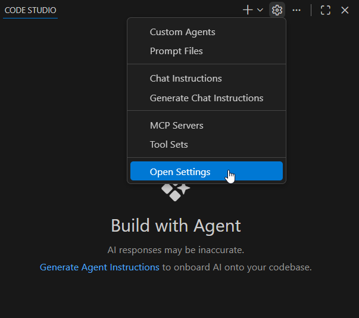
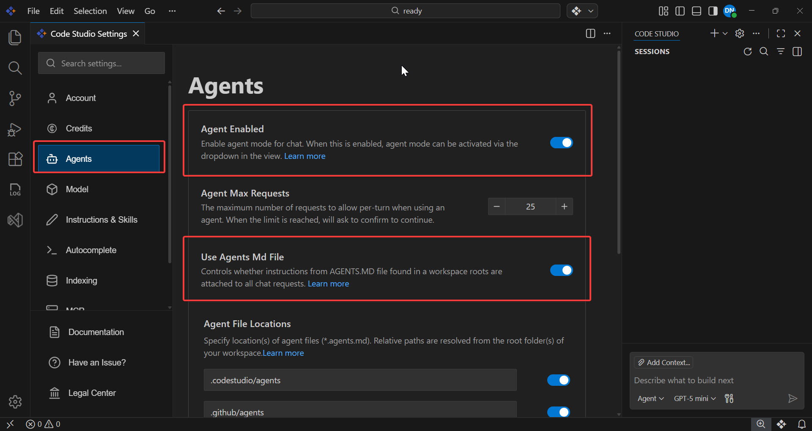

# How to Migrate Agent Files from v1.x.x to v2.0.0+

This guide explains how to migrate Agent files from Code Studio v1.x.x to v2.0.0 and later versions so they remain compatible with the updated settings.

## Problem Summary
After upgrading to Code Studio v2.0.0 and later versions, Agent rules may stop working unless you rename your Agent files and update the **Agents** settings.

## Resolution Steps

### Step 1: Rename Your Agent File
Rename your file from `agent.md` to `agents.md` (plural) in your project root directory.

### Step 2: Update Settings Configuration

**Settings in v2.0.0 and later versions:**
1. Click the Settings icon.

    

2. Open Settings

    

3. In the settings window, select **Agents** in the sidebar.

    

4. Ensure **Agent Enabled** and **Use Agents Md file** are enabled.

**Note**: Keep your agent instructions under 500 lines to avoid context length issues.

