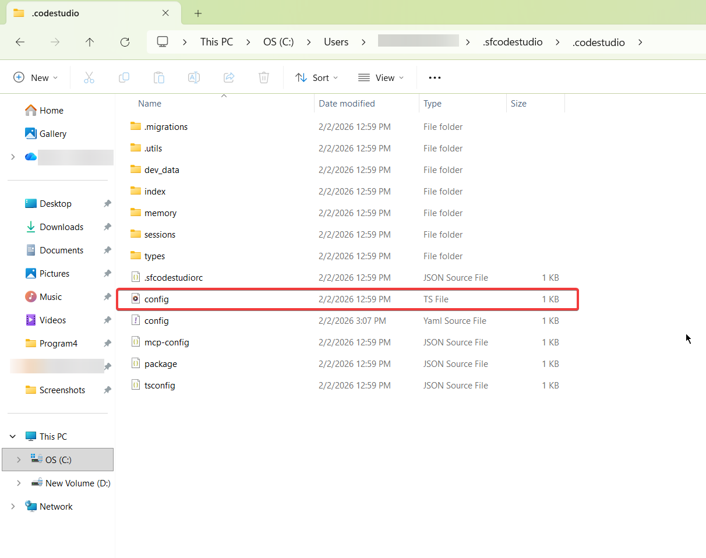
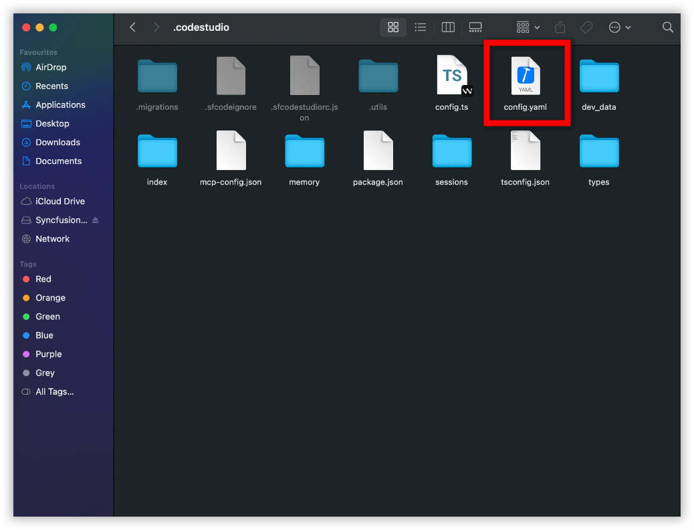
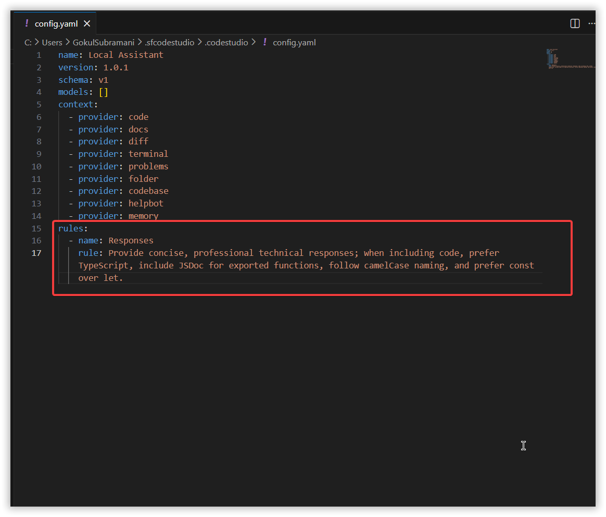
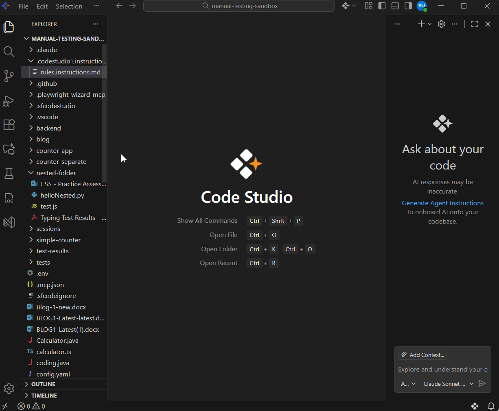
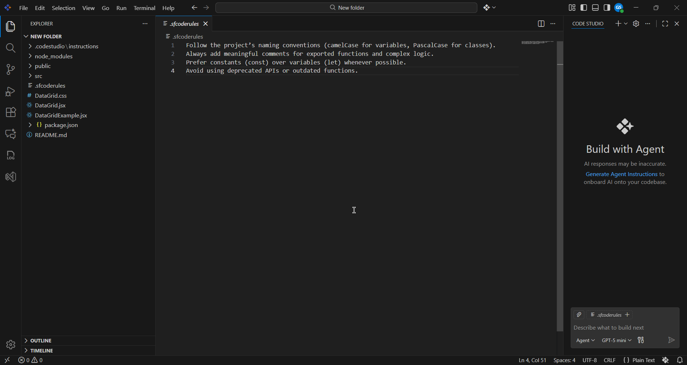
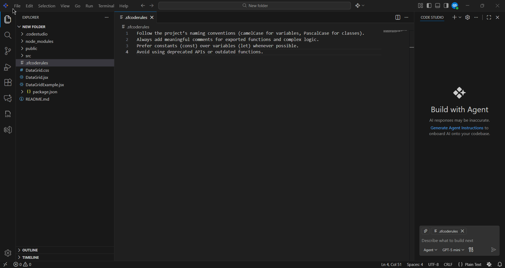

# How to Migrate Code Studio Rules to Instructions

## Problem Summary
In versions prior to 2.0.0, Code Studio stored rule configurations in two legacy formats: `config.yaml` and `.sfcoderules`. Starting from version 2.0.0, these formats are no longer supported. All rule definitions must now be migrated to the Custom Instructions file structure to ensure Code Studio continues applying them correctly.

## Possible Causes
- In earlier versions of Code Studio, rules were stored in legacy locations (`config.yaml` and `.sfcoderules`) and Code Studio automatically used them.  Starting from version 2.0.0, these legacy files are no longer detected or processed.

## Resolution Steps

### Step 1: Create a New Instruction File
---
- Open Code Studio.
- Create a new instruction file following the [Custom Instructions](../reference/configure-properties/custom-instructions.md)

> Note: Custom Instructions are supported only in version 2.0.0 or later.  If you are using an older version, please update to the latest version of Code Studio.


### Step 2: Migrate Existing Rules
---

### If Your Rules Were in `config.yaml`

- Open the `config.yaml`.

**Windows**

```
C:\Users\<YourName>\.sfcodestudio\.codestudio\config.yaml
```
<br/>

**macOS**

```
/Users/<YourName>/.sfcodestudio/.codestudio/config.yaml
```
<br/>

- Locate the `rules:` section.  

<br/>

- Copy all rule descriptions.

- Paste them into the new instruction file below the `applyTo` section. 

<br/>

- Save the file.


### If Your Rules Were in `.sfcoderules` File

- Open the `.sfcoderules` file in the workspace.

<br/> 

- Copy all lines.

- Paste them into your new instruction file below the `applyTo` section.  

<br/>

- Save the file.


## How Instruction Files Will Work
Once your instructions file is saved, Code Studio will:

- Automatically reference your new instructions
- Apply them to all future requests

<br/>