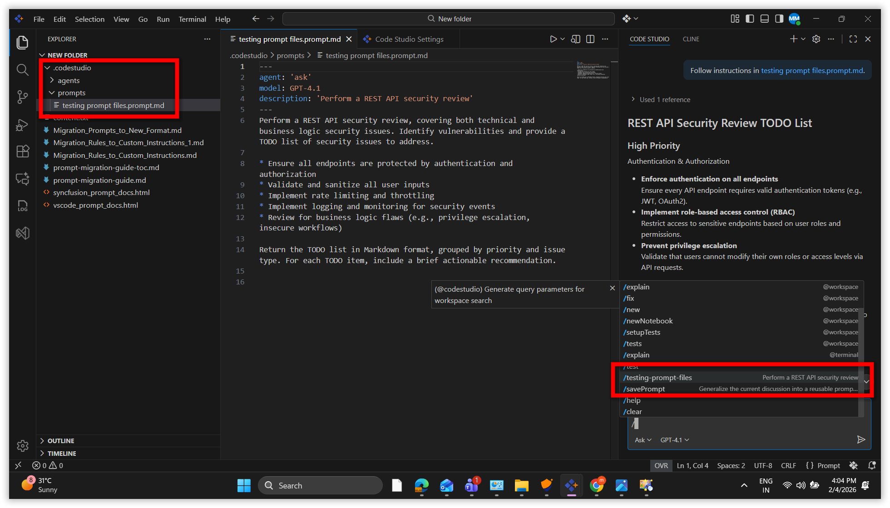
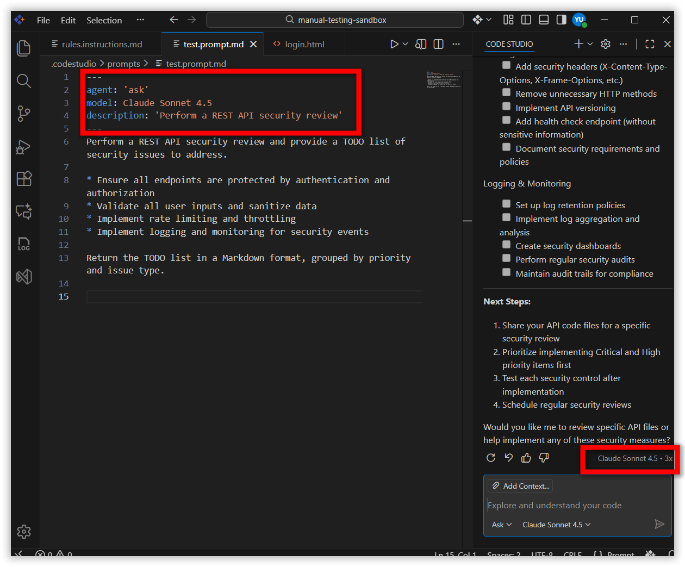

# Migrate Legacy Prompt Files: Troubleshooting Guide

## Problem Summary
Legacy Code Studio prompt files (`.prompt` in `.codestudio/prompts/`) from versions before 2.0.0 are not recognized or usable in Code Studio 2.0.0 and later, which requires the new `.prompt.md` format with YAML frontmatter and Markdown support. Users may find their old prompts missing, not appearing in chat, or not functioning as expected.

## Possible Causes
- Prompt files are still in the legacy `.prompt` format (`.codestudio/prompts/`)
- Files are not saved with the `.prompt.md` extension
- Prompts are not placed in the correct directory (`.codestudio/prompts/` for workspace, user profile folder for user prompts)

## Resolution Steps

Follow these steps to migrate and restore prompt functionality:

### 1. Locate Your Legacy Prompt Files
- **Workspace prompts:** `.codestudio/prompts/` (in your workspace folder)
- **File Extension:** `.prompt`

### 2. Open and Copy Prompt Content
1. Open a `.prompt` file in a text editor or Code Studio.
2. Copy the content from the `prompt:` section (the main instruction text).

### 3. Create a New Prompt File in Code Studio
You can create prompts as either **Workspace** or **User** prompts:
- **Workspace Prompt:** `.codestudio/prompts/` 
- **User Prompt:** User profile folder (available across all workspaces)

1. Open Code Studio
2. Go to the **Chat view**
3. Click the **Configure Chat** (gear icon)
4. Select **Prompt Files** → **New prompt file**
5. Choose Workspace or User
6. Enter a filename (no extension needed)

> **Note:** For detailed instructions on creating and configuring prompt files, see the [Custom Prompt Files](/code-studio/reference/configure-properties/custom-prompt) guide.

### 4. Paste and Format Content in New File
1. Add YAML frontmatter at the top:
   - Start and end with `---`
   - Add `name:`, `description:`, and optionally `agent:`, `model:`, `tools:`, `argument-hint:`
2. Paste your prompt content below the frontmatter
3. Use Markdown for formatting (headings, lists, bold, etc.)
4. Save the file with the `.prompt.md` extension


#### Example: Legacy vs. New Format

**Legacy Format (before 2.0.0) - `GenerateReactForm.prompt`:**
```yaml
name: GenerateReactForm
description: Generate a new React form component
prompt:
  Your goal is to generate a new React form component based on the templates in #tool:githubRepo contoso/react-templates.

  Ask for the form name and fields if not provided.

  Requirements for the form:
    - Use form design system components: [design-system/Form.md](../docs/design-system/Form.md)
    - Use `react-hook-form` for form state management
    - Always define TypeScript types for your form data
    - Prefer *uncontrolled* components using register
    - Use `defaultValues` to prevent unnecessary rerenders
    - Use `yup` for validation
    - Create reusable validation schemas in separate files
    - Use TypeScript types to ensure type safety
    - Customize UX-friendly validation rules
```

**New Format (2.0.0 and later) - `GenerateReactForm.prompt.md`:**
```markdown
---
agent: 'agent'
model: GPT-4o
tools: ['githubRepo', 'search/codebase']
description: 'Generate a new React form component'
---
Your goal is to generate a new React form component based on the templates in #tool:githubRepo contoso/react-templates.

Ask for the form name and fields if not provided.

Requirements for the form:
* Use form design system components: [design-system/Form.md](../docs/design-system/Form.md)
* Use `react-hook-form` for form state management
* Always define TypeScript types for your form data
* Prefer *uncontrolled* components using register
* Use `defaultValues` to prevent unnecessary rerenders
* Use `yup` for validation
* Create reusable validation schemas in separate files
* Use TypeScript types to ensure type safety
* Customize UX-friendly validation rules
```


### 5. Verify YAML Frontmatter and Variables
- Ensure the YAML frontmatter is correct and between `---` lines
- Use only officially supported variables:
  - `${workspaceFolder}`
  - `${workspaceFolderBasename}`
  - `${selection}`
  - `${selectedText}`
  - `${file}`
  - `${fileBasename}`
  - `${fileDirname}`
  - `${fileBasenameNoExtension}`
  - `${input:variableName}`
  - `${input:variableName:placeholder}`

### 6. Run the Migrated Prompts 
To confirm your migrated prompts are working:
1. Open the new `.prompt.md` file in Code Studio.
2. Check the YAML frontmatter for syntax errors. 
3. In Chat, type `/` and see if the prompt appears in the list (look for the prompt name and model used).
   
4. Run the prompt and make sure it produces the expected results.
    

> **Note:** If there are errors in the YAML frontmatter, the prompt's assigned `model` may not be used and a default model could be selected instead. Fix frontmatter errors to ensure the specified model is applied.

---
