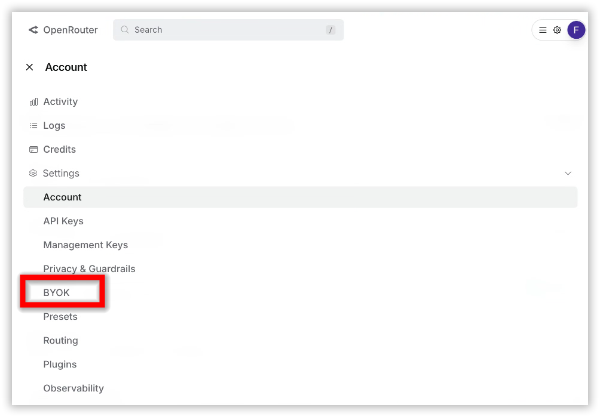
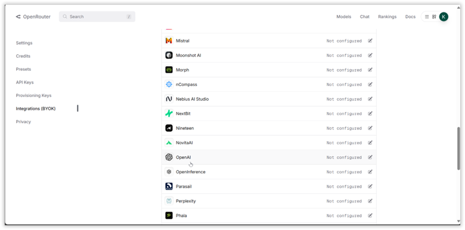
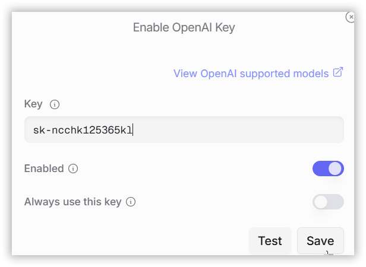

# How to Resolve Error (Status Code 403) for O3 Model in OpenAI Integration via OpenRouter

## Problem Summary

When using the OpenAI O3 model through OpenRouter, requests can fail with HTTP 403 (Forbidden). This typically occurs because O3 requires a valid Tier 3 (or higher) OpenAI API key configured under a Bring Your Own Key (BYOK) setup in OpenRouter. If the key is missing, insufficient-tier, or misconfigured, OpenRouter denies the request.

>**Note:** "Tier 3" refers to OpenAI's usage tiers that control rate and spend limits. As of OpenAI's documentation, Tier 3 generally requires $100+ paid and 7+ days since the first successful payment. See [OpenAI Rate limits – Usage tiers](https://platform.openai.com/docs/guides/rate-limits/usage-tiers) for more details.

## Possible Causes

- **Insufficient API Key Tier**: The OpenAI key used is not Tier 3 or above, which is required for the O3 model.
- **Incorrect Configuration**: The key was either added incorrectly or not properly linked to the OpenRouter Integrations page.
- **Usage Limits Reached**: Daily request limits (50 free / 1,000 with credits) may have been exceeded.

## Prerequisites

- An active OpenAI account with a valid API key (Tier 3 or higher is required for the O3 model).
- An OpenRouter account to connect and manage your API key.

## Resolution Steps

### Step 1: Obtain an OpenAI API Key

#### Log in to OpenAI

Visit [OpenAI Platform](https://platform.openai.com) and sign into your account.

#### Generate an API Key

1. Navigate to the **API keys** section in the OpenAI dashboard.
2. Click **Create API Key** and provide a descriptive name (e.g., "OpenRouter O3 Key").
3. Copy the generated key and store it securely.

### Step 2: Configure OpenRouter with Your OpenAI API Key

#### Sign Up for OpenRouter

1. Go to [OpenRouter](https://openrouter.ai) and create an account if you don't already have one.
2. Log in to your OpenRouter dashboard.

#### Access OpenRouter Integrations

1. Navigate to **Settings > Integrations (BYOk)**.

   

   

2. Select **OpenAI** as the provider for the O3 model.

   

3. Paste your OpenAI API key into the provided field.
4. Ensure the key is Tier 3 or higher.

   

5. Click **Save** to link your key to OpenRouter. The platform will verify your key and configure it for O3 model requests.

### Step 3: Monitor Your Usage

- **Check Usage Limits**: Free accounts on OpenRouter have a limit of 50 requests per day. Purchasing 10+ credits increases this limit to 1,000 requests per day.
- **Track Costs**: The OpenRouter dashboard displays your token usage and costs based on your OpenAI API key activity.

## Additional Resources

- [OpenRouter Documentation](https://openrouter.ai/docs) – Detailed API specifications
- [OpenRouter Integrations](https://openrouter.ai/settings/integrations) – Manage API keys
- [OpenAI Platform](https://platform.openai.com) – API key management and tier status
