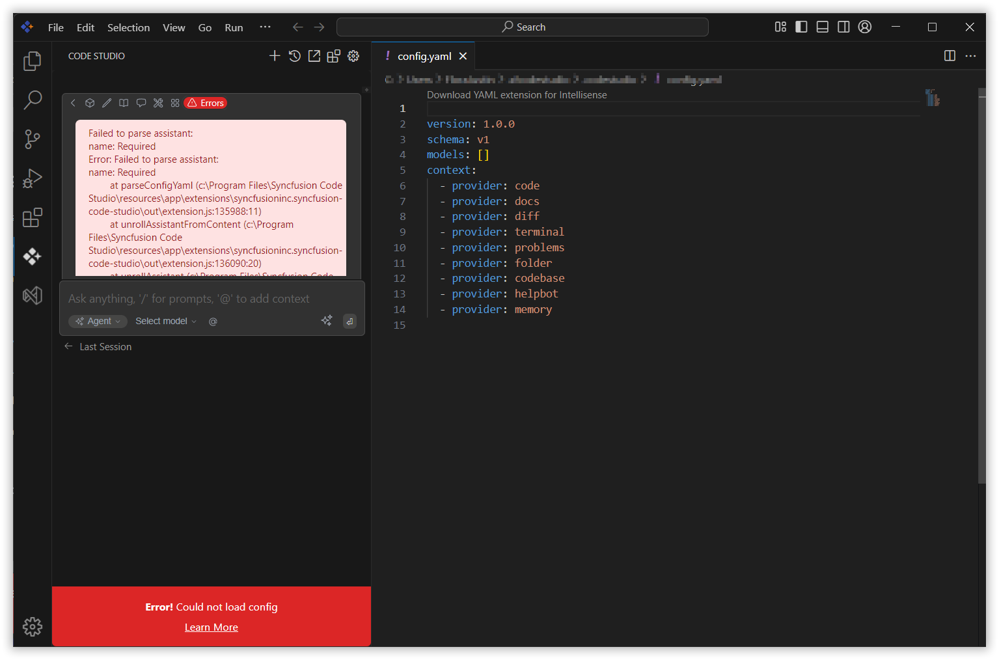
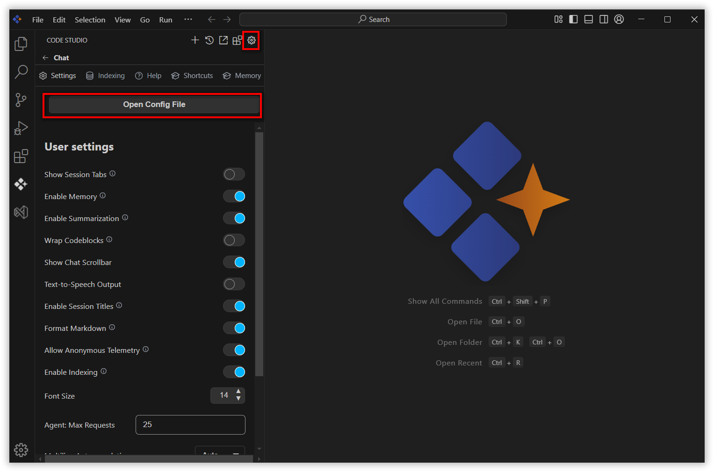
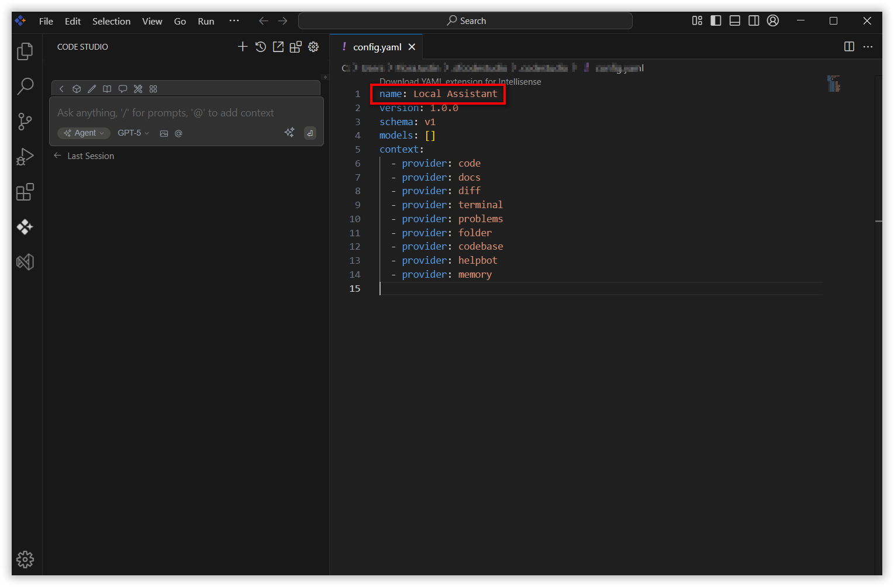

# Resolving the "Failed to parse assistant: name: Required" Error

## Overview
When starting or using **Syncfusion Code Studio**, you may see an error dialog similar to:

Failed to parse assistant: name: Required



This occurs when the `name` field is missing in the Code Studio configuration YAML file. This guide explains how to add the missing field and resolve the issue.


## Prerequisites
- Syncfusion Code Studio installed.
- Ability to edit the configuration file from within Code Studio.

## Steps to Resolve

### Step 1: Open the Config File from Code Studio
1. In Code Studio, click the Gear (Settings) icon in the sidebar.
2. Select "Open Config". This opens the YAML configuration file.



### Step 2: Add the Required name Field
1. In the opened YAML file, add a `name` field for your local assistant and save the file. For example:

```yaml
name: Local Assistant

```



> **Notes:**  `name` must be a non-empty string and Keep YAML indentation consistent (use spaces, not tabs).

### Step 3: Restart Code Studio
1. Close Syncfusion Code Studio.
2. Reopen it and verify the error is resolved.

### Validation

- **Confirm that Syncfusion Code Studio launches without showing the config error.**
- Ensure the `config.yaml` file has **valid syntax and consistent indentation**, as YAML is indentation-sensitive.


### Troubleshooting

- **Still seeing the error?**
  - Double-check that the `name` field is added correctly.
  - Ensure there are no syntax issues in the YAML file.

- **Config file won’t open?**
  - Try accessing it directly from the file system:
    - **Windows:** `C:\Users\YourName\.sfcodestudio\.codestudio\config.yaml`
    - **macOS:** `Users\syncfusion\.sfcodestudio\.codestudio\config.yaml`
