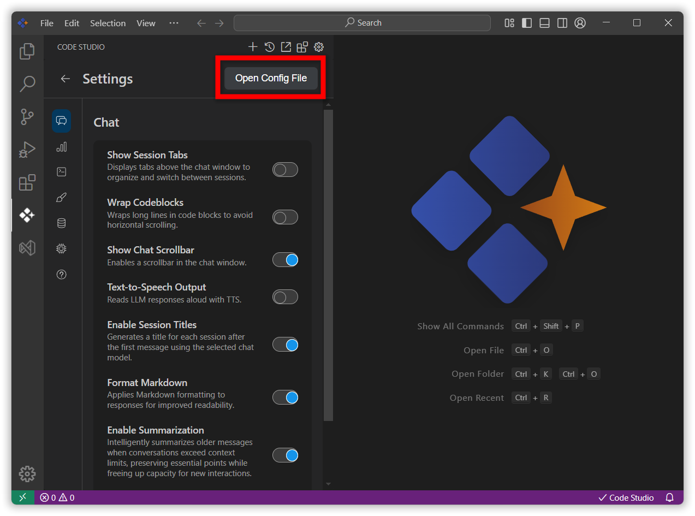

# Resolving the "Failed to parse assistant: name: Required" Error

## Overview
When starting or using **Syncfusion Code Studio**, you may see an error dialog similar to:

Failed to parse assistant: name: Required


This occurs when the `name` field is missing in the Code Studio configuration YAML file. This guide explains how to add the missing field and resolve the issue.


## Prerequisites
- Syncfusion Code Studio installed.
- Ability to edit the configuration file from within Code Studio.

## Steps to Resolve

### Step 1: Open the Config File from Code Studio
1. In Code Studio, click the Gear (Settings) icon in the sidebar.
2. Select "Open Config". This opens the YAML configuration file.



### Step 2: Add the Required name Field
1. In the opened YAML file, add a `name` field for your local assistant and save the file. For example:

```yaml
name: Local Assistant

```


> **Notes:**  `name` must be a non-empty string and Keep YAML indentation consistent (use spaces, not tabs).

### Step 3: Restart Code Studio
1. Close Syncfusion Code Studio.
2. Reopen it and verify the error is resolved.
