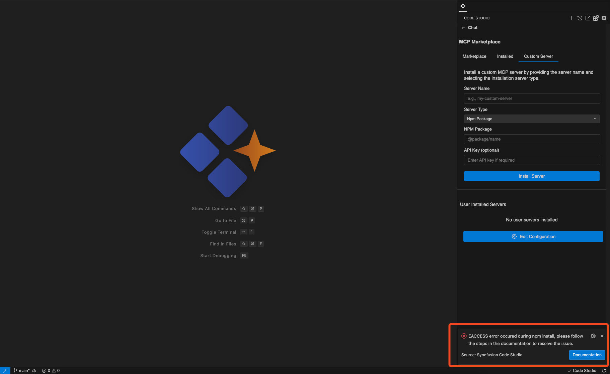

# Resolving the EACCESS Error in Syncfusion Code Studio

## Overview
When attempting to install the MCP server in the Marketplace tab of **Syncfusion Code Studio**, you may encounter an **EACCESS error**. This issue typically arises due to insufficient permissions in the application's support directory. This document provides a clear, step-by-step guide to resolve the issue professionally and efficiently.

 **Note:**  The EACCESS error most commonly occurs on macOS systems. 



## Prerequisites
- Administrative access to your system.
- A terminal application (e.g., Terminal on macOS).
- Syncfusion Code Studio installed on your system.

## Steps to Resolve the EACCESS Error

### Step 1: Change Ownership of the Directory
To ensure your user account has the necessary permissions, you need to change the ownership of the Syncfusion Code Studio directory.

1. Open your terminal application.
2. Run the following command to change the ownership to your user account:

   ```bash
   sudo chown -R $(whoami):staff ~/Library/Application\ Support/syncfusion.codestudio
   ```

When prompted, enter your administrator password.
This command assigns ownership of the directory to your user account, ensuring proper access.

### Step 2: Update Directory Permissions
 1. After changing ownership, update the permissions to grant full read and write access to the directory.


 2. In the terminal, run the following command:

```bash
chmod -R u+rw ~/Library/Application\ Support/syncfusion.codestudio
```


 3. This command ensures that your user account has read and write permissions for the directory and its contents.


### Step 3: Restart Syncfusion Code Studio
To apply the changes:

1. Close Syncfusion Code Studio if it is currently open.
2. Reopen the application.
3. Navigate to the Marketplace tab and attempt to install the MCP server again to verify that the issue is resolved.

### Validation

- **Confirm that the MCP server installs successfully without triggering the EACCESS error.**
- Check that the **Marketplace tab** loads and functions as expected.
- Verify that no **permission-related errors** appear in the terminal or logs.


### Troubleshooting

- **Still seeing EACCESS error?**
  - Double-check that you ran both commands correctly.
  - Ensure you used `sudo` and entered the correct password.

- **Directory not found?**
  - Make sure **Syncfusion Code Studio** is installed and has launched at least once.

- **Permission denied when running commands?**
  - Confirm you have **admin rights** on your macOS account.