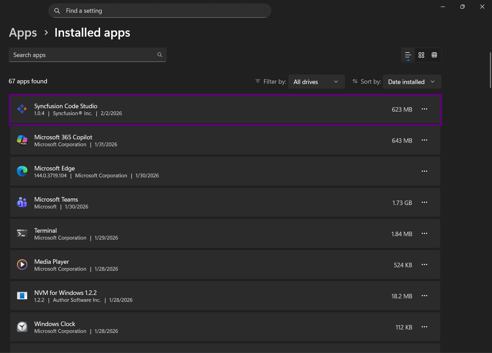

# How to Resolve the Uncaught Exception Error During Code Studio AutoUpdate

This guide explains how to resolve the `Uncaught Exception` error that occurs when Code Studio is launched during its automatic update process.

## Problem Summary

Users may encounter an `Uncaught Exception` error when Code Studio is launching during its automatic update process. This occurs if the application is opened before the update is fully completed, causing conflicts while essential files are still being modified. The issue can temporarily prevent Code Studio from starting and may require a simple wait-and-retry approach or a clean reinstallation if it persists. 

## Possible Causes

- **Update In Progress**: The automatic update process is still replacing application files.
- **Premature Launch**: Code Studio was opened before the update completed.
- **File Conflicts**: Temporary file locks or conflicts occurred during file replacement.

## Resolution Steps

### Quick Fix

1. Close the error dialog.
2. Wait a few minutes for the automatic update to complete in the background.
3. Relaunch Code Studio. It will start successfully with the latest version and automatically launch without requiring any user interaction.

### If the Issue Persists (Clean Reinstallation)

#### Step 1: Uninstall Code Studio

1. **Windows**:
   - Open **Windows Settings** → **Apps**.
   - Find and select **Syncfusion Code Studio**.
   - Click **Uninstall** and follow the user prompts to remove the application.

      

2. **macOS**:
   - Open **Finder** → **Applications**.
   - Locate **Syncfusion Code Studio**.
   - Open context menu and click **Move to Trash** or **Move to Bin** to remove the application.
   
   

#### Step 2: Remove Code Studio Cache Files

Delete cache and configuration folders to ensure a clean reinstallation. See [How to remove cache folders of Code Studio](/code-studio/troubleshoot/how-to-remove-cache-folders-of-code-studio-to-resolve-the-app-corruption) for detailed steps.

#### Step 3: Reinstall Code Studio

1. Reinstall Syncfusion Code Studio, refer to the [Syncfusion Code Studio Install and Configure](/code-studio/getting-started/install-and-configuration).
2. Launch the application and verify it starts without errors.

## Verification

To confirm the issue is resolved:

- Code Studio launches without the "Uncaught Exception" dialog.
- The application shows the expected latest version in **Help** → **About** (after an update).
- Subsequent launches are successful without intermittent errors.

## Best Practices

- **Avoid Interrupting Updates**: Do not open Code Studio while an update is in progress.
- **Allow Full Completion**: Let the update complete fully. The application typically relaunches automatically.
- **Maintain System Resources**: Ensure sufficient disk space and memory during update operations.

**Note:** Backup Recommendation - If you have custom configurations or settings you want to preserve, back up the relevant folders before deleting or clearing them.
