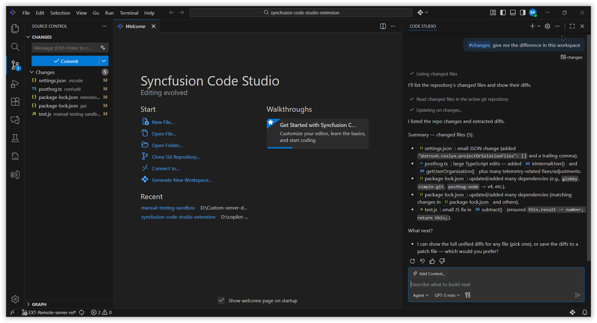

# Review Git Diff Changes in Code Studio

## Problem Summary

After upgrading to Code Studio v2.0.0+, the method to review git diff changes has been updated. Previously(before v2.0.0), users could view uncommitted changes by typing **@Git Diff** in the chat box or using the **"Add context"** button. In v2.0.0+, this functionality is now accessed by typing **#** in the chat input box and selecting `#changes` from the dropdown menu.

## Resolution Steps

### Steps to Use #changes

1. Make sure the desired project/workspace is open and active in Code Studio — preferably one that is connected to a GitHub repository. The `#changes` tool only shows modifications from the currently opened project.

2. Go to the chat panel in Code Studio where you interact with the AI assistant.

3. In the chat input box type #, a dropdown menu will appear showing available options. From this dropdown, select `#changes`.

    

4. After selecting `#changes`, type your specific question or request regarding the current changes.

5. Submit the prompt. The agent collects the current Git changes from your workspace and generates a response that references those changes to fulfill your request.

    

## Best Practices

- Write clear and specific questions so the `#changes` tool can focus on exactly what you want to see.
- Review the diff carefully before staging, committing, or merging changes, especially when many files are modified.
- Refine your question or ask a follow-up if you need a shorter summary, more explanation, or only certain types of changes.