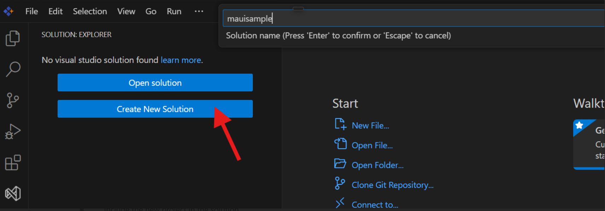

# Cross-Platform Development in Syncfusion Code Studio

Cross-platform development is a fundamental approach in modern application development that enables developers to create applications targeting multiple operating systems and device types from a single codebase. **Syncfusion Code Studio** provides comprehensive development tools and integrated features to streamline cross-platform .NET MAUI application development and debugging processes. This guide delivers step-by-step instructions for effectively developing and debugging cross-platform .NET MAUI applications within the Code Studio environment.

## Prerequisites

- **Syncfusion Code Studio** installed and configured on your development system
- **.NET SDK 9.0 or later** installed for your target platform (Windows, macOS, or Linux). Download from the [.NET Website](https://dotnet.microsoft.com/)
- **Verify .NET SDK installation** by executing the following commands in your terminal:
  - Check version: `dotnet --version`
  - Get detailed information: `dotnet --info`
- **Check existing workloads** installed on the system: `dotnet workload list`
- **Install .NET MAUI Workload:**

  **Windows:**
  ```bash
  dotnet workload install maui
  ```

  **macOS:**
  ```bash
  sudo dotnet workload install maui
  ```

  **Linux:**
  ```bash
  dotnet workload install maui-android
  ```

  **Verify Installation:**
  ```bash
  dotnet workload list
  ```

- **Platform-specific requirements:**
  - **Android development:** Android Studio for Android emulator
  - **iOS development:** Xcode for iOS emulator (macOS only)

**Additional Resources:** For detailed installation guidance, watch this video - [.NET MAUI Development in VS Code - Complete Setup Guide](https://www.youtube.com/watch?v=1t2zzoW4D98&t=547s)

## Built-in Extensions of Code Studio

Syncfusion Code Studio includes integrated extensions that enhance .NET MAUI development and debugging capabilities. These pre-configured extensions provide comprehensive support for cross-platform mobile and desktop application development and debugging workflows.

**For detailed information about Code Studio's built-in extensions, see:** [Built-in Extensions of Syncfusion Code Studio](./built-in-extensions.md)

## Create a .NET MAUI Project

Before you can develop and debug a cross-platform .NET MAUI application, you need to establish a project structure. Follow these steps to create a new .NET MAUI project in Syncfusion Code Studio:

### Step 1: Create a Solution
1. Open Syncfusion Code Studio.
2. Navigate to **Solution** > **Create New Solution**.
3. Create a new solution by specifying:
   - **Solution name**



### Step 2: Add a .NET MAUI Project to the Solution
1. Right-click on the solution in the **Solution Explorer** panel.
2. Select **Add New Project** from the context menu.

3. In the project template selection:
   - Choose **.NET MAUI App** template
   - Specify your **application name**
   - Set the **project location**


## Steps to Configure and Debug a Cross-Platform .NET MAUI Application

Once you have successfully created your .NET MAUI project, follow these comprehensive steps to configure, build, and debug your cross-platform application effectively within the Code Studio development environment.

### Configure Code Studio for Cross-Platform Development

#### Step 1: Set Up Debug Configuration Files

1. **Navigate to the Run and Debug section** and create the `launch.json` file using the **.NET Core Debugger**.


2. **Create a `tasks.json` file** within the `.vscode` folder for build automation.


#### Step 2: Configure tasks.json

Create the following `tasks.json` file in your `.vscode` folder:

```json
{
   "version": "2.0.0",
   "tasks": [
       {
           "label": "build-android",
           "command": "dotnet",
           "type": "process",
           "args": [
               "build",
               "${workspaceFolder}/FinanceTracker/FinanceTracker.csproj",
               "-f",
               "net9.0-android",
               "-c",
               "Debug"
           ],
           "problemMatcher": "$msCompile",
           "group": {
               "kind": "build",
               "isDefault": true
           }
       },
       {
           "label": "run-android",
           "command": "dotnet",
           "type": "process",
           "args": [
               "build",
               "-t:Run",
               "${workspaceFolder}/FinanceTracker/FinanceTracker.csproj",
               "-f",
               "net9.0-android",
               "-c",
               "Debug"
           ],
           "dependsOn": "build-android",
           "problemMatcher": "$msCompile"
       },
       {
           "label": "install-android-workload",
           "command": "dotnet",
           "type": "process",
           "args": [
               "workload",
               "install",
               "maui-android"
           ],
           "problemMatcher": "$msCompile"
       },
       {
           "label": "build-windows",
           "command": "dotnet",
           "type": "process",
           "args": [
               "build",
               "${workspaceFolder}/FinanceTracker/FinanceTracker.csproj",
               "-f",
               "net9.0-windows10.0.19041.0",
               "-c",
               "Debug",
               "/p:EnableWindowsTargeting=true"
           ],
           "problemMatcher": "$msCompile"
       },
       {
           "label": "clean",
           "command": "dotnet",
           "type": "process",
           "args": [
               "clean",
               "${workspaceFolder}/FinanceTracker/FinanceTracker.csproj"
           ],
           "problemMatcher": "$msCompile"
       },
       {
           "label": "rebuild-windows",
           "dependsOn": ["clean", "build-windows"],
           "dependsOrder": "sequence",
           "problemMatcher": "$msCompile",
           "group": "build"
       }
   ]
}
```

#### Step 3: Configure launch.json

Create the following `launch.json` file in your `.vscode` folder:

```json
{
   "version": "0.2.0",
   "configurations": [
       {
           "name": "Debug Android",
           "type": "coreclr",
           "request": "launch",
           "preLaunchTask": "run-android",
           "program": "${workspaceFolder}/FinanceTracker/bin/Debug/net9.0-android/com.companyname.financetracker.apk",
           "cwd": "${workspaceFolder}/FinanceTracker",
           "stopAtEntry": false,
           "console": "internalConsole",
           "pipeTransport": {
               "pipeCwd": "${workspaceFolder}",
               "pipeProgram": "adb",
               "pipeArgs": [
                   "shell"
               ],
               "debuggerPath": "/data/local/tmp/vsdbg/vsdbg"
           },
           "postDebugTask": "clean"
       },
       {
           "name": "Debug Windows",
           "type": "coreclr",
           "request": "launch",
           "preLaunchTask": "rebuild-windows",
           "program": "dotnet",
           "args": [
               "run",
               "--project",
               "${workspaceFolder}/FinanceTracker/FinanceTracker.csproj",
               "-f",
               "net9.0-windows10.0.19041.0",
               "--no-build"
           ],
           "cwd": "${workspaceFolder}/FinanceTracker",
           "stopAtEntry": false,
           "console": "internalConsole"
       }
   ]
}
```

#### Step 4: Verify File Structure

Your project structure should look like this:

```
YourSolution/
├── .vscode/
│   ├── tasks.json
│   └── launch.json
└── YourMauiApp/
    ├── Platforms/
    ├── Resources/
    ├── App.xaml
    ├── App.xaml.cs
    └── YourMauiApp.csproj
```

### Build the Cross-Platform Project

Before executing the cross-platform application, build your project to ensure all dependencies are properly configured and resolved for target platforms.


### Running the Cross-Platform Application

#### For Windows Platform:
1. Navigate to **"Run and Debug"** in the Activity Bar
2. Select **"Debug Windows"** from the platform configuration dropdown
3. Click the **Start Debugging** button or press `F5`


#### For Android Platform:

1. **Configure Android Emulator:**
   - Open Command Prompt from this path: `C:\Program Files (x86)\Android\android-sdk\emulator`
   - Check available emulators: `emulator -list-avds`
   - Start the emulator: `emulator -avd pixel_7_-_api_35` (replace with your configured emulator name)

2. **Start Debugging Session:**
   - Navigate to **"Run and Debug"** in the Activity Bar
   - Select **"Debug Android"** from the platform configuration dropdown
   - Click the **Start Debugging** button or press `F5`

### Build and Run via Terminal

For efficient building and execution of cross-platform applications without debugging sessions, use these terminal commands:

```bash
# Build the cross-platform project
dotnet build

# Run the application on default platform
dotnet run
```

**Note:** Make sure to replace `FinanceTracker` with your actual project name in the configuration files above.

## Important Notes

Before proceeding with cross-platform .NET MAUI application development and debugging in Code Studio, consider these critical configuration requirements:

- **File Structure:** The `.vscode` folder must be positioned at the same level as your cross-platform MAUI project folder to ensure proper configuration loading and execution.

- **Relative Paths:** All file paths in the configuration files are relative to the workspace root directory. Ensure your cross-platform workspace structure is properly configured.

- **Project Name Matching:** The project name in configuration files must exactly match your `.csproj` file name. Any naming discrepancy will result in cross-platform build failures.

- **Android Emulator:** Always initialize the Android emulator before launching the debug session. The cross-platform debugging process cannot establish connection to a stopped or unresponsive emulator.

- **Platform Limitations:** This configuration is specifically optimized for **Android and Windows platforms only**. Other target platforms require different setup procedures and platform-specific configurations.

- **iOS and macOS:** iOS and macOS cross-platform debugging requires additional platform-specific configuration not covered in this setup. Refer to platform-specific documentation for these target platforms.

- **Breakpoint Limitations:** Note that breakpoints might not be triggered in Code Studio with this cross-platform configuration due to current debugging implementation limitations.

## Video Tutorial

For a comprehensive visual guide on cross-platform .NET MAUI application creation and debugging workflows, refer to this detailed video tutorial that demonstrates the complete cross-platform development process step-by-step.

**Video Reference:** [Cross-Platform Application Creation and Debug in .NET MAUI](https://www.youtube.com/watch?v=1t2zzoW4D98&t=547s)