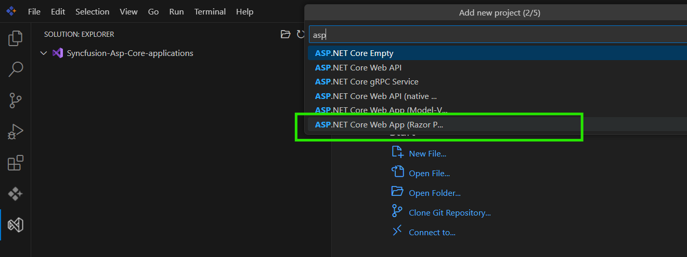

# Running Web Platform Applications in Syncfusion Code Studio

**Syncfusion Code Studio** is an integrated development environment that enables developers to build, configure, and execute modern web platform applications efficiently. This guide provides step-by-step instructions for launching and testing JavaScript/TypeScript frameworks (Vue.js, React, Angular), server-side ASP.NET Core applications, and client-side Blazor WebAssembly applications within the Code Studio environment.

You'll learn how to configure development environments, set up project structures, and leverage the integrated **DotRush** runtime for streamlined application execution. This documentation covers both browser-based client applications and server-side .NET applications, providing practical workflows for common development scenarios.

## Prerequisites

### General Requirements
- **Syncfusion Code Studio** installed on your system

### Platform-Specific Requirements

#### For Browser-Based Applications (JavaScript/TypeScript, Vue, React, Angular)
- **Node.js** (LTS version recommended) - Download from [Node.js Website](https://nodejs.org/)
- **npm or yarn** package manager (included with Node.js)
- **Framework-specific CLI tools** (optional but recommended):
  ```bash
  # Vue CLI
  npm install -g @vue/cli
  
  # Angular CLI  
  npm install -g @angular/cli
  ```

#### For .NET Applications (ASP.NET Core & Blazor WebAssembly)
- **.NET SDK 9.0** installed based on your platform (Windows, macOS, or Linux). Download from the [.NET Website](https://dotnet.microsoft.com/)
- **Verify .NET SDK installation**:
  ```bash
  dotnet --version
  dotnet --info
  ```
- **Required workloads for Blazor WebAssembly**:
  ```bash
  dotnet workload install wasm-tools
  ```
- **Verify installations**:
  ```bash
  dotnet new list
  dotnet workload list
  ```

## Built-in Extensions of Code Studio

Syncfusion Code Studio includes integrated extensions that streamline web platform development workflows without requiring additional installations. These extensions provide essential functionality for JavaScript/TypeScript development, .NET debugging, and browser-based application execution.

**Key Extensions for Web Platform Development:**
- **DotRush Extension**: .NET runtime and debugging capabilities for ASP.NET Core and Blazor applications.

**For comprehensive extension details, configuration options, and advanced features, see:** [Built-in Extensions of Syncfusion Code Studio](../../built-in-extensions.md)

This guide covers running the following web application platforms:

1. **[Client-Side Web Applications](#client-side-web-applications)** - Modern JavaScript/TypeScript applications built with Vue.js, React, Angular, and other client-side frameworks
2. **[ASP.NET Core Web Applications](#aspnet-core-web-applications)** - Server-side .NET web applications with MVC, Razor Pages, and Web API
3. **[Blazor WebAssembly Applications](#blazor-webassembly-applications)** - Client-side .NET applications running in WebAssembly

---

# Client-Side Web Applications

Modern JavaScript and TypeScript applications that run in web browsers, including Vue.js, React, and Angular frameworks. These applications can be efficiently developed and launched using Syncfusion Code Studio.

## Prerequisites
- **Node.js** (LTS version 18.x+)
- **npm or yarn** package manager

## Project Creation

Create new client-side web applications using the following commands:

### React Applications
```bash
# Create new React project using Vite
npm create vite@latest my-app

# Select React framework when prompted
# Choose React → JavaScript or React → TypeScript
```

### Vue.js Applications  
```bash
# Create new Vue.js project using Vite
npm create vite@latest my-vue-app

# Select Vue framework when prompted
# Choose Vue → JavaScript or Vue → TypeScript
```

### Angular Applications
```bash
# Install Angular CLI globally
npm install -g @angular/cli

# Create new Angular project
ng new my-angular-app
```

### TypeScript Applications
```bash
# Clone Syncfusion TypeScript quickstart template
git clone https://github.com/SyncfusionExamples/ej2-quickstart-webpack- ej2-quickstart
```

### JavaScript Applications (Vanilla)
For vanilla JavaScript projects, create a basic project structure:
```bash
# Create project directory
mkdir my-js-app

# Create basic HTML file (within the project directory)
echo '<!DOCTYPE html><html><head><title>My JS App</title></head><body><h1>Hello World</h1><script src="app.js"></script></body></html>' > my-js-app/index.html

# Create JavaScript file (within the project directory)
echo 'console.log("Hello from JavaScript!");' > my-js-app/app.js
```

## Quick Start

| Framework | Start Command | Default URL |
|-----------|--------------|-------------|
| **JavaScript (Vanilla)** | Open `index.html` in browser | `file:///path/to/index.html` |
| **TypeScript** | `npm start` or `npm run dev` | `http://localhost:3000` |
| **Vue.js** | `npm run dev` | `http://localhost:5173` |
| **React** | `npm run dev` | `http://localhost:3000` |
| **Angular** | `ng serve` | `http://localhost:4200` |

### Development Workflow
1. **Navigate to project directory:** `cd your-project`
2. **Install dependencies:** `npm install` (if not already done during creation)  
3. **Start development server:** Use appropriate command from the Quick Start table above
4. **Open application:** Browser will automatically open or navigate to the displayed localhost URL

## Debugging Client-Side Web Applications

This section covers VS Code debugging configuration and steps for JavaScript, TypeScript, Vue.js, React, and Angular applications.

### VS Code Debug Configuration

#### Step 1: Create Debug Configuration Files

1. Open the **Run and Debug** panel in Code Studio (Ctrl+Shift+D)
2. Click the **"Create a launch.json file"** link
3. Select the appropriate debugger for your application type from the dropdown menu

#### Step 2: Framework-Specific Debug Configuration

**For JavaScript Applications:**
```json
{
    "version": "0.2.0",
    "configurations": [
        {
            "type": "chrome",
            "request": "launch",
            "name": "Debug JavaScript App",
            "url": "http://localhost:8080",
            "webRoot": "${workspaceFolder}",
            "file": "${workspaceFolder}/YourApp/index.html"
        }
    ]
}
```

#### Setting up HTTP Server for JavaScript Applications
For debugging JavaScript applications, you need a local HTTP server to serve your `index.html` and `YourApp.js` files properly. Install a lightweight HTTP server like `http-server` via npm:

```bash
npm install -g http-server
```

Then, navigate to your `YourApp` directory in the terminal and run:

```bash
http-server . -p 8080
```

This will serve your application on `http://localhost:8080`, which matches the URL in the `launch.json` configuration.

**For TypeScript Applications:**
```json
{
    "version": "0.2.0",
    "configurations": [
        {
            "name": "Debug TypeScript App",
            "type": "chrome",
            "request": "launch",
            "url": "http://localhost:3000",
            "webRoot": "${workspaceFolder}/YourWebApp",
            "sourceMaps": true,
            "sourceMapPathOverrides": {
                "webpack://YourWebApp/./src/*": "${webRoot}/src/*",
                "webpack:///src/*": "${webRoot}/src/*",
                "webpack:///*": "*",
                "webpack:///./src/*": "${webRoot}/src/*"
            },
            "skipFiles": [
                "${workspaceFolder}/node_modules/**/*.js",
                "<node_internals>/**/*.js"
            ]
        }
    ]
}
```
#### Configure Webpack for TypeScript Development
Create or update a `webpack.config.js` file in the project root with debugging-optimized settings:

```javascript
module.exports = {
    mode: 'development',
    devtool: 'source-map',
    entry: './src/app.ts',
    output: {
        filename: 'bundle.js',
        path: __dirname + '/dist',
        publicPath: '/dist/'
    },
    resolve: {
        extensions: ['.ts', '.js']
    },
    module: {
        rules: [
            {
                test: /\.ts$/,
                use: 'ts-loader',
                exclude: /node_modules/
            }
        ]
    },
    devServer: {
        static: './',
        port: 3000,
        hot: true
    }
};
```

**For React Applications:**
```json
{
    "version": "0.2.0",
    "configurations": [
        {
            "type": "chrome",
            "request": "launch",
            "name": "Debug React App",
            "url": "http://localhost:5173",
            "webRoot": "${workspaceFolder}/my-app/src",
            "sourceMapPathOverrides": {
                "webpack:///src/*": "${webRoot}/*"
            }
        }
    ]
}
```

**For Vue.js Applications:**
```json
{
    "version": "0.2.0",
    "configurations": [
        {
            "name": "Debug Vue App",
            "type": "chrome",
            "request": "launch",
            "url": "http://localhost:5173",
            "webRoot": "${workspaceFolder}/my-app/src",
            "sourceMaps": true
        }
    ]
}

```

#### Install Vue (Official) Extension
For enhanced Vue.js development and debugging capabilities, install the official Vue extension:

1. Open the **Extensions** panel in Syncfusion Code Studio (`Ctrl+Shift+X`)
2. Search for **"Vue - Official"** by Vue.js team
3. Click **Install** on the extension
4. Restart Code Studio to activate the extension features

#### Configure Vite for Vue.js Development
Create or update your `vite.config.js` file in the project root with debugging-optimized settings:

```javascript
import { defineConfig } from 'vite'
import vue from '@vitejs/plugin-vue'

export default defineConfig({
  plugins: [vue()],
  build: {
    sourcemap: true,
    rollupOptions: {
      output: {
        sourcemapExcludeSources: false
      }
    }
  },
  server: {
    port: 5173,
    host: 'localhost',
    open: false,
    strictPort: true
  },
  css: {
    devSourcemap: true
  },
  define: {
    __VUE_PROD_DEVTOOLS__: true,
  }
})
```

**For Angular Applications:**
```json
{
  "version": "0.2.0",
  "configurations": [
    {
      "type": "chrome",
      "request": "launch",
      "name": "Debug Angular App",
      "url": "http://localhost:4200",
      "webRoot": "${workspaceFolder}/my-angular-app",
      "sourceMapPathOverrides": {
        "webpack:///./src/*": "${webRoot}/src/*",
        "webpack:///src/*": "${webRoot}/src/*",
        "webpack:///*": "${webRoot}/*",
        "webpack:///./~/*": "${webRoot}/node_modules/*"
      }
    }
  ]
}
```

### Browser Developer Tools Integration

**Open Browser DevTools:**
- **Chrome/Edge:** Press `F12` or `Ctrl+Shift+I`
- **Firefox:** Press `F12` or `Ctrl+Shift+I`

**Debugging Features:**
- **Console Tab:** View console.log output and errors
- **Sources Tab:** Set breakpoints and step through code
- **Network Tab:** Monitor HTTP requests and responses
- **Elements Tab:** Inspect and modify DOM elements

# ASP.NET Core Web Applications

Running ASP.NET Core applications is a fundamental aspect of the development workflow that enables you to launch and test your server-side applications locally. This section provides comprehensive step-by-step instructions for effectively running your ASP.NET Core web applications using the integrated **DotRush** runtime within Syncfusion Code Studio.

## Create an ASP.NET Core Web Project

Before you can run an ASP.NET Core application, you need to set up a project. Follow these steps to create a new ASP.NET Core web project in Syncfusion Code Studio:

### Step 1: Create a Solution
1. Open Syncfusion Code Studio.
2. Navigate to **Solution** > **Create New Solution**.
3. Create a new solution by specifying the **solution name**.


### Step 2: Add an ASP.NET Core Project to the Solution
1. Right-click on the solution in the **Solution Explorer** panel.
2. Select **Add New Project** from the context menu.
3. In the project template selection:
   - Choose the **ASP.NET Core Web App** template
   - Specify your **application name**
   - Set the **project location**




## Steps to Run an ASP.NET Core Application

Once you have created your ASP.NET Core project, follow these comprehensive steps to configure, build, and run your application effectively.

### Configure Code Studio for Running the Project

#### Step 1: Set Up Configuration Files

1. Navigate to the **Run and Debug** section and create the `launch.json` file using the **.NET Core Debugger**.

2. Create a `tasks.json` file within the `.vscode` folder.

#### Step 2: Configure tasks.json for ASP.NET Core

Create the following `tasks.json` file in your `.vscode` folder:

```json
{
    "version": "2.0.0",
    "tasks": [
        {
            "label": "build",
            "command": "dotnet",
            "type": "process",
            "args": [
                "build",
                "${workspaceFolder}/YourWebApp/YourWebApp.csproj",
                "/property:GenerateFullPaths=true",
                "/consoleloggerparameters:NoSummary"
            ],
            "problemMatcher": "$msCompile",
            "group": {
                "kind": "build",
                "isDefault": true
            }
        },
        {
            "label": "publish",
            "command": "dotnet",
            "type": "process",
            "args": [
                "publish",
                "${workspaceFolder}/YourWebApp/YourWebApp.csproj",
                "/property:GenerateFullPaths=true",
                "/consoleloggerparameters:NoSummary"
            ],
            "problemMatcher": "$msCompile"
        },
        {
            "label": "watch",
            "command": "dotnet",
            "type": "process",
            "args": [
                "watch",
                "run",
                "--project",
                "${workspaceFolder}/YourWebApp/YourWebApp.csproj"
            ],
            "problemMatcher": "$msCompile"
        },
        {
            "label": "clean",
            "command": "dotnet",
            "type": "process",
            "args": [
                "clean",
                "${workspaceFolder}/YourWebApp/YourWebApp.csproj"
            ],
            "problemMatcher": "$msCompile"
        }
    ]
}
```

#### Step 3: Configure launch.json for ASP.NET Core

Create the following `launch.json` file in your `.vscode` folder:

```json
{
    "version": "0.2.0",
    "configurations": [
        {
            "name": "Launch ASP.NET Core Web App",
            "type": "coreclr",
            "request": "launch",
            "preLaunchTask": "build",
            "program": "${workspaceFolder}/YourWebApp/bin/Debug/net9.0/YourWebApp.dll",
            "args": [],
            "cwd": "${workspaceFolder}/YourWebApp",
            "serverReadyAction": {
                "action": "openExternally",
                "pattern": "\\bNow listening on:\\s+(https?://\\S+)"
            },
            "env": {
                "ASPNETCORE_ENVIRONMENT": "Development"
            },
            "sourceFileMap": {
                "/Views": "${workspaceFolder}/YourWebApp/Views",
                "/Pages": "${workspaceFolder}/YourWebApp/Pages"
            },
            "console": "integratedTerminal",
            "internalConsoleOptions": "openOnSessionStart"
        }
    ]
}
```

## ASP.NET Core Project Structure

### Verify File Structure

Your ASP.NET Core project structure should look like this:

```
YourSolution/
├── .vscode/
│   ├── tasks.json
│   └── launch.json
└── YourWebApp/
    ├── Pages/
    ├── Models/
    ├── wwwroot/
    ├── Program.cs
    ├── appsettings.json
    └── YourWebApp.csproj
```

## Running the ASP.NET Core Application

### Build the Project

Before running the application, build your project to ensure all dependencies are properly configured:

```bash
# Navigate to project directory
cd YourWebApp

# Build the project
dotnet build

# Restore packages if needed
dotnet restore
```

### Running via Code Studio

1. Go to **Run and Debug** in the Activity Bar
2. Select **Launch ASP.NET Core Web App** from the dropdown
3. Click the **Start Debugging** button or press `F5`

### Running via Terminal

For quick building and running, use these terminal commands:

```bash
# Navigate to project directory
cd YourWebApp

# Run the application
dotnet run

# Run with hot reload (recommended for development)
dotnet watch run

# Run with specific launch profile
dotnet run --launch-profile "Development"
```

# Blazor WebAssembly Applications

Running Blazor WebAssembly applications requires specialized configuration due to their client-side execution model. This section demonstrates how to effectively configure, run, and launch Blazor WebAssembly applications using the integrated **DotRush** runtime and browser development tools within Syncfusion Code Studio.

## Create a Blazor WebAssembly Project

### Step 1: Initialize Solution
- Open Syncfusion Code Studio
- Navigate to **Solution** > **Create New Solution**
- Specify solution name and location


### Step 2: Add Blazor WASM Project
- Right-click the solution in **Solution Explorer**
- Select **Add New Project**
- Choose the **Blazor WebAssembly App** template
- Configure the project name and location


## Blazor WebAssembly Configuration

### Configure Runtime Environment

#### Step 1: Create Configuration Files

Create the necessary configuration files in your project's `.vscode` directory:

1. Navigate to the **Run and Debug** panel
2. Generate `launch.json` for Blazor WebAssembly execution
3. Create `tasks.json` for build automation

#### Step 2: Tasks Configuration for Blazor WASM

Create the following `tasks.json` file in your `.vscode` folder:

```json
{
    "version": "2.0.0",
    "tasks": [
        {
            "label": "build",
            "command": "dotnet",
            "type": "process",
            "args": [
                "build",
                "${workspaceFolder}/YourBlazorApp/YourBlazorApp.csproj",
                "/property:GenerateFullPaths=true",
                "/consoleloggerparameters:NoSummary"
            ],
            "problemMatcher": "$msCompile",
            "group": {
                "kind": "build",
                "isDefault": true
            }
        },
        {
            "label": "publish",
            "command": "dotnet",
            "type": "process",
            "args": [
                "publish",
                "${workspaceFolder}/YourBlazorApp/YourBlazorApp.csproj",
                "/property:GenerateFullPaths=true",
                "/consoleloggerparameters:NoSummary"
            ],
            "problemMatcher": "$msCompile"
        },
        {
            "label": "watch",
            "command": "dotnet",
            "type": "process",
            "args": [
                "watch",
                "run",
                "--project",
                "${workspaceFolder}/YourBlazorApp/YourBlazorApp.csproj"
            ],
            "problemMatcher": "$msCompile"
        },
        {
            "label": "clean",
            "command": "dotnet",
            "type": "process",
            "args": [
                "clean",
                "${workspaceFolder}/YourBlazorApp/YourBlazorApp.csproj"
            ],
            "problemMatcher": "$msCompile"
        }
    ]
}
```

#### Step 3: Launch Configuration for Blazor WASM

Create the following `launch.json` file in your `.vscode` folder:

```json
{
    "version": "0.2.0",
    "configurations": [
        {
            "name": "Launch Blazor WebAssembly",
            "type": "coreclr",
            "request": "launch",
            "preLaunchTask": "build",
            "program": "dotnet",
            "args": [
                "run",
                "--project",
                "${workspaceFolder}/YourBlazorApp/YourBlazorApp.csproj"
            ],
            "cwd": "${workspaceFolder}/YourBlazorApp",
            "env": {
                "ASPNETCORE_ENVIRONMENT": "Development",
                "ASPNETCORE_URLS": "https://localhost:5001;http://localhost:5000"
            },
            "serverReadyAction": {
                "action": "debugWithChrome",
                "pattern": "\\bNow listening on:\\s+(https?://\\S+)",
                "webRoot": "${workspaceFolder}/YourBlazorApp/wwwroot"
            },
            "console": "integratedTerminal"
        }
    ]
}
```

## Blazor WebAssembly Project Structure

### Verify File Structure

Your Blazor WebAssembly project structure should look like this:

```
YourSolution/
├── .vscode/
│   ├── tasks.json
│   └── launch.json
└── YourBlazorApp/
    ├── Components/
    ├── Pages/
    ├── wwwroot/
    ├── Program.cs
    ├── App.razor
    └── YourBlazorApp.csproj
```

## Running the Blazor WebAssembly Application

### Build the Project

Before running the application, build your project to ensure all dependencies are properly configured:

```bash
# Navigate to project directory
cd YourBlazorApp

# Build the project
dotnet build

# Restore packages if needed
dotnet restore
```

### Running via Code Studio

1. **Build Project:** Ensure all dependencies are properly configured before running
2. **Select Launch Target:** Choose **Launch Blazor WebAssembly** from the dropdown
3. **Start Application:** Use the **Run and Debug** panel or press `F5`

### Running via Terminal

**Terminal Commands:**
```bash
# Navigate to project directory
cd YourBlazorApp

# Run the application (starts development server)
dotnet run

# Development with hot reload (recommended for Blazor development)
dotnet watch run

# Run with HTTPS only
dotnet run --urls="https://localhost:5001"
```

# Important Notes

Before proceeding with running your web platform applications in Code Studio, please consider these critical points:

## General Configuration
- **File Structure:** The `.vscode` folder should be at the same level as your solution folder to ensure proper configuration loading.
- **Relative Paths:** All file paths in the configuration files are relative to the workspace root. Ensure your workspace is properly set up.
- **Project Name Matching:** The project name in configuration files must exactly match your `.csproj` file name. Any mismatch will cause build failures.

## Video Tutorial

For a comprehensive visual guide on web platform development and running applications, refer to Microsoft's official documentation and video tutorials.

**ASP.NET Core Resources:**
- [ASP.NET Core Development Documentation](https://docs.microsoft.com/aspnet/core/test/debugging)
- [Entity Framework Core Logging](https://docs.microsoft.com/ef/core/logging-events-diagnostics/)
- [ASP.NET Core Performance Best Practices](https://docs.microsoft.com/aspnet/core/performance/performance-best-practices)

**Blazor WebAssembly Resources:**
- [Microsoft Blazor WebAssembly Development Guide](https://docs.microsoft.com/aspnet/core/blazor/debug)
- [Blazor WebAssembly Performance Best Practices](https://docs.microsoft.com/aspnet/core/blazor/webassembly-performance-best-practices)
- [Chrome WebAssembly Developer Tools](https://developer.chrome.com/docs/devtools/)