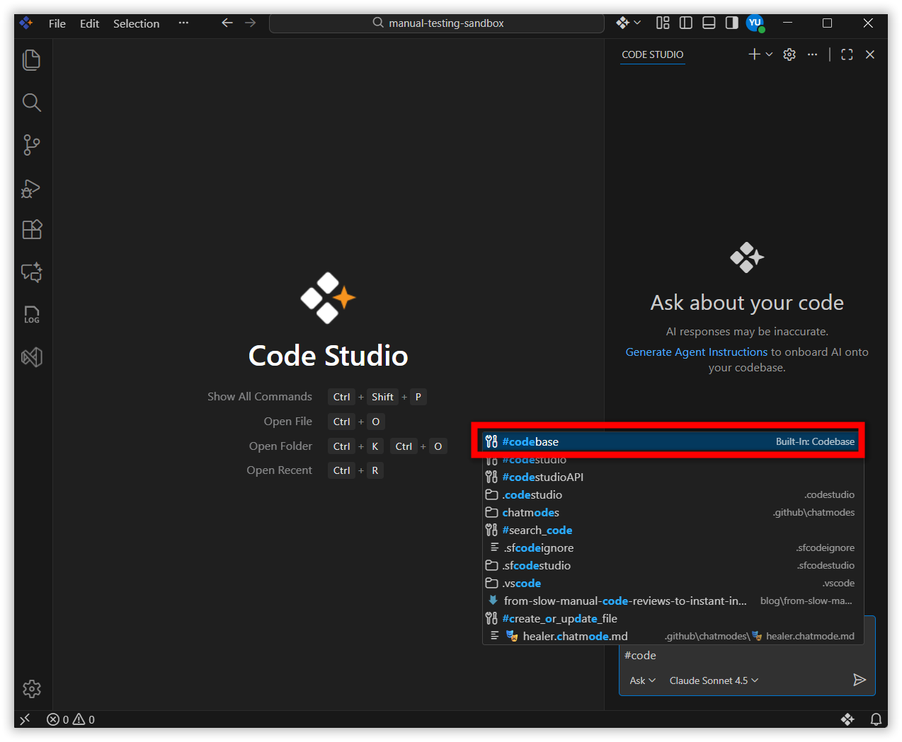
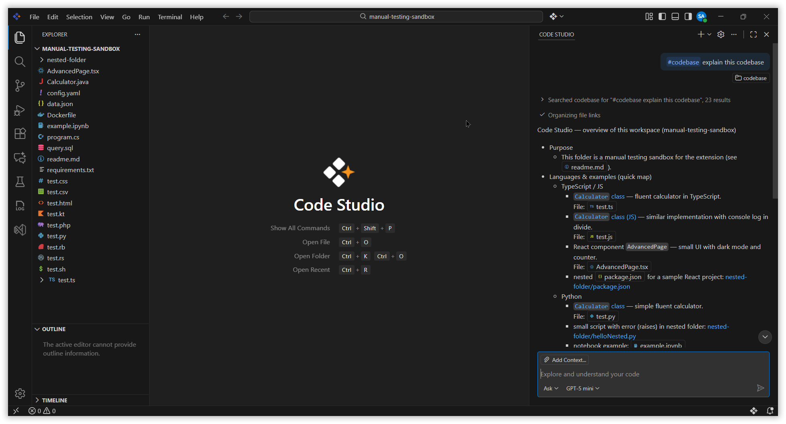

# Codebase Search in Code Studio

## Problem Summary

Previously, users could query or get context about their codebase in Code Studio by typing **@codebase** in the chat box or by using the **"Add context"** button and selecting the codebase option. In the current version, this functionality has been moved and is now accessed by typing **#** in the chat input box and selecting **#codebase** from the dropdown menu.

## Resolution Steps

### Steps to Use Codebase Search

1. Ensure that your desired codebase is loaded and active in the Code Studio IDE. The tool only accesses the currently opened project.

2. Navigate to the chat panel within Code Studio where you can interact with the AI assistant.

3. In the chat input box type #, a dropdown menu will appear with available options. From this dropdown, select #codebase

    

4. After the keyword, add specific questions or requests about the codebase, such as explaining the codebase, searching for functions, variables, or files.

5. Send the prompt and review the response, which will include relevant details from the codebase. If needed, refine your query for more precise results.

    

## Best Practices

- Write clear and specific questions so the codebase search can accurately understand which part of the project you want to explore.
- Add helpful context such as folder names, file names, class names, function names, or the area of the codebase you are interested in.
- Refine your question or ask a follow-up if the answer is too broad, misses something important, or needs more detail.