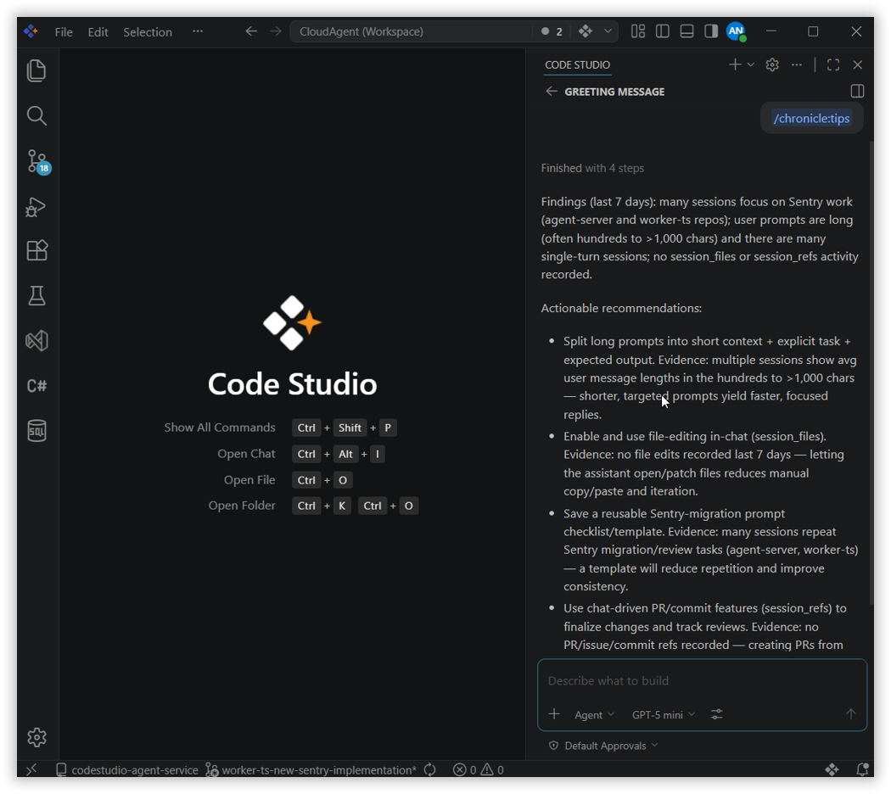
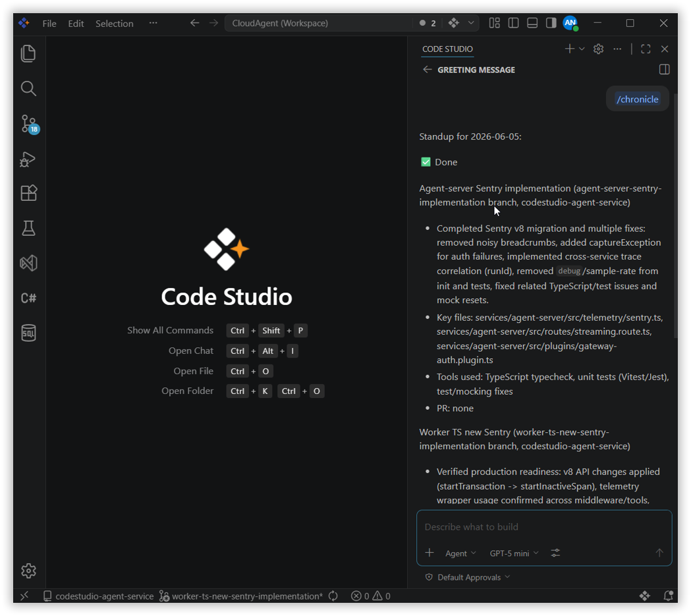

# Chronicle

## Overview
Chronicle is a handy feature in Syncfusion Code Studio that keeps a detailed history of everything you do in your workspace. It records your changes, actions, and even the context around them for your coding, so you can review, retrace steps, or share exactly what happened.

## Why Use Chronicle?
- Quickly see your recent coding history.
- Get tips on how to improve your coding and workflow.
- Easily review or share what you did and learn from your own patterns.

Chronicle makes your coding journey visible and easy to review, helping you learn, debug, and collaborate better.

## What You Will Learn
By the end of this tutorial, you’ll be able to:
- Understand what Chronicle does and how it benefits you.
- Start using Chronicle to view your coding history.
- Learn basic concepts like timelines, events, and context.
- Review and use your work history with easy steps.

## Key Concepts
- **Session History**: Chronicle records your chat and coding activities, including files you touched, commands you ran, and references to PRs, commits, or issues.
- **Standup Report**: Chronicle summarizes your last 24 hours of coding activity, grouped by feature, branch, or file.
- **Personalized Tips**: It can analyze your workflow to give you smart suggestions for even better productivity.

## Steps to Use Chronicle

### Step 1: Use Chronicle Commands
- **For a Standup Summary**: Type `/chronicle:standup` in the chat.  
  This will give you a summary of your coding sessions from the last 24 hours. The summary is organized by feature or branch and includes file lists and PR links.

  

- **For Productivity Tips**: Type `/chronicle:tips` in the chat.  
  Chronicle will review your last 7 days of work and share helpful tips to improve your prompting, tool usage, and workflow.

  

- **To Ask a Custom Question**: Type `/chronicle` followed by your question.  
  For example:  
  /chronicle what files did I edit yesterday?

  Chronicle will answer in plain language based on your coding sessions.

  

### Step 2: Read Your Results
- After you send a command, Chronicle will quickly reply in the chat with an easy-to-read summary, a helpful list, or an answer based on your recent work.

> **Tip:** For custom questions, just type them after `/chronicle`!  
  Example:  
  /chronicle what PRs did I work on this week?

## What’s Next?
- Use **Autocomplete** to catch errors as you type and reduce bugs before they occur.
- Explore **Agent mode** for generating and fixing code autonomously across your project.
- Use the **Ask feature** to have the AI explain error messages and suggest solutions in detail.
