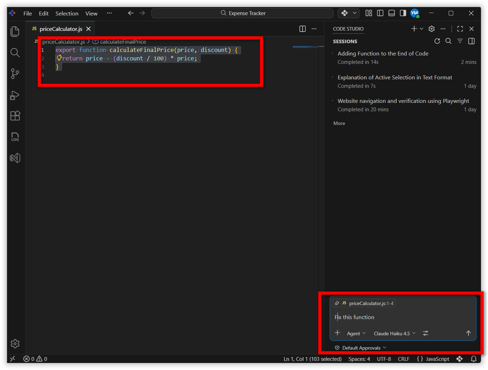
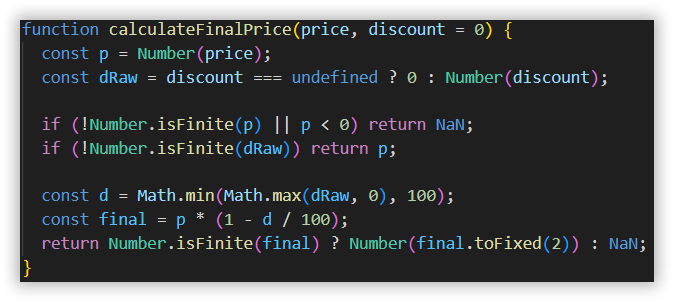
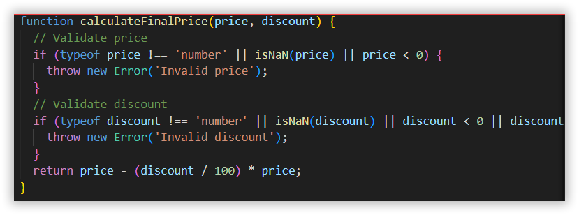
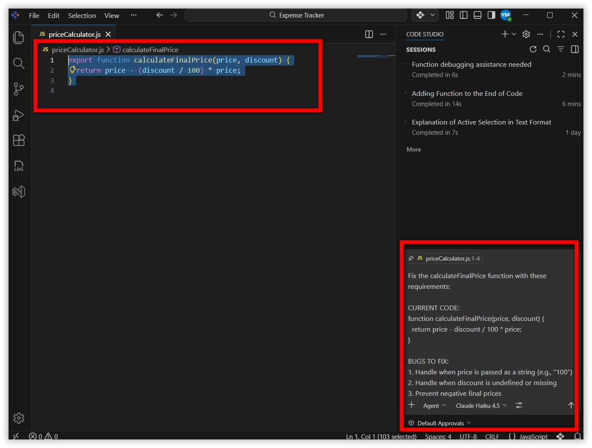
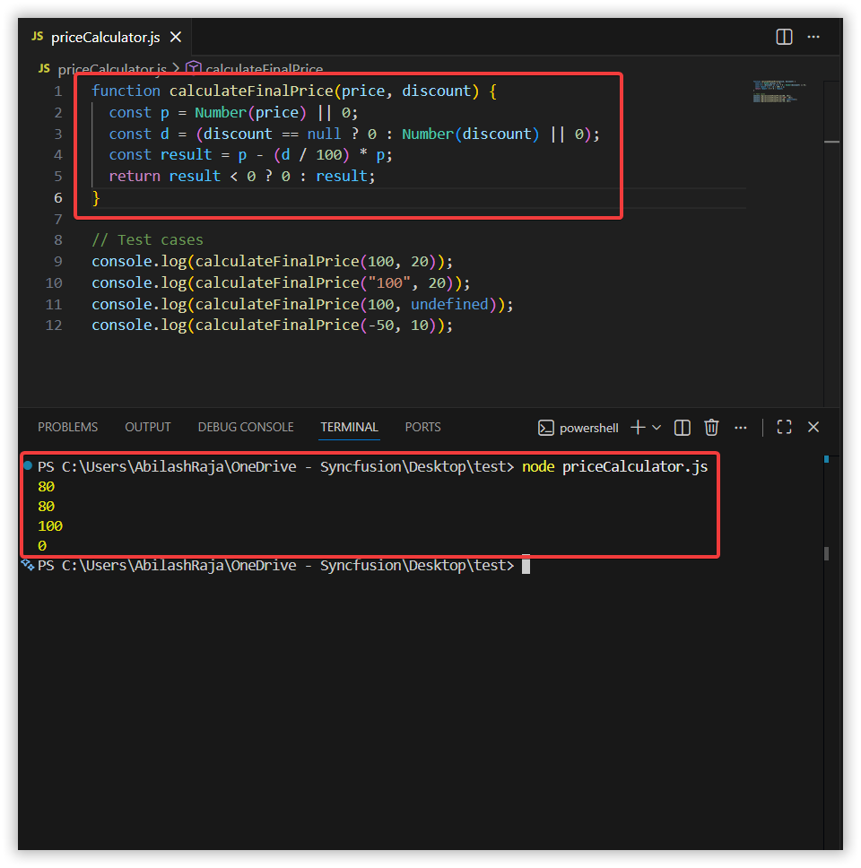

# Ensuring Consistent AI Responses with Context‑Aware Prompt Optimization in Code Studio

## Overview

Have you ever asked an AI to "fix this code" and gotten a completely different answer each time? When you tell the AI "fix this function" without any context, the results are unpredictable — it may rewrite your function entirely, change your formula, or add error handling you don't need.

Context-aware prompting means giving the AI clear instructions about what the code currently does, what is broken, what you want fixed, and what you do not want changed. With this approach, the AI produces focused, consistent results every time.

In this tutorial, you will see how vague prompts cause problems and how adding context makes the AI give you reliable answers. You will fix a real JavaScript bug using a structured, context-aware prompt and verify that the result is consistent across multiple runs.

> **Note:** This tutorial uses JavaScript, but the context-aware prompting techniques apply equally to TypeScript, Python, and other languages.

## Prerequisites

Before beginning, ensure:

- Syncfusion Code Studio is installed and properly configured on your system. If you have not yet installed it, see [Install and Configure](/code-studio/getting-started/install-and-configuration).
- You have a workspace or project folder opened in Code Studio where you can create files.
- Node.js is installed on your system. You can download it from [nodejs.org](https://nodejs.org/).
- **Agent** mode is enabled in the chat window. Learn more about [Agent mode](/code-studio/features/agent).

## What You Will Learn

By the end of this tutorial, you'll be able to:

- Identify why vague prompts produce inconsistent AI responses
- Write structured, context-aware prompts that produce reliable results
- Specify constraints that tell the AI what to preserve and what to change
- Apply a fixed function generated by the AI and verify correctness
- Test prompt consistency by comparing results across multiple runs

## Key Concepts

- **Context-aware prompting**: A technique for writing AI prompts that include the current code, specific bugs to fix, desired behavior, and constraints — so the AI produces focused, repeatable results.
- **NaN (Not a Number)**: A JavaScript value returned when a numeric operation receives a non-numeric input, such as when a string is used in arithmetic without conversion.
- **Operator precedence**: The order in which JavaScript evaluates mathematical operators. For example, `discount / 100 * price` may not compute as intended without explicit parentheses.
- **Prompt constraints**: Instructions in a prompt that tell the AI what not to change, such as keeping the existing formula structure or avoiding external dependencies.

## Steps to Optimize Your Prompts

### Step 1: Create the Buggy Code

This step creates a JavaScript file with a broken price calculation function so you can observe the bugs before applying a fix.

1. **Create a new file in Code Studio:**
   - **Option 1 - Using Menu:** Click `File` in the top menu bar, then select `New File` from the dropdown menu.
   - **Option 2 - Using Keyboard Shortcut:** Press `Ctrl+N` (Windows/Linux) or `Cmd+N` (Mac) to create a new file.
   - After the new file opens, press `Ctrl+S` (Windows/Linux) or `Cmd+S` (Mac) to save it.
   - In the save dialog, name the file `priceCalculator.js` and choose your desired location in your workspace.
   - Click **Save** to confirm.

2. **Paste the buggy code into the file:**
   - Copy the code block below using `Ctrl+C` (Windows/Linux) or `Cmd+C` (Mac).
   - Click inside your `priceCalculator.js` file in the editor.
   - Paste using `Ctrl+V` (Windows/Linux) or `Cmd+V` (Mac).
   - Save the file using `Ctrl+S` (Windows/Linux) or `Cmd+S` (Mac).

```javascript
function calculateFinalPrice(price, discount) {
  return price - discount / 100 * price;
}

// Test cases
console.log(calculateFinalPrice(100, 20));        // Should be 80
console.log(calculateFinalPrice("100", 20));      // Bug: NaN or wrong
console.log(calculateFinalPrice(100, undefined)); // Bug: NaN
console.log(calculateFinalPrice(-50, 10));        // Bug: Negative price
```

3. **Run the code:**
   - Open the integrated terminal by pressing `` Ctrl+` `` (Windows/Linux) or `` Cmd+` `` (Mac), or go to `Terminal` → `New Terminal` in the top menu.
   - Ensure you are in the directory where you saved `priceCalculator.js`, then run:

```bash
node priceCalculator.js
```

> **Note:** If you see a "command not found" error, Node.js is not installed. See the Prerequisites section above.

The output will show wrong numbers or `NaN` (Not a Number), confirming the function is broken.

### Step 2: Use a Context-Aware Prompt to Fix the Bugs

This step demonstrates why vague prompts produce inconsistent results, then shows how a structured, context-aware prompt fixes all four bugs reliably.

**Why vague prompts fail:** Submit the prompt `Fix this function` to the chat and observe the results across two separate attempts.



**Attempt 1 result:**


**Attempt 2 result (same prompt):**


The AI produced two different answers because the prompt did not specify which bugs to fix, how much to change, or what to preserve.

Now use a structured prompt to get a consistent result.

1. Open the **Chat Panel** by pressing `Ctrl+Alt+B` (Windows/Linux) or `Cmd+Alt+B` (Mac), or click the Code Studio icon to the left of the centered search box.

2. **Highlight the buggy function** - Select the entire `calculateFinalPrice` function in your `priceCalculator.js` file

3. **Use the context-aware prompt below** - Copy this entire prompt and paste it into the chat window:

```
Fix the calculateFinalPrice function with these requirements:

CURRENT CODE:
function calculateFinalPrice(price, discount) {
  return price - discount / 100 * price;
}

BUGS TO FIX:
1. Handle when price is passed as a string (e.g., "100")
2. Handle when discount is undefined or missing
3. Prevent negative final prices
4. Ensure the function returns a clean number, not NaN

CONSTRAINTS:
- Keep the existing formula structure (price - discount percentage * price)
- Use minimal code changes
- Don't add external dependencies
- Set default discount to 0 if missing

EXPECTED BEHAVIOR:
- calculateFinalPrice(100, 20) → 80
- calculateFinalPrice("100", 20) → 80
- calculateFinalPrice(100, undefined) → 100
- calculateFinalPrice(-50, 10) → 0 (no negative prices)
```

4. Select the entire `calculateFinalPrice` function in your `priceCalculator.js` file, then send the prompt.





The AI provides a focused fix that addresses all four bugs without unnecessary changes. The detailed context in the prompt ensures consistent, reliable results.

### Step 3: Apply and Test the Fix

Replace the original function with the AI-generated fix and confirm all test cases pass.

1. **Replace your old function** with the fixed version in `priceCalculator.js`.

2. **Update your test cases:**

```javascript
function calculateFinalPrice(price, discount) {
  const p = Number(price) || 0;
  const d = (discount == null ? 0 : Number(discount) || 0);
  const result = p - (d / 100) * p;
  return result < 0 ? 0 : result;
}

// Test cases
console.log(calculateFinalPrice(100, 20));        // Expected: 80
console.log(calculateFinalPrice("100", 20));      // Expected: 80 (handles string input)
console.log(calculateFinalPrice(100, undefined)); // Expected: 100 (handles missing discount)
console.log(calculateFinalPrice(-50, 10));        // Expected: 0 (no negative prices)
```

All four test cases now pass. The function no longer produces `NaN` or negative values.

## Verify Your Results

After applying the AI's fix, confirm the function behaves correctly for all expected inputs.

### Test 1: Run the Code

Open the integrated terminal as described in Step 1, then run the updated file:

```bash
node priceCalculator.js
```

You should see four numeric outputs with no `NaN` errors. If you see `NaN` or an error, go back and check that the fixed function was saved correctly.

### Test 2: Try Additional Test Cases

Add more test cases to evaluate edge cases:

```javascript
// Additional test cases
console.log(calculateFinalPrice(50, 10));     // Expected: 45
console.log(calculateFinalPrice("75", "25")); // Expected: 56.25
console.log(calculateFinalPrice(1000));       // Expected: 1000 (no discount)
```

**Compare results:** Check if the function handles these cases as expected.

### Test 3: Check Prompt Consistency

Run the same context-aware prompt from Step 2 again and compare the two responses:
- Are the solutions similar?
- Do both fix the same bugs?
- Is the code approach consistent?

## What's Next?

- [Generate Your First Code Change Using Agent](/code-studio/tutorials/generate-your-first-code-using-agent) — Let AI write new code for you.
- [Compare AI Models for Different Tasks](/code-studio/tutorials/compare-ai-models) — Choose the best AI model for your use case.
- [From Repetition to Speed: Reusable Prompt Templates](/code-studio/tutorials/reusable-prompt-templates) — Save your context-aware prompts as reusable templates.
