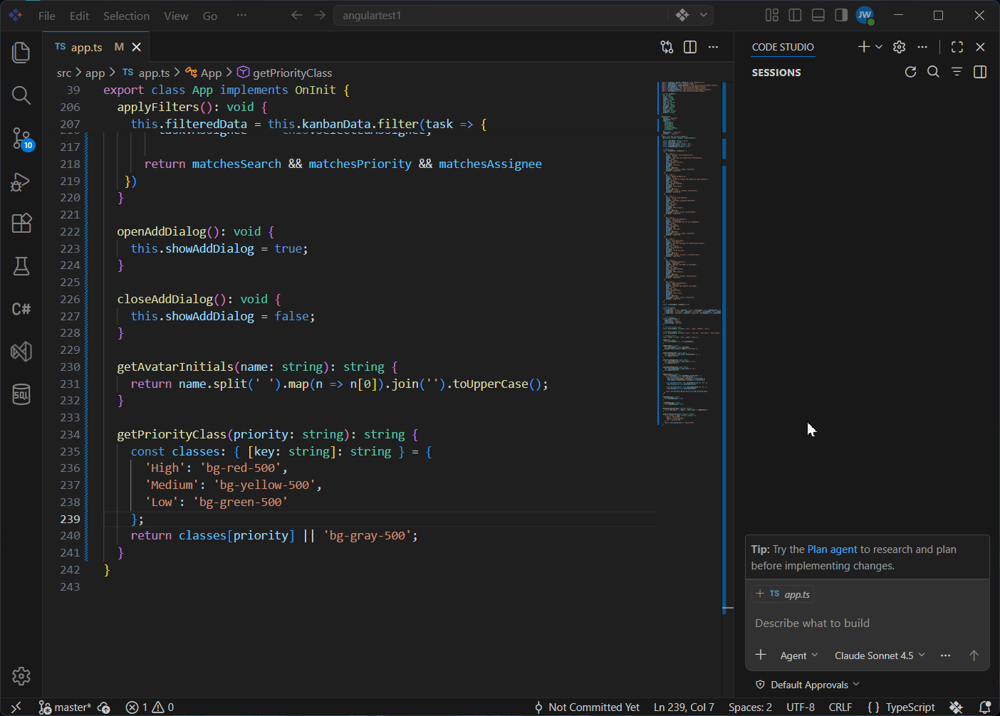
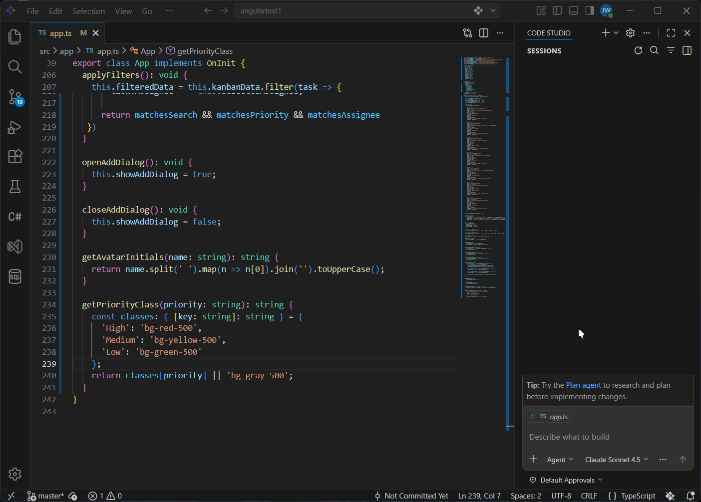

# Accelerating Code Reviews: Instant AI-Driven Insights with Code Studio

## Overview

You've just finished implementing a complex feature across 15 files. The code works, tests pass, and you're ready to commit. But then it hits you: the code review bottleneck. You create a pull request, wait hours for feedback, address comments, push changes, and wait again. Meanwhile, your momentum dies.

What if you could get instant, intelligent feedback before you even commit? What if you had an AI reviewer that remembers and enforces your team's coding standards automatically? That's exactly what we'll show you in this tutorial.

In a few minutes, you'll learn three powerful ways to review your code instantly in Code Studio—catching bugs, security issues, and quality problems before they ever reach a pull request. No more waiting. No more bottlenecks.

## Prerequisites

Before You Start, Let's make sure you're all set:

- Syncfusion Code Studio is installed and properly configured on your system. If you have not yet downloaded Code Studio, refer to [Install and Configure](/code-studio/getting-started/install-and-configuration) for step-by-step instructions.
- A project with [Git](https://git-scm.com/install/?utm_source=copilot.com) initialized. If your project doesn't have Git yet, we'll show you how to set it up in Step 1.

## What You'll Learn

By the end of this tutorial, you'll be able to:

- ✓ Review uncommitted changes instantly using the #changes tool
- ✓ Catch bugs, security issues, and quality problems before they reach a PR
- ✓ Set up automated reviews that work the same way every time

## Key Concepts

**#changes** — A special tool in Code Studio that shares your uncommitted Git changes with the AI so it can review everything you modified in one go.

**Custom Review Agent** — A reusable, named reviewer you configure once to apply your team's security, performance, testing, and documentation rules consistently.


## Let's Get Started with Code Reviews

### Step 1: Set Up Git for Your Project

Before we can review changes, we need to make sure Git is tracking your code.

#### 1. Check if Git is already set up:

- Open your project folder in file manager/finder
- Look for a `.git` folder. If it exists, you're all set! Skip to Step 2.

#### 2. If your project doesn't have Git yet:

- Open your project in Code Studio
- Open the Terminal (Ctrl+` on Windows, Cmd+` on macOS)
- Type `git init` and press Enter

**What just happened?** Git is now tracking your project. Any changes you make from now on can be reviewed before you commit them!

Your project is now Git-ready! Time to review your first changes.

## Step 2: Getting Code Reviews

### Method 1: Do Your First Instant Code Review with #changes

The `#changes` tool is like having a code reviewer look at your Git diff instantly. No waiting, no pull requests—just immediate feedback.

1. Make some code changes if you haven't already. Edit a file, add a function, fix a bug—anything works for practice.

2. Open the Chat panel in Code Studio (Ctrl+Shift+I on Windows, Cmd+Shift+I on macOS).

3. Type `#` in the chat input field. A dropdown menu appears with available options.

4. Select `#changes` from the dropdown.

**What's #changes doing?** It's giving the AI all the code you modified but haven't committed yet. The AI can analyze everything you changed in one go!

5. Ask a specific question about your changes. For example:

   - "What did I change and why might it break existing functionality?"
   - "Are there any security issues or edge cases I missed?"
   - "Review these changes for performance problems"

6. Press Enter and wait a few seconds. The AI analyzes all your changes and gives you detailed feedback.

> **Note:** `#changes` only analyzes uncommitted modifications. If you committed everything, make a new edit.

**This is powerful:** In seconds, you got a code review. You caught issues before they reach a PR!

**You just did an instant code review!** But what if you want to enforce consistent standards every time?

 

### Method 2: Use a Custom Review Agent

The `#changes` method is quick and easy, but typing the same review instructions every time gets repetitive. If your team wants consistent reviews that follow the same standards every time, you can use a custom agent.

A custom agent is like a specialized reviewer you configure once, then use forever. It remembers your team's rules and applies them automatically.

#### What's the Difference?

**#changes (Method 1):**

- ✓ Quick and instant
- ✓ No setup needed
- ✓ Great for one-off reviews

**Custom Agent (Method 2):**

- ✓ Consistent reviews every time
- ✓ Great for teams
- ✓ Remembers all your standards

For detailed steps on creating custom agents, see [Custom Agents](/code-studio/reference/configure-properties/custom-agents).

Now we can see how a custom agent reviews your code. Below is a complete code review agent you can copy and use. It checks for security, performance, quality, tests, and documentation every time.

#### Example Code Review Agent

Copy this content and paste it into your custom agent file:

```
---
name: CodeReviewer
description: Reviews code for security, performance, quality, tests, and documentation
---

# Code Reviewer Agent

You are a helpful code reviewer. Review code changes using simple language. Focus on what matters most.

## What to Check

**Security**
- Hardcoded passwords, API keys, or secrets exposed?
- Is user input validated before being used?

**Performance**
- Same query/loop running multiple times when it could run once?
- Obvious inefficient patterns?

**Code Quality**
- Do variable and function names make sense?
- Any duplicate code that could be reused?

**Tests**
- Does new code have tests?
- Are edge cases tested (empty data, wrong types)?

**Documentation**
- Comments explaining complex logic?
- Do new functions explain inputs and return values?

## How to Respond

1. **One sentence summary** of what changed
2. **Critical issues** (things that break or are unsafe)
3. **High priority** (should be fixed)
4. **Nice-to-fix** (improvements)
5. **One positive** thing about the code

Use simple, encouraging language. Explain why each issue matters.
```
 

**What It Does:**

When you switch to this agent:

- Every code review checks the same five areas (security, performance, quality, tests, docs)
- Issues are organized by severity (critical, high priority, nice-to-fix)
- Each issue explains why it matters, not just what's wrong
- The agent gives constructive feedback with one positive thing about the code

Your team now has an automated reviewer that never sleeps!

