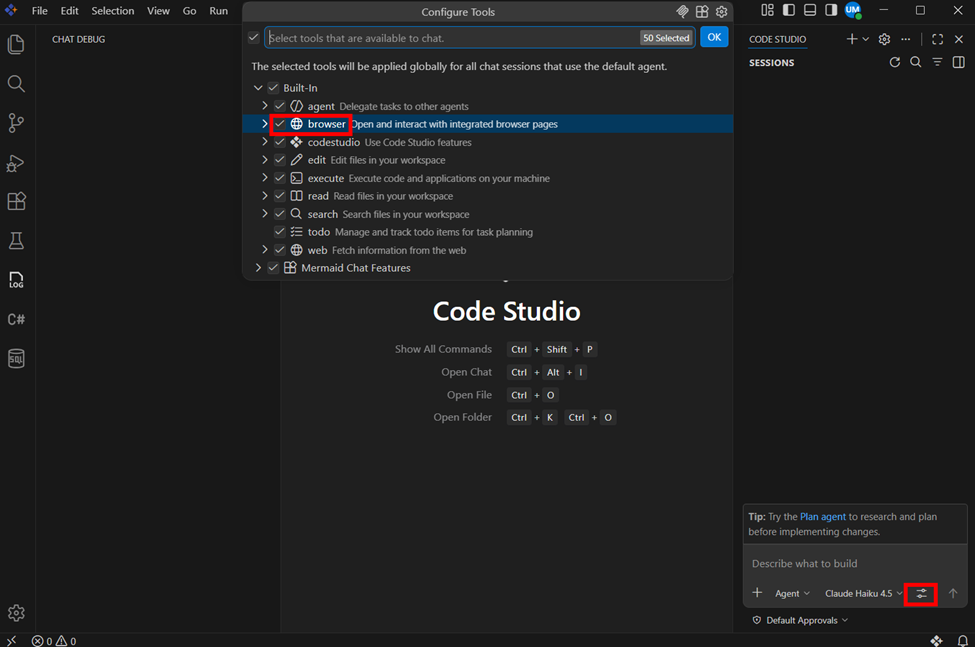
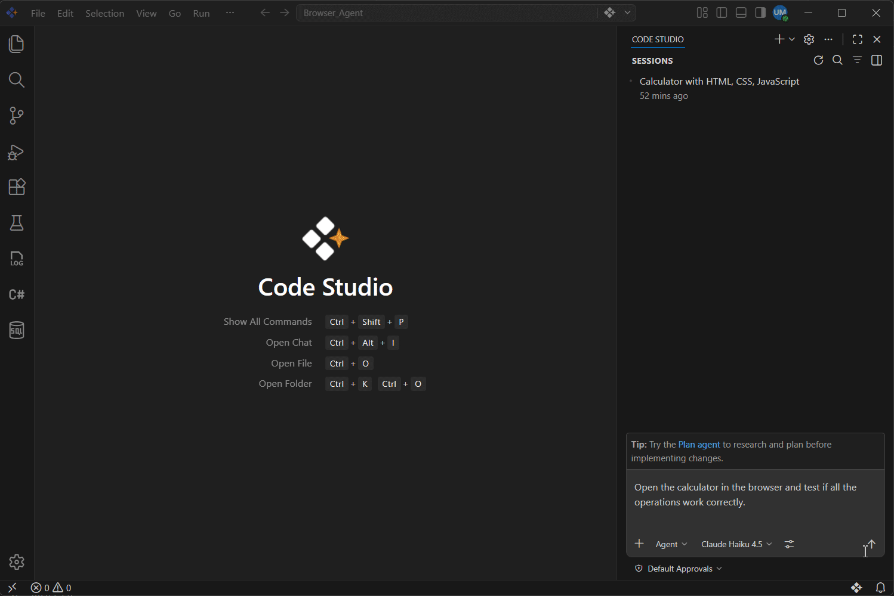

# Agentic Browser Tool Overview

In this tutorial, you’ll learn how to use Agentic Browser Tools to build and test web applications with AI assistance. These tools allow the agent to interact directly with a built-in browser, enabling real-time testing and validation.

Acting as a bridge between your code and a live browser, the agent can automatically open pages, interact with UI elements, detect issues, and fix them based on your instructions. This creates a smooth workflow where applications are built, tested, and improved continuously.

---

## What You Will Learn

By the end of this tutorial, you will be able to:

- Understand how Agentic Browser Tools work  
- Enable and use browser tools in Code Studio  
- Build a web application using an AI agent  
- Automatically test your application using the integrated browser  
- Identify and fix issues based on real-time browser feedback  

---

## Steps to Use Agentic Browser Tools

### Step 1: Enable Browser Tools for the Agent

- Open the **Chat view** using the shortcut: `Ctrl + Alt + I`  
- In the Chat panel, choose **Agent** from the **Agents** dropdown  
- Click the **Tools** button in the chat input area to open the tools picker  
- In the tools picker, navigate to **Built-in → Browser**  
- Ensure that **all Browser tools are enabled**  

The agent can now use these tools to interact with, navigate, and perform actions on web pages.

---

### Step 2: Build a Calculator Using the Agent

- Create and open a new project folder in Code Studio  
- Open the **Chat view**  
- Request the agent to build a calculator app  

---

### Step 3: Test the Application with the Agent

Ask the agent to open and test your application in the integrated browser.

In the **Chat view**, enter the prompt:Test the app end-to-end, report bugs, fix them, and retest to confirm everything works.
The agent will:

- Open your application in the integrated browser  
- Analyze the page structure  
- Simulate user interactions (such as clicking buttons and entering inputs)  
- Verify whether each feature works as expected  

After testing, the agent will:

- Report which functionalities are working correctly  
- Highlight any issues or errors it finds  

If any issues are detected, the agent can:

- Automatically fix the identified bugs  
- Update the code  
- Retest the application to ensure the fixes are working correctly  

---

## What’s Next

- https://help.syncfusion.com/code-studio/features/agent – Discover advanced workflows and capabilities of the agent  
- https://help.syncfusion.com/code-studio/reference/configure-properties/custom-agents – Establish clear rules and instructions for consistent and constrained behavior  