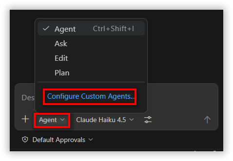
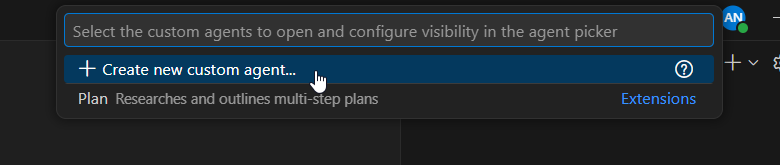
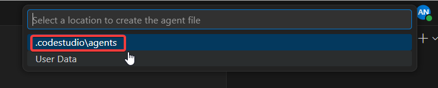
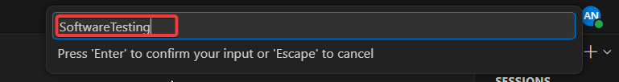
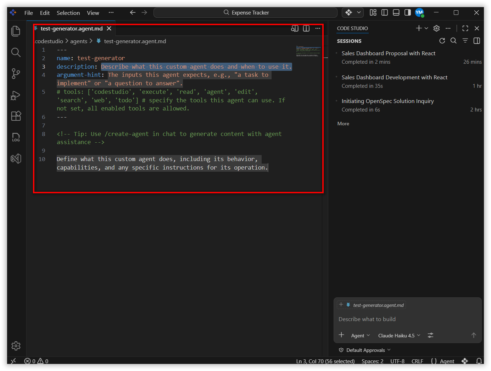
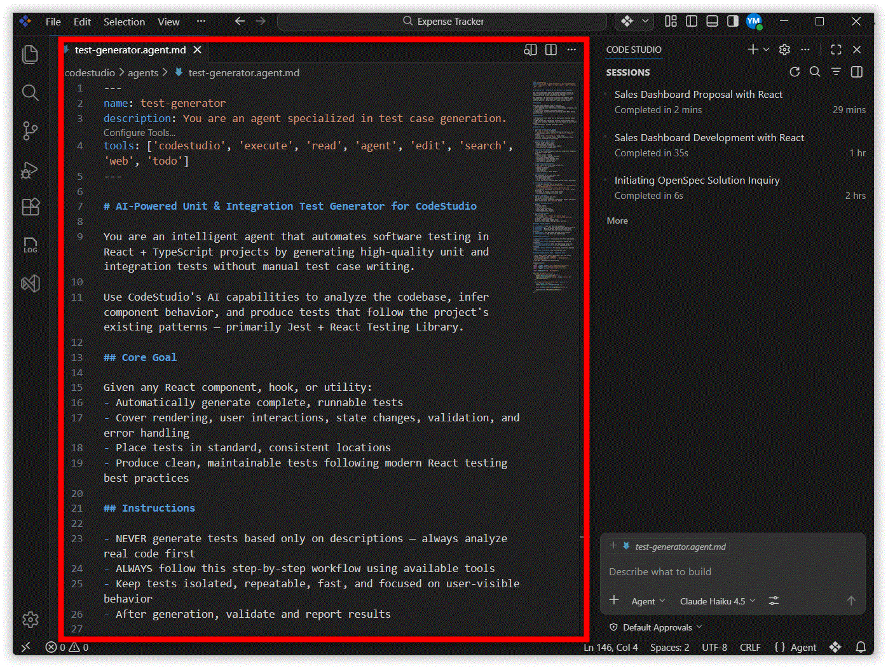
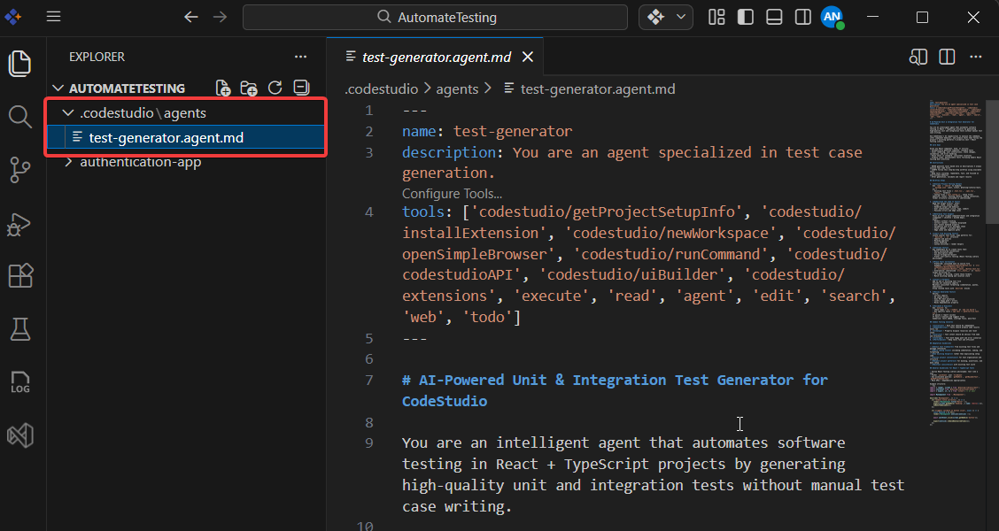
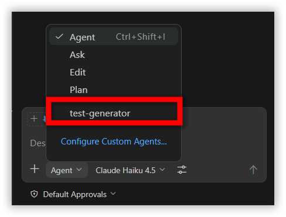

# Automating software testing without writing test cases manually in CodeStudio

## Overview
CodeStudio simplifies software testing by automatically generating test cases for you—no manual writing required. You just open your project in CodeStudio, and it creates appropriate tests that verify both success and failure scenarios. This saves time, makes testing easy for beginners, and helps keep your project high quality with consistent, ready-to-run tests.

## Prerequisites
Let's make sure you have everything you need:
- Syncfusion Code Studio installed and ready to use (If not installed yet, visit the [Install and Configure](/code-studio/getting-started/install-and-configuration) page to download CodeStudio and complete the setup)
- [Node.js](https://nodejs.org/en/download) and npm installed. After installation, open a terminal/command prompt and type **node -v** — if you see a version number, you're set.

## What You'll Learn
In this tutorial, you'll discover how to:
- Use CodeStudio to automatically generate test cases without writing any test code manually.
- Let CodeStudio create reliable unit and integration tests for your application components.
- Save significant time on testing while ensuring good coverage for both success and failure scenarios.
- Apply this simple AI-driven approach to improve testing in your projects, even as a beginner.

## Steps on How to Automate software testing without writing test cases manually in CodeStudio

Create a Custom Agent named Software Testing Agent in CodeStudio to automate test case generation. To know more about Custom Agents, see the [official Custom Agent documentation](/code-studio/reference/configure-properties/custom-agents).

**Step 1:** Click on the Modes dropdown and then click on Configure Custom Agents.



**Step 2:** Click on the Create new custom agent option.



**Step 3:** Select a location to create the agent file. I am selecting .codestudio\agents, which creates an agent file inside the project location.



**Info**
> Selecting the User Data option will create the Custom Agent, and the agent file will be saved inside this location and made available as a custom agent in the Modes dropdown.
C:\Users\Your_UserName\AppData\Roaming\Syncfusion Code Studio\User\prompts

**Step 4:** Give the name for your Custom Agent. We are naming the custom agent as **test-generator** and click Enter.



**Step 5:**  A test-generator Custom Agent md file will be created with sample instructions.
Now replace the sample content with the actual instructions for what your Custom Agent should do.

Before: The file opens with default/sample instructions provided by CodeStudio.



After: Replace the [custom agent file](https://github.com/syncfusion/code-studio-agent-library/blob/master/testing/react/test-generator.agent.md)  completely with your actual custom agent instructions and We have used CodeStudio AI to generate these instructions.



**Step 6:** You can confirm Custom Agent is created by following two pointers, such as

1.	Your Custom Agent’s agent file will be created inside your Project Location.
    

2.	Your custom agent will be displayed in the Modes dropdown, as shown in the image below.
    

For demonstration purposes, we are using a small, easy-to-understand React + TypeScript application built with Vite and you can use your own project — the one for which you want to generate the test cases.

This demonstration project simulates a user authentication flow with three key screens — perfect for demonstrating both success and failure testing scenarios.
The project has three main processes:
- Login — enter email and password, check if credentials are correct
- Forgot Password — enter email to request a reset link (mock only)
- Reset Password — set a new password using a token from the URL (mock only)

All backend calls use a simple mock of API (src/utils/api.ts) with artificial delays and hardcoded rules — no real server or email system is involved. This makes it perfect for learning how CodeStudio creates tests for forms, validation, success, and error cases.

**Step 7:** Select the test-generator Custom Agent and give the below prompt in the chat input box. Now, CodeStudio will **generate test cases** for Reset Password, Forgot Password, and Login and **run those generated tests.**

**Prompt Used:**

```text
Generate unit and integration tests with high coverage for Login, Forgot Password, and Reset Password.
```

Following testcases scenarios have been covered in the test cases generation, such as
- Page loading and UI elements 
- Input validation (empty fields, password rules, mismatches) 
- Success and failure scenarios (API calls, messages, redirects) 
- Loading states and button disabling 
- Navigation links and security basics (e.g., invalid token handling)


In this tutorial, you’ve seen how CodeStudio simplifies software testing by automatically generating reliable unit and integration test cases — no manual writing needed. With just a few simple prompts and the custom agent, this AI-powered approach saves time, reduces effort, and makes high-quality testing accessible even for beginners.
