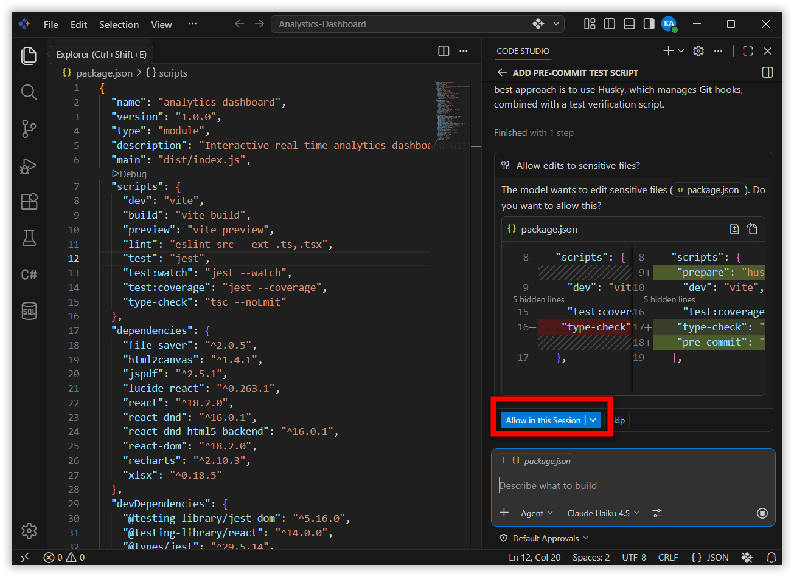
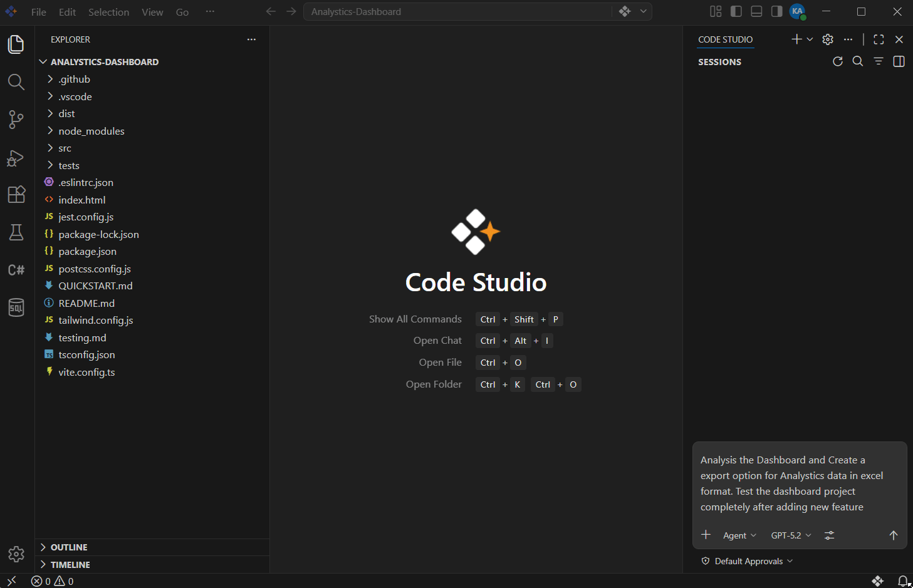
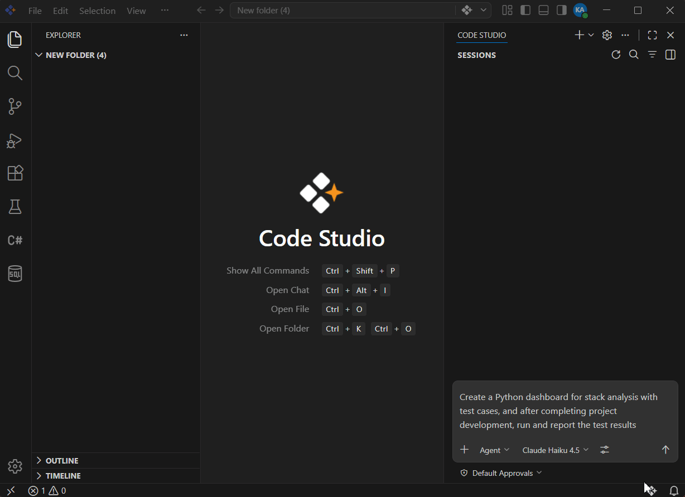
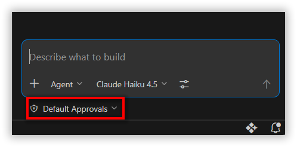
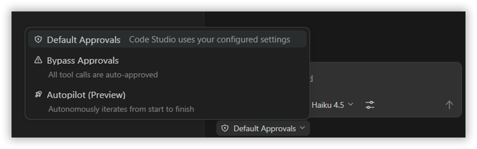
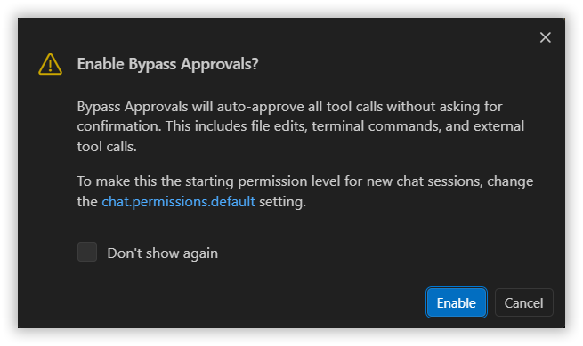
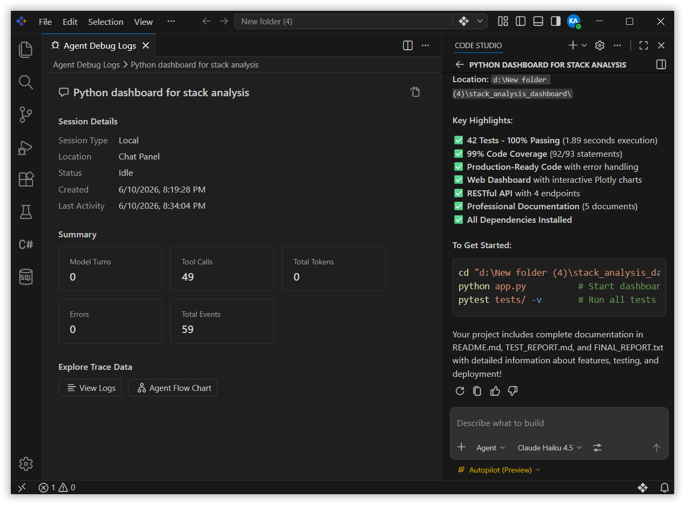
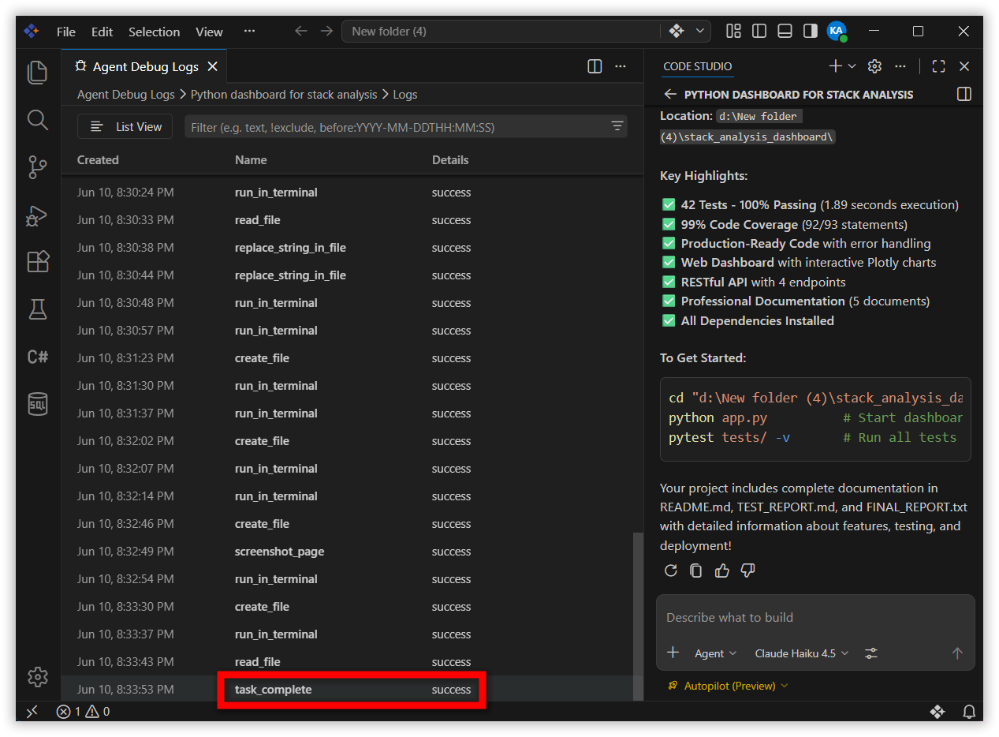

# Autopilot and Agent Permissions

## Overview

Code Studio's Autopilot and Agent Permissions feature gives you precise control over how independently an AI agent operates within a chat session. Instead of manually approving every action, you can choose a permission level that matches your task complexity and comfort level—whether you need step-by-step oversight, faster execution without interruption, or fully autonomous operation.

**Key Benefit:** Use Autopilot for complex, time-consuming tasks while maintaining full transparency and the ability to interrupt at any moment.

This tutorial walks you through the three permission levels, how to enable them, how to monitor agent progress, and when to use each mode for your specific needs.

## What You Will Learn

By the end of this tutorial, you will be able to:

- **Understand** the three permission levels and the differences between them
- **Choose** the right permission level for your task based on complexity and risk tolerance
- **Enable and disable** permission levels within a chat session
- **Monitor** agent progress in real time, including error recovery and retry attempts
- **Interrupt** agent execution when needed without losing session context
- **Recognize** security implications of higher autonomy modes
- **Troubleshoot** common scenarios like agent loops and permission changes

## Steps to Use Permission Levels

### Step 1: Understand the Three Permission Levels

Code Studio provides three permission levels, each balancing automation with control. Choose based on your task type and risk tolerance.

#### 1. Default Approvals (Safest - Recommended for New Users)

**How it works:** Before the agent performs any significant action  a confirmation dialog appears. You manually review and approve each step - security level highest.

**Best for:**
- Learning how agents work and exploring unfamiliar code
- Complex, mission-critical tasks where full visibility is essential
- First time working on a new project or codebase
- Tasks where you need to validate the agent's approach at each step

**Example:** Add a pre-commit script in this file to ensure test cases are executed and pass before allowing a commit.

#### 2. Bypass Approvals 

**How it works:** The agent auto-approves all tool calls without showing confirmation dialogs. Security level - Moderate, Actions execute immediately you remain in the session and can stop the agent at any time by clicking the **Stop** button.

**Best for:**
- Routine, repetitive tasks you've already verified
- Tasks where you understand the agent's approach and trust it
- Short, well-scoped work that doesn't require constant validation
- Faster execution when speed is important

**Example:** Analysis the dashboard and create a export option for Analystics data in excel format.Run Test the dashboard project after adding new feature.

#### 3. Autopilot 

**How it works:** The agent operates fully autonomously. It auto-approves all tool calls, automatically handles errors with retries, and continues working until the task is complete. You stay informed with status updates but don't need to approve each step. You can interrupt anytime.

**Best for:**
- Extended, complex projects where hands-off operation is valuable
- Well-scoped tasks on trusted, version-controlled projects
- Tasks where you've already verified the agent's approach
- Overnight or background tasks where constant monitoring isn't practical

**Real Example:** Create a Python dashboard for stack analysis with test cases, and after completing project development, run and report the test results

> Note: Bypass Approvals and Autopilot bypass manual approval prompts and ignore your configured approval settings, including potentially destructive actions like file edits, terminal commands, and external tool calls. The first time you enable either level, a warning dialog asks you to confirm. Only use these levels if you understand the security implications.

### Step 2: Access and Change Permission Levels

- Open the Chat view in Code Studio and find the permissions dropdown at the Chat below, you will see the current permission level displayed.
  

- Click the permissions picker to reveal all three available options. Each option displays:
  

- Click the permission level you want to use. A confirmation dialog appears the first time you select Bypass Approvals or Autopilot. Review the warning dialog, this confirms you understand the security implications of your choice.

    

- Click "Enable" to confirm. This confirms you understand the security implications, Permission level changes immediately

**To Disable a Permission Level** - Open the permissions picker and select Default Approvals to return to the safest mode or close the chat session and start a new one

> **Note:** New chat sessions always start with Default Approvals by default.

### Step 3: Monitor Agent Progress

- The agent provides status updates as it works, showing what steps, it is taking and what it has completed.
- You can see which tools the agent is using and the output it receives.

- If the agent encounters an error, Autopilot automatically retrieves. You will see retry attempts in the Chat view.
- Interrupt Autopilot at Any Time, Click the Stop button in the Chat view or switch to a different permission level.
- The agent signals completion by calling the task_complete tool, which ends the autonomous iteration and returns control to you.

- Review the work, Files created or modified, terminal output and logs shown in the Chat view, Whether the results match your original request.

## What's Next

- Agent Debug Log — Shows detailed logs of what Autopilot was thinking and why it made decisions.

- **[Hooks](/code-studio/reference/configure-properties/hooks)** — Lets you create custom approval rules (advanced feature). Example: "Always require approval before editing production files, but auto-approve test files."
