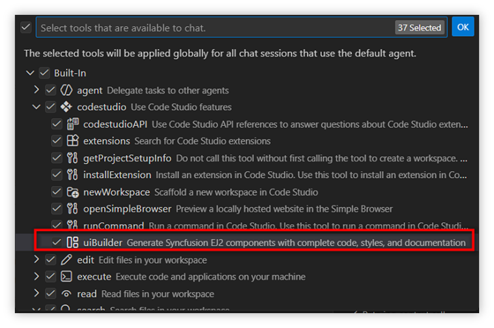
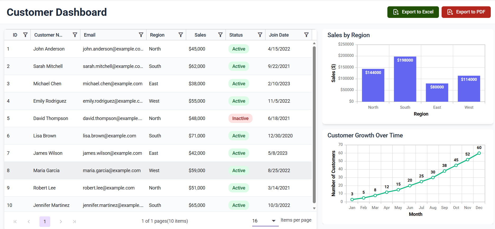

# Build UI Using Syncfusion UI Builder

## Overview

Build a complete customer dashboard using Syncfusion UI Builder in Code Studio. You will scaffold a React app, generate a data grid and charts, wire up export actions, and validate the final result.

## Prerequisites

- Syncfusion Code Studio installed and configured (Follow the [Install and Configure](/code-studio/getting-started/install-and-configuration) guide if not yet installed)
- Ensure UI Builder tool enabled
- [Node.js](https://nodejs.org/en/download) and npm installed
- [Syncfusion license key](https://help.syncfusion.com/common/essential-studio/licensing/how-to-generate) 

## What You’ll Learn

- Generate a dashboard UI with data grid, charts, and export actions
- Write effective UI Builder requests to create full features
- Customize generated Syncfusion components
- Configure Syncfusion licensing and theme assets
- Validate functionality and troubleshoot common issues

## Steps

### Step 1: Create and Open the React Project

1. Create a new React app and open it in Code Studio:
   ```bash
   npm create vite@latest customer-dashboard -- --template react
   cd customer-dashboard
   ```
2. Open the project folder in Code Studio.
3. Verify the UI Builder tool is enabled:
   - Open the Configure Tools panel in Code Studio
   - Ensure the UI Builder tool is enabled.
   
   

### Step 2: Generate the Dashboard with UI Builder

1. In Code Studio, make a comprehensive UI Builder request to create the full dashboard:

   Create a customer dashboard for React using Syncfusion components with data grid, charts, and export functionality.

2. Code Studio will generate the components (data grid, charts) and wire up basic layout and interactions.
   

### Step 3: Configure Syncfusion License and Theme

1. Ensure required Syncfusion packages are installed. Code Studio typically installs dependencies automatically when generating components.
2. [Register](https://help.syncfusion.com/common/essential-studio/licensing/how-to-register-in-an-application#reactjs) your Syncfusion license key in your app entry (for example, in index.js):
   ```javascript
   import { registerLicense } from '@syncfusion/ej2-base';
   registerLicense('YOUR_LICENSE_KEY');
   ```
3. Confirm that a Syncfusion theme CSS import is present in your entry styles.

### Step 4: Run and Inspect

1. Start the development server and open the app in the browser:
   ```bash
   npm run dev
   ```
2. Confirm all components render without errors and the layout is responsive.

### Step 5: Customize (Optional)

- Adjust grid columns, sorting, filtering, and pagination settings
- Update chart types, series, and data sources
- Add toolbar items such as Excel/PDF export and wire them to handlers
- Replace sample data with API-backed data as needed

## Verify

Expected result:



Validate the following:

- Data Grid
  - Columns support sorting and filtering
  - Pagination works and data renders correctly
- Charts
  - Sales by Region (bar) and Customer Growth (line) show expected values
  - Tooltips and interactions work; layout is responsive
- Export
  - Grid exports to Excel and PDF successfully
  - Exported files contain correct data and formatting
- Integration
  - No runtime errors; acceptable load and render performance
  - License key is registered and no license popups appear

If something fails:
- Ensure all Syncfusion packages and peer dependencies are installed
- Verify theme CSS imports
- Check data shapes against component requirements

## Next Steps

 - [Configure the default model](/code-studio/how-to-guides/Configure-default-model) to use the UI Builder tool effectively.
