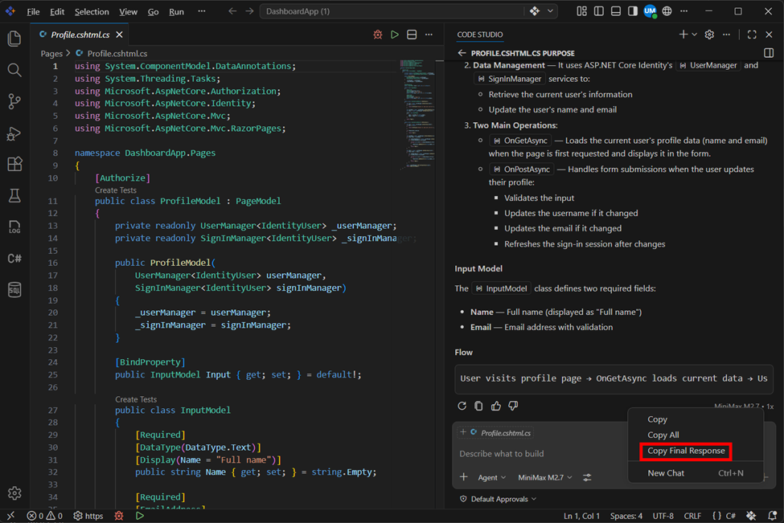

# Copy Final Response in Chat

## Overview

The **Copy Final Response** feature in the Chat view allows you to quickly copy only the final output generated by the agent, without including intermediate steps such as tool calls or internal processing details.

This is especially useful when you need a clean, ready-to-use response for documentation, sharing, or further use, ensuring that only the relevant content is copied in a readable format.

---

## What You Will Learn

By the end of this tutorial, you will:

- Understand the purpose of the Copy Final Response feature  
- Learn how it differs from copying the full chat conversation  
- Know how to copy only the final output from the agent  
- Use this feature for clean and efficient content extraction  

---

## Steps to Copy the Final Response

### Step 1: Open the Chat View

Navigate to the Chat view in your editor where the agent responses are displayed.

---

### Step 2: Locate the Agent Response

- Identify the response you want to copy  
- Ensure the agent has completed all actions and the final response is visible  

---

### Step 3: Open the Context Menu

- Right-click on the agent’s response to open the context menu  

---

### Step 4: Select Copy Final Response

- Click on **Copy Final Response** from the menu  
- This will copy only the final formatted output  

---
