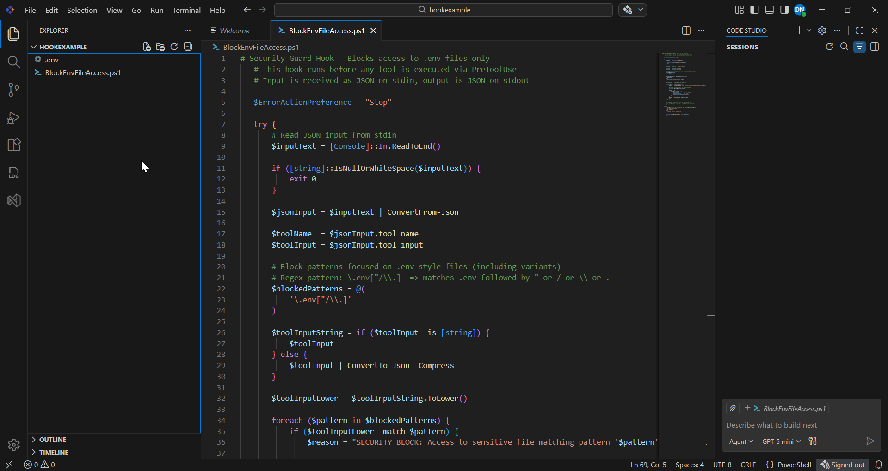
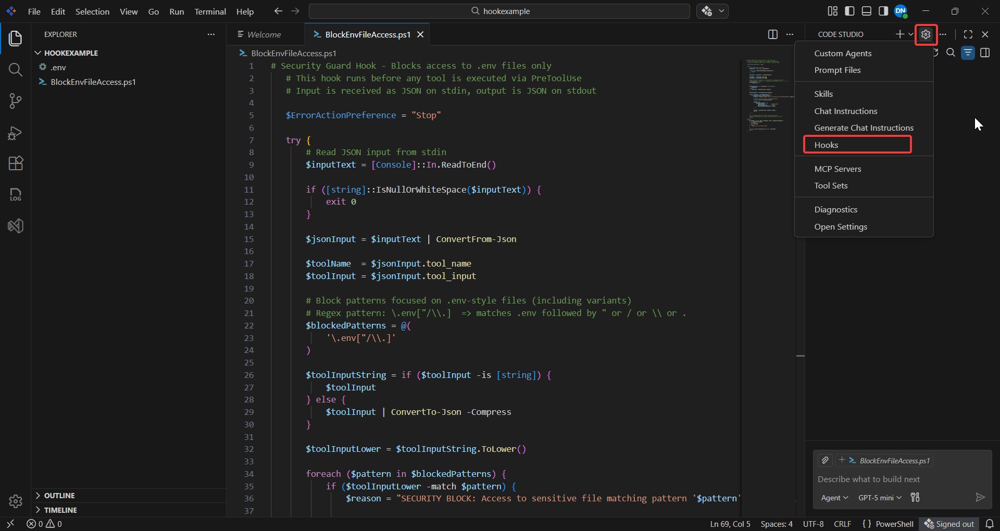
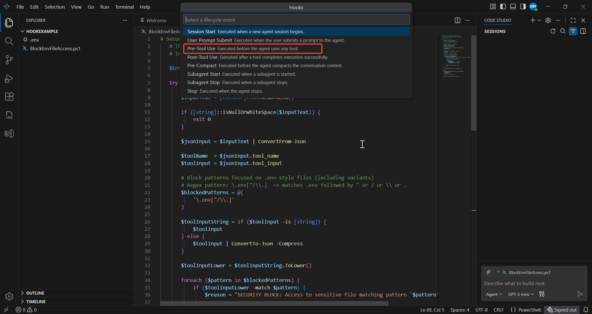
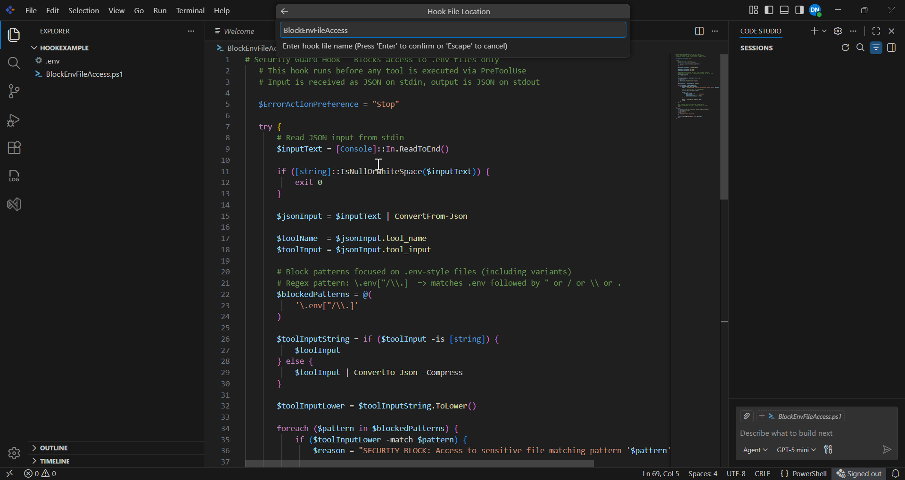
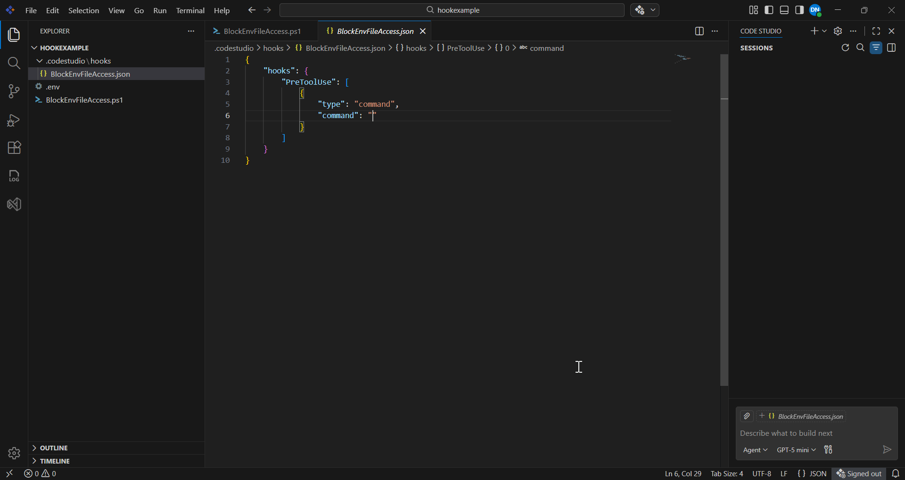
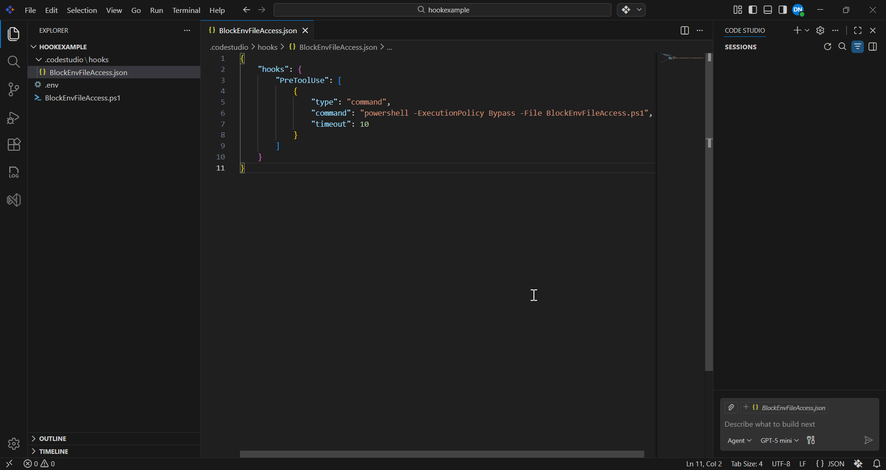
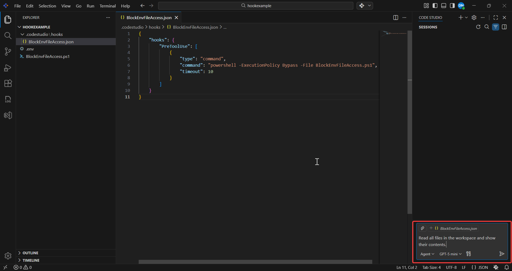
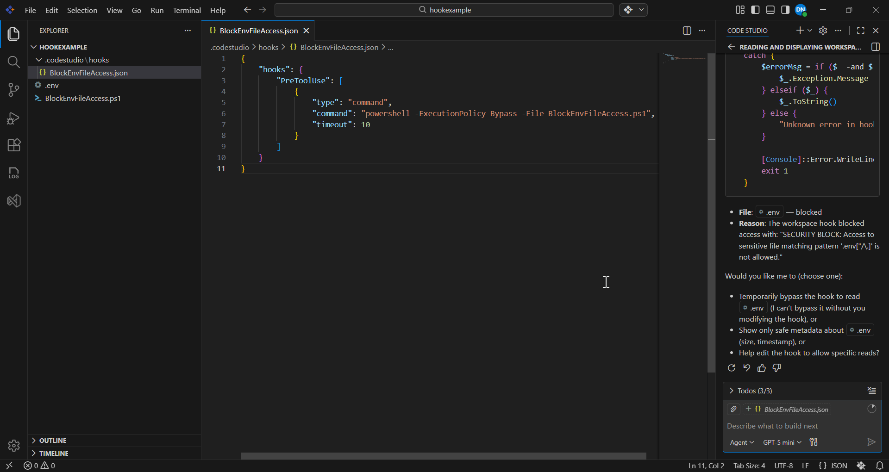

# Enhancing Security Reviews and Code Quality with Automated Hooks in Code Studio

## Overview

AI agents in Syncfusion Code Studio can read files, run tools, and generate code on your behalf. Without guardrails, an agent might accidentally:

- Read sensitive files such as `.env` or credential files.
- Run risky shell commands.
- Modify files you consider off-limits.

**Hooks** let you insert your own logic into these workflows. A hook is a small script that runs at specific lifecycle events (for example, before a tool runs) and decides whether to:

- Allow the action.
- Block the action.
- Optionally return a custom message back to the user.

In this tutorial, you'll configure a **Pre-Tool Use** hook that blocks any tool call that tries to access `.env`-style files. You can then extend the same pattern to enforce broader security and code-quality rules.

> **Note:** The hook script in this tutorial is written in PowerShell for Windows. If you are on macOS or Linux, you will need to adapt the script to Bash or another shell available on your system.

## Prerequisites

Before you begin, make sure:

- Syncfusion Code Studio is installed and properly configured. If you haven't installed it yet, see [Install and Configure](/code-studio/getting-started/install-and-configuration) for step-by-step instructions.
- **Agent Mode** and tools are enabled for your workspace.
- Basic familiarity with running scripts:
  - PowerShell on Windows.
  - Bash (or another shell) on macOS or Linux.

## What You Will Learn

By the end of this tutorial, you will be able to:

- Enable and configure **Hooks** in Code Studio.
- Create a **Pre-Tool Use** hook that inspects tool requests before they run.
- Block attempts to read `.env` (and other sensitive files) from AI tools.
- Provide clear feedback to the user when a request is blocked.
- Extend hook patterns to cover broader security and code-quality rules.
- Test hook behavior from the **Chat Panel**.

## Key Concepts

**Hook**
A small script that Code Studio calls at specific points in the agent workflow. Hooks let you intercept, inspect, and optionally block agent actions before they execute.

**Pre-Tool Use event**
A hook lifecycle event that fires *before* any tool call runs. Your script receives details about the upcoming call and returns a decision (allow or deny) before Code Studio proceeds.

**permissionDecision**
The field in your hook's JSON (JavaScript Object Notation) output that tells Code Studio whether to allow or deny a tool call. Supported values are `"allow"` and `"deny"`.

**stdin / stdout**
Standard input and standard output streams. Code Studio passes tool-call details to your hook script via stdin and reads your hook's decision from stdout.

## Steps to Enhance Security with Hooks

### Step 1: Create a .env and PowerShell script 

In this step, you will prepare a test `.env` file and create the PowerShell hook script that blocks tool calls attempting to read `.env`-style configuration files.

1. Create a minimal `.env` file in the project root.
2. Create a new PowerShell script at the project root named `BlockEnvFileAccess.ps1`.
3. Paste the following PowerShell logic into the file:

   ```powershell
   # Security Guard Hook - Blocks access to .env files only
   # This hook runs before any tool is executed via PreToolUse
   # Input is received as JSON on stdin, output is JSON on stdout

   $ErrorActionPreference = "Stop"

   try {
       # Read JSON input from stdin
       $inputText = [Console]::In.ReadToEnd()

       if ([string]::IsNullOrWhiteSpace($inputText)) {
           exit 0
       }

       $jsonInput = $inputText | ConvertFrom-Json

       $toolName  = $jsonInput.tool_name
       $toolInput = $jsonInput.tool_input

       # Block patterns focused on .env-style files (including variants)
       # Regex pattern: \.env["/\\.]  => matches .env followed by " or / or \\ or .
       $blockedPatterns = @(
           '\.env["/\\.]'
       )

       $toolInputString = if ($toolInput -is [string]) {
           $toolInput
       } else {
           $toolInput | ConvertTo-Json -Compress
       }

       $toolInputLower = $toolInputString.ToLower()

       foreach ($pattern in $blockedPatterns) {
           if ($toolInputLower -match $pattern) {
               $reason = "SECURITY BLOCK: Access to sensitive file matching pattern '$pattern' is not allowed."

               # Log the reason to stderr for debugging/audit
               [Console]::Error.WriteLine($reason)

               $output = @{
                   hookSpecificOutput = @{
                       hookEventName            = "PreToolUse"
                       permissionDecision       = "deny"
                       permissionDecisionReason = $reason
                   }
               }

               $output | ConvertTo-Json -Compress -Depth 3
               exit 0
           }
       }

       # If no blocked patterns are found, do nothing special.
       # Most configurations will treat a missing decision as "allow".
       exit 0
   }
   catch {
       $errorMsg = if ($_ -and $_.Exception -and $_.Exception.Message) {
           $_.Exception.Message
       } elseif ($_) {
           $_.ToString()
       } else {
           "Unknown error in hook script"
       }

       [Console]::Error.WriteLine("Hook error: $errorMsg")
       exit 1
   }
   ```

4. Save the file.



#### What This Hook Does

At a high level, this script:

- Reads the PreToolUse JSON **input** from stdin.
- Extracts:
  - `tool_name` – which tool is about to run.
  - `tool_input` – the arguments the tool will use (for example, requested file paths).
- Converts the tool input to a lowercase string and scans it for patterns that look like `.env` files:
  - The default pattern (`\.env["/\\.]`) matches `.env` followed by `"`, `/`, `\\`, or `.`.
- If a match is found:
  - Logs a security message to stderr for audit purposes.
  - Returns a JSON **deny** decision with a clear human-readable reason.
- If no match is found:
  - Exits without modifying behavior, so the tool call can proceed normally.

> **Important:** Be careful with overly broad patterns. Blocking too many paths (for example, everything under your project root) can prevent agents from doing useful work.

### Step 2: Create a Pre-Tool Use Hook

Next, you will create a hook that runs **before** any tool is executed.

1. Click the settings icon (**Configure Chat**) in the **Chat Panel**, then select **Hooks** from the menu.



2. When prompted for the life cycle event type, select **Pre-Tool Use**.



3. Enter a descriptive name for your hook, such as **BlockEnvFileAccess**.



4. Code Studio scaffolds the necessary hook configuration, typically under a folder such as `.codestudio/hooks/`.



> **Note:** The exact filename and folder may differ slightly depending on your configuration, but the file will be associated with the **Pre-Tool Use** event you selected.

### Step 3: Configure the Pre-Tool Use Hook Command

Now wire the Pre-Tool Use event to your PowerShell script using the hooks configuration.

1. Open your Code Studio hooks configuration file (for example, `.codestudio/hooks/BlockEnvFileAccess.json`).
2. Under the `hooks` section, add or update a **Pre-Tool Use** entry similar to the following:

   ```json
   {
     "hooks": {
       "PreToolUse": [
         {
           "type": "command",
           "command": "powershell -ExecutionPolicy Bypass -File BlockEnvFileAccess.ps1",
           "timeout": 10
         }
       ]
     }
   }
   ```

3. Save the configuration file.

#### What This Configuration Does

- `type: "command"` tells Code Studio to run a shell command when the **Pre-Tool Use** event fires.
- `command` runs your PowerShell script (`BlockEnvFileAccess.ps1`) with `ExecutionPolicy Bypass` so it can execute even if your system has a more restrictive default policy.
- `timeout: 10` limits the hook to 10 seconds; increase this if your script needs more time.



### Step 4: Review the Hook Input and Output Format

Review the JSON structures that Code Studio sends to and expects from your hook script before running a live test.

When a tool is about to run (for example, a file read or search), Code Studio:

1. Collects details about the upcoming tool call, such as:
   - Tool name (for example, `read/readFile` or `search/fileSearch`).
   - Tool arguments (for example, file paths to read).
   - Session metadata (timestamps, session id, user, etc.).
2. Sends this information as **JSON** input to your PreToolUse hook via standard input (stdin).
3. Waits for your hook to return a **JSON response** on standard output (stdout).

Your hook script uses this information to decide what to do next. Common outcomes include:

- **Allow** the tool call:

  ```json
  {
    "hookSpecificOutput": {
      "hookEventName": "PreToolUse",
      "permissionDecision": "allow"
    }
  }
  ```

- **Deny** the tool call with a reason:

  ```json
  {
    "hookSpecificOutput": {
      "hookEventName": "PreToolUse",
      "permissionDecision": "deny",
      "permissionDecisionReason": "Access to .env files is not allowed."
    }
  }
  ```

Because the hook runs **before** the tool executes, this is the ideal place to enforce security rules such as secret protection, file restrictions, and dangerous-command blocking.

### Step 5: Test the Hook in a Real Session

Now you will verify that your hook works as expected from the user’s point of view.

1. Open the **Chat Panel** and ensure that **Hooks** are enabled for your project.

2. Next, ask the agent to perform an action that could involve reading `.env` or similar files. For example:

   ```text
   Read all files in the workspace and show their contents.
   ```



3. Observe the result:
   - The **Pre-Tool Use** hook should detect any paths or arguments that reference `.env`-style files.
   - The tool request should be blocked.
   - You should see the custom security message defined in your script (for example, starting with `SECURITY BLOCK:`).



### Step 6: Extend Hooks for Security Reviews and Code Quality

Once your `.env` protection works, you can reuse the same pattern for broader security and code-quality rules.

Here are some ideas:

- **Block dangerous commands**
  - Deny shell tools that try to run commands such as `rm -rf`, `drop database`, or other destructive patterns.
- **Restrict file types**
  - Prevent tools from modifying binary assets, generated artifacts, or specific directories (for example, `dist/`, `build/`, or `secrets/`).
- **Enforce review workflows**
  - Require that certain tool uses (such as large refactors) only run when a specific environment flag is set (for example, `ALLOW_MASS_REFACTOR=true`).
- **Audit and logging**
  - Log all tool calls for specific agents or sessions to a central audit file during security reviews.

## Verify Your Results

Use this checklist to confirm that your automated security hook is working correctly:

- **Hooks are enabled**
  - The Hooks toggle is turned **On** under Agent or Chat settings.
- **Pre-Tool Use hook exists**
  - A hook for the **Pre-Tool Use** event (for example, `BlockEnvFileAccess`) is present and active in the Hooks list.
- **Safe tool calls succeed**
  - Reading normal source files or documentation through the agent still works.
- **.env access is blocked**
  - Any attempt by the agent to read `.env` or related files is denied, and the user sees your custom security message.
- **Errors are handled**
  - If the hook script encounters an error, it logs a clear message, and Code Studio does not fail silently.

If any of these checks fail:

- Reopen your hook script and confirm that it parses the JSON input correctly.
- Add additional logging around JSON parsing and pattern matching.
- Re-run your tests in a clean chat session.

## What's Next

- [Generate Your First Code Change Using Agent](code-studio/tutorials/generate-your-first-code-using-agent) — Guide the agent to implement and verify a small change end-to-end.
- [Fixing Bugs with AI](code-studio/tutorials/fixing-bugs-with-ai) — Use the agent to identify, patch, and validate defects safely.
- [Compare AI Models for Different Tasks](code-studio/tutorials/compare-ai-models) — Evaluate model quality, cost, and speed for your workflows.
