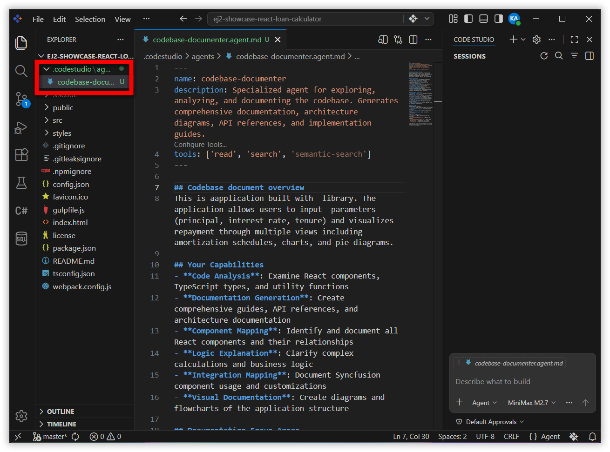
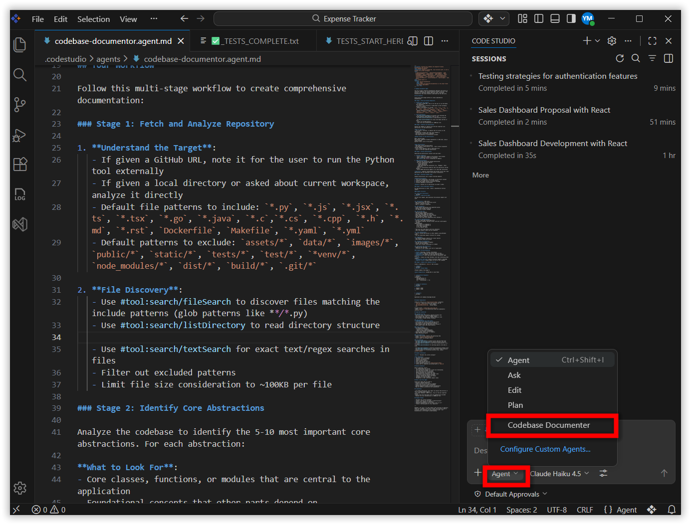
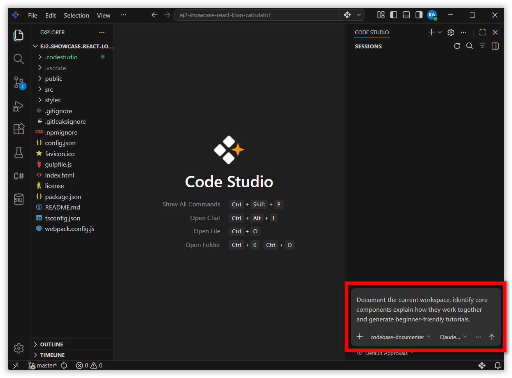
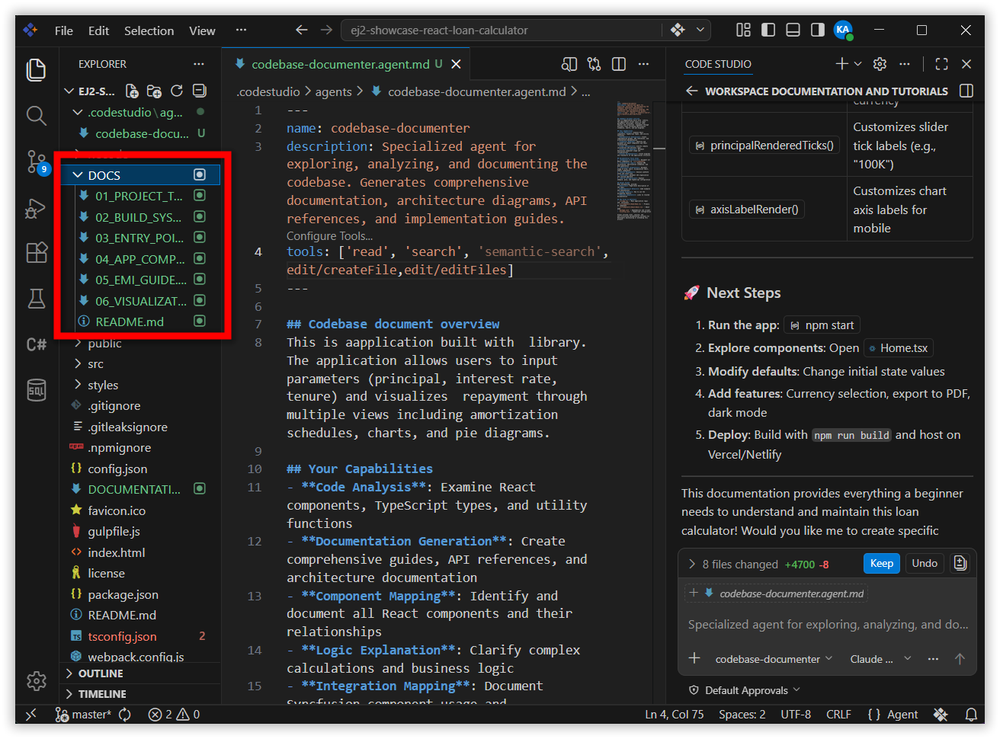

---
title: Fixing Documentation Gaps How AI Generates Accurate Developer Documentation Instantly
description: Learn how to use a custom Codebase Documenter agent in Syncfusion Code Studio to generate clear, beginner-friendly documentation for any codebase.
platform: syncfusion-code-studio
keywords: documentation, custom-agent, codebase-docs, ai-documentation, code-studio, knowledge-sharing
---

# Fixing Documentation Gaps: How AI Generates Accurate Developer Documentation Instantly

## Overview

Many teams have at least one project that nobody wants to touch because **the code is complex and the documentation is out of date—or missing entirely**. This tutorial shows you how to use a **Codebase Documenter** custom agent in Syncfusion Code Studio to turn that kind of codebase into clear, beginner-friendly documentation.

Instead of manually writing long README files and architecture notes, you will:

- Create (or reuse) a **Codebase Documenter** agent.
- Point it at your project.
- Let it analyze your code and generate tutorials and overviews automatically.

By the end, you will have a **repeatable workflow** to keep your documentation fresh without turning developers into full-time writers.

For a deeper understanding of the features used in this tutorial, see [Custom Agents](/code-studio/reference/configure-properties/custom-agents) and [Checkpoints](/code-studio/features/checkpoints).

## Prerequisites

Before you start, make sure:

- Syncfusion Code Studio is installed and properly configured. If you haven't installed it yet, see [Install and Configure](/code-studio/getting-started/install-and-configuration) for step-by-step instructions.

- Have a project ready to document. For this tutorial, we use the example project [ej2-showcase-react-loan-calculator](https://github.com/syncfusion/ej2-showcase-react-loan-calculator.git).

## What You Will Learn

By the end of this tutorial, you will be able to:

- Create or reuse a **Codebase Documenter** custom agent based on a `.agent.md` template.
- Point the agent at a local project and let it analyze your codebase.
- Generate beginner-friendly documentation including high-level overviews, architecture descriptions, and step-by-step tutorial “chapters”.
- Run targeted follow-up prompts to update specific documentation chapters after a code change, keeping your docs in sync with the codebase over time.

## Key Concepts

**.agent.md file**
A Markdown-based configuration file that defines a custom agent's identity, behavior, tools, and workflow instructions. Code Studio reads these files from the `.codestudio/agents/` folder and makes the agents they describe available in the Chat Panel.

**Codebase Documenter**
A named custom agent pre-configured to analyze a codebase and produce beginner-friendly documentation. Its behavior is defined in `Codebase-Documenter.agent.md` and can be customized for any project structure or documentation style.

## Steps to Generate Developer Documentation

### Step 1: Create the Codebase Documenter Agent File 

In this step, you will create the configuration file that turns a generic model into a documentation-focused **Codebase Documenter** agent.

1. Open your project folder in Code Studio (`Ctrl+K Ctrl+O` (Windows/Linux) or `Cmd+K Cmd+O` (Mac)), or clone the repository and open the folder in Code Studio. For this tutorial, we use the example project [ej2-showcase-react-loan-calculator](https://github.com/syncfusion/ej2-showcase-react-loan-calculator.git).

2. **Create the agent configuration folder (if it does not exist):**
   - In the **Explorer** (`Ctrl+Shift+E` (Windows/Linux) or `Cmd+Shift+E` (Mac)), create a folder named `.codestudio` at the root of your project.
   - Inside it, create a subfolder named `agents`.
   - Final path: `.codestudio/agents/`.
3. **Create or download the agent template:**
   - Create a custom agent for documentation, or obtain the `Codebase Documenter` agent from the agent library.
   - Download the custom Codebase Documenter agent from the [Codebase Documenter agent template](https://github.com/syncfusion/code-studio-agent-library/blob/master/documentation/codebase-documenter.agent.md).
4. **Place the template in your project:**
   - Copy `Codebase-Documenter.agent.md` into the `.codestudio/agents` folder.
5. **Open the agent file in the editor:**
   - In the **Explorer**, expand `.codestudio/agents`.
   - Select `Codebase-Documenter.agent.md` to open it.

You now have a documentation-focused agent configuration file attached to your project. A `.agent.md` file describes how the agent should behave—its name, description, tools, and detailed workflow.



### Step 2: Customize the Codebase Documenter Agent

This step is optional but recommended — tune the agent so it matches your project and documentation style.

1. **Review the top metadata block** in `Codebase-Documenter.agent.md`:
   - Confirm or update:
     - `description` – for example, “Transform any codebase into beginner-friendly documentation and tutorials”.
     - `name` – for example, “Codebase Documenter”.
     - `argument-hint` – explain what inputs the agent expects (for example, “Specify a GitHub URL, local directory path, or ask to document the current workspace”).
2. **Confirm the model and tools:**
   - Ensure the `model` is set to your preferred model in Code Studio.
   - Check that the required tools for reading files, searching the codebase, and creating docs are listed (for example, `read/readFile`, `search/fileSearch`, `edit/createFile`).
3. **Skim the workflow instructions inside the file:**
   - Make sure they:
     - Emphasize beginner-friendly explanations.
     - Limit code examples to short, well-commented snippets.
     - Describe how to structure chapters and the main `index.md`.
4. **Adjust any project-specific details:**
   - If your repository is very large, you can:
     - Limit which folders to scan (for example, `src/`, `apps/api/`).
     - Exclude test, build, or asset directories.
   - If your team has naming conventions for docs (for example, `docs/architecture/`), update the instructions so the agent writes output to those folders.

Think of this file as the “job description” for your documentation agent. The clearer it is, the better your generated docs will be.

### Step 3: Activate the Codebase Documenter Agent in Chat

Now that the agent is defined in your project, you can start using it from the **Chat Panel**.

1. Open the **Chat Panel** in Code Studio (`Ctrl+Alt+B` (Windows/Linux) or `Cmd+Alt+B` (Mac)).

2. **Select the Codebase Documenter agent:**
   - Click the **Agent** dropdown at the bottom of the **Chat Panel**.
   - Choose **Codebase Documenter** from the list.

3. **Confirm the agent is active:**
   - The agent’s description should appear as a hint or subtitle in the chat input area.
   - You should see that you are now chatting with **Codebase Documenter**, not the default agent.



> **Note:** If you do not see the agent in the dropdown, double-check that the `.agent.md` file is inside `.codestudio/agents/`, the file name ends with `.agent.md`, and there are no syntax errors in the metadata block at the top. For a deeper understanding of agent behavior, see [Custom Agents](/code-studio/reference/configure-properties/custom-agents).

### Step 4: Ask the Agent to Document Your Codebase

With the agent selected, you can now ask it to analyze your project and generate documentation.

1. **Choose your scope:**
   - If your project is already open in Code Studio and you want docs for everything, you can target the **current workspace**.
   - If you want to focus on a subfolder (for example, `src/`), mention that explicitly in your request.
2. **Send a focused initial request in Chat, for example:**
   ```text
   Document the current workspace. Identify core components, explain how they work together, and generate beginner-friendly tutorials.
   ```
3. **Let the agent run:**
   - The agent will typically:
     - Scan relevant folders and important source files.
     - Identify core abstractions (services, controllers, widgets, modules, and so on).
     - Map out how those pieces relate to each other.
     - Generate:
       - An `index.md` file with a high-level overview and table of contents.
       - A series of chapter files (for example, `01_overview.md`, `02_authentication.md`, and so on).
4. **Watch the tool usage and status messages** in the chat:
   - You should see the agent:
     - Listing files.
     - Reading source code.
     - Creating new Markdown files in an output folder.



### Step 5: Review and Refine the Generated Documentation

AI-generated documentation is a draft. You stay in control of quality and correctness.

1. **Open the generated docs in the Explorer:**
   - Look for an output folder created by the agent, for example: `output/my-project/`.
   - You should see:
     - `index.md` – overview and architecture.
     - Several chapter files – individual topics.
2. **Start with `index.md`:**
   - Check:
     - Does the project summary sound correct?
     - Does the architecture diagram (if any) match reality?
     - Does the table of contents reflect how you want newcomers to learn the system?
3. **Skim through a few chapter files:**
   - Do the chapter titles match major areas of your architecture?
   - Are explanations accurate enough for a new teammate?
   - Are code examples short enough to read quickly and correct in terms of APIs and behavior?
4. **Give targeted feedback through follow-up prompts:**
   - If something is unclear or wrong, go back to Chat and say, for example:
     ```text
     The data flow section is confusing. Please rewrite Chapter 3 with a clearer sequence diagram and shorter explanations.
     ```
   - Or:
     ```text
     Chapter 2 over-explains basic React concepts. Focus more on how our custom hooks work and less on React fundamentals.
     ```
5. **Let the agent regenerate or refine specific chapters** instead of rewriting everything by hand.

> **Tip:** Treat the AI as a **junior technical writer**. The agent writes first drafts; you review, correct, and approve. This keeps you in control while still saving time.



### Step 6: Keep Documentation in Sync with Code Changes

Documentation is only useful if it stays up to date. This step shows you how to use the agent to update docs incrementally so that keeping them current becomes a quick habit instead of a big project.

1. **Update docs after a major feature or refactor:**
   - Open the **Chat Panel** and make sure **Codebase Documenter** is still selected.
   - Send the following prompt:
     ```text
     Compare the current workspace with the last documented version and update any sections that are now outdated.
     ```
   - The agent re-scans key modules, updates specific chapters, and flags places where behavior appears to have changed.

2. **Generate focused tutorials for new areas of the codebase:**
   - When a new module is added or a teammate needs to onboard to a specific area, ask for a targeted tutorial:
     ```text
     Create a beginner-friendly tutorial for the billing module under src/billing.
     ```
   - The agent produces a new chapter file you can review and merge into the existing docs structure.

## What's Next

Keep momentum by trying one of these next steps:

- Generate your first code change: Walk through creating and applying a safe code diff with the agent. See [Generate Your First Code Using Agent](/code-studio/tutorials/generate-your-first-code-using-agent).
- Fix bugs with AI: Locate, explain, and patch defects end-to-end. See [Fixing Bugs with AI](/code-studio/tutorials/fixing-bugs-with-ai).
- Accelerate code reviews: Summarize diffs, surface risks, and propose improvements. See [Accelerate Code Reviews](/code-studio/tutorials/accelerate-code-reviews).

