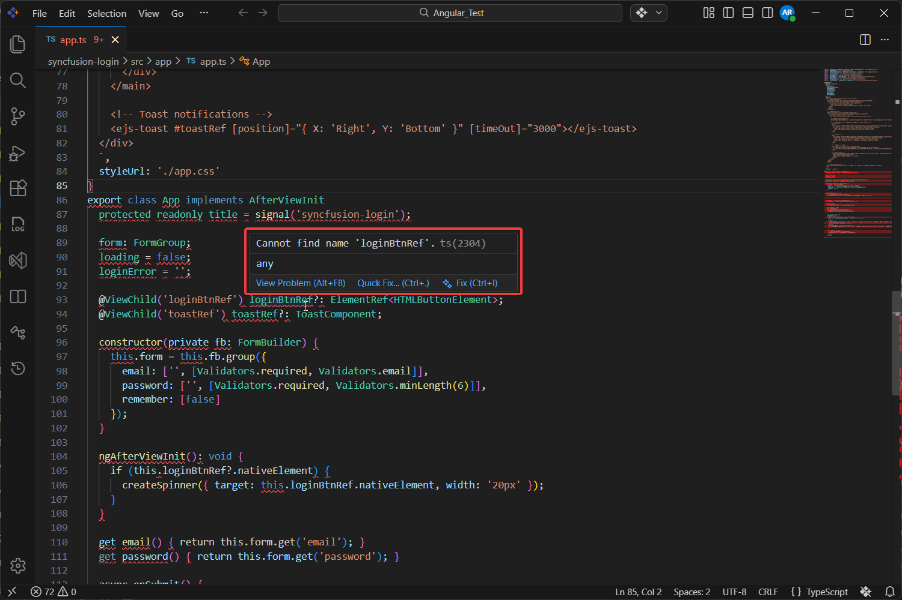
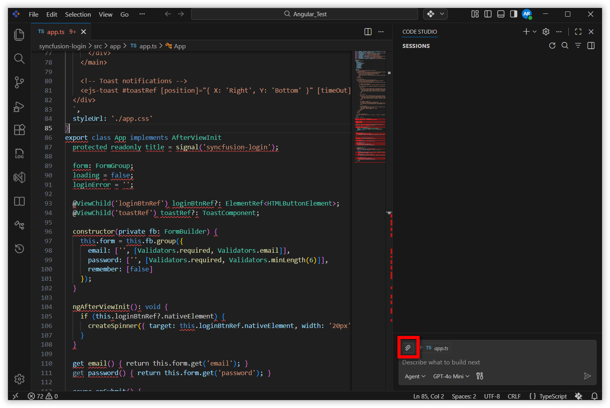
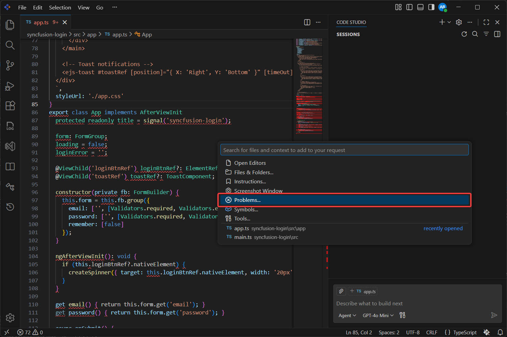
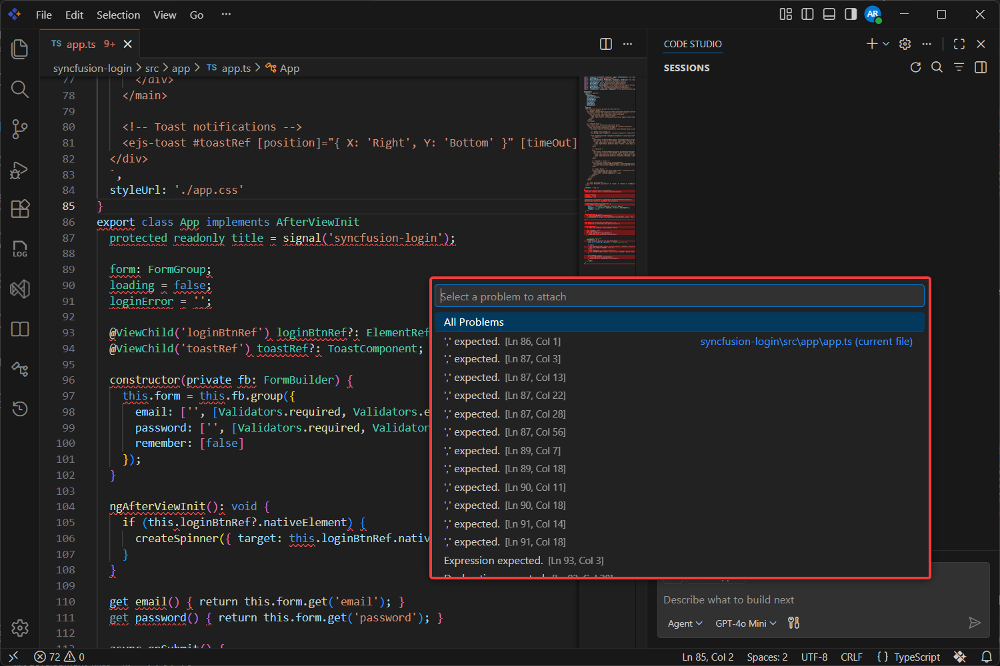
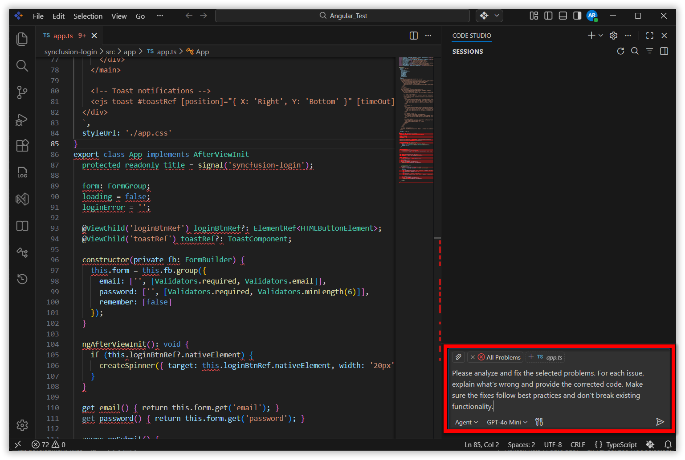
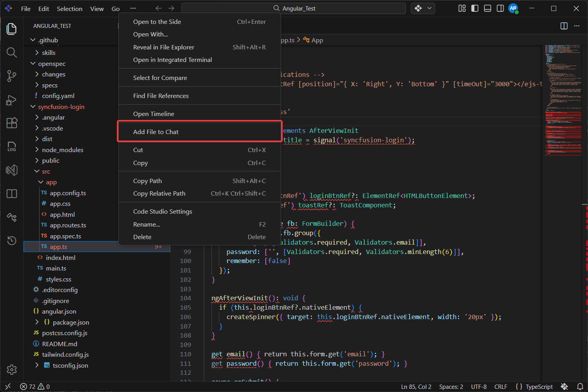
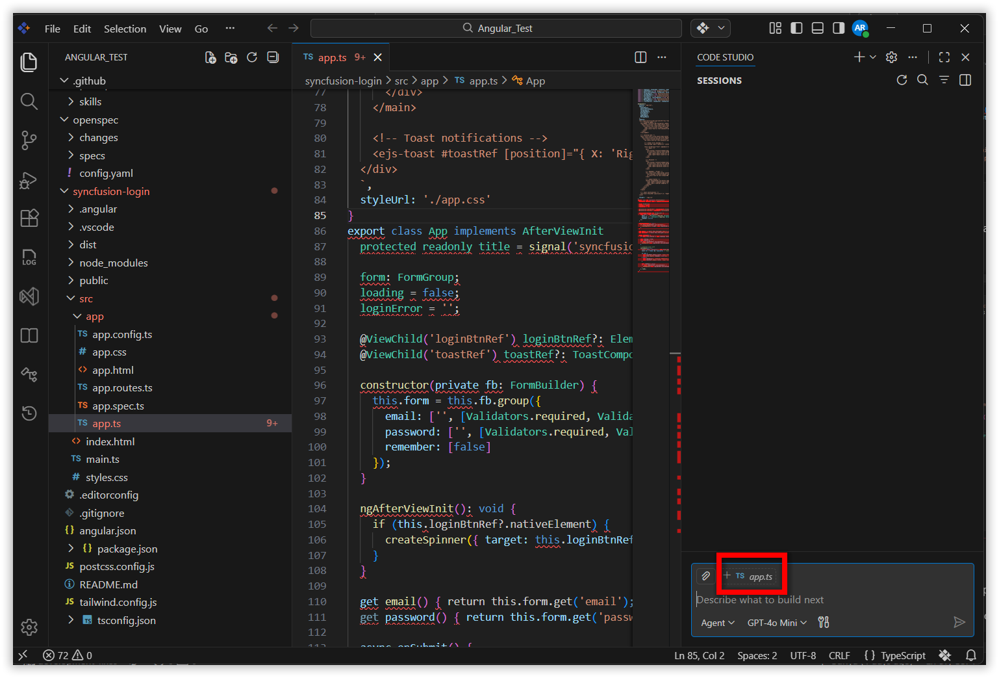
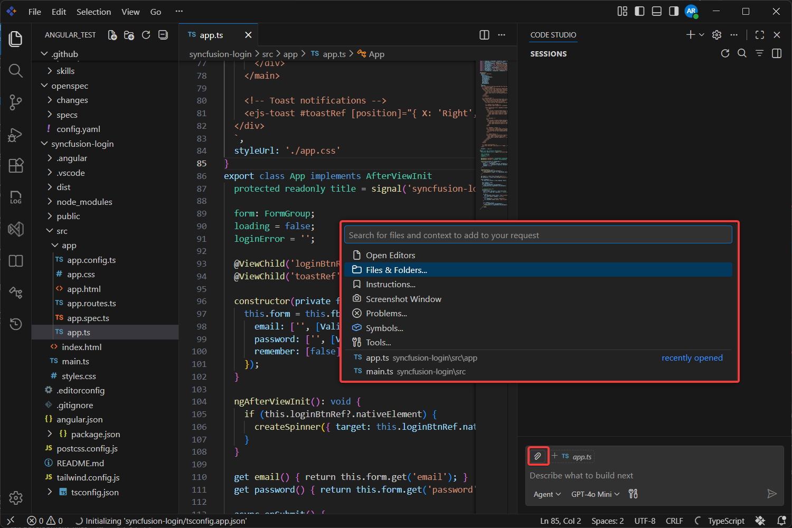
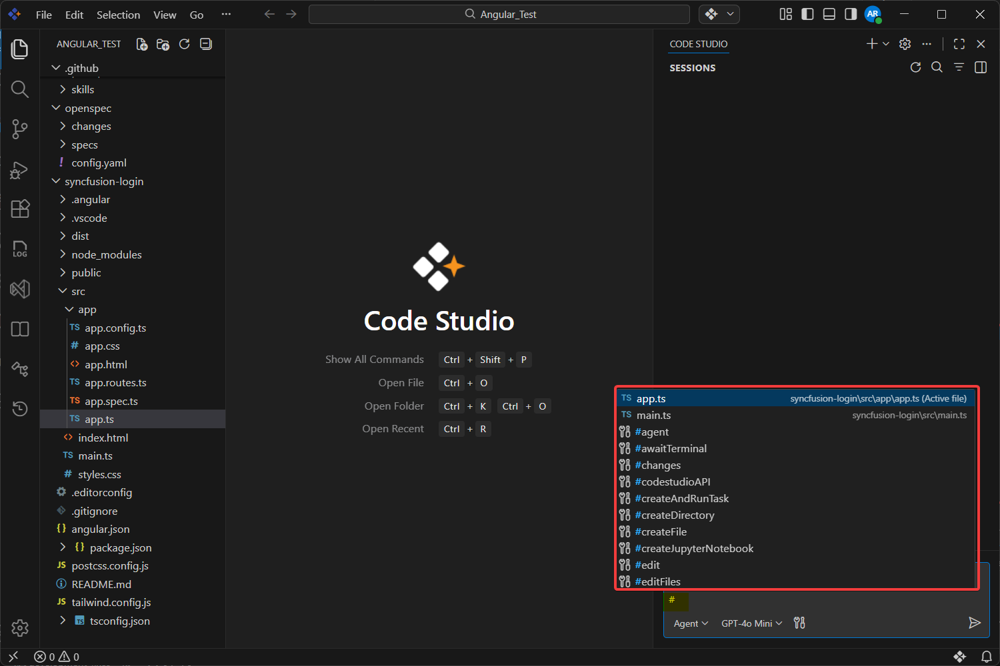

# Fixing Bugs in Seconds: Smart Error Resolution with Syncfusion Code Studio AI

## Overview

Tracking down a bug can take significant time, especially when the root cause is a simple typo, a missing import, or a type mismatch buried across multiple files. Code Studio AI helps you identify and resolve these errors quickly by surfacing AI-powered fixes directly in your editor.

This tutorial walks you through three approaches to fixing bugs with Code Studio AI: using hover quick fixes for single errors, sending problems from the **Problems panel** as context to the AI agent, and attaching files so the AI understands your broader codebase before suggesting a fix.

## Prerequisites

Before beginning, ensure:

- Syncfusion Code Studio is installed and properly configured on your system. If you have not yet downloaded Code Studio, refer to [Install and Configure](/code-studio/getting-started/install-and-configuration) for step-by-step instructions.
- Your project is opened in Code Studio with at least one file containing errors or warnings.
- Agent mode is enabled in the chat window. Learn more about [Agent mode](/code-studio/features/agent).

## What You Will Learn

By the end of this tutorial, you'll be able to:

- Use AI-powered quick fixes to resolve errors instantly with a single click
- Navigate and resolve issues efficiently using the Problems panel
- Add project files as context to help AI understand your codebase better
- Leverage context-menu options for targeted problem-solving
- Verify that AI-generated fixes match your intended logic

## Steps to Fix Bugs with AI

### Step 1: Apply a Quick Fix by Hovering

Use this approach when you have a single, isolated error to resolve.

1. Move your mouse cursor over any red underlined error in your code. Code Studio AI displays the following options:
   - **Quick Fix** — Apply an immediate fix for the specific error.
   - **Fix** — Get a detailed AI-generated solution.
   - **View Problem** — See the error details in the **Problems panel**.

2. Click **Quick Fix** to apply the fix instantly.

   

The AI analyzes your code, understands the context, and applies the fix.

### Step 2: Send Problems as Context Using the Problems Panel

Use this approach when you have multiple errors and want to send specific problems to the AI as context.

1. Open the **Chat Panel** by pressing `Ctrl+Alt+B` (Windows/Linux) or `Cmd+Alt+B` (Mac), or click the Code Studio icon to the left of the centered search box. Then click **Add context** (the paperclip icon) at the bottom of the chat window:

   

2. Choose the **Problems** option from the attachment menu:

   

3. Select the problems to fix. You have two options:
   - Click **All Problems** to send all problems as context.
   - Click individual problems to select specific ones.

   

4. Type a prompt in the chat to ask the agent to fix the selected problems. For example:

   ```
   Please analyze and fix the selected problems. For each issue, explain what's wrong and provide the corrected code. Make sure the fixes follow best practices and don't break existing functionality.
   ```

   Review the suggested fixes before applying them:

   

> **Tip:** Use this workflow when you want the AI to focus on specific issues across your project without adding whole files as context.

### Step 3: Add Files as Context for Complex Issues

Use this approach when errors require understanding of multiple files or your project's architecture. There are four ways to add a file as context:

**Method 1: Right-click in Explorer**

1. Right-click the file in the **Explorer** and select **Add file to chat**:

   

**Method 2: Use Suggested Context**

1. Open the file with errors. The **Chat Panel** will suggest the file as context — click the file name in the chat to add it:

   

**Method 3: Use the Add Context Menu**

1. Open the **Chat Panel** (see Step 2, action 1 for how to open it and access **Add context**).

2. Select the file with errors from the list. It will be sent as context:

   

**Method 4: Use the # Symbol in Chat**

1. Open the **Chat Panel** by pressing `Ctrl+Alt+B` (Windows/Linux) or `Cmd+Alt+B` (Mac).

2. Type `#` in the chat input box. A list of files will appear.

3. Select your file from the list to send it as context:

   

   After adding the file as context, type a prompt asking the agent to fix the issues. For example:

   ```
   Please review the attached file and fix all errors. Explain what's causing each error and provide the corrected code. Ensure the fixes maintain code quality and don't introduce new bugs.
   ```

   

The more relevant context the AI has, the more accurate its suggestions will be.

## What's Next

- Use [Autocomplete](/code-studio/features/autocomplete) to catch errors as you type and reduce bugs before they occur.
- Explore [Agent mode](/code-studio/tutorials/generate-your-first-code-using-agent) for generating and fixing code autonomously across your project.
- Use the [Ask feature](/code-studio/features/ask) to have the AI explain error messages and suggest solutions in detail.
