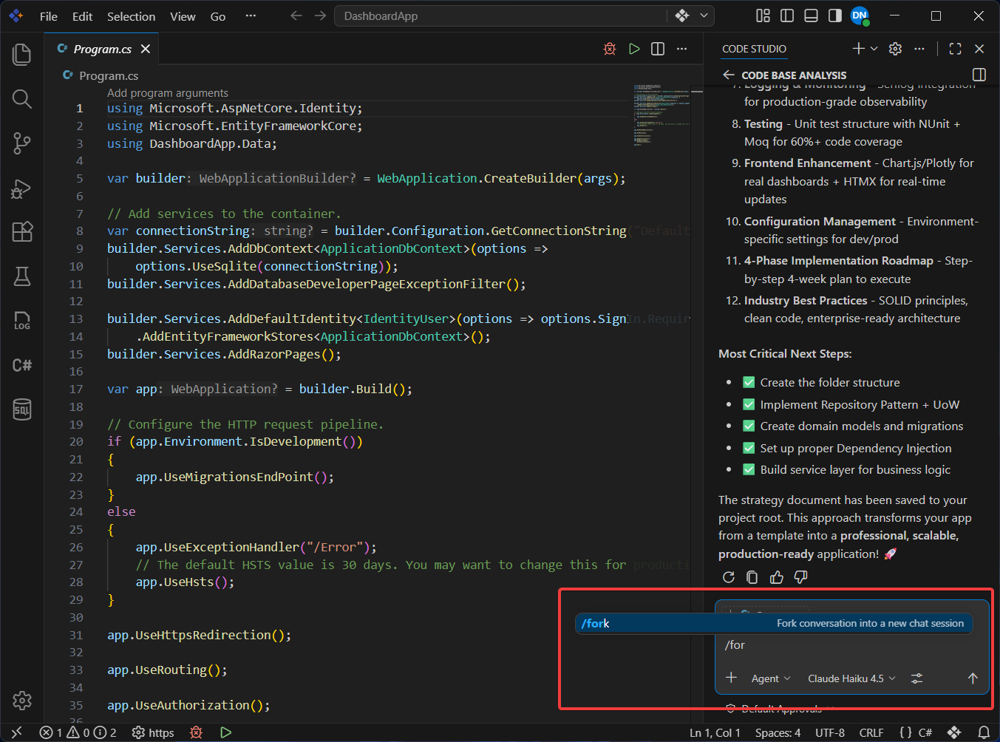
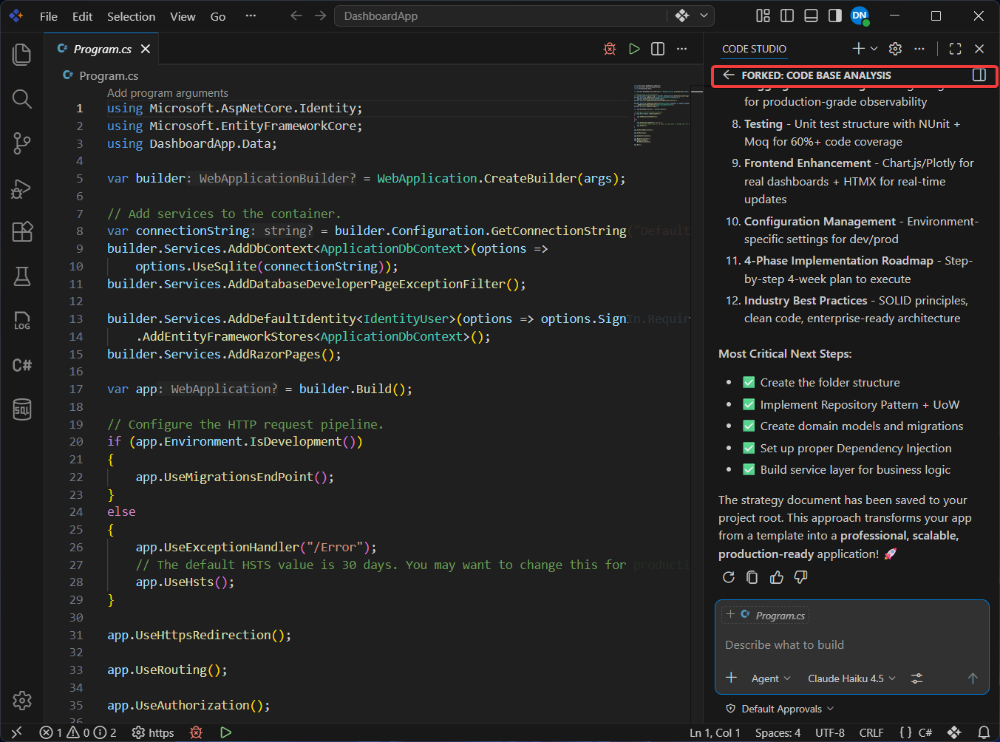
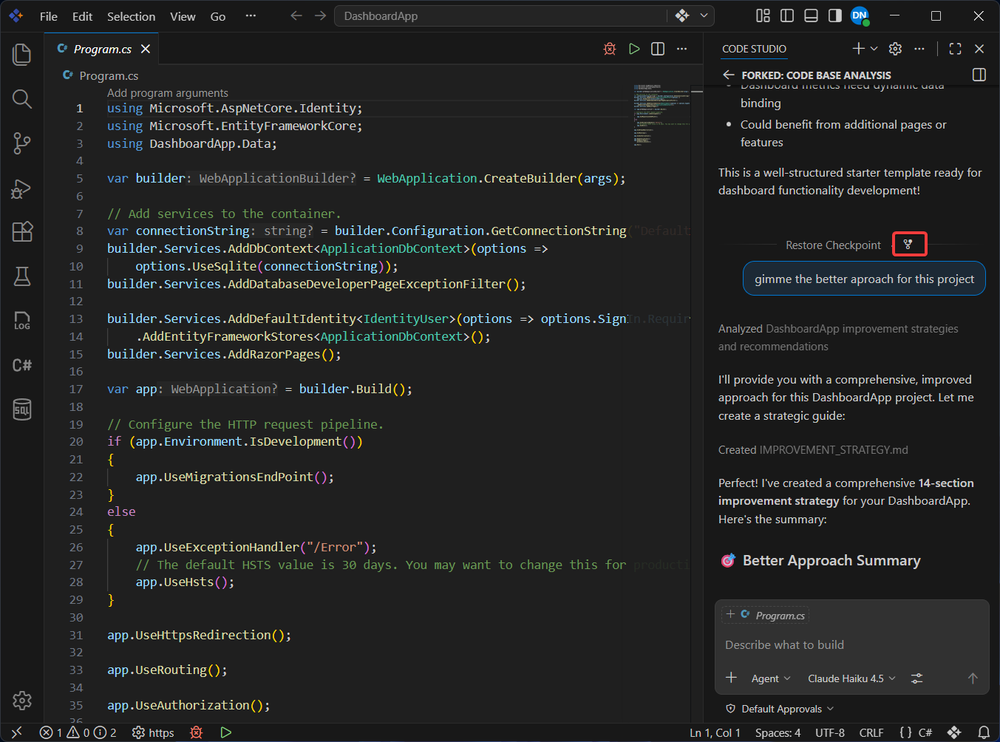
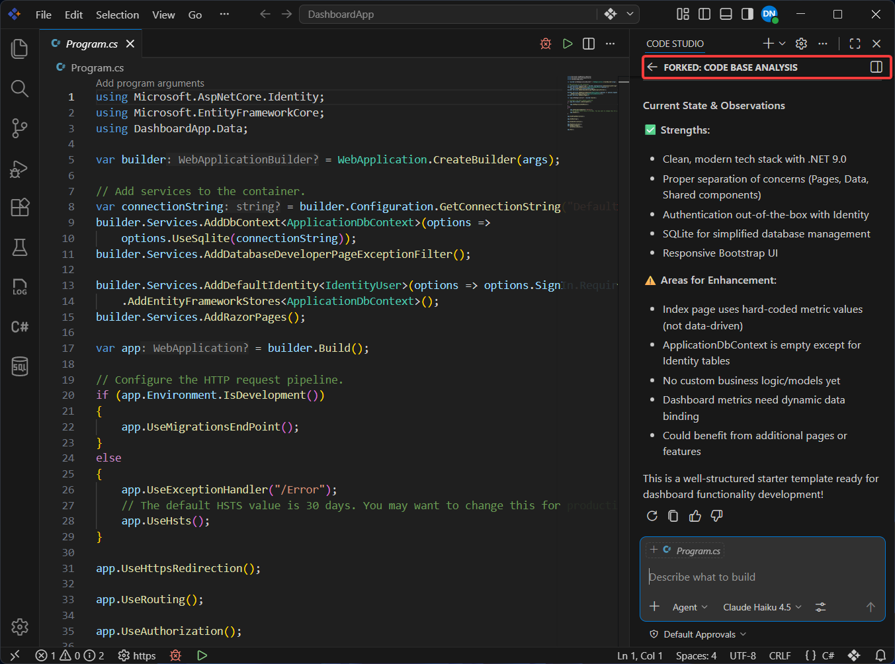

# Fork Chat Sessions to Explore Multiple Solutions

## Overview

When working on complex problems, you often need to explore multiple approaches simultaneously without losing your progress. Forking a chat session in Syncfusion Code Studio allows you to create independent conversation branches from an existing session, each maintaining its own history and context.

This tutorial shows you how to fork chat sessions to experiment with different solutions, test alternative implementations, or explore "what if" scenarios while preserving your original conversation. You'll learn when to fork entire sessions versus forking from specific checkpoints, and how to leverage this capability for more productive development workflows.

## What You Will Learn

By the end of this tutorial, you'll be able to:

- Fork an entire chat session to explore alternative approaches without affecting the original conversation
- Create a new session from a specific checkpoint to branch off at key decision points

## Steps to Fork a Chat Session

Code Studio provides two flexible ways to fork a chat session. Use Method 1 to fork the entire conversation, or use Method 2 to branch from a specific point in your chat history.

### Method 1: Fork the Entire Session

Use this method when you want to explore a completely different approach while preserving the full conversation context.

**Step 1**: In your active chat session, type `/fork` in the chat input box and press **Enter**.

**Step 2**: Code Studio creates a new chat session that includes all previous messages and context from the original session.

> **Note**: The new session opens automatically, and you can switch between the original and forked sessions using the chat session switcher in the Chat view.

**Step 3**: Continue your conversation in the new forked session. Any changes or new messages you add here will not appear in the original session.

### Method 2: Fork from a Specific Checkpoint

Use this method when you want to branch off from an earlier decision point without carrying forward messages that took the conversation in a different direction.

**Step 1**: In the Chat view, navigate to the specific chat request where you want to branch off.

**Step 2**: Hover over the chat request to reveal the action buttons, then click **Fork Conversation**.

**Step 3**: Code Studio creates a new session containing only the conversation history up to the selected checkpoint.

> **Note**: This is useful when you want to try a different approach from an earlier point in the conversation without carrying forward subsequent messages that may have taken the conversation in a different direction.

**Step 4**: The forked session opens with the conversation history intact. You can now take the conversation in a completely different direction.

## What's Next

- [Checkpoints and Editing Requests](/code-studio/features/checkpoints) - Restore your workspace to earlier states within a single session
- [Agent Mode](/code-studio/features/agent) - Combine forked sessions with agent mode for autonomous exploration of different approaches
- [Manage Chat Session](/code-studio/how-to-guides/manage-chat-session) - Organize, rename, and manage multiple chat sessions effectively
