# From Complex Web Automation to Streamlined Workflows Code Studio Skills for Playwright MCP

## Overview 

Ready to transform your web testing workflow? In this tutorial, you'll learn how to use Playwright Model Context Protocol (MCP) with Code Studio's [Agent mode](/code-studio/features/agent) to generate, execute, and manage web automation tests with AI assistance. Playwright MCP acts as a bridge that enables Code Studio's AI to perform real-world browser automation tasks based on your natural language instructions.

> **Key concept — Playwright MCP Server:** A specific MCP implementation that brings Playwright's browser automation capabilities to AI agents. It acts as a translator between natural language commands and browser actions. When you tell the AI to "verify the login button exists," the Playwright MCP Server converts this into executable Playwright code that navigates pages, clicks elements, fills forms, and captures results.

For a deeper understanding of the features used in this tutorial, see [Agent](/code-studio/features/agent) and [Skills](/code-studio/features/skills).

## Prerequisites

Before beginning this tutorial, ensure the following:

- Code Studio is installed on your system. If you haven't set it up yet, follow the [Install and Configure](/code-studio/getting-started/install-and-configuration) guide.
- Node.js (v18 or higher) is installed on your system. Playwright requires Node.js to run automation tests. Download from [nodejs.org](https://nodejs.org/) and verify installation with `node --version`.

## What You Will Learn

By the end of this tutorial, you'll be able to:

- Install and configure Playwright MCP server in Code Studio
- Enable Agent mode for AI-powered test generation
- Create test scenarios in natural language and watch AI generate executable test scripts
- Review and execute generated Playwright tests

## Steps to Generate Playwright Tests

### Step 1: Install Playwright packages and Playwright MCP Server

**Playwright** is an open-source browser automation framework that lets you write tests for web applications across multiple browsers. The **Playwright MCP Server** acts as a bridge between Code Studio's AI and Playwright's automation capabilities — translating natural language test instructions into executable browser commands.

Before the AI can generate tests, you need to install both Playwright and the MCP server integration.

**Steps:**

1. Create a new project folder and open it in Code Studio.
2. Open the integrated terminal by clicking **Terminal** → **New Terminal** from the menu bar, or press `Ctrl+`` (Windows/Linux) or `Cmd+`` (Mac).
3. Install Playwright by running the following command:

   ```bash
   npm init playwright@latest
   ```

4. Follow the installation prompts:
   - Press **Enter** to confirm installation
   - Select **TypeScript** as the language (default) and press **Enter**

   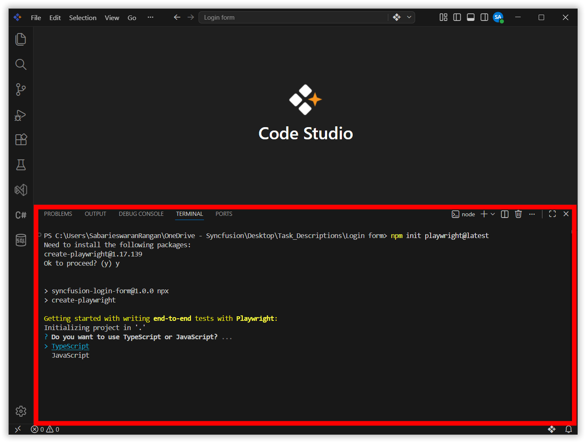

   - Accept the default `tests` folder for end-to-end tests by pressing **Enter**

   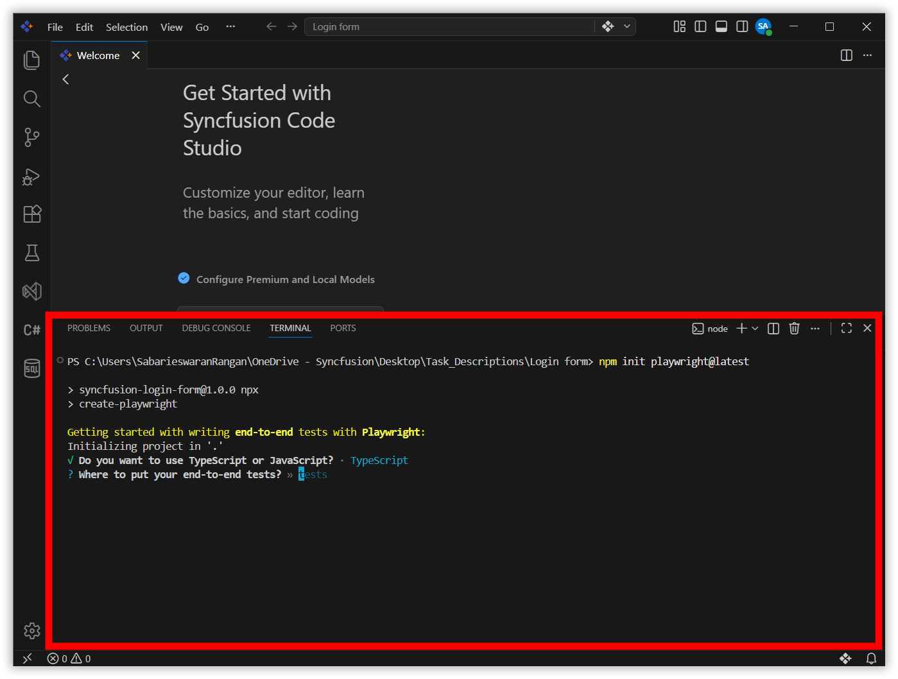
   <br>
   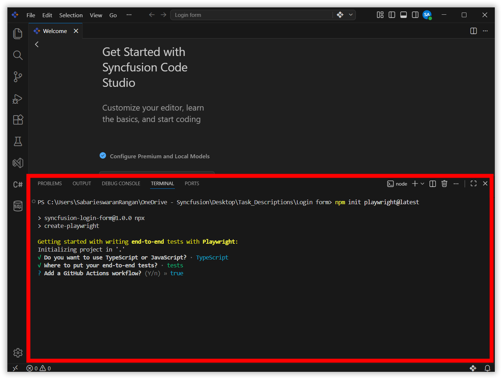

   - When prompted **"Add a GitHub Actions workflow?"**, type `n` and press **Enter** to skip it. This workflow would automatically run your tests on GitHub when you push code, but for this tutorial, you'll focus on local development.

   - Confirm installation of Playwright browsers by pressing **Enter**

   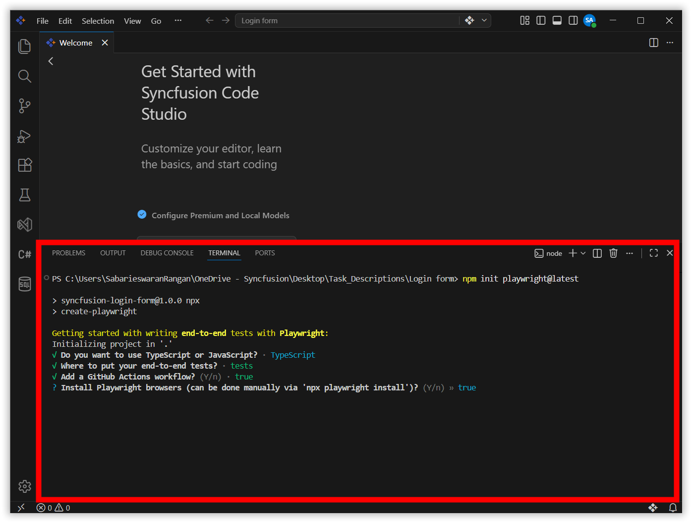

   The installation will download browser binaries. Once complete, you'll see the Playwright folder structure in your project.

   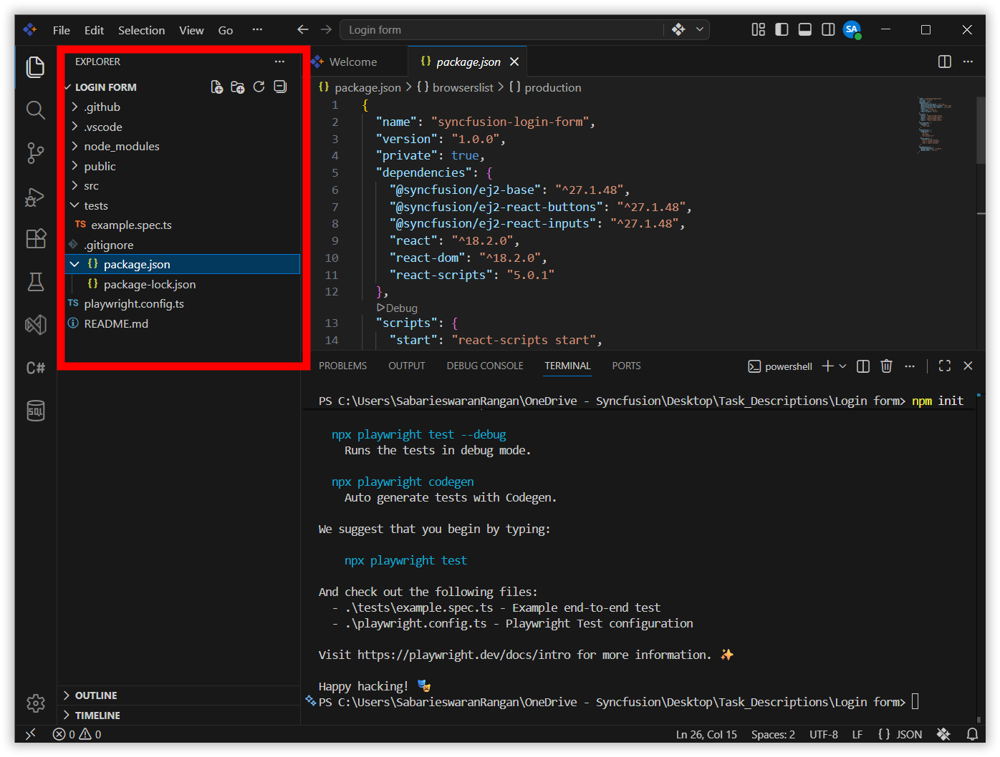

   > **Note:** The browser binaries download is approximately 500MB. The installation may take a few minutes depending on your internet connection speed.

5. Install the Playwright MCP Server:
   
   - Open the Chat Panel. If it's not already visible, press `Ctrl+Shift+P` (Windows/Linux) or `Cmd+Shift+P` (Mac) to open the **Command Palette**, then type "Chat: Focus on Chat View" and press **Enter**.

   - Once the Chat Panel is open, locate and click the **Configure Chat** icon (typically displayed as a settings or gear icon in the Chat Panel toolbar).

   - From the configuration menu that appears, select the **MCP Server** option. This will open the MCP marketplace view where you can browse and install available MCP servers.

   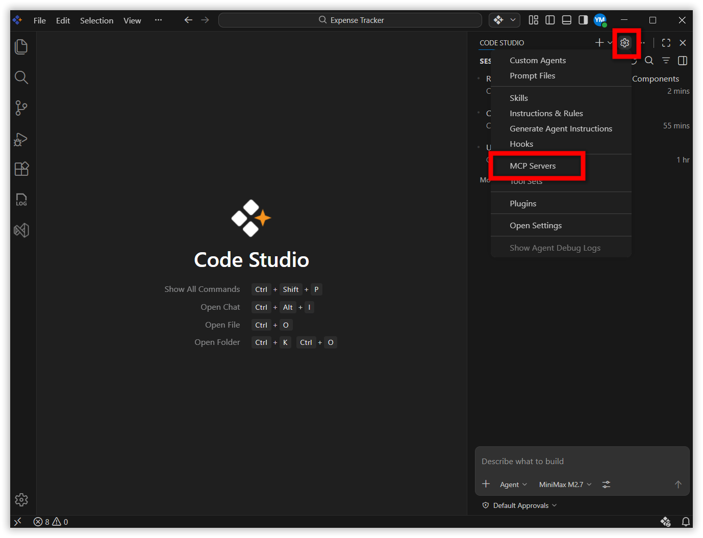

   - In the MCP marketplace panel, select the Playwright MCP tools

   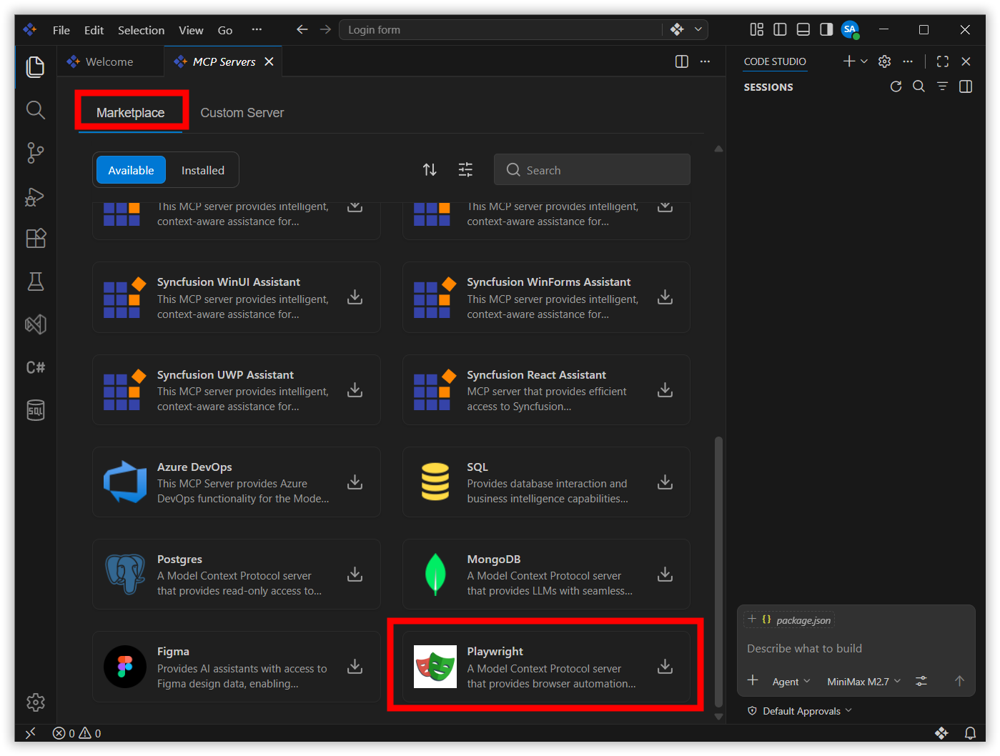

   - Click the **Install** button and choose your installation option (global or local)

   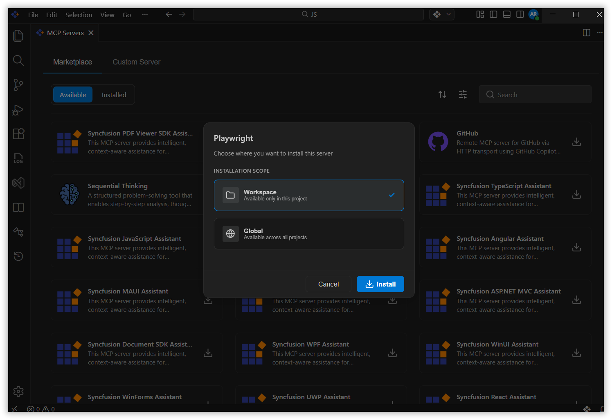

   - Select your preferred option to add the Playwright MCP server to the installed list

6. Verify the MCP installation:
   - After installation completes, the Playwright MCP server connection status will show as active

   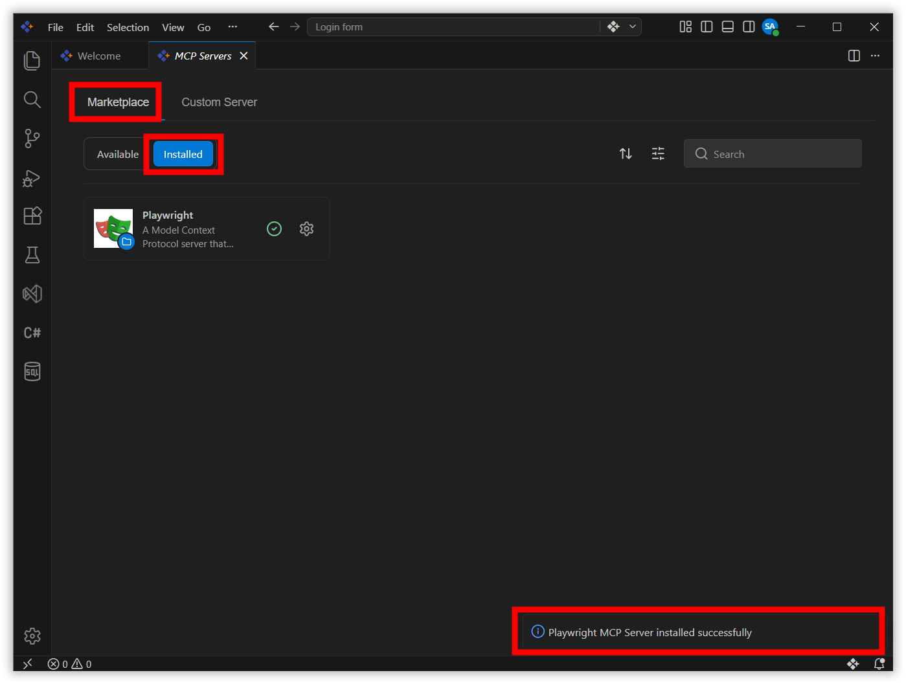

   - To verify the Playwright MCP server installation, click the **Select Tools** icon in Chat. You should see "MCP server: playwright" listed with available Playwright commands.

   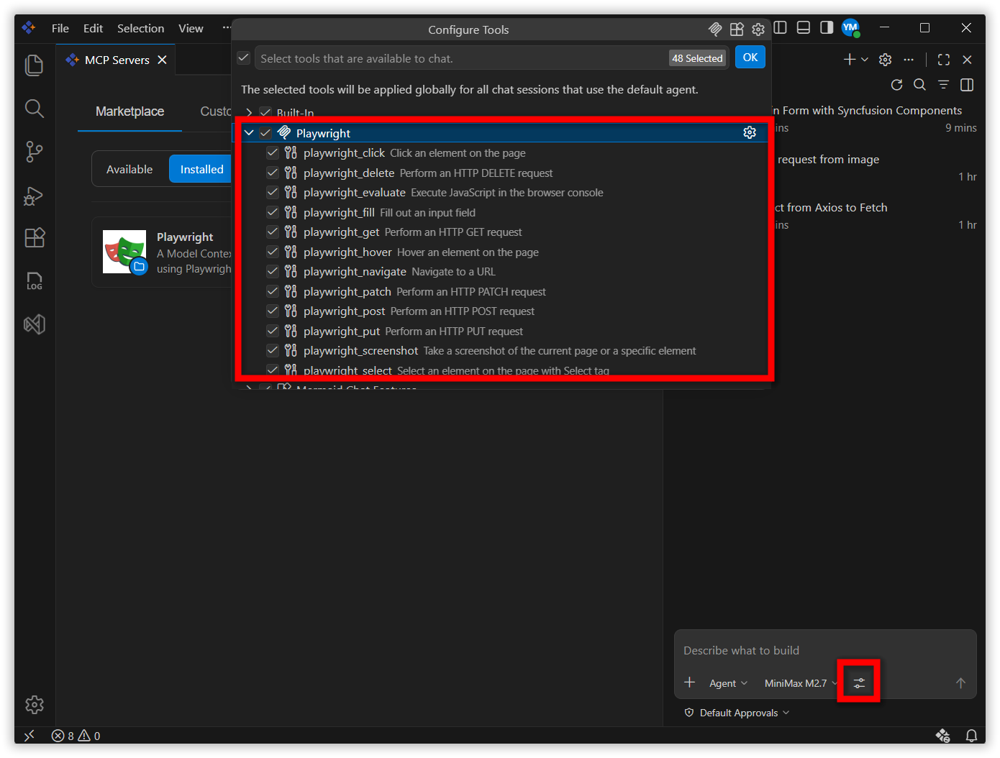

### Step 2: Create the Required Skills

**Skills** are specialized instruction sets that direct the AI agent to perform specific tasks autonomously. Think of them as focused "playbooks" that define exactly how the agent should approach a particular type of work. In this case, you'll create a skill that instructs the agent to explore a website using Playwright MCP, identify key user flows, and automatically generate test cases based on what it discovers.

**Steps:**

1. Open the Chat Panel. If it's not already visible, press `Ctrl+Shift+P` (Windows/Linux) or `Cmd+Shift+P` (Mac) to open the **Command Palette**, then type "Chat: Focus on Chat View" and press **Enter**.

   - Once the Chat Panel is open, locate and click the **Configure Chat** icon (typically displayed as a settings or gear icon in the Chat Panel toolbar).

   - From the configuration menu that appears, select the **skill** option.

   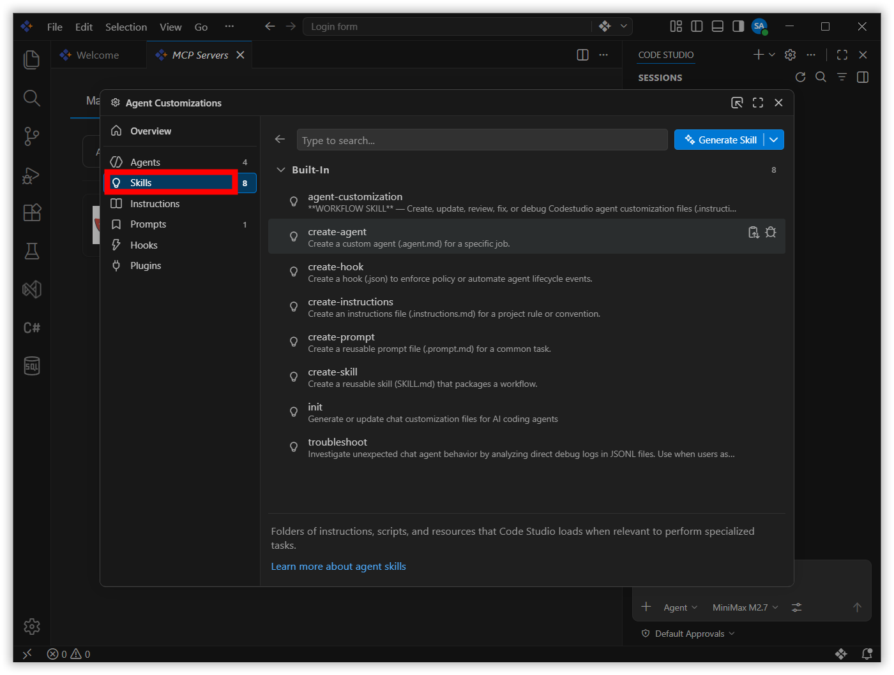

2. In the Skills panel, locate and click the **+ New skill...** button to create a new skill definition.

   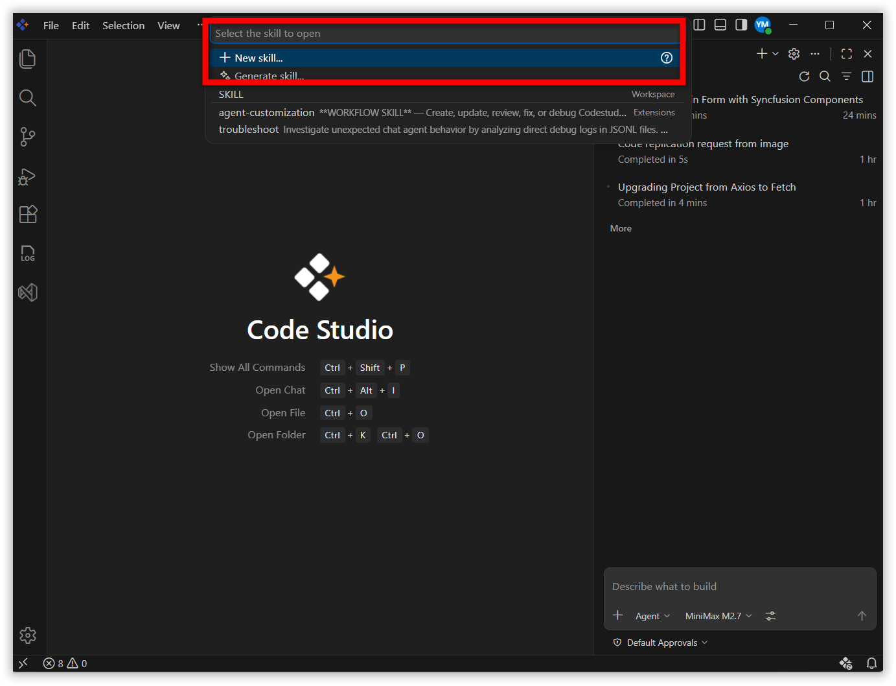

3. Name your skill:
   - A dialog will appear prompting you to enter a skill name. Type `playwright-explore-website` as the skill name. Skill names must use lowercase letters, numbers, and hyphens only — no spaces or special characters are allowed.
   - Press **Enter** to confirm and create the skill.

   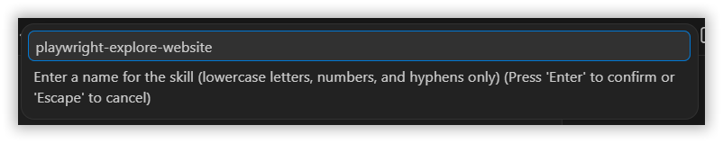

4. Define the skill instructions:
   - Code Studio will automatically open a new `SKILL.md` file where you can define the instructions that guide the AI agent's behavior.
   - Replace the default content with the following skill definition:

   ```markdown
   ---
   name: playwright-explore-website
   description: 'Website exploration for testing using Playwright MCP'
   ---

   # Website Exploration for Testing

   Your goal is to explore the website and identify key functionalities.

   ## Specific Instructions

   1. Navigate to the provided URL using the Playwright MCP Server. If no URL is provided, ask the user to provide one.
   2. Identify and interact with 3-5 core features or user flows.
   3. Document the user interactions, relevant UI elements (and their locators), and the expected outcomes.
   4. Close the browser context upon completion.
   5. Provide a concise summary of your findings.
   6. Propose and generate test cases based on the exploration.
   ```

   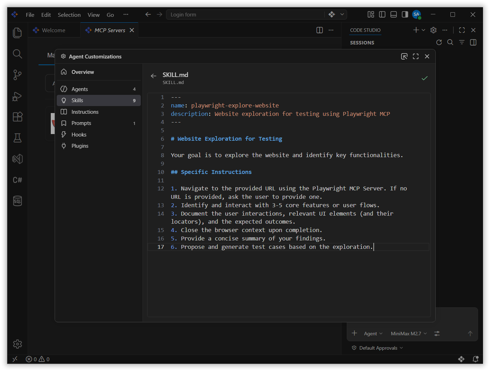

### Step 3: Enter Your Test Scenario and Run the Agent

Now that the skill is configured, you can describe your test scenario in plain English and let the AI agent do the rest. The agent will autonomously explore the website, identify the elements you described, and generate executable test code — no manual scripting required.

**Steps:**

1. Enable Agent Mode:
   - Open Chat (if it's not already visible, press `Ctrl+Shift+P` (Windows/Linux) or `Cmd+Shift+P` (Mac) to open the **Command Palette**, then type "Chat: Focus on Chat View" and press **Enter**)
   - Select **Agent** from the dropdown menu

2. Select your skill:
   - In the chat input box at the bottom of the Chat Panel, type a forward slash `/` to open the skills menu. This displays the list of all available skills in your workspace.
   - From the skills menu, select `playwright-explore-website`. This tells the agent to use the specific instructions you defined earlier for website exploration and test generation.

3. Enter your test scenario in natural language:

   ```
   1. Navigate to "https://ej2.syncfusion.com/showcase/angular/appointmentplanner/#/dashboard".
   2. Verify that the page title contains "Appointment Planner" or "Example Clinic".
   3. Check that the header displays the logged-in user's name (e.g., "Jane Doe") and role (e.g., "Admin").
   4. Confirm the presence of the main navigation menu / sidebar with items like: Dashboard, Schedule, Doctors, Patients, Preference, About.
   5. Verify that the "Logout" button/link is visible in the header or sidebar.
   6. Check that clicking the "Dashboard" menu item (if visible) keeps/reloads the current view without errors.
   ```

   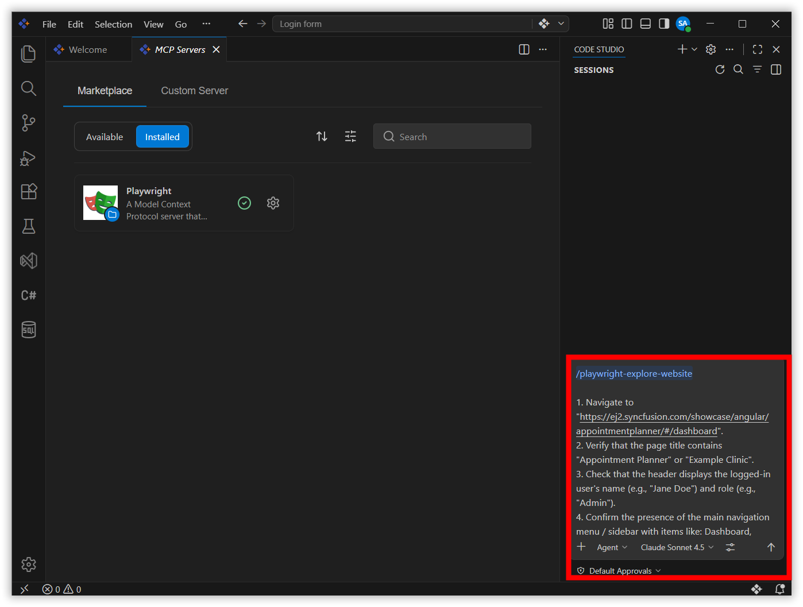

4. Press **Enter** to submit your request.

5. The Agent autonomously performs the following actions:
   - Analyzes your test scenario and breaks it down into executable steps
   - Uses Playwright MCP tools to interact with the browser and explore the website
   - Generates the test code based on the exploration results
   - Executes the generated test to verify it works correctly
   - Prepares a summary of results and the generated test file

   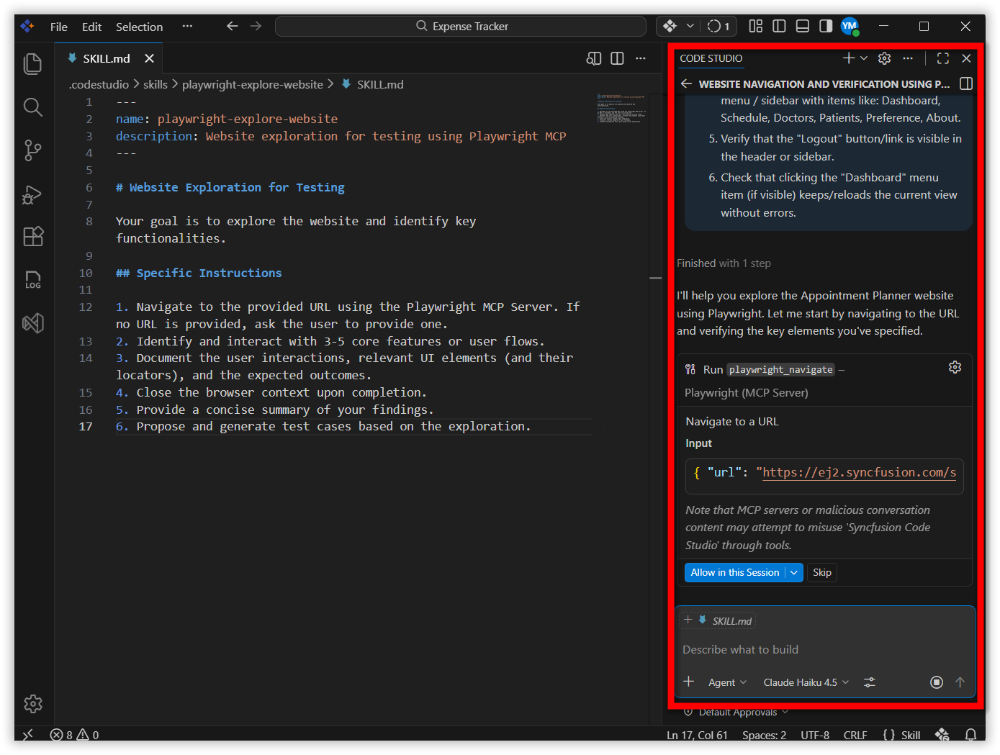

### Step 4: Review the Generated Test

Once the agent finishes its work, you'll have a complete, executable Playwright test. In this step, you'll examine the generated code, verify it matches your requirements, and review the test execution results to confirm everything works as expected.

**Steps:**

1. Open the generated test file in the `tests/` folder (e.g., `appointment-planner-verification.spec.ts`) to review the generated test code:

   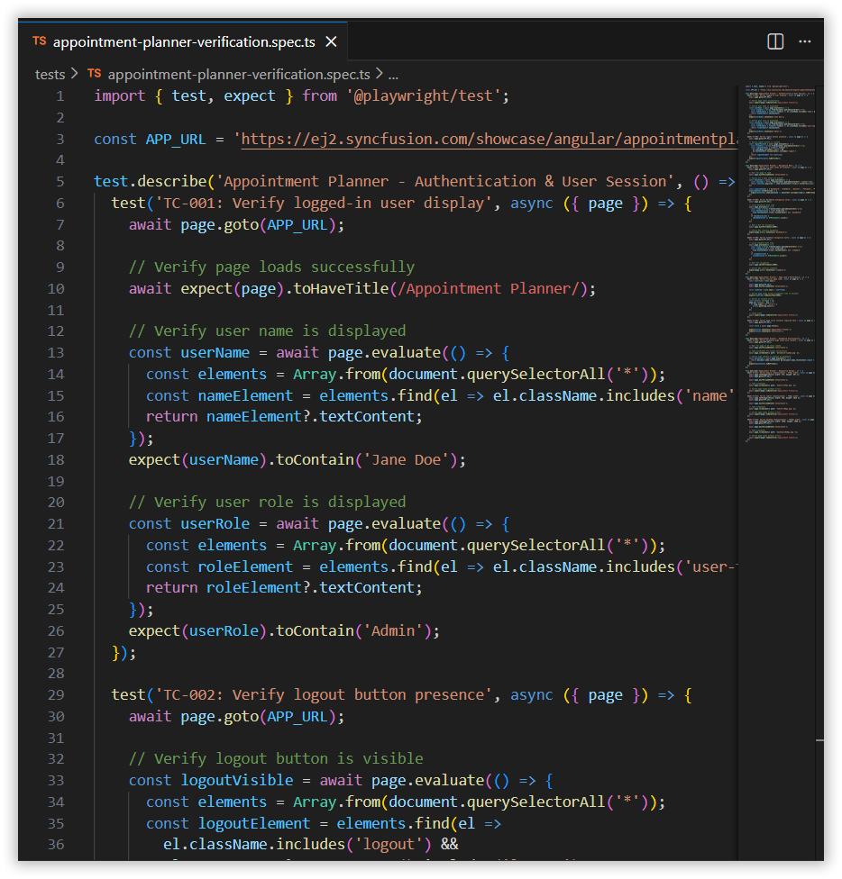

2. Check the terminal output for test execution results.

   The terminal shows live execution details as Playwright runs your test. By default, Playwright runs tests headless (without opening visible browser windows) and executes them in parallel across 3 workers (Chromium, Firefox, and WebKit).

   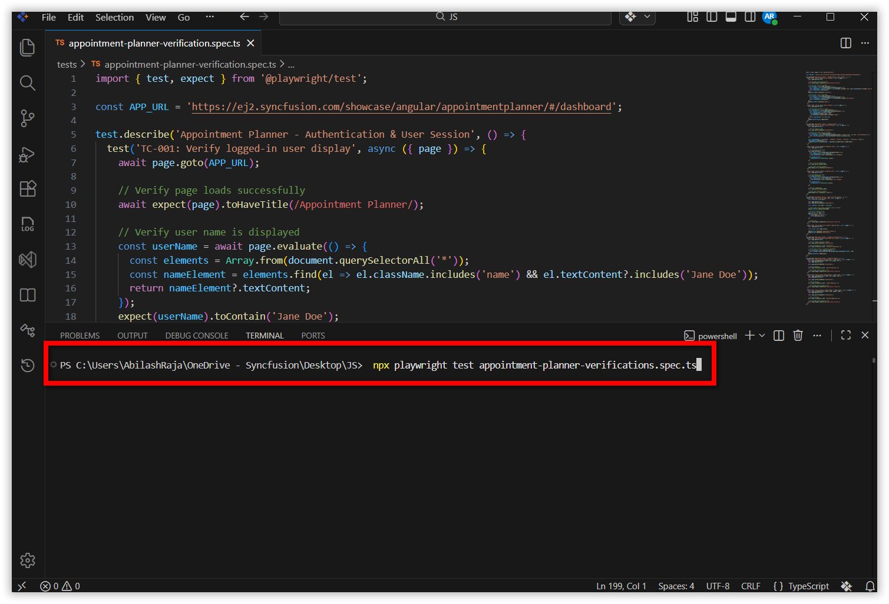
    <br><br>
   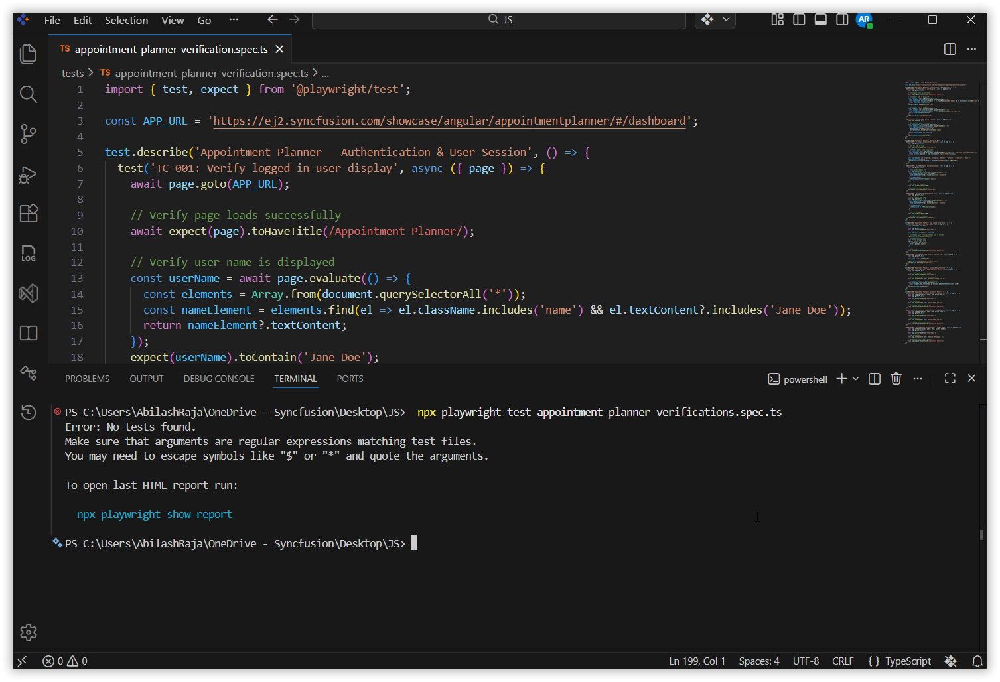

3. To run the test, use the following command in the terminal:

   ```bash
   npx playwright test appointment-planner-verification.spec.ts
   ```

   > **Note:** Replace `appointment-planner-verification.spec.ts` with your actual test filename if different.

4. View the HTML report by running the following command in the terminal:

   ```bash
   npx playwright show-report
   ```

   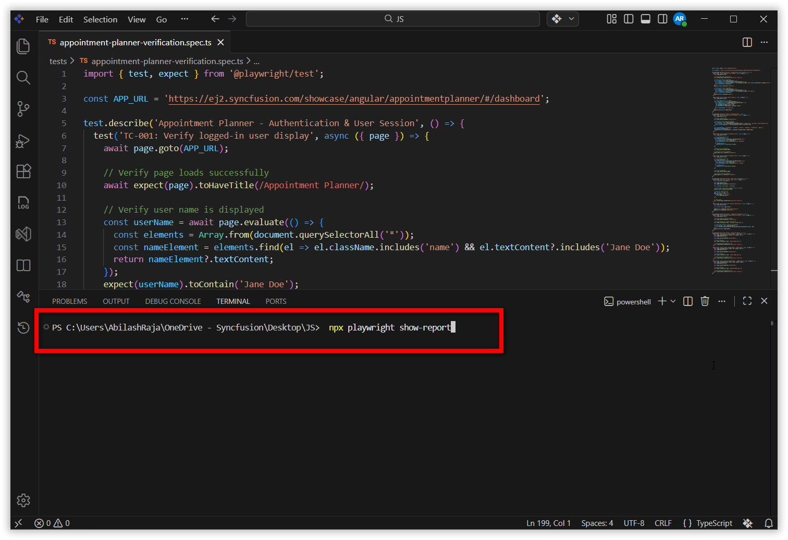
   <br><br>
   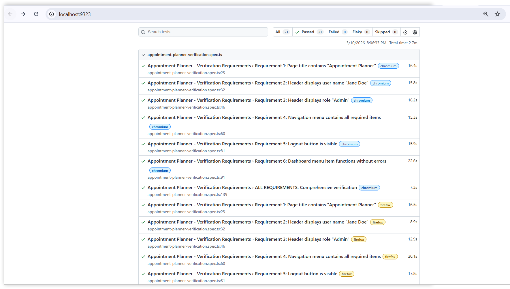


## Verification

After completing the tutorial, work through this checklist to confirm everything is set up correctly:

- **Agent mode is enabled** — Check the mode selector at the top of Chat. It should display "Agent" when active.

- **Playwright and MCP are installed** — Verify that `playwright.config.ts` exists in your project root directory. Confirm the Playwright MCP server shows as "Connected" in MCP.

- **Test was generated successfully** — Open the `tests/` folder and confirm your test file exists (e.g., `appointment-planner-verification.spec.ts`). Review the terminal output to confirm test execution completed with passing results.

- **HTML report is accessible** — Run `npx playwright show-report` in the terminal and verify the HTML report opens in your browser with detailed test results.

**Congratulations!** You've successfully completed your first AI-generated web automation test using Playwright MCP and Agent mode. You've transitioned from manual test writing to AI-powered test generation.


## What's Next?

You've mastered the basics of AI-powered test generation — here's where to go next:

- **Learn about checkpoints for version control:** [Checkpoints](/code-studio/features/checkpoints)
- **Explore advanced Agent mode capabilities:** [Agent Feature Guide](/code-studio/features/agent)
- **Generate code using Agent mode:** [Generate Your First Code Change Using Agent](/code-studio/tutorials/generate-your-first-code-using-agent)
- **Improve code quality with automated refactoring:** [Improving Code Maintainability with Automated Clean Code Refactoring](/code-studio/tutorials/improving-code-maintainability-with-automated-clean-code-refactoring)