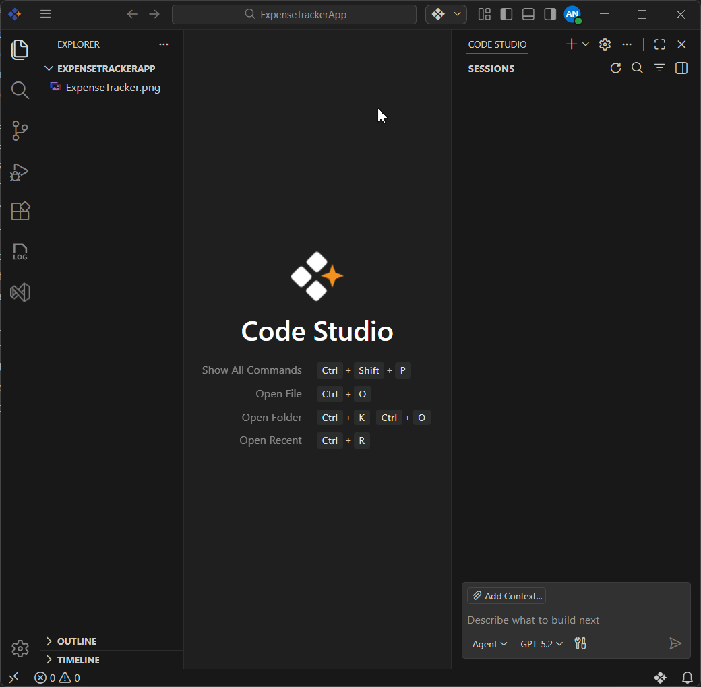
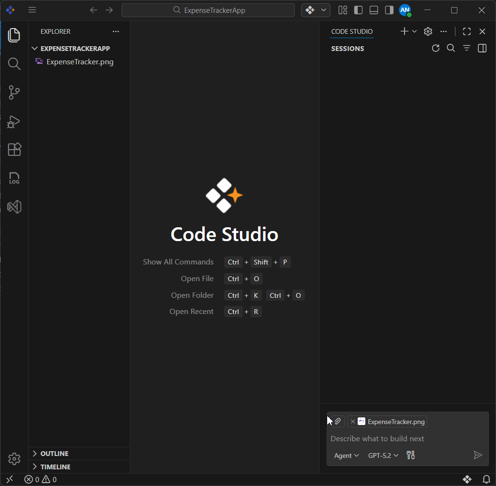
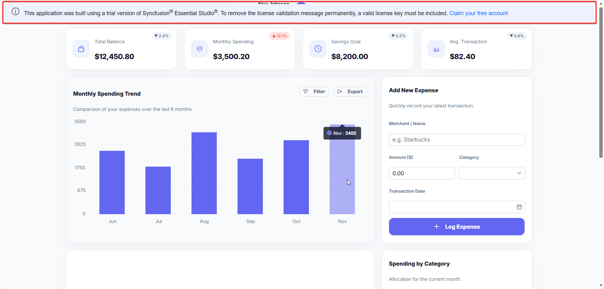

# Generate UI from an Image Using Code Studio’s AI Powered UI Builder

## Overview
Code Studio makes building app interfaces (like dashboards, forms, or login screens) much faster and easier with AI.

There are two main ways to create a UI:
- Describe it in words — Just type what you want (e.g., "Create a sales dashboard with a bar chart, table, etc.,) and the AI generates the code. This is perfect for quick ideas or when you don't have a ready UI design or image.
- Upload an Image — Use a UI design image (from Sketch, Photoshop, or even a photo), upload it to Code Studio, add a short description in words (e.g., "Make this dashboard responsive" or "Use Syncfusion components with dark theme"), and the AI turns it into working code.

This tutorial focuses on the second method: Generating a professional UI directly from an uploaded image using the UI Builder tool in Code Studio.

To learn more about the UI Builder tool, check the [official](/code-studio/ui-builder) documentation.

## Prerequisites
Let's make sure you have everything you need:
- Syncfusion Code Studio installed and ready to use (If not installed yet, visit the [Install and Configure](/code-studio/getting-started/install-and-configuration) page to download CodeStudio and complete the setup)
- [Node.js](https://nodejs.org/en/download) and npm installed. After installation, open a terminal/command prompt and type **node -v** — if you see a version number, you're set.

## What You'll Learn
By following this tutorial, you'll be able to:
- Upload a UI design image to Code Studio
- Use the UI Builder tool to automatically generate working code with Syncfusion components

## Steps to Generate UI from an Image Using Code Studio’s AI Powered UI Builder

**Step 1:** How to Upload an Image into CodeStudio?
- Open CodeStudio with your project folder. 
- Have your UI image ready inside your project folder.
- In the CodeStudio AI chat window, click the Add Context button. It shows a set of options; in the search bar, type your image's file name and click it. 
- Now your image is uploaded to the chat window.



**Step 2:** Verify the UI Builder Tool is Enabled in Code Studio

This quick check ensures the UI Builder tool for building UI from your image is ready to use. It's simple and takes just a few seconds.
- In the CodeStudio AI Chat Window, Click the Configure Tools option. It opens the tools list.
- Make sure the UI Builder tool is enabled.



**Step 3:** Generate the React Expense Tracker Dashboard UI

Now let's do it together! We'll upload an image of a Personal Expense Tracker design, add a short description (prompt), and watch CodeStudio build a dashboard using Syncfusion components.

> Note: Prompt means the text instructions you write to guide the AI.

**What we're going to create:** A React-based Personal Expense Tracker dashboard UI, that includes below sections 
- Header — Shows the logo, a search box, and user profile picture.
- Summary Stat Cards — Displays big numbers for Total Balance, Monthly Spending, Savings Goal, and Average Transaction.
- Monthly Spending Trend — A bar chart showing expenses over months (e.g., from June to November).
- Add New Expense Form — Input fields for merchant name, amount, category (dropdown), date (picker), and a Submit button.
- Recent Transactions Table — A list/table with columns: Merchant, Category, Date, Status, and Amount.
- Spending by Category — A donut or pie chart that breaks down expenses by category.
- Footer — Simple text with copyright notice plus links to policy and support pages.

**Prompt used:**

```text
Create a React app and Generate a single React component named "ExpenseTrackerDashboard" that exactly replicates the uploaded dashboard image visually and structurally.
1. Exact match to the image — Match layout, spacing, alignment, colors, fonts, icons, shadows, proportions, badges, and all visual details exactly as shown in the uploaded image (no simplifications, additions, or changes). 
2. Make it fully responsive. 
3. Use Syncfusion React components.
```


**Step 4:** Register Your Syncfusion License Key (To remove the license Validation message)



Syncfusion components (charts, tables, forms, etc. in your generated code) are licensed product. 

Follow these steps to generate and register your Syncfusion License Key,
1. Trial users can generate License key, by following this [documentation](https://help.syncfusion.com/common/essential-studio/licensing/how-to-generate).
2. [Register](https://help.syncfusion.com/common/essential-studio/licensing/how-to-register-in-an-application#reactjs) the generated Syncfusion license key by adding the following code at your project's entry file (eg: For React: main.tsx or index.tsx)
   
   <pre>
   import { registerLicense } from '@syncfusion/ej2-base';
   registerLicense('YOUR_LICENSE_KEY');
   </pre>

In this tutorial, you've successfully generated a Personal Expense Tracker dashboard UI from an image using UI Builder tool. Now that the foundation is ready, feel free to customize colors, connect real data, add user interactions, or make it into a full application. You've taken a big step toward faster and smarter UI development!