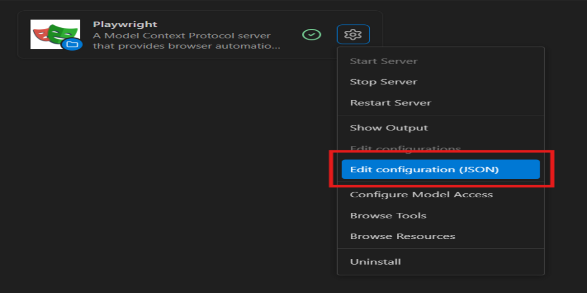
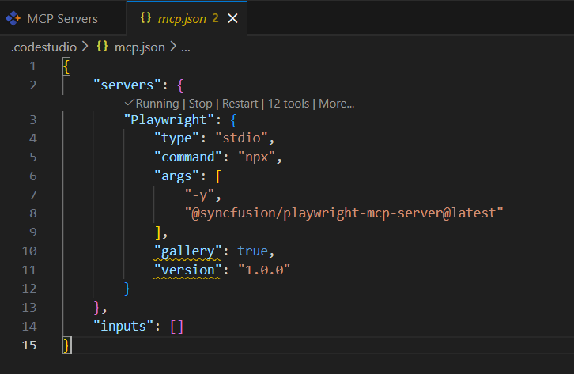

# From Complex Web Automation to Streamlined Workflows: Code Studio Skills for Playwright MCP

## Overview 

Ready to transform your web testing workflow? In this tutorial, you'll learn how to use Playwright MCP with Code Studio's [Agent mode](/code-studio/features/agent) to generate, execute, and manage web automation tests with AI assistance. Playwright MCP acts as a bridge that enables Code Studio's AI to perform real-world browser automation tasks based on your natural language instructions.

> **Key concept — Playwright MCP Server:** A specific MCP implementation that brings Playwright's browser automation capabilities to AI agents. It acts as a translator between natural language commands and browser actions. When you tell the AI to "verify the login button exists," the Playwright MCP Server converts this into executable Playwright code that navigates pages, clicks elements, fills forms, and captures results.

By the end of this tutorial, you'll be comfortable using Playwright MCP with Agent mode to create end-to-end tests without manually writing code.

## Prerequisites

Before beginning this tutorial, ensure the following:

- Code Studio is installed on your system. If you haven't set it up yet, follow the [Install and Configure](/code-studio/getting-started/install-and-configuration) guide.
- Node.js (v18 or higher) is installed on your system. Playwright requires Node.js to run automation tests. Download from [nodejs.org](https://nodejs.org/) and verify installation with `node --version`.

## What You Will Learn

By the end of this tutorial, you'll be able to:

- Install and configure Playwright MCP server in Code Studio
- Enable Agent mode for AI-powered test generation
- Create test scenarios in natural language and watch AI generate executable test scripts
- Review and execute generated Playwright tests

## Steps to Generate Playwright Tests

### Step 1: Install Playwright packages and Playwright MCP Server

The first step is to install Playwright packages and configure the Playwright MCP server integration in Code Studio.

**Steps:**

1. Create a new project folder and open it in Code Studio.
2. Open the integrated terminal by clicking **Terminal** → **New Terminal** from the menu bar, or press `Ctrl+`` (Windows/Linux) or `Cmd+`` (Mac).
3. Install Playwright by running the following command:

   ```bash
   npm init playwright@latest
   ```

4. Follow the installation prompts:
   - Press **Enter** to confirm installation
   - Select **TypeScript** as the language (default) and press **Enter**

   
   
   - Accept the default `tests` folder for end-to-end tests by pressing **Enter**
   
   
   <br><br>
   
   
   - Press **Enter** to continue with the setup
   - Confirm installation of Playwright browsers by pressing **Enter**

   

   The installation will download browser binaries. Once complete, you'll see the Playwright folder structure in your project explorer.

   

   > **Note:** The browser binaries download is approximately 500MB. The installation may take a few minutes depending on your internet connection speed.

5. Install the Playwright MCP Server:
   
   - Click the **MCP** icon in the Code Studio sidebar

   
   
   - In the MCP marketplace panel, select the Playwright MCP tools

   
   
   - Click the **Install** button and choose your installation option (global or local)

   
   
   - Select your preferred option to add the Playwright MCP server to the installed list

6. Verify the MCP installation:
   - After installation completes, the Playwright MCP server connection status will show as active

   
   
   - Right-click the Playwright MCP entry and select **Edit Configuration (JSON)** from the context menu

   
   
   - The MCP server will be running by default after installation. An MCP entry is automatically added to the configuration. To stop it at any time, click the **Stop** button.

   

   - To verify the Playwright MCP server installation, click the **Select Tools** icon in the Code Studio chat panel. You should see "MCP server: playwright" listed with available Playwright commands.

   

### Step 2: Create the Required Skills

Skills guide the AI agent to perform specific tasks with focused instructions. In this step, you'll create a skill for Playwright test generation and website exploration.

**Steps:**

1. Open the Code Studio menu and click **Skills**, or press `Ctrl+Shift+P` (Windows/Linux) or `Cmd+Shift+P` (Mac) to open the **Command Palette** and type "Skills".

   

2. Create a new skill by clicking **+ New skill...** from the skills panel.
   
   

3. Name your skill:
   - Enter `playwright-explore-website` as the skill name (use lowercase letters, numbers, and hyphens only)
   - Press **Enter** to confirm
   
   

4. Define the skill instructions in the `SKILL.md` file that opens:

   ```markdown
   ---
   name: playwright-explore-website
   description: 'Website exploration for testing using Playwright MCP'
   ---

   # Website Exploration for Testing

   Your goal is to explore the website and identify key functionalities.

   ## Specific Instructions

   1. Navigate to the provided URL using the Playwright MCP Server. If no URL is provided, ask the user to provide one.
   2. Identify and interact with 3-5 core features or user flows.
   3. Document the user interactions, relevant UI elements (and their locators), and the expected outcomes.
   4. Close the browser context upon completion.
   5. Provide a concise summary of your findings.
   6. Propose and generate test cases based on the exploration.
   ```

   

### Step 3: Enter Your Test Scenario and Run the Agent

With the skill configured, you can now use Agent mode to generate Playwright tests from natural language test scenarios.

**Steps:**

1. Enable Agent Mode:
   - Open the Chat Panel by pressing `Ctrl+Shift+C` (Windows/Linux) or `Cmd+Shift+C` (Mac), or by clicking the Chat icon in the sidebar
   - Click the mode selector dropdown at the top of the Chat Panel (it displays "Chat" by default)
   - Select **Agent** from the dropdown menu

2. Select your skill:
   - In the chat input box, type `/` to display the list of available skills
   - Select `playwright-explore-website` from the dropdown

3. Enter your test scenario in natural language:

   ```
   1. Navigate to "https://ej2.syncfusion.com/showcase/angular/appointmentplanner/#/dashboard".
   2. Verify that the page title contains "Appointment Planner" or "Example Clinic".
   3. Check that the header displays the logged-in user's name (e.g., "Jane Doe") and role (e.g., "Admin").
   4. Confirm the presence of the main navigation menu / sidebar with items like: Dashboard, Schedule, Doctors, Patients, Preference, About.
   5. Verify that the "Logout" button/link is visible in the header or sidebar.
   6. Check that clicking the "Dashboard" menu item (if visible) keeps/reloads the current view without errors.
   ```

   

4. Press **Enter** to submit your request.

5. The Agent autonomously performs the following actions:
   - Analyzes your test scenario and breaks it down into executable steps
   - Uses Playwright MCP tools to interact with the browser and explore the website
   - Generates the test code based on the exploration results
   - Executes the generated test to verify it works correctly
   - Prepares a summary of results and the generated test file

   

### Step 4: Review the Generated Test

After the Agent completes execution, you can review the generated test file and execution results.

**Steps:**

1. Open the generated test file in the `tests/` folder (e.g., `appointment-planner-verification.spec.ts`) to review the generated test code:

   

2. Check the terminal output for test execution results.

   The integrated terminal displays execution details. By default, Playwright runs tests headless across 3 workers (Chromium, Firefox, and WebKit).

   
   <br><br>
   

3. View the HTML report by running the following command in the terminal:

   ```bash
   npx playwright show-report
   ```

   
   <br><br>
   


## Verification

After completing the tutorial, work through this checklist to confirm everything is set up correctly:

- **Agent mode is enabled** — Check the mode selector dropdown at the top of the Chat Panel. It should display "Agent" when active.

- **Playwright and MCP are installed** — Verify that `playwright.config.ts` exists in your project root directory. Confirm the Playwright MCP server shows as "Connected" in the MCP panel.

- **Test was generated successfully** — Open the `tests/` folder in the file explorer and confirm your test file exists (e.g., `appointment-planner-verification.spec.ts`). Review the terminal output to confirm test execution completed with passing results.

- **HTML report is accessible** — Run `npx playwright show-report` in the terminal and verify the HTML report opens in your browser with detailed test results.

**Congratulations!** You've successfully completed your first AI-generated web automation test using Playwright MCP and Agent mode. You've transitioned from manual test writing to AI-powered test generation.


## What's Next?

You've mastered the basics of AI-powered test generation — here's where to go next:

- **Learn about checkpoints for version control:** [Checkpoints](/code-studio/features/checkpoints)
- **Explore advanced Agent mode capabilities:** [Agent Feature Guide](/code-studio/features/agent)
- **Generate code using Agent mode:** [Generate Your First Code Change Using Agent](/code-studio/tutorials/generate-your-first-code-using-agent)
- **Improve code quality with automated refactoring:** [Improving Code Maintainability with Automated Clean Code Refactoring](/code-studio/tutorials/improving-code-maintainability-with-automated-clean-code-refactoring)