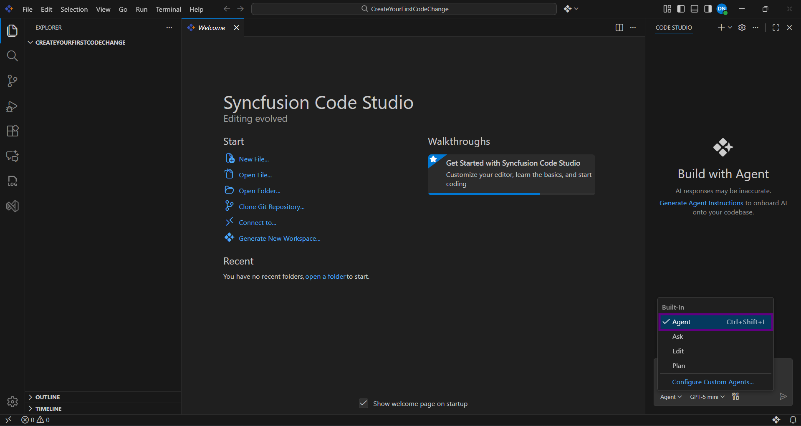
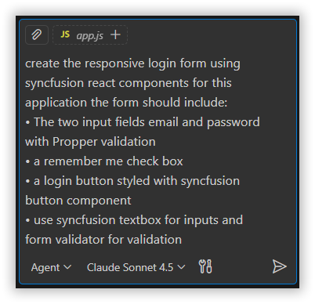
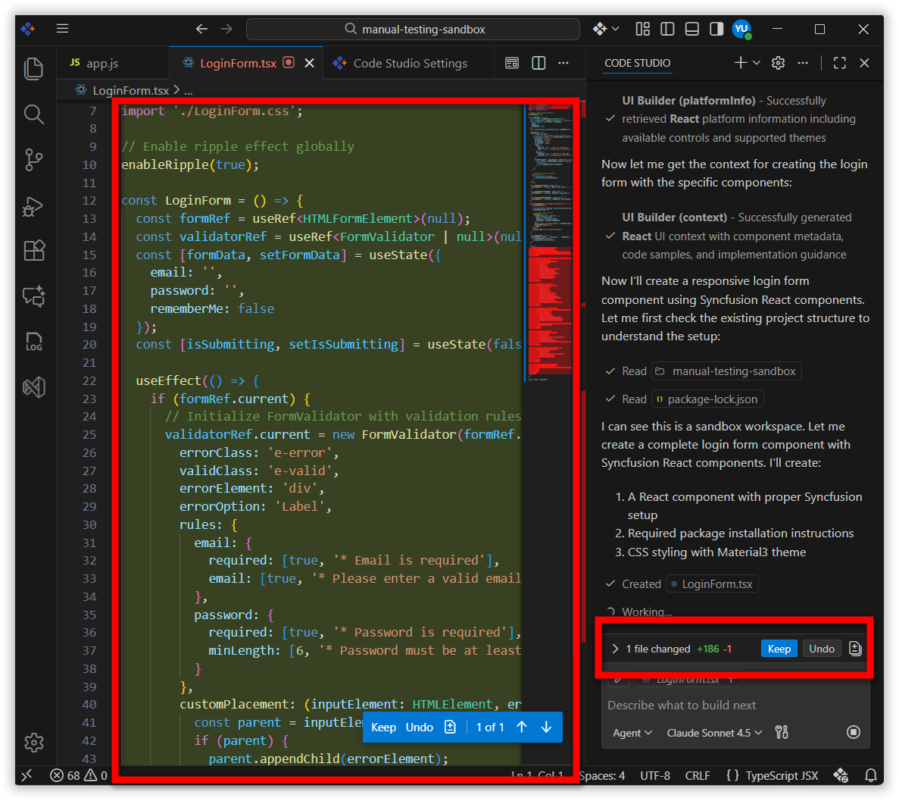
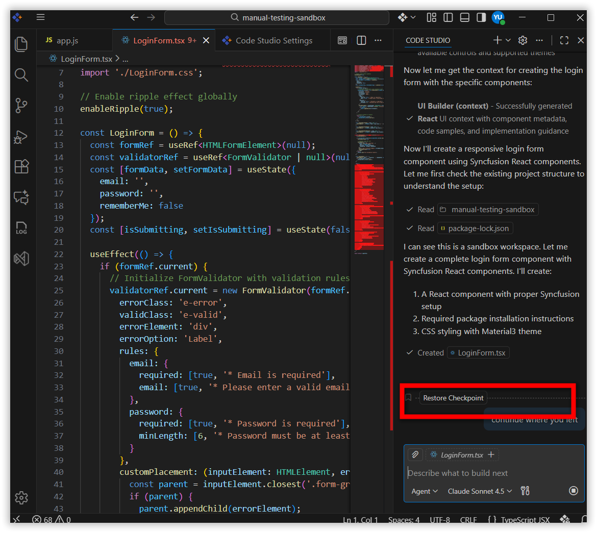

# Generate Your First Code Change Using Agent

## Overview 

Ready to supercharge your coding? In this tutorial, we'll walk you through one of the most exciting features of Syncfusion Code Studio: **Agent mode**. Imagine having an AI teammate that can understand what you want to build, write the code for you, and even show you exactly what changed before applying those changes. That's what Agent mode does!

By the end of this tutorial, you'll be comfortable using Agent mode to make your first AI-powered code changes. Let's get started!

For deeper understanding of Agent mode capabilities, check out [Agent](/code-studio/features/agent).

## Prerequisites

Before beginning, ensure:

- Syncfusion Code Studio is installed and properly configured on your system. If you have not yet downloaded Code Studio, refer to [Install and Configure](/code-studio/getting-started/install-and-configuration) for step-by-step instructions.
- Your project is opened in Code Studio, or you have at least one folder open.

## What You Will Learn

By the end of this tutorial, you'll be able to:

- Switch on Agent mode in Code Studio (it's just one click!)
- Write clear instructions for the AI to understand what you want
- See exactly what changes the Agent wants to make in a side-by-side view
- Approve changes you like with Keep, or reject ones you don't with Undo
- Understand a summary showing everything that changed
- Use checkpoints to safely restore earlier versions of your code if you change your mind

## Steps to Generate Code

### Step 1: Enable Agent Mode

Let's turn on Agent mode! This is the gateway to AI-powered coding.

1. **Open Syncfusion Code Studio** with your project or any folder you'd like to experiment with.
2. Click the mode selector in the interface.
3. Select **Agent Mode** from the dropdown menu. Agent Mode enables autonomous coding capabilities, allowing the AI to analyze, edit, and manage your codebase.

4. **Verify it's active** by looking for a checkmark or indicator next to Agent Mode in the interface. You'll know it's working when the mode selector shows "Agent Mode" is active.

   

**You've just taken your first step!** Agent mode is now active and ready to work with you.

### Step 2: Describe Your Task

1. In the chat input field, enter your coding request or task description.

   >**Tip:** Be as specific as possible with your prompt to achieve better results.

2. Press **Enter** to submit your request.
3. **Watch the Agent work its magic!** You'll see it:
   - Think about your request and understand what you're asking for
   - Look through your code to find the right places to make changes
   - Use its tools to write and modify code
   - Prepare suggestions for you to review

   

**This is where the AI earns its name!** The Agent is actively exploring and planning changes—just like a developer reviewing your code before making updates.

### Step 3: Review the Proposed Changes

Here's where *you* stay in control. The Agent shows you everything it wants to change before applying any of it.

1. **Look at the side-by-side comparison** that appears. 
2. **Read through each change carefully.** Take your time! This is your chance to make sure the changes match what you wanted.
3. **For each change, you have two options:**
   - Click **Keep** if you like the change and want to apply it
   - Click **Undo** if you want to reject it and keep the original code

   

**You have full control here!** Think of yourself as a code reviewer—you're making sure the AI's work meets your standards before it's applied.

### Step 4: Review the Code Change Summary

Once you've approved all the changes you want, the Agent put together a helpful summary for you.

1. **Review the summary** that appears after all changes are processed. It shows:
   - **Files modified:** Which files the Agent changed
   - **New files created:** Any brand-new files the Agent created for you
   - **Tools used:** A record of exactly what the AI did to make the changes

2. **Take a moment to verify** that everything matches your expectations. Did it create the file you wanted? Did it modify the right function?

   > **What if something's wrong?** Don't panic! This is why we have checkpoints (coming up next). You can easily restore to a previous state if needed.

**Great work!** You've successfully guided the AI through its first task and validated the results. This is how professional developers work—with careful review and verification.

### Step 5: Manage Using Checkpoints

- Think of checkpoints like save points in a video game. The Agent automatically creates them, and you can jump back anytime.
- These are snapshots of your code at different points in time
- You can restore any checkpoint if you want to "undo" several changes at once

   

   > **Checkpoints are your safety net!** This is why you can be brave and experiment with Agent mode. There's always a way back.

## Verification

Let's make sure everything went smoothly! Here's your verification checklist:

**Agent Mode is On?**
  - Look at the mode selector—does it show "Agent Mode" is active?

**Changes Look Good?**
  - Open your project files and review the changes you approved. Do they match what you asked for?

**Summary Makes Sense?**
  - Check the summary one more time. Did it list all the files you expected to see modified or created?

**Checkpoints Are There?**
  - Look for the checkpoint list (usually at the bottom of your chat area). Try clicking on one to restore and see that your code reverts. Then restore back to the latest—this confirms checkpoints are working!

**Congratulations!** You've just completed your first AI-powered code change. Take a moment to appreciate what you've done—you've gone from idea to implemented code with AI assistance!

## What's Next? Continue Your Learning Journey

You've mastered the basics, but there's so much more to explore:

**Want to dive deeper into checkpoints?**
  → Head to [Checkpoints](/code-studio/features/checkpoints) to learn how to manage multiple versions of your code like a pro.

**Curious about what else Agent mode can do?**
  → Check out the [Agent](/code-studio/features/agent) feature guide for advanced tips and tricks.

