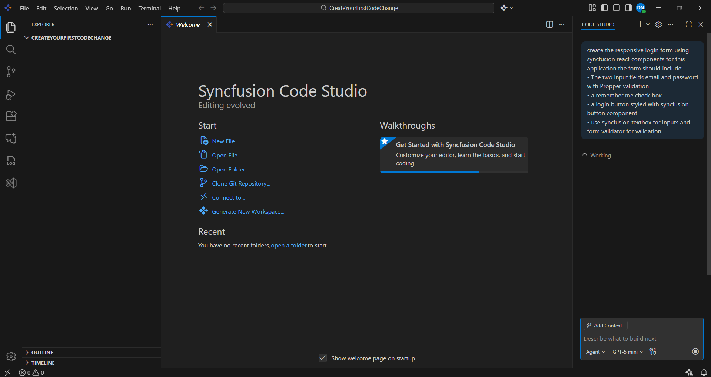

# Generate Your First Code Change Using Agent 
 
## Overview 
This tutorial guides you to use Agent mode in Syncfusion Code Studio. You'll learn how to enable Agent mode, instruct the AI with prompts, review and manage proposed code changes, and utilize checkpoints for code changes review. To learn more about the agent mode visit [agent](/code-studio/features/agent). 

## Prerequisites 
Before beginning, ensure: 
- Syncfusion Code Studio installed and properly configured on your system. If you have not yet downloaded Code Studio, please refer to this link [Install and Configure](/code-studio/getting-started/install-and-configuration.md) for step-by-step instructions on downloading and configuring Code Studio. 
- Your project is opened in Code Studio, or you have opened at least one empty folder. 
 
## What You'll Learn 
By the end of this tutorial, you'll be able to: 
- Enable Agent mode within Code Studio. 
- Use a prompt to initiate code changes and tool operations. 
- Review, accept, or reject suggested code changes. 
- Receive a detailed summary of all the changes made. 
- Manage and restore project states using checkpoints. 
 
## Step-by-Step Guide 
 
### 1. Enable Agent Mode 
1. Open Syncfusion Code Studio with your target project or with a new folder. 
2. Click on the mode selector and choose Agent Mode. 
   - Agent Mode enables autonomous coding capabilities, allowing the AI to analyze, edit, and manage your codebase with minimal manual intervention. 
3. Confirm that Agent Mode is active (the interface displays a tick mark status indicator). 

  
### 2. Describe Your Task 
1. In the chat input, give your query. 
2. Press Enter to submit your request. 
3. Agent will: 
   - Understand and analyze your request. 
   - Explore the relevant codebase. 
   - Use tools for making changes. 
   - Suggest necessary code changes. 
   
   **Note:** Be as specific as possible to achieve the desired output. 

  
### 3. Review the Proposed Changes
- The Agent displays a clear, side-by-side comparison of all proposed modifications.
- After each change, the Agent provides Keep or Undo options directly in the chat, allowing you to approve or revert updates instantly.

 
### 4. Code Change Summary 
- Once all changes are complete, the Agent summarizes its actions. 
  - You'll see a detailed summary in the chat, listing all files modified, new files created, and tools used. 
  - Review this summary carefully to ensure all changes align with your intent. 
 
### 5. Manage and Use Checkpoints  
- The Agent automatically creates checkpoints between chat requests.
- You can review, compare, and restore these checkpoints at any time, giving you a safety net. 
- Progress updates—including diffs, command outputs, and next steps—are posted in the chat area. 

 
## Verification & Troubleshooting 
To confirm everything worked as expected: 
- Ensure Agent Mode is active, and you grant all necessary tool permissions. 
- Review the final summary and verify that the intended module(s) were updated/refactored. 
- Check your codebase to see that changes you accepted have taken effect. 
- Review available checkpoints (usually visible at the bottom of the request). Try restoring a checkpoint to confirm this feature works. 
- Click [here](/code-studio/features/checkpoints) to know more about checkpoints. 
- If the tool call is not working, check whether you have granted permission for tool access.
