# Improving Code Maintainability with Automated Clean Code Refactoring

## Overview

Is your codebase getting harder to read, test, or extend? That's a sign it's time to **refactor**. **Refactoring** is the process of restructuring your existing code to improve its clarity, structure, and maintainability — without changing what it actually does.

Code Studio makes this process effortless through its built-in AI-powered tools. In this tutorial, you'll walk through practical, real-world examples of how Code Studio automatically detects and fixes the most common code quality problems: repeated logic, bloated functions, hard-to-read conditionals, and poor naming — all with just a few keystrokes.

By the end of this tutorial, you'll have a concrete set of refactoring techniques you can apply immediately to your own projects.

For a deeper understanding of the AI features used in this tutorial, see [Inline Chat](/code-studio/features/inlinechat) and [Agent](/code-studio/features/agent).

> **Note:** Refactoring changes the structure of your code, not its behavior. If your project has tests, run them before and after refactoring to confirm nothing has broken.

## Prerequisites

Before beginning this tutorial, ensure the following:

- Code Studio is installed on your system. If you haven't set it up yet, follow the [Install and Configure](/code-studio/getting-started/install-and-configuration) guide.
- A project is open in Code Studio, or you have at least one source file open in the editor.
- Basic familiarity with the programming language used in the examples (TypeScript is used throughout, but the techniques apply to JavaScript, Python, and Java as well).


## What You Will Learn

By the end of this tutorial, you'll be able to:

- Use Code Studio's [Inline Chat](/code-studio/features/inlinechat) to understand unfamiliar or complex code instantly
- Eliminate repeated logic by extracting it into reusable functions
- Simplify verbose code to make it shorter and easier to read
- Rewrite messy conditional chains into cleaner, more readable structures
- Break large, multi-purpose functions into focused, single-responsibility units
- Rename symbols intelligently across your entire project in one step
- Use [Agent mode](/code-studio/features/agent) to perform multi-file, large-scale refactoring automatically


## Understanding Code Studio's AI-Features

Before you begin refactoring, it's important to understand the two main AI-features you'll use:

### Inline Chat
**[Inline Chat](/code-studio/features/inlinechat)** is a lightweight AI assistant that appears directly in your code editor as an input box overlay. You open it with `Ctrl+I` (Windows/Linux) or `Cmd+I` (Mac). Once open, you can type natural language instructions or use slash commands (like `/explain` or `/fix`) to modify the code you've selected. Inline Chat works on **a single file or selection** at a time and shows you a side-by-side diff preview before applying any changes.

### Chat Panel
The **Chat Panel** is a separate sidebar panel in Code Studio where you can have ongoing conversations with the AI. You can use it to ask questions, get explanations, or give instructions. It supports two modes:
- **[Ask mode](/code-studio/features/ask)**: For questions, explanations, and single-file changes
- **[Agent mode](/code-studio/features/agent)**: For complex, multi-file refactoring that requires the AI to autonomously plan and execute changes across multiple files

> **Quick tip:** Use [Inline Chat](/code-studio/features/inlinechat) for quick, focused changes to code you've selected. Use [Agent mode](/code-studio/features/agent) in the Chat Panel for larger refactoring tasks that involve multiple files.

## Steps to Refactor Code

### Step 1: Understand Code Before You Refactor

Before changing any code, you must understand what it does. Code Studio's [Inline Chat](/code-studio/features/inlinechat) gives you an instant, plain-English explanation of any selected block of code — removing the guesswork before you begin.

1. Open a file in your editor that contains code you'd like to refactor.
2. Select the code block you want to understand — this can be a function, a class, or any section of logic.
3. Open the Chat Panel (if it's not already visible, press `Ctrl+Shift+P` to open the **Command Palette** — a search box that appears at the top of the editor — then type "Chat: Focus on Chat View" and press Enter).
4. Type a forward slash `/` in the input box to reveal a dropdown menu of available commands.
5. Select `/explain` from the dropdown (or simply type `/explain`) and press Enter.
6. Choose your context: You'll see a dropdown with two options:
   - **@workspace** - Choose this when explaining code, files, or project-related content (recommended for code refactoring)
   - **@terminal** - Choose this when explaining terminal commands, shell scripts, or command-line operations
   
   For this tutorial, select **@workspace** since we're analyzing code in our project files.

   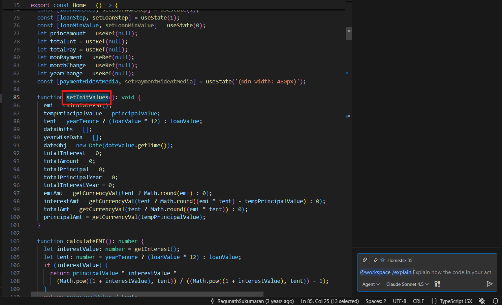

7. Code Studio returns a clear, step-by-step explanation of what the selected code does in the Chat Panel.

   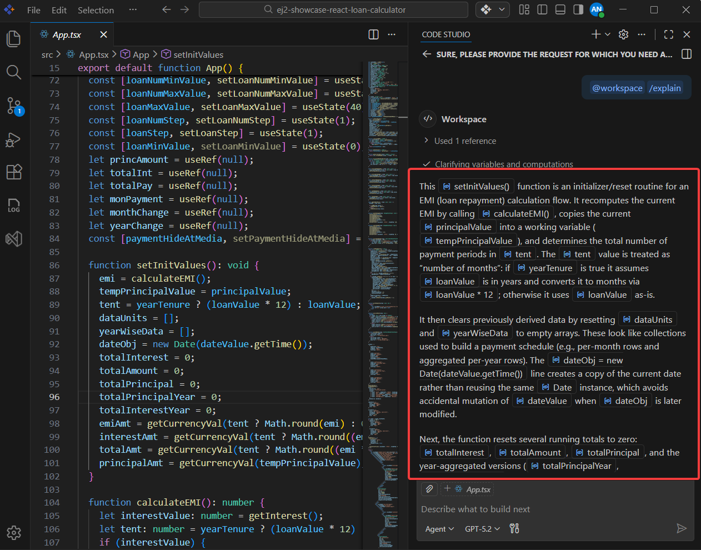

### Step 2: Eliminate Repeated Code with Extracted Functions

**Code duplication** — the same logic copy-pasted in multiple places — is one of the most common maintainability problems. When the same operation appears more than once, every bug fix or change must be applied in every location, which is time-consuming and error-prone.

Code Studio can detect duplicated logic and extract it into a single, reusable function automatically.

#### Example — Before Refactoring

```typescript
// Before: Duplicated EMI calculation logic
let loanAmount1 = 300000;
let interestRate1 = 5.5;
let years1 = 15;
let monthlyPayment1 = loanAmount1 * (interestRate1 / 12 / 100) * 
    Math.pow(1 + (interestRate1 / 12 / 100), years1 * 12) / 
    (Math.pow(1 + (interestRate1 / 12 / 100), years1 * 12) - 1);

let loanAmount2 = 450000;
let interestRate2 = 6.0;
let years2 = 30;
let monthlyPayment2 = loanAmount2 * (interestRate2 / 12 / 100) * 
    Math.pow(1 + (interestRate2 / 12 / 100), years2 * 12) / 
    (Math.pow(1 + (interestRate2 / 12 / 100), years2 * 12) - 1);

console.log(monthlyPayment1);
console.log(monthlyPayment2);
```

**Steps:**

1. Select the entire file contents in the editor (`Ctrl+A` / `Cmd+A`).
   > **Why select everything?** When you select the entire file, Code Studio's AI can analyze all the functions and automatically identify patterns where the same logic appears multiple times. You don't need to manually highlight each duplicate — the AI does this detection for you.
2. Open Inline Chat with `Ctrl+I` (Windows/Linux) or `Cmd+I` (Mac). The input box will appear over your editor.
3. Type the following prompt and press Enter:
   ```
   move repeated calculations into reusable functions
   ```
4. Code Studio analyzes the entire file, identifies duplicate patterns, and suggests a refactored version:

   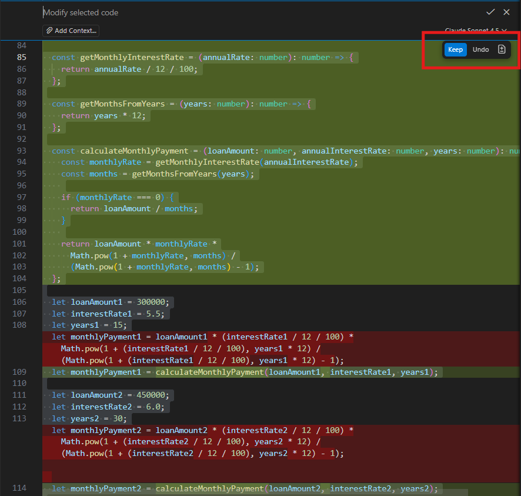

5. Review the suggestion and click Accept if you're satisfied with the result.

> **Note:** Always run your tests after accepting a refactoring suggestion to confirm the behavior has not changed.

### Step 3: Make Verbose Code More Concise

Long-winded code with unnecessary variables, redundant checks, or outdated syntax is harder to scan and review. Code Studio can rewrite unnecessarily verbose code into a compact, idiomatic form — without removing any functionality.

#### Example — Before Refactoring

```typescript
// Before: Verbose code with unnecessary intermediate variables and string concatenation
function formatLoanAmount(amount: number) {
  const formattedAmount = new Intl.NumberFormat('en-US', {
    style: 'currency',
    currency: 'USD',
    minimumFractionDigits: 0
  }).format(amount);
  return formattedAmount;
}

function formatInterestRate(rate: number) {
  const formattedRate = rate.toFixed(2) + '%';
  return formattedRate;
}

const principalAmount = 300000;
const formattedPrincipal = formatLoanAmount(principalAmount);
console.log('Loan Amount: ' + formattedPrincipal);

const interestRateValue = 5.5;
const formattedInterest = formatInterestRate(interestRateValue);
console.log('Interest Rate: ' + formattedInterest);
```

**Steps:**

1. Select the entire file contents (`Ctrl+A` / `Cmd+A`).
2. Open Inline Chat with `Ctrl+I` (Windows/Linux) or `Cmd+I` (Mac).
3. Type the following prompt and press Enter:
   ```
   make this more concise
   ```
   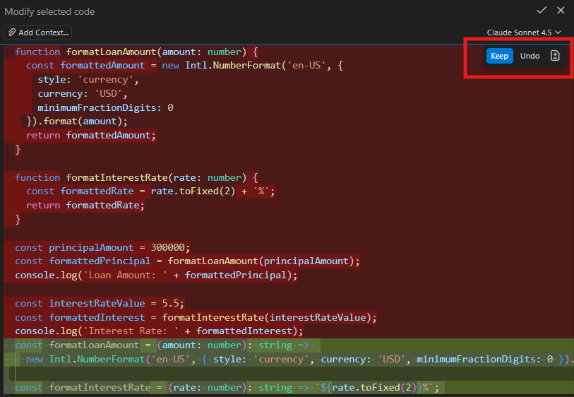

4. Code Studio suggests a cleaner version:
   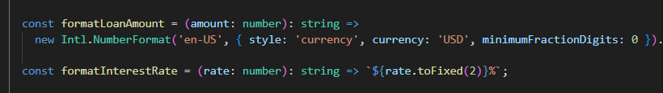

5. Review the suggestion and click Accept if you're satisfied.

### Step 4: Split Large Functions into Focused Units

A function that does too many things at once is called a **god function**. It's hard to test in isolation, difficult to reuse in other contexts, and slow to debug when something goes wrong.

The solution is the **Single Responsibility Principle (SRP)**: each function should do exactly one thing. Code Studio can split a god function into smaller, focused units automatically.

> **Key concept — Single Responsibility Principle (SRP):** A design principle that states every function, class, or module should have only one reason to change. Smaller, focused functions are easier to test, reuse, and maintain.

#### Example — Before Refactoring

```typescript
// Before: A "god function" that does too many things
function calculateLoanDetails(principal: number, rate: number, years: number): void {
  // Step 1: Calculate monthly rate and total months
  const monthlyRate = rate / 12 / 100;
  const months = years * 12;
  
  // Step 2: Calculate EMI
  const emi = principal * monthlyRate * Math.pow(1 + monthlyRate, months) /
    (Math.pow(1 + monthlyRate, months) - 1);
  
  // Step 3: Calculate total payment and interest
  const totalPayment = emi * months;
  const totalInterest = totalPayment - principal;
  
  // Step 4: Format and display results
  const formatter = new Intl.NumberFormat('en-US', { style: 'currency', currency: 'USD' });
  console.log(`Monthly Payment: ${formatter.format(emi)}`);
  console.log(`Total Interest: ${formatter.format(totalInterest)}`);
  console.log(`Total Payment: ${formatter.format(totalPayment)}`);
}

calculateLoanDetails(300000, 5.5, 15);
```

**Steps:**

1. Place the cursor anywhere inside the large function (e.g., `calculateLoanDetails`).
2. Open Inline Chat with `Ctrl+I` (Windows/Linux) or `Cmd+I` (Mac).
3. Type the following prompt and press Enter:

   ```
   split into separate functions: one for calculating EMI, one for calculating totals, and one for formatting currency
   ```
   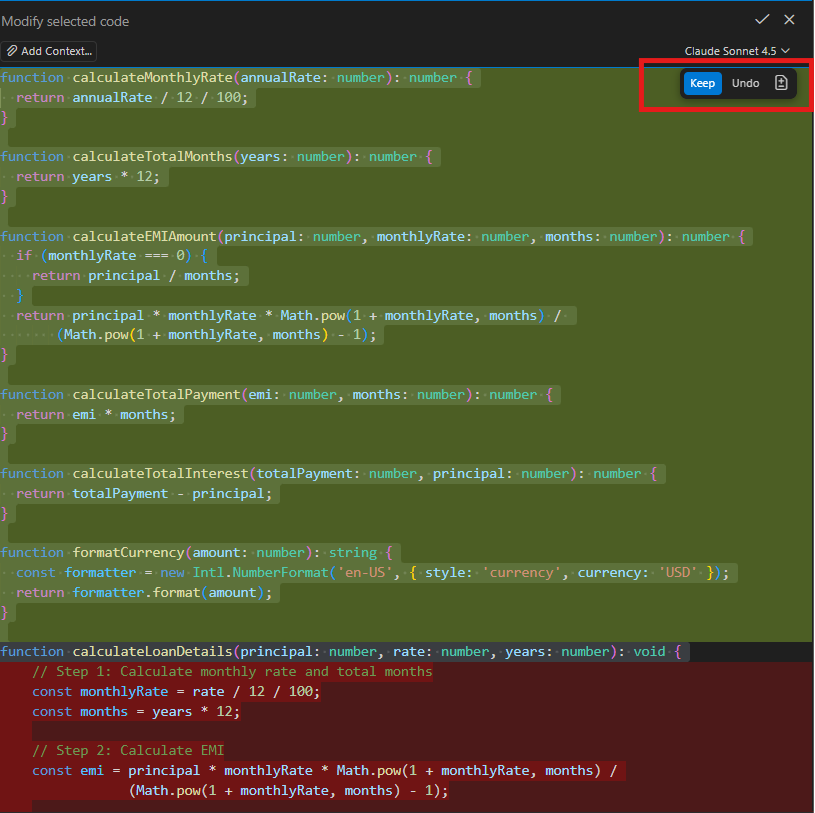

4. Code Studio suggests the refactored version with each concern separated:

   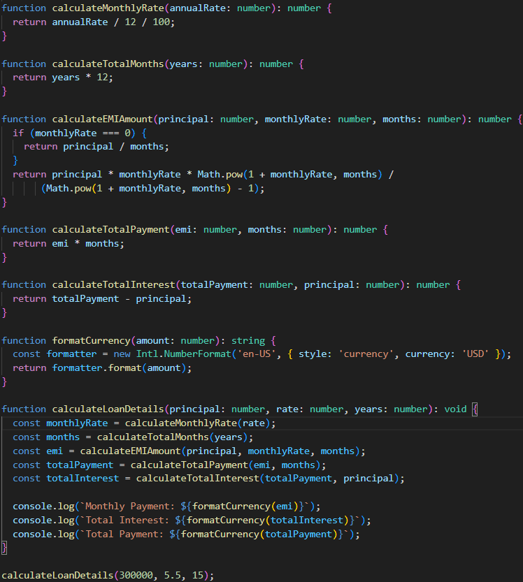

5. Review the suggestion and click Accept if you're satisfied.

### Step 5: Rename Symbols Across the Entire Project

Poor variable and function names silently reduce code quality over time. Names like `d`, `tmp`, `fn`, or `process` tell the next developer nothing about what they represent. Code Studio can suggest meaningful names and rename every reference across your entire project in a single action.

1. Place the cursor on the symbol you want to rename — this can be a variable, function name, class, or parameter.
2. Press `F2` to trigger the rename action.
3. Code Studio displays a list of AI-suggested alternative names in a dropdown.

   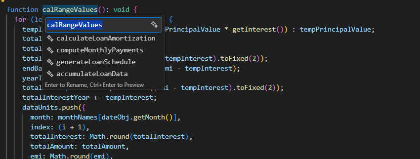

4. Select the name you prefer from the list, or type your own replacement name.

   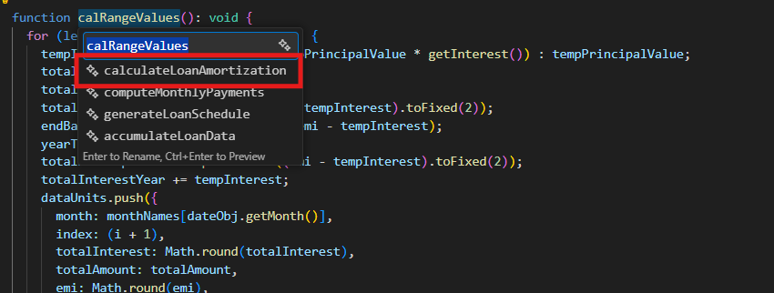

5. Press Enter to confirm. The symbol is automatically renamed **everywhere it is used** in the project — across all files.

   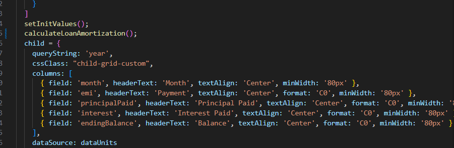

> **Note:** Code Studio's rename is scope-aware — it updates only the references that belong to the same symbol, not unrelated variables that happen to share the same name.

### Step 6: Large-Scale Refactoring with Agent Mode

For bigger refactoring jobs that span multiple files — such as standardizing error handling patterns, migrating to a new API, or updating deprecated library methods across your entire codebase — **[Agent mode](/code-studio/features/agent)** is the right tool.

> **Key concept — [Agent mode](/code-studio/features/agent):** An AI mode in Code Studio that can autonomously plan, read, and edit multiple files in sequence to complete a multi-step task. Unlike [Inline Chat](/code-studio/features/inlinechat) (which works on a single file or selection), [Agent mode](/code-studio/features/agent) can coordinate changes across your whole project. Think of it as giving the AI a complete task to handle end-to-end, rather than manually guiding each individual file change.

#### Example: Standardize Error Handling Across Multiple Files

In this example, your project has inconsistent error handling — some functions use `try-catch` blocks, others silently swallow errors, and error messages lack context. The goal is to apply a single, consistent error handling pattern across all service files.

**Steps:**

1. Clone the sample repository and open it in Code Studio:
   ```bash
   git clone https://github.com/syncfusion/ej2-showcase-react-loan-calculator
   cd ej2-showcase-react-loan-calculator
   code .
   ```

2. Open your project in Code Studio.
3. Open the Chat Panel (if it's not already visible, press `Ctrl+Shift+P` to open the **Command Palette** — a search box that appears at the top of the editor — then type "Chat: Focus on Chat View" and press Enter).
4. Click the mode selector dropdown at the top of the Chat panel (it will say "Chat" by default) and choose **[Agent](/code-studio/features/agent)** from the dropdown.
5. Type the following prompt in the chat input and press Enter:

   ```
   Refactor error handling across all files in src/services to use a consistent pattern: wrap all async operations in try-catch blocks, log errors using console.error with meaningful messages, and return standardized error objects with status and message properties.
   ```

6. Watch [Agent mode](/code-studio/features/agent) work. It will automatically:
   - Scan all relevant files in the `src` folder
   - Identify functions that are missing or have inconsistent error handling
   - Plan the changes needed across each file
   - Propose edits to each file in sequence
   - **Create automatic checkpoints** as it works — these are restore points you can return to if you want to undo all changes from the Agent session

7. Review each proposed change in the side-by-side diff view — click Keep to accept or Undo to reject individual file changes.

   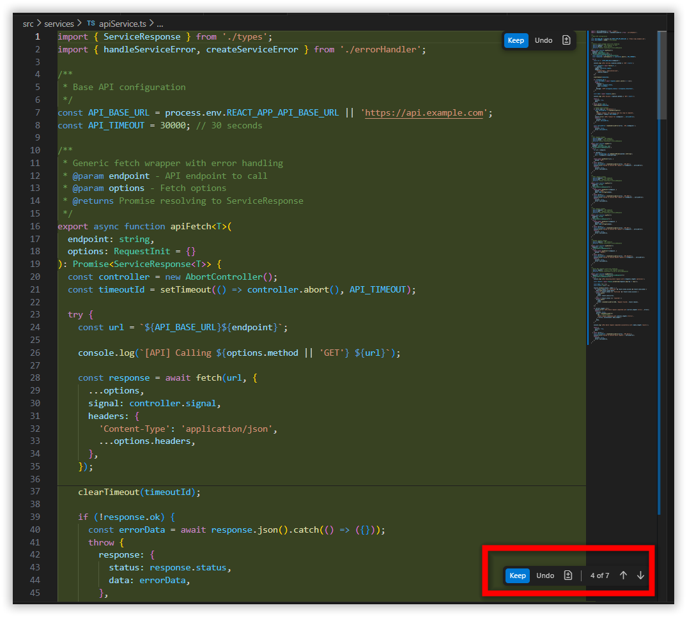

## Verification

After applying any refactoring, work through this checklist to confirm everything is correct:

- **Code behavior is unchanged** — If your project has automated tests, run your full test suite. All tests that passed before refactoring should still pass after. If you don't have tests, manually test the affected features in your application to confirm they still work as expected.
- **Code is cleaner** — Open each refactored file and confirm it is easier to read and understand than before.
- **No broken references** — Open the Problems panel (`Ctrl+Shift+M`) and confirm there are no new errors or unresolved references from renamed symbols, extracted functions, or moved imports.
- **Style is consistent** — Review the changed files to confirm the reformatted code matches your team's style guide or linting rules.

**Congratulations!** You've applied professional-grade clean code refactoring techniques using Code Studio's AI-features. Your codebase is now more readable, more maintainable, and better prepared for new features.

## What's Next?

You've mastered the key refactoring techniques — here's where to go next:

- **Generate new features with AI:** [Generate Your First Code Change Using Agent](/code-studio/tutorials/generate-your-first-code-using-agent)
- **Catch and fix bugs early:** [Quick Fix Error Guide](/code-studio/how-to-guides/quick-fix-error)
- **Explore advanced Agent workflows:** [Agent Feature Guide](/code-studio/features/agent)
- **Master all Inline Chat commands:** [Inline Chat Feature Guide](/code-studio/features/inlinechat)
