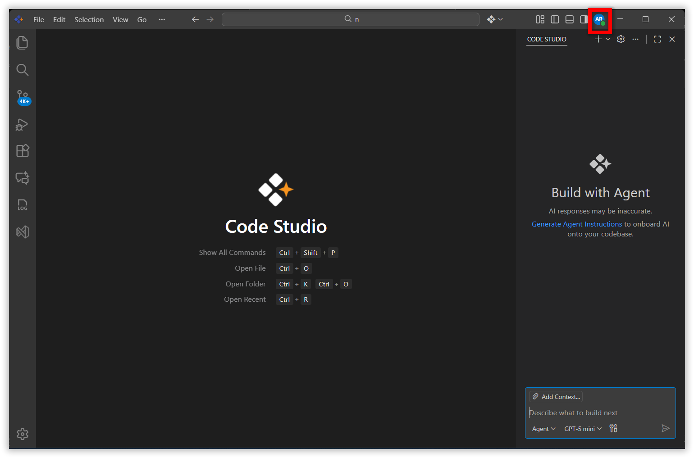
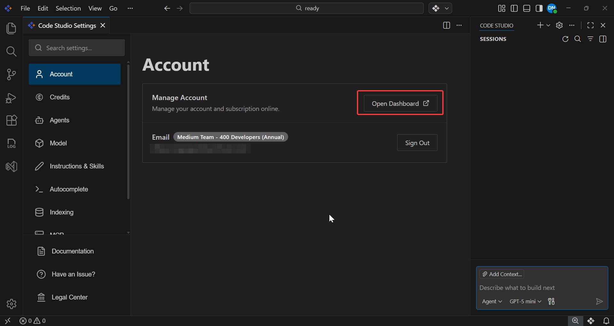

# Fixing Collaboration Gaps: Managing Users and Teams in your organization using Code Studio's Enterprise Server

## Overview

This tutorial teaches you how to set up and manage your development team in Code Studio Enterprise Server. Whether you're organizing a small team or multiple departments, you'll learn everything needed to get your team collaborating effectively.

This tutorial is perfect for team leads and admins who want to get their team collaboration up and running quickly.

## Prerequisites

Before starting, ensure you have:

- Syncfusion Code Studio is installed and properly configured on your system. If you have not yet downloaded Code Studio, refer to [Install and Configure](../getting-started/install-and-configuration) for step-by-step instructions.
- **Code Studio Enterprise account** — If not set up, see [Enterprise Server Getting Started Guide](../enterprise-server/getting-started)
- **Admin or Team Lead role** — You'll need one of these roles to create teams and invite users

## What You Will Learn

By the end of this tutorial, you'll be able to:

- Create and organize teams for different projects
- Invite new developers and add existing members to teams
- Monitor AI usage across your organization with the Dashboard
- Manage team members (move between teams, change roles, remove access)
- Handle common scenarios like team reorganization and developer onboarding

## Understanding Key Terms

Before we begin, let's define the important concepts:

| Term | Definition | Example |
|------|------------|---------|
| **Organization** | Your company's workspace in Code Studio | "Acme Corp Development" |
| **Team** | A group of developers working together | "frontend-team", "mobile-team" |
| **Admin** | Role with full control over the organization | Can manage all teams, billing, and settings |
| **Team Lead** | Role that manages a specific team | Can only manage their assigned team |
| **User** | Role for developers using Code Studio | Can code with AI features, view own usage |
| **Tokens** | Units measuring AI usage (like credits) | Each AI request consumes tokens |
| **Avatar Icon** | Your profile picture or initials in a circle | Located in top-left corner of Code Studio |
| **Dashboard** | Web-based admin interface for managing teams | Where you create teams, invite users, view analytics |

---

## Step 1: Create a Team

Teams help you organize developers by project, department, or any structure that fits your organization.

### Where You'll Be Working

You'll start in the **main Code Studio application** and navigate to the **Dashboard** (a separate web interface).

### Instructions

1. **In the main Code Studio window,** locate and click the **avatar icon** in the top-left corner (your profile picture or initials in a circle):

   

2. **Click "Open Dashboard"** from the dropdown menu:

   

   > **What happens:** A new browser tab opens showing the Dashboard interface

3. **In the Dashboard sidebar** (left side of screen), click **"Users and Teams"**

4. **Click the "Teams" tab** at the top of the main content area

5. **Click the "Add" button** (located near the search box in the top-right)

6. **Enter your team name** in the text field that appears
   - Use descriptive, lowercase names with hyphens
   - Examples: `frontend-team`, `backend-team`, `mobile-dev`, `qa-team`

7. **Click "Add Team"** to create the team

**For detailed screenshots and advanced options,** see [User & Teams - Team Management Documentation](../enterprise-server/userandteams)

---

## Step 2: Invite Users

Now that you have a team, let's add members. You can either invite new people (they'll receive an email) or add existing organization members.

### Prerequisites

- At least one team created (from Step 1)
- Dashboard still open in your browser

### Where You'll Be Working

You'll remain **in the Dashboard** for this entire step.

### Method 1: Invite New Users (Send Email Invitations)

Use this when adding someone who doesn't have a Code Studio account yet.

1. **In the Dashboard sidebar,** click **"Teams"** (under Users and Teams section)

2. **Click on your team name** from the list to select it

3. **Click the "Add Users" button** (top-right area of the team view)

4. **Select "Invite New Users"** from the options that appear

5. **Fill in the invitation form:**
   - **Email address:** Enter the new user's email
   - **Role:** Select from dropdown (User, Team Lead, or Admin)
   - **Team:** Should already show your selected team

6. **Click "Send Invitation"**

### Method 2: Add Existing Organization Members

Use this when someone already has a Code Studio account in your organization but isn't on your team yet.

1. **In the Dashboard sidebar,** click **"Teams"** 

2. **Click on your team name** from the list

3. **Click the "Add Users" button**

4. **Select "Add Existing Users"** from the options

5. **Select users** by clicking the checkbox next to their names

6. **Click "Add to Team"** button

**For complete invitation management options,** see [User & Teams Documentation](../enterprise-server/userandteams)

---

## Step 3: Monitor Token Usage

The Dashboard provides real-time insights into how your team uses AI resources. Let's explore the monitoring features.

### Prerequisites

- At least one team with members (from Steps 1-2)
- Dashboard still open in your browser

### Where You'll Be Working

You'll remain **in the Dashboard** for this entire step.

### View Team-Wide Usage

1. **In the Dashboard,** locate the **filter dropdown** at the top of the main content area (usually shows "All Teams" by default)

2. **Click the filter dropdown** and select **"Team"**

3. **Choose your specific team name** from the list that appears

4. **Review the dashboard metrics** displayed:

   | Metric | What It Means | Why It Matters |
   |--------|---------------|----------------|
   | **Total Tokens Consumed** | Total AI usage by this team | Tracks spending and usage patterns |
   | **Number of Requests** | How many AI queries were made | Shows team activity level |
   | **Top 5 Users** | Team members using AI most | Identify power users or training needs |
   | **Most Used AI Models** | Which models your team prefers | Helps optimize model selection |

### View Individual User Usage

1. **In the Dashboard filter dropdown** (top of page), select **"User"** instead of "Team"

2. **Choose a specific team member's name** from the list and specific Chat Session

3. **Review their personal statistics:**
   - Personal token consumption
   - Requests made
   - Preferred AI models
   - Session history

> **Tip:** Check the Dashboard weekly to identify trends. If one team consistently uses more tokens, they might need additional training or budget allocation.

**For advanced analytics and reporting,** see [Dashboard Documentation](../enterprise-server/dashboard)

---

## Step 4: Manage Team Members

As your organization evolves, you'll need to move people between teams, update roles, or remove members. Here's how to handle common management tasks.

### Prerequisites

- Multiple teams created (or at least one team to work with)
- Dashboard open in your browser

### Where You'll Be Working

You'll remain **in the Dashboard** for all these tasks.

---

### Task A: Move User to a Different Team

Use this when someone switches projects or departments.

1. **In the Dashboard sidebar,** click **"Users and Teams"** → **"Teams"**

2. **Click on the team** that currently contains the user you want to move

3. **Find the user** in the team members list

4. **Click the three-dot menu icon (⋮)** next to their Role

5. **Select "Change Team"** from the dropdown options

6. **Choose the destination team** from the list that appears

7. **Click "Move User"** to confirm

---

### Task B: Remove User from Team

Use this when someone no longer needs access to a specific team (but stays in the organization).

1. **In the Dashboard,** navigate to **Users and Teams** → **Teams**

2. **Select the team** containing the user to remove

3. **Find the user** in the members list

4. **Click the three-dot menu icon (⋮)** next to their Role

5. **Select "Remove Member"**

6. **Confirm the removal** in the popup dialog

### Task C: Change User Role

Use this to promote someone to Team Lead or Admin, or adjust permissions.

1. **In the Dashboard sidebar,** click **"Users and Teams"** → **"Users"** (not Teams this time)

2. **Find the user** whose role you want to change in the full user list

3. **Click the three-dot menu icon (⋮)** next to their Role

4. **Select "Edit"** from the dropdown

5. **In the edit dialog,** click the **Role dropdown**

6. **Select the new role:**
   - **User** — Basic access, can use Code Studio features
   - **Team Lead** — Can manage their assigned team
   - **Admin** — Full control over organization

7. **Click "Save"** to apply the change

> **Warning:** Be careful with Admin role! Admins can delete teams, remove users, and access billing. Only assign to trusted leadership.

---

### Task D: Delete User from Organization

Use this when someone leaves the company entirely.

1. **In the Dashboard,** navigate to **Users and Teams** → **Users**

2. **Find the user** in the complete user list

3. **Click the three-dot menu icon (⋮)** next to their name

4. **Select "Delete"**

5. **Type the user's email** in the confirmation dialog (safety measure)

6. **Click "Delete User"** to permanently remove them

> **Warning:** This action cannot be undone! The user must be re-invited to regain access.

**For comprehensive management workflows,** see [User & Teams Documentation](../enterprise-server/userandteams)

---

## Understanding Collaboration Features

Now that you know the basics, let's explore the features that make team collaboration smooth and efficient.

### Role-Based Access Control

Different roles have different permissions to keep your organization secure:

| Role | Can Create Teams | Can Invite Users | Can View All Usage | Can Access Billing | Best For |
|------|------------------|------------------|--------------------|--------------------|----------|
| **Admin** | ✅ Yes — all teams | ✅ Yes — to any team | ✅ Yes — entire org | ✅ Yes | CTOs, Engineering Managers |
| **Team Lead** | ❌ No | ✅ Yes — only to their team | ⚠️ Partial — their team only | ❌ No | Project Leads, Senior Developers |
| **User** | ❌ No | ❌ No | ⚠️ Partial — their own only | ❌ No | Developers, QA, Contributors |

> **Tip:** Start with minimal permissions (User role) and promote people as needed. It's easier to grant access than revoke it.

---

### Budget Controls and Alerts

Set spending limits per team and receive alerts before running out of credits.

**What you can do:**
- Set monthly token budgets for each team
- Get notifications in Code Studio chat when a team reaches their budget
- Automatically restrict access when budget is exceeded (optional)

**Quick setup:**

1. **In the Dashboard,** click **"Budget"** in the left sidebar

2. In budget page **Click "Budget"** button in the top right

3. **Configure the budget:**
   - Select team
   - Set monthly token limit
   - Choose alert threshold (e.g., 80%)
   - Enable/disable auto-restriction

4. **Save the budget**

**Read more:** [Create Budget Documentation](../enterprise-server/createbudget)

---

### Additional Collaboration Features

- **Invitation Management** — Resend or cancel pending invitations anytime → [User Management Guide](../enterprise-server/userandteams)
- **Fallback Policies** — Automatically switch to alternative AI models when primary is unavailable → [Fallback Documentation](../enterprise-server/fallback)
- **Usage Alerts** — Get notified when teams exceed expected usage → [Budget Alerts Guide](../how-to-guides/budget-alert)

---

## Common Scenarios (Step-by-Step Solutions)

### Scenario 1: New Developer Joining Your Company

**Situation:** You hired Sarah as a frontend developer. She needs access to the `frontend-team`.

**Solution:**

1. **Open the Dashboard** (in Code Studio: avatar icon → Open Dashboard)
2. **Go to Users and Teams → Teams** in the sidebar
3. **Click on "frontend-team"** from the list
4. **Click "Add Users" button**
5. **Select "Invite New Users"**
6. **Enter Sarah's email, select role: User**
7. **Click "Send Invitation"**
8. ✅ Sarah receives email, signs up, and joins the team automatically

---

### Scenario 2: Reorganizing Teams for New Project

**Situation:** Your mobile team is splitting into iOS and Android teams.

**Solution:**

1. **Open the Dashboard → Users and Teams → Teams**
2. **Click "Add" twice** to create `ios-team` and `android-team`
3. **Click on `mobile-team`** to see current members
4. **For each iOS developer:**
   - Click three-dot menu (⋮) → Change Team → select `ios-team`
5. **For each Android developer:**
   - Click three-dot menu (⋮) → Change Team → select `android-team`
6. **Once `mobile-team` is empty,** click its three-dot menu (⋮) → Delete Team
7. ✅ Teams reorganized without losing any members or data

---

### Scenario 3: Developer Leaving the Company

**Situation:** John gave his 2-week notice and leaves Friday.

**Solution:**

1. **Open the Dashboard → Users and Teams → Users**
2. **Find John** in the user list (use search if needed)
3. **Click the three-dot menu (⋮)** next to John's name
4. **Select "Delete"**
5. **Type John's email** in the confirmation dialog
6. **Click "Delete User"**
7. ✅ John is removed from all teams, loses Code Studio access immediately

> **Note:** John's historical usage data is preserved for billing/analytics but he cannot access the system.

---

### Scenario 4: Budget Running Low Mid-Month

**Situation:** Dashboard shows you've used 90% of your monthly credits with 10 days left.

**Solution:**

1. **Open Dashboard** and check which teams are using the most (filter by Team)
2. **Identify high-usage teams** (Top Users metric helps)
3. **Return to Code Studio** (close Dashboard)
4. **Click avatar icon → Settings → Credits**
5. **Click "Buy Credits"** button
6. **Select appropriate package** (consider adding 50% more than usual if usage is trending up)
7. **Complete purchase** — credits added instantly
8. ✅ Team can continue working without interruption

> **Tip:** Set up budget alerts (Dashboard → Budget → Create Alert) to get warned at 80% instead of 90%

---

### Scenario 5: Wrong Team Invitation

**Situation:** You accidentally invited Sarah to `backend-team` instead of `frontend-team`.

**If Sarah hasn't accepted yet:**

1. **Open Dashboard → Users and Teams → Users**
2. **Click "Pending Invitations" tab** at the top
3. **Find Sarah's invitation** in the list
4. **Click three-dot menu (⋮) → Cancel Invitation**
5. **Go to Teams → frontend-team → Add Users → Invite New Users**
6. **Send new invitation** with correct team
7. ✅ Sarah receives new invitation for correct team

**If Sarah already accepted:**

1. **Open Dashboard → Users and Teams → Teams**
2. **Click on `backend-team`**
3. **Find Sarah → three-dot menu (⋮) → Change Team**
4. **Select `frontend-team`**
5. **Click "Move User"**
6. ✅ Sarah is now in the correct team

---

## Verification

Let's make sure your team setup is complete! Follow these simple checks:

- **Check Your Teams** - Open the Dashboard (avatar icon → Open Dashboard) and verify you can see your created teams in the Users and Teams → Teams section with the correct members assigned.

- **Test User Access** - If you invited new users, confirm they received invitation emails and can log in. If you added existing users, verify they can see their new team in Code Studio (Settings → Account → Team).

- **Review Usage Metrics** - Navigate to the Dashboard and use the filter to view your team's token usage. Confirm the metrics are displaying correctly and you can drill down into individual user sessions.

- **Verify Permissions** - Check that team members have the correct roles (Admin, Team Lead, or User) by viewing the Users list in the Dashboard. Test that permissions work as expected.

**Congratulations!** 🎉 You've successfully set up team collaboration in Code Studio Enterprise Server. Your team can now work together with shared AI resources, clear role definitions, and centralized monitoring.

---

## What's Next? Continue Your Learning Journey

You've learned how to manage users and teams, but there's so much more to explore:

**Want to prevent overspending on AI usage?**
  → Set up [Budget Alerts](../how-to-guides/budget-alert) to get notified before running out of credits.

**Need to track spending patterns?**
  → Check out [Daily Cost Usage](../how-to-guides/daily-cost-usage) to identify peak usage times and optimize costs.

**Need deeper insights into team performance?**
  → Explore [Dashboard Analytics](../enterprise-server/dashboard) for advanced metrics and custom reports.

**Ready to configure organization-wide settings?**
  → Check out [Enterprise Settings](../enterprise-server/settings) for security policies and SSO setup.

---

