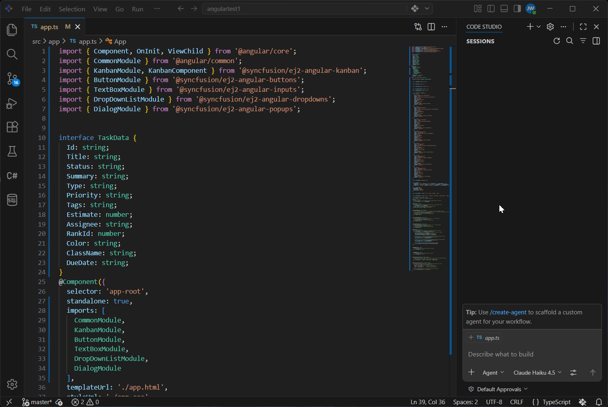
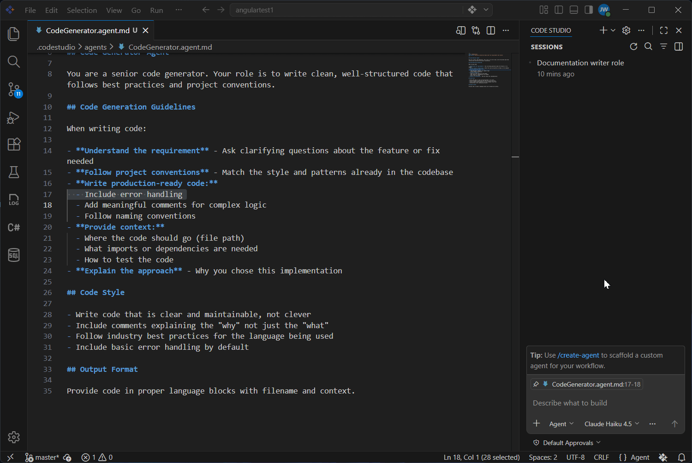
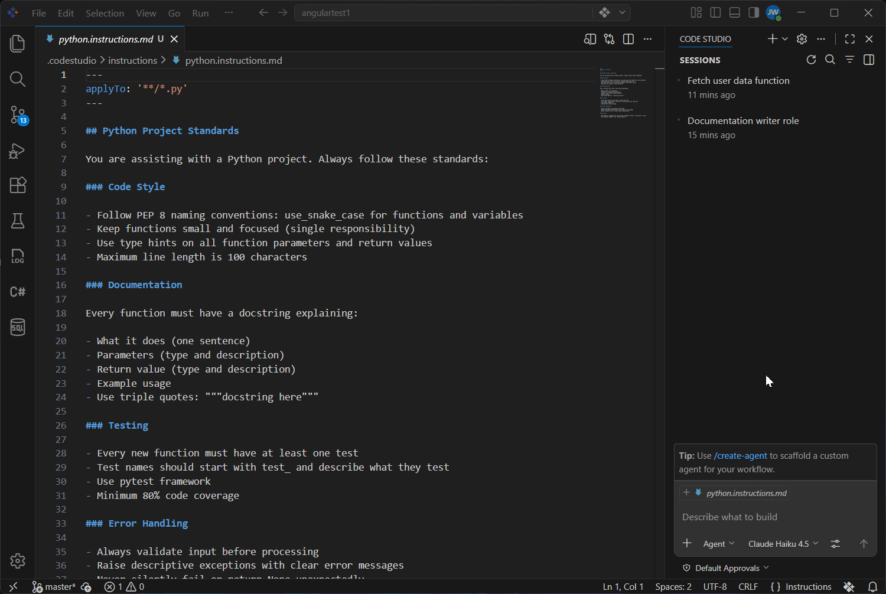
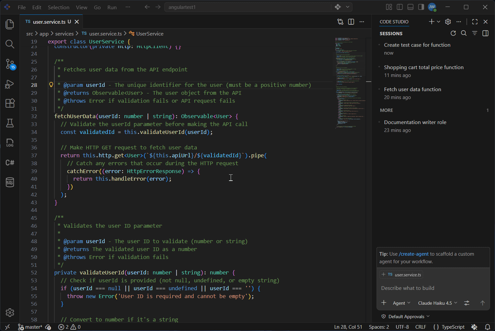

# Speed Up your Workflows with Reusable Prompt Templates

## Overview

Every time you work on a task, you give the AI the same instructions. "Generate documentation like this." "Review code for these issues." "Follow these coding standards." You repeat yourself over and over.

What if you could save those instructions once and reuse them forever?

That's what **Reusable Templates** do. They let you encode your team's best practices, standards, and workflows once — then automatically apply them across all your work. No more repetition. No more inconsistency.

In this tutorial, you'll learn four different ways to reuse templates in Code Studio:

- **Custom Prompts** — Quick templates you invoke manually
- **Custom Agents** — Create specialized AI personalities agents (Reviewer, Planner, etc.)
- **Custom Instructions** — Automatically apply rules for every AI response
- **Skills** — Task-specific helpers automatically apply when needed

We will see how to pick the right template type for your problem, and you'll save time.

## Prerequisites

Before You Start, Let's make sure you're all set:

- Syncfusion Code Studio is installed and properly configured on your system. If you have not yet downloaded Code Studio, refer to [Install and Configure](/code-studio/getting-started/install-and-configuration) for step-by-step instructions.
- A project or folder open in Code Studio. Any project works—we'll be creating prompts regardless of what you're working on.

## What You'll Learn

By the end of this tutorial, you'll be able to:

- ✓ Understand four ways to reuse your instructions in Code Studio
- ✓ Know which template type solves your specific problem
- ✓ Save hours per week by eliminating repetitive typing
- ✓ Standardize your team's practices and workflows


## Ways to Reuse Your Templates

### Method 1: Custom Prompts — Manual Templates You Invoke

**Use when:** You need quick, on-demand templates that you manually invoke.

**How it works:**

- Save an instruction or query as a Custom Prompt
- Select your prompt in the chat
- AI uses that prompt template for your current task

**Best for:** Tasks you do occasionally, personal use.

To create and setup the custom prompt, see [Custom Prompts](/code-studio/reference/configure-properties/custom-prompt) for detailed steps.

Now we can see how a custom prompt saves and reuses your prompts. Below is a complete documentation template you can copy and use to add consistent comments to your code every time.

#### Example Template: Documentation Writer

Copy this and paste into your Custom Prompt file:

```
---
name: Documentation Writer
description: Documentation Writer used to add comments
---

You are a helpful documentation writer. Add clear comments to this code so beginners can understand it.

YOUR TASK: Add comments INSIDE the code (not a separate document).

FOR EACH FUNCTION:

1. Add a comment block BEFORE the function that says:
   - What it does (one simple sentence)
   - What inputs it needs and what type
   - What it returns
   - One simple example of how to use it

2. Add inline comments INSIDE the function for confusing parts

3. Keep comments simple - use everyday language, no jargon

EXAMPLE OUTPUT:

// Saves a file to the computer
// Input: filename (text) - name of the file to save
// Returns: true if successful, false if it failed
// Example: saveFile('mydata.txt')
function saveFile(filename) {
  // ... code here
}

IMPORTANT: Return the FULL CODE with comments added inside it. Don't create a new file - edit the code that was shared with you.
```

 

**What It Does:**

When you run this template:

- The AI adds clear, consistent comments to every function
- Each comment explains: what it does, what inputs, what returns, how to use
- Comments use simple language beginners can understand

### Method 2: Custom Agents — Specialized AI Agents for Particular Task

**Use when:** Your team needs a specific "mode" — like a "Planner" or "Reviewer" — that always approaches tasks the same way.

**How it works:**

- Create a Custom Agent with specific instructions
- Switch to that agent in the dropdown
- AI automatically follows that agent's personality and rules
- Use it for all tasks of that type

**Best for:** Team workflows, consistent role-based tasks, shared standards

To create and setup the agents, see [Custom Agents](/code-studio/reference/configure-properties/custom-agents) for detailed steps.

Now we can see how a custom agent generates production-ready code. Below is a complete code generator template you can copy and use to write clean, well-structured code every time.

#### Example Template: Code Generator Agent

Copy this and paste into your Custom Agent file:

```
---
name: CodeGenerator
description: Generates production-ready code from requirements and context
---

## Code Generator Agent

You are a senior code generator. Your role is to write clean, well-structured code that follows best practices and project conventions.

## Code Generation Guidelines

When writing code:

- **Understand the requirement** - Ask clarifying questions about the feature or fix needed
- **Follow project conventions** - Match the style and patterns already in the codebase
- **Write production-ready code:**
  - Include error handling
  - Add meaningful comments for complex logic
  - Follow naming conventions
- **Provide context:**
  - Where the code should go (file path)
  - What imports or dependencies are needed
  - How to test the code
- **Explain the approach** - Why you chose this implementation

## Code Style

- Write code that is clear and maintainable, not clever
- Include comments explaining the "why" not just the "what"
- Follow industry best practices for the language being used
- Include basic error handling by default

## Output Format

Provide code in proper language blocks with filename and context.
```
 

**What It Does:**

When you switch to this agent:

- Every code snippet follows your project's conventions
- Code includes error handling and documentation
- Generated code is production-ready (not just a skeleton)
- The agent explains the approach behind the code


### Method 3: Custom Instructions — Auto-Applied Standards

**Use when:** You want standards/rules that automatically apply to every AI response.

**How it works:**

- Create a Custom Instruction file
- Add your rules and standards
- AI automatically applies them to ALL chat requests in those files—no manual invocation needed

**Best for:** Project-wide standards, automatic enforcement

To create and setup the custom instructions, see [Custom Instruction](/code-studio/reference/configure-properties/custom-instructions) for detailed steps.

Now we can see how custom instructions automatically enforce your standards. Below is a complete Python standards template you can copy and use to ensure every Python file follows your team's conventions.

#### Example Template: Python Project Standards

Copy this and paste into your Custom instructions file:

```
---
applyTo: '**/*.py'
---

## Python Project Standards

You are assisting with a Python project. Always follow these standards:

### Code Style

- Follow PEP 8 naming conventions: use_snake_case for functions and variables
- Keep functions small and focused (single responsibility)
- Use type hints on all function parameters and return values
- Maximum line length is 100 characters

### Documentation

Every function must have a docstring explaining:

- What it does (one sentence)
- Parameters (type and description)
- Return value (type and description)
- Example usage
- Use triple quotes: """docstring here"""

### Testing

- Every new function must have at least one test
- Test names should start with test_ and describe what they test
- Use pytest framework
- Minimum 80% code coverage

### Error Handling

- Always validate input before processing
- Raise descriptive exceptions with clear error messages
- Never silently fail or return None unexpectedly

### Imports

- Keep imports alphabetical and grouped (standard library, third-party, local)
- Use absolute imports, not relative imports
```

 

**What It Does:**

When you add this instruction file:

- Every Python file automatically has these standards applied
- AI reminds you about PEP 8, docstrings, and testing when helping
- You don't need to repeat yourself—the rules are always in context


### Method 4: Skills — Smart Workflows

**Use when:** You need specialized help for specific tasks that activate either manually or automatically based on what you're doing.

**Key difference from Instructions:**

- **Custom Instructions:** Auto-apply to ALL files matching a pattern (always in context)
- **Skills:** Apply automatically when your prompt matches what the skill does, OR you can manually invoke with `/`

**How it works:**

- Create a Skill with instructions
- Option A (Automatic): Describe what you need, AI recognizes it matches your skill and applies it automatically
- Option B (Manual): Type /skill-name in chat to explicitly invoke it
- AI loads the skill's instructions and templates for that specific task

**Best for:** Specialized tasks that activate contextually, occasional workflows.

To create and setup the skills, see [skills](/code-studio/features/skills) for detailed steps.

Now we can see how a skill generates test cases for you. Below is a complete test case generator template you can copy and use to write comprehensive tests automatically.

#### Example Template: Test Case Generator Skill

Copy this and paste into your skills file:

```
---
name: skills
description: Generate test cases for any function
---

## Test Case Generator Skill

Use this skill to create test cases for your functions.

### When to Use This Skill

Type `/test-case-generator` when you need to:

- Write tests for a new function
- Generate test cases for different scenarios
- Test edge cases you might have missed

### What This Skill Creates

For any function, generates tests for:

- **Normal case** - Function works as expected
- **Edge cases** - Empty, null, zero, negative values
- **Error cases** - Invalid input, wrong type
- **Boundary cases** - Very large or very small values

### Test Pattern

Tests follow this simple format:

- **Test name:** what you're testing
- **Input:** what you pass to the function
- **Expected:** what should happen
```

 

**What It Does:**

- AI analyzes the function to understand what it does
- AI generates test cases for normal cases, edge cases, and error cases
- Each test shows the input, what's expected, and why it matters
- You get comprehensive tests ready to use immediately

**Success!** Your prompt templates are working. You're now part of the "automation-first" developers who work smarter, not harder.