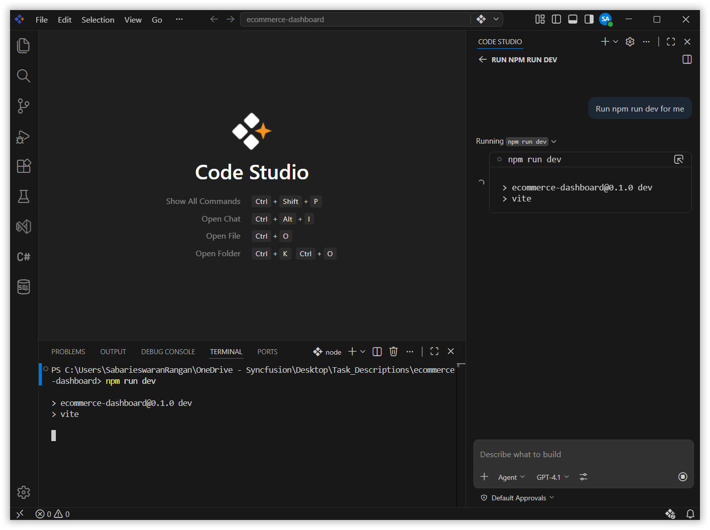
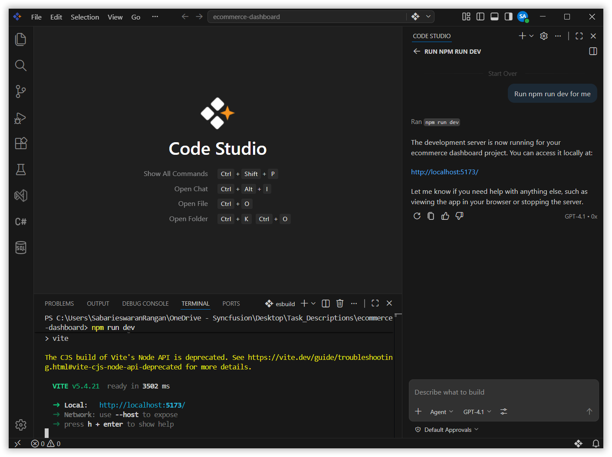
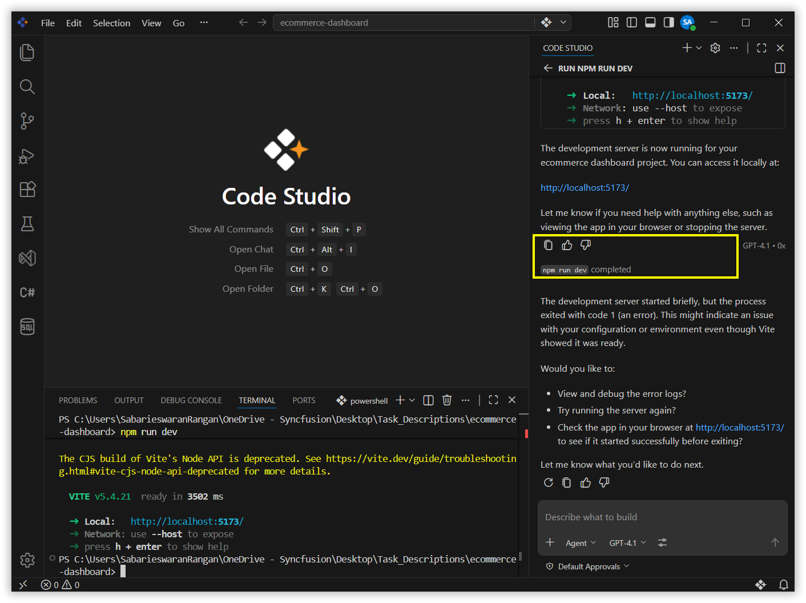

# Terminal Tools Improvements for Background Sessions

## Overview
When the Code Studio agent runs terminal commands, those commands sometimes move to the background, either because they are long-running tasks or because a foreground terminal timed out. Previously, the agent could only read the output of those background terminals but could not interact with them. This meant that if a background terminal was waiting for a password, a confirmation, or any other input, the agent was stuck.

This solves that problem with two key improvements:
1. **Send input to background terminals**: The agent can now send input directly to a background terminal, not just read from it.
2. **Background terminal notifications**: The agent is automatically notified when a background terminal finishes a command or needs user input, so it can take immediate action.

## What You Will Learn
By the end of this guide, you will understand:
- Why the agent previously struggled with background terminals and what has changed.
- How the agent can now send input to a background terminal that is waiting for a response.
- How to enable background terminal notifications so the agent never misses an important event in a running terminal.
- How the agent can automate full workflows across foreground and background terminals.

## Key Concepts
- **Background Terminal**: A terminal session that’s running, but not currently visible (for example, switched to a different tab or minimized).
- **Notification**: A pop-up or alert in Code Studio that warns you when something in the background terminal needs your attention (like needing a password or confirming an action).

## Steps

### Step 1: Ask the Agent to Run a Command via Chat
In the Code Studio chat panel, ask the agent to run a long-running terminal command. 

For example: Run npm run dev for me.

 

### Step 2: Chat Response Completes, Terminal Runs in Background
Once the agent has started the command and the chat response finishes, the `npm run dev` process continues running silently in the background terminal in the IDE. You can see it is still active in the Terminal panel, but the chat has moved on.

 

### Step 3: Agent Responds Immediately
As soon as you press `Ctrl + C`, the agent is automatically triggered by the background terminal notification. It detects that the process was interrupted and immediately responds in the chat — for example, letting you know the dev server was stopped, showing the final output, or asking if you want to restart it.

You do not need to go back to chat and ask the agent what happened. The notification fires instantly and the agent reacts on its own.

 

> **Note:**  
This same instant response also works for other terminal events, not just `Ctrl + C`. If the command completes successfully, throws an error, or asks for input (like a password prompt), the agent will be notified and respond right away. 
>
> For example:
> - A build script finishes → agent reports the result.
> - An SSH session asks for a password → agent sends the input automatically using `send_to_terminal`.
> - A process crashes → agent reports the error and suggests a fix. 

## What’s Next?
- [Generate Your First Code Change Using Agent](/code-studio/tutorials/generate-your-first-code-using-agent.md) — Guide the agent to implement and verify a small change end-to-end.
- [Fixing Bugs with AI](/code-studio/tutorials/fixing-bugs-with-ai.md) — Use the agent to identify, patch, and validate defects safely.
- [Compare AI Models for Different Tasks](/code-studio/tutorials/compare-ai-models.md) — Evaluate model quality, cost, and speed for your workflows.
