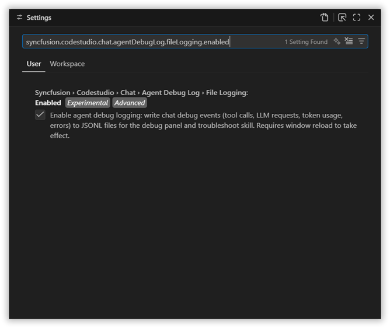
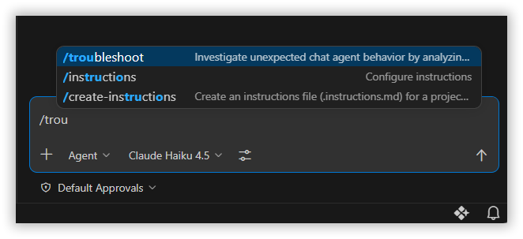
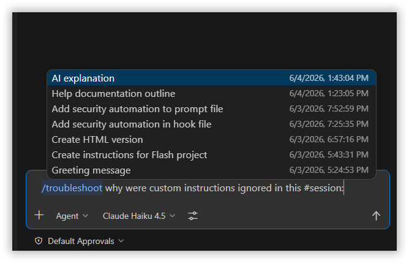
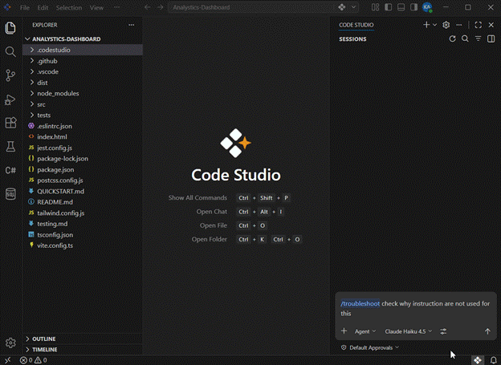

# Troubleshooting Previous Chat Sessions

## Overview 

The Troubleshoot Previous Chat Sessions, shows you how to analyze and resolve issues from past conversations without recreating them. By using the `/troubleshoot` command together with the session picker, you can reference earlier sessions and investigate unexpected behavior such as custom instructions, agent skills, prompts, and hooks being ignored, delayed responses, or tools not being triggered correctly.

This tutorial will guide you through the process of opening past sessions, diagnosing problems, and applying fixes so you can improve the reliability and performance of future chat interactions.

## Prerequisites 
- Enable debug logging — set ` syncfusion.codestudio.chat.agentDebugLog.fileLogging.enabled ` to `true` so detailed chat activity is recorded for troubleshooting.
- Have at least one previous chat session available to reference.

## What You Will Learn 

By completing this tutorial, you will be able to: 
- Access and reference previous chat sessions using the `/troubleshoot` command 
- Analyze agent debug logs to identify issues with: 

- Custom instructions, agent skills, prompts, and hooks are ignored or not applied

- Slow response times and performance  

- Tools not being invoked as expected  and interpret debug log information to diagnose common chat issues 

- Attach sessions as context using the Add Context menu 


## Steps to Troubleshoot Previous Sessions 

### Step 1: Enable Debug Logging 

- Open the Settings (`Ctrl+,` / `Cmd+,`) 

- Search for ` syncfusion.codestudio.chat.agentDebugLog.fileLogging.enabled ` 

- Toggle the setting to On for persistent file logging 

    

This ensures that detailed debug information is captured for future troubleshooting sessions. 

### Step 2: Use the /troubleshoot Command 
- Open the Chat view in Code Studio. This will be your current troubleshooting session where you'll diagnose past issues 

- In the chat input field, type: `/troubleshoot` command is recognized 
    

### Step 3: Reference a Previous Session - Using the Session Picker 

- After typing `/troubleshoot`, include `#session` in your prompt: 
 
   ```
   /troubleshoot why were custom instructions ignored in this #session:
   ```

- A session picker dialog will appear showing your previous chat sessions 
    
Browse through the list of sessions and select the one you want to investigate 

- The selected session will be attached to your current troubleshooting query 

### Step 4: Analyze the Troubleshooting Results 

Once you submit your troubleshooting query, Code Studio will analyze the debug logs from the selected session and provide insights such as: 

- Custom Instructions: Whether they were loaded and applied correctly 

- Tool Invocations: Which tools were called and their execution status 

- Response Times: Performance metrics and bottleneck identification 

- Agent Reasoning: Step-by-step breakdown of agent decisions 

- Error Logs: Any errors or warnings encountered during execution 

### Step 5: Review the analysis 

The troubleshoot skill will parse agent debug logs and return insights which tool calls ran, where custom instructions were ignored, or latency sources. Use these insights to adjust settings or reproduce the issue if needed. 




## What's Next 

After troubleshooting a previous session, consider these next steps: 

- Apply fixes the troubleshoot report recommends (update custom instructions, tool approvals, or agent settings), then run /troubleshoot session again to confirm the problem is resolved.  

- Regularly review chat logs for performance patterns. Update your chat configuration based on troubleshooting insights 

 