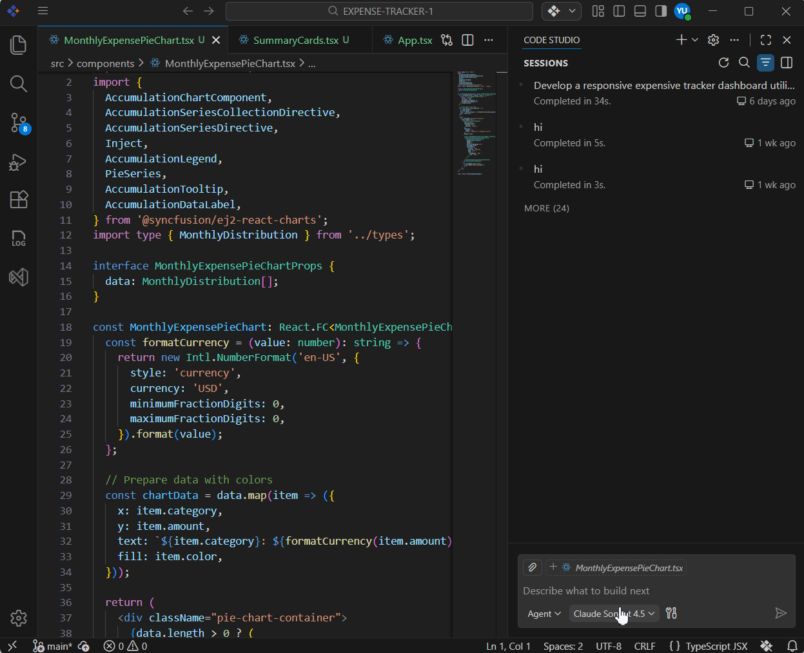
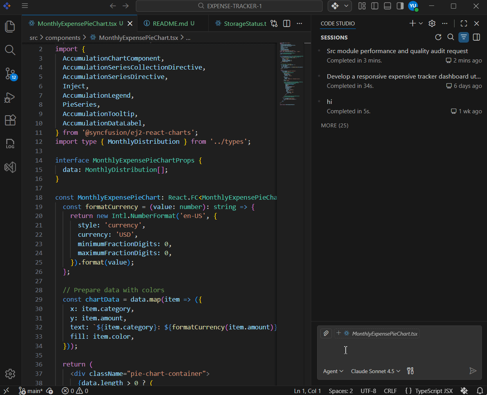

# Understanding Legacy Code Faster: Analyze Any Codebase with AI

## Overview

You just joined a new team—or took over a critical project. You're staring at thousands of lines of unfamiliar code with minimal documentation. And somehow, you're expected to maintain, fix, and improve this system without breaking anything.

**The real problem:** When developers can't quickly grasp what code does, every change becomes risky. New hires take weeks to get productive. Refactoring feels impossible. And the codebase keeps getting messier because no one wants to touch code they don't fully understand.

With Syncfusion Code Studio, you can understand any module in few minutes by asking intelligent questions and getting comprehensive answers about your entire codebase.

In this tutorial, you'll discover four powerful approaches:

- **Understand an Unfamiliar Module** — Get the big picture without reading everything
- **Find Performance and Quality Issues** — Discover hidden problems 
- **Plan Safe Refactoring** — Create a phased modernization strategy with clear risks

Each approach includes a copy-paste-ready prompt and real examples showing what Code Studio returns. Pick the one that matches your problem, and let's get started.

## Prerequisites

Before You Start, Let's make sure you're all set:

- Syncfusion Code Studio is installed and properly configured on your system. If you have not yet downloaded Code Studio, refer to [Install and Configure](/code-studio/getting-started/install-and-configuration) for step-by-step instructions.
- A project or folder open in Code Studio to analyze the codebase of that project.

## What You'll Learn

By the end of this tutorial, you'll be able to:

- ✓ Quickly understand unfamiliar modules without reading all the code
- ✓ Find performance and quality issues hidden in your codebase
- ✓ Plan safe refactoring with confidence


## Understand an Unfamiliar Module

If you need to understand what a module does, how it works, and what depends on it—without spending days reading code—ask Code Studio to analyze it. It will read the entire module and trace all connections to give you a clear summary: purpose, key functions, dependencies, and usage patterns.

Below is a complete analysis prompt you can copy and use to understand any module in your codebase.

### Example Prompt: Analyze a Legacy Module

```
@workspace I need to understand the [Modulename] module in our codebase.

1. What is the main purpose of this module?
   (Explain what problem it solves and why it exists)

2. What are the key functions and what do they do?
   (List the main functions/classes and their purpose)

3. What other modules depend on this?
   (Show me what imports or uses this module)

4. How is this module typically used throughout the codebase?
   (Show me 2-3 real examples of how it's called)

5. Any important patterns, security considerations, or edge cases I should know about?
   (Highlight things that could break if changed)
```
 

**What It Does:**

It reads the entire module and traces all connections, analyzes dependencies, identifies key patterns, and flags important behaviors that matter for maintenance.

## Find Performance and Quality Issues

If you suspect something is wrong (slow, buggy) but don't know where, ask Code Studio to audit your module for problems. It will analyze the code for common issues: performance bottlenecks, security risks, duplicated logic, and more. You get a prioritized list with specific recommendations to fix the worst problems.

Below is a complete audit prompt you can copy and use to identify quality and performance issues.

### Example Prompt: Audit Code for Issues

```
@workspace I want to audit the [Modulename] module for performance and quality issues.

Please analyze [Folderpath] and tell me:

1. List all database queries and where they're used
   (Example: database queries, API calls, file operations)

2. Flag any performance red flags
   (Loops that could timeout, redundant operations)

3. What are the slowest operations in this module?
   (Identify bottlenecks that affect user experience)

4. Security considerations
   (hardcoded secrets, unvalidated input)

5. Specific recommendations to fix the worst problems
   (Prioritize by impact and effort)
```
 

**What It Does:**

It scans the module for performance, security vulnerabilities, and optimization opportunities. It prioritizes issues by impact and provides actionable fixes.

## Plan Safe Refactoring and Modernization

If you want to improve code but need a safe, phased plan that won't break anything, ask Code Studio to analyze your current architecture and create a modernization strategy. It will identify outdated patterns, recommend modern approaches, break refactoring into manageable phases, and show you how to maintain compatibility during migration.

Below is a complete modernization prompt you can copy and use to create a phased improvement plan.

### Example Prompt: Plan Code Modernization

```
@workspace I want to refactor and modernize the [MODULE-NAME] module.

Please analyze the code and provide:

1. What does [MODULE-NAME] currently do?
   (High-level summary of purpose and functionality)

2. What modern approaches or frameworks could replace or improve this?
   (What's the current best practice in the industry?)

3. Break down the refactoring into safe, manageable phases
   (What can we change first without breaking anything?)

4. For each phase, what are the risks and how do I minimize them?
   (What could go wrong? How do we test?)

5. How would I maintain backward compatibility during the migration?
   (How can old code keep working while we transition?)
```
 

**What It Does:**

It analyzes the current architecture, identifies outdated patterns, researches modern alternatives, and creates a phased plan with identified risks and backward compatibility strategy.
