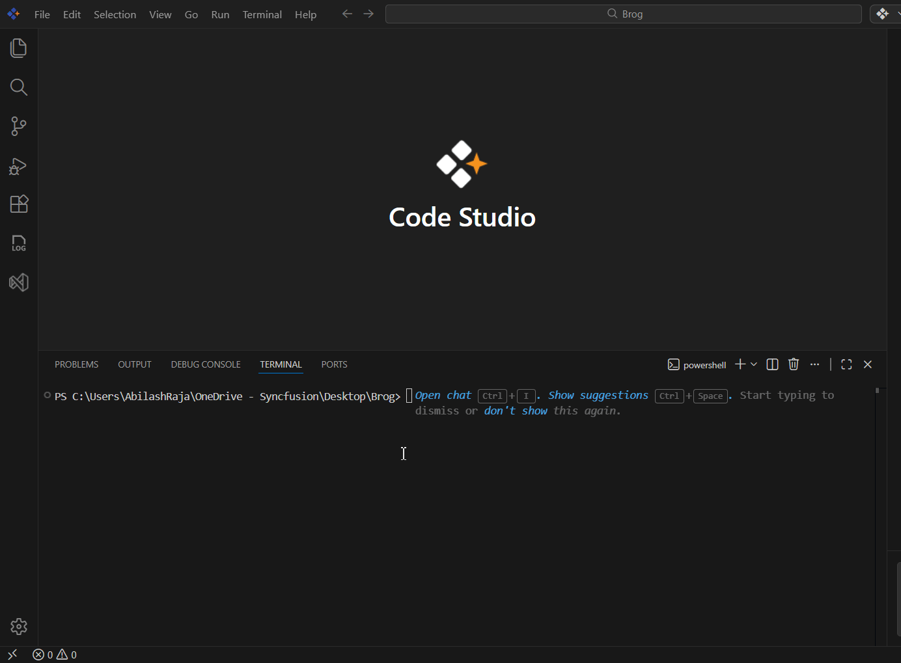

# Build a Project with OpenSpec in Syncfusion Code Studio

## Overview 

This tutorial will guide you through using OpenSpec inside Syncfusion Code Studio to create, plan, and execute AI-assisted changes in a safe, structured, and predictable way. 

OpenSpec helps you avoid common AI coding problems like hallucinations, lost context, and unstructured changes. Instead of letting AI make random edits, you'll learn a workflow that plans everything first, implements changes step-by-step, and organizes all work in markdown files you can review and track.

By the end, you'll understand how to build your first project using OpenSpec commands, review AI-generated plans before they run, and manage code changes like a pro. Let's get started!

---

## What is OpenSpec?

**OpenSpec** is a structured workflow tool that helps you work with AI to build software more predictably. Think of it as a project manager for AI coding.

### The Problem It Solves

When you ask AI to "build a feature," the AI might:
- Make changes to files you didn't expect
- Forget what you discussed earlier in the conversation
- Hallucinate features that don't exist
- Leave your project in a messy, half-finished state

### The OpenSpec Solution

OpenSpec fixes this by introducing a **four-step workflow**:

1. **Explore** (optional) - Brainstorm ideas without making changes
2. **Propose** - Create a detailed plan in markdown files (proposal, design, tasks, specs)
3. **Apply** - Execute the plan step-by-step, following the specs exactly
4. **Archive** - Organize completed work into your project's documentation

All plans are stored as markdown files in an `openspec/` folder, so you can review, edit, and track every change before and after it happens.

**Key Concepts You'll Use:**
- **Proposal** - A summary document describing what you want to build
- **Design** - Technical details about how it will be built
- **Tasks** - Step-by-step checklist of work to complete
- **Specs** - Detailed specifications for each file or component
- **Change folder** - A temporary directory containing all files for a proposed change
- **Spec deltas** - The differences between current specs and proposed changes

> **Note:** You don't need to understand all these concepts right now. You'll see them in action as you follow the tutorial.

---

## Prerequisites

Before beginning, ensure you have the following:

- **Syncfusion Code Studio** installed and properly configured on your system. If you haven't downloaded Code Studio yet, refer to [Install and Configure](../getting-started/install-and-configuration) for step-by-step instructions.
- **A project or folder** opened in Code Studio (you can create an empty test folder if needed).
- **Node.js 20 or higher** installed on your system. OpenSpec runs on top of Node.js, so this is required.

> **Tip:** To check your Node.js version, open a terminal and run `node --version`. If you see a version number like `v20.x.x` or higher, you're good to go.

---

## What You Will Learn

By the end of this tutorial, you'll be able to:

- Understand what OpenSpec is and why it makes AI coding more reliable
- Install and initialize OpenSpec in any project
- Use the four core OpenSpec commands (`/opsx:explore`, `/opsx:propose`, `/opsx:apply`, `/opsx:archive`)
- Review AI-generated proposals and designs before any code is written
- Implement changes safely by following a structured workflow
- Organize completed work in your project's spec folder
- Verify your setup is working correctly

---

## Steps to Build Your First Application Using OpenSpec

### Step 1: Install and Configure OpenSpec

Let's get OpenSpec set up in your project. This is a one-time setup process.

#### 1. Open Syncfusion Code Studio

Launch Syncfusion Code Studio and open your project folder. If you don't have a project yet, create a new empty folder and open it in Code Studio.

#### 2. Install OpenSpec Globally

Open a terminal in Code Studio (View > Terminal or `` Ctrl+` ``) and run:

```bash
npm install -g @fission-ai/openspec@latest
```

This installs the OpenSpec command-line tool globally on your system so you can use it in any project.

> **Tip:** The `-g` flag means "global" - this lets you run `openspec` commands from anywhere.

**✅ Expected Result:** You should see npm installing packages, and the process should complete without errors.

#### 3. Initialize OpenSpec in Your Project

In the same terminal, run:

```bash
openspec init
```

This creates an `openspec/` directory in your project with the following structure:
- `openspec/specs/` - Where finalized specifications are stored
- `openspec/changes/` - Where active and archived changes live
- `openspec/config/` - Configuration files

**✅ Expected Result:** You should see a new `openspec/` folder appear in your project explorer.

#### 4. Select Your AI Extension

The initialization wizard will ask you to choose an AI extension. Since Syncfusion Code Studio includes GitHub Copilot integration, select the **GitHub Copilot** option.


**✅ Expected Result:** The wizard completes successfully, and you see a confirmation message.

> **Note:** If you don't see GitHub Copilot as an option, make sure you have the GitHub Copilot extension enabled in Code Studio.

---

### Step 2: Understand the OpenSpec Command Workflow

Before we start building, let's understand the four commands you'll use. All OpenSpec commands are typed in the **Code Studio chat interface** (not the terminal).

Here's the workflow at a glance:

| Command | Purpose | When to Use |
|---------|---------|-------------|
| `/opsx:explore` | Brainstorm and discuss ideas | When you're not sure what to build yet |
| `/opsx:propose` | Create a detailed change plan | When you're ready to plan your feature |
| `/opsx:apply` | Implement the planned changes | After reviewing and approving the proposal |
| `/opsx:archive` | Finalize and organize work | After verifying the changes work correctly |

Let's walk through each command step-by-step.

---

### Step 3: Explore Ideas (Optional)

This step is **optional** but helpful when you're brainstorming or exploring different approaches.

#### What This Command Does

`/opsx:explore` lets you have a conversation with the AI without making any file changes. Use it to:
- Discuss different approaches to solving a problem
- Ask questions about your codebase
- Brainstorm features before committing to a plan
- Understand tradeoffs between different solutions

> **Note:** This command only provides suggestions in the chat window—it won't create any files or make any changes to your project.

#### How to Use It

1. Open the Code Studio chat interface
2. Type `/opsx:explore` followed by your question or idea

**Example Prompts:**
```
/opsx:explore What's the best way to add authentication to a Node.js API?
/opsx:explore Should I use REST or GraphQL for my project's API?
/opsx:explore How can I structure a React app with multiple dashboards?
```


**✅ Expected Result:** The AI responds with suggestions, comparisons, or explanations in the chat window. No files are created or modified.

> **Tip:** Use explore when you want to think through options before committing to a plan. It's like having a conversation with a technical advisor.

---

### Step 4: Create Your Change Plan (Propose)

Now let's create a structured plan for your first feature. This is where OpenSpec really shines.

#### What This Command Does

`/opsx:propose` generates a complete change folder with multiple markdown files:
- **proposal.md** - High-level summary of what you want to build
- **design.md** - Technical design decisions and architecture
- **tasks.md** - Checklist of specific tasks to complete
- **spec-deltas/** - Detailed specifications for each file that will be created or modified

This gives you a full blueprint to review before any code is written.

#### How to Use It

1. Open the Code Studio chat interface
2. Type `/opsx:propose` followed by a clear description of what you want to build

**Example Prompts:**
```
/opsx:propose Create a REST API with user authentication using Express and JWT
/opsx:propose Build a React dashboard with a data table and charts
/opsx:propose Add a login page with email and password validation
```

> **Tip:** Be specific in your requirements. The more details you provide, the better the AI can plan your changes.

#### Step-by-Step Process

**1. Enter Your Requirements**

Type your proposal command with your specific requirements as shown below:


**2. Wait for the AI to Generate Files**

The AI agent will analyze your request and create several markdown files in your `openspec/changes/` directory.

**3. Review the Generated Files**

Open the change folder and review the files the AI created:


> **Important:** Always review these files carefully! This is your chance to catch any misunderstandings before code is written. If something looks wrong, you can modify the markdown files directly or start over with a better prompt.

### Step 5: Implement the Plan (Apply)

Once you've reviewed and approved the proposal, it's time to implement it.

#### What This Command Does

`/opsx:apply` tells the AI to execute the tasks defined in your `tasks.md` file, one by one, following the specifications in the `spec-deltas/` folder. The AI will:
- Create new files as specified
- Modify existing files according to the specs
- Follow the exact plan you reviewed in the proposal

This keeps the implementation process predictable and safe—no surprises!

#### How to Use It

**1. Start the Implementation**

In the Code Studio chat interface, type the apply command:

```
/opsx:apply
```


**✅ Expected Result:** The AI agent begins executing tasks one by one. You'll see progress updates in the chat as each task completes.

### Step 6: Finalize and Organize (Archive)

After verifying that everything works correctly, clean up your project by archiving the completed change.

#### What This Command Does

`/opsx:archive` performs two important actions:
1. **Moves spec files** from `openspec/changes/[change-folder]/spec-deltas/` to the main `openspec/specs/` folder
2. **Archives the change folder** by moving it from `openspec/changes/` to `openspec/changes/archive/`

This keeps your project organized and creates a permanent record of what was built.

#### How to Use It

**1. Run the Archive Command**

In the Code Studio chat interface, type:

```
/opsx:archive
```


**✅ Expected Result:** The change folder moves to the archive directory, and specs merge into the main specs folder.

**2. Verify the Organization**

Check your `openspec/` folder structure:


You should see:
- **openspec/specs/** - Now contains your new specifications

**✅ Expected Result:** Your project is cleanly organized, with specs in the main folder and completed change documentation in the archive.

> **Note:** Archived changes serve as a permanent record of what was built and why. This is valuable for team collaboration and future reference.

---

## Verification

Let's make sure everything went smoothly! Here's your verification checklist:

**OpenSpec is Set Up?**
  - Look for the `openspec/` folder in your project. It should have `specs/`, `changes/`, and `config/` folders inside it.

**Commands Are Working?**
  - Try typing `/opsx:explore` in the chat. Does it respond without errors? This means OpenSpec is working!

**Files Were Created?**
  - If you ran a proposal, check the `openspec/changes/` folder. Do you see your change folder with proposal, design, and task files?

**Changes Were Applied?**
  - Open your project files. Do you see the new code that was created? Does your application run without errors?

**Archive is Organized?**
  - After archiving, check `openspec/changes/archive/` and `openspec/specs/`. Your completed work should be there!

**Congratulations!** You've just completed your first project with OpenSpec. Take a moment to appreciate what you've done—you've learned a structured way to work with AI safely and predictably!

---

## Optional: Customize Commands for Your Project

OpenSpec allows you to configure custom commands based on your project's specific needs. This is an **advanced feature** and is not required to use OpenSpec effectively—the default commands work well for most projects.

If you want to tailor the workflow (for example, adding custom validation steps or integrating with your team's specific processes), you can create custom command configurations.



> **Note:** Custom commands are useful for teams with established workflows, but beginners should master the four core commands first.

For more information on customizing commands, refer to the OpenSpec documentation or advanced configuration guides.

---

## What's Next? Continue Your Learning Journey

You've mastered the basics of OpenSpec in Code Studio! Here are some recommended next steps to expand your skills:

**Ready to explore Agent mode?**
→ Learn how to combine OpenSpec with autonomous AI coding in [Generate Your First Code Using Agent](./generate-your-first-code-using-agent)

**Want to customize your Code Studio environment?**
→ Discover advanced settings and personalization options in [Configure Code Studio](../reference/configure-the-code-studio)

**Curious about building UI components?**
→ Try [Build UI Using Syncfusion UI Builder](./build-ui-using-syncfusionui-builder) for rapid interface development

**Need help managing your AI workflow?**
→ Check out [Manage Chat Sessions](../how-to-guides/manage-chat-session) to organize your conversations


> **Tip:** The best way to learn is by doing. Try building a small project using OpenSpec to solidify these concepts!
