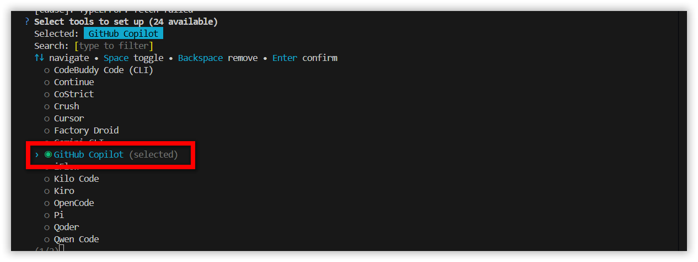
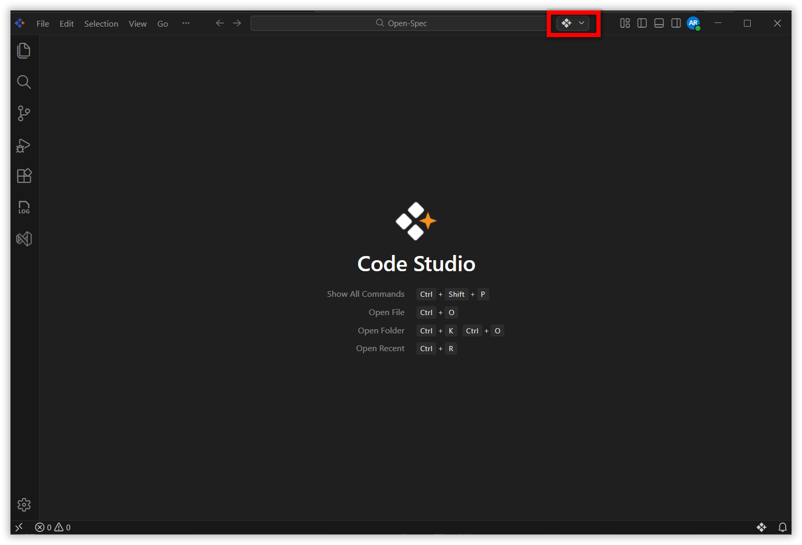
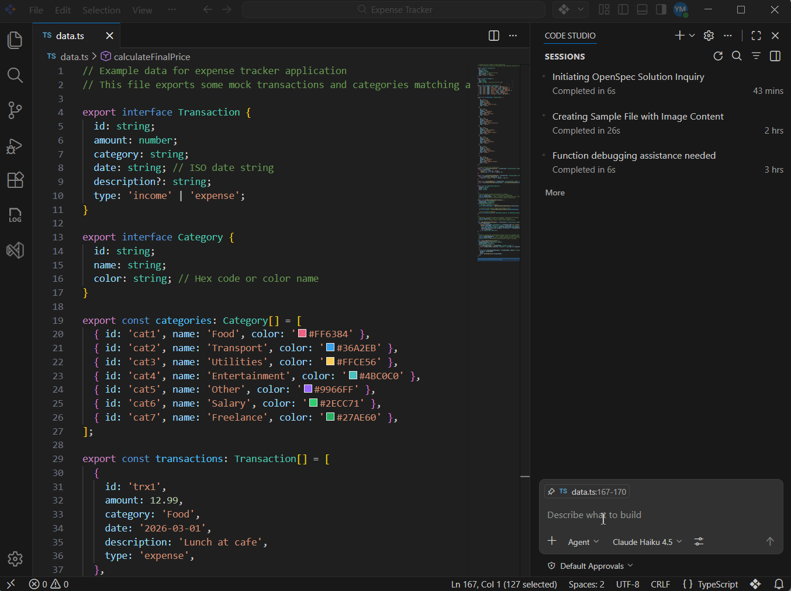
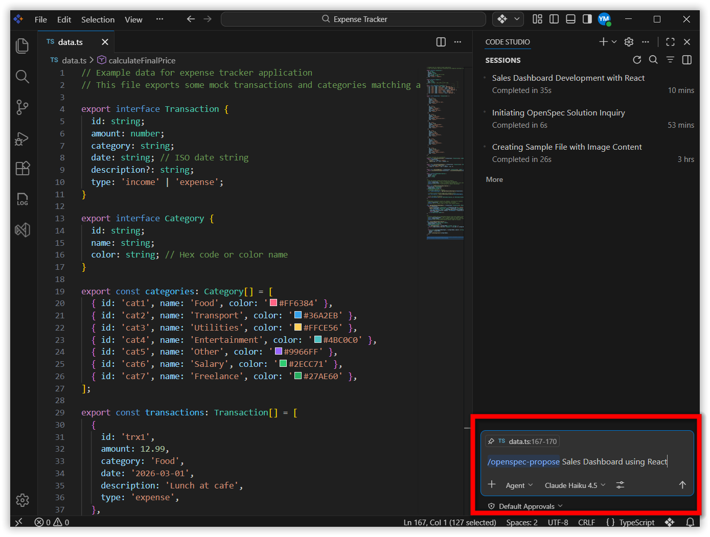
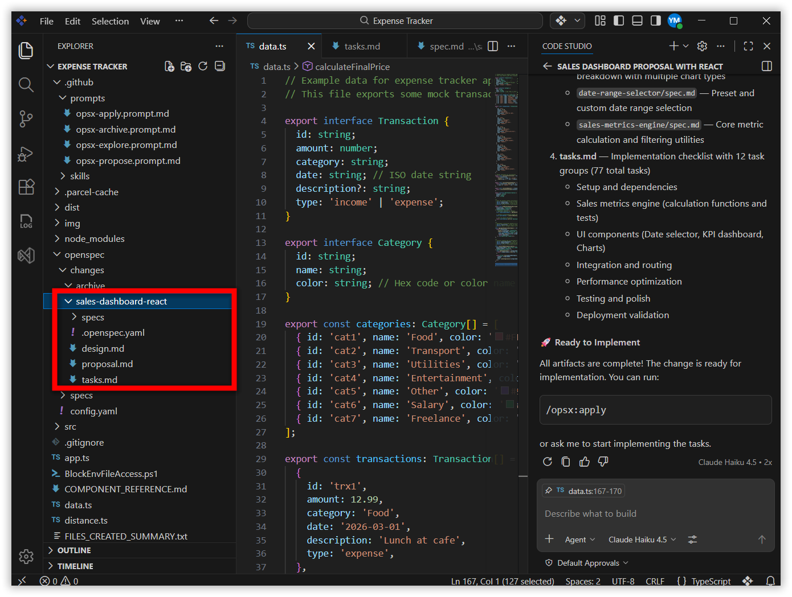
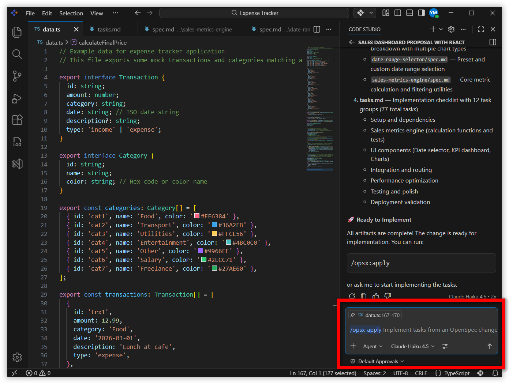
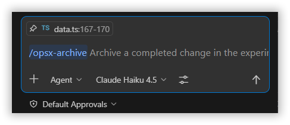
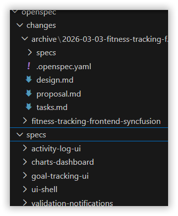

# Using OpenSpec Inside Syncfusion Code Studio: A Complete Guide

## Overview 

This tutorial will guide you through using **OpenSpec** inside **Syncfusion Code Studio** to create, plan, and execute AI (Artificial Intelligence)-assisted changes in a safe, structured, and predictable way. 

[**OpenSpec**](https://github.com/Fission-AI/OpenSpec?tab=readme-ov-file) is a structured workflow tool that helps you work with AI to build software more predictably. Think of it as a project manager for AI coding. It helps you avoid common AI coding problems like **hallucinations, lost context, and unstructured changes**. Instead of letting AI make random edits, you'll learn a workflow that plans everything first, implements changes step-by-step, and organizes all work in markdown files you can review and track.

OpenSpec introduces a **four-step workflow** using slash commands. All OpenSpec commands are typed in the **Chat Panel** (not the terminal):

| Command         | Purpose                       | When to Use                                |
| --------------- | ----------------------------- | ------------------------------------------ |
| `/opsx:explore` | Brainstorm and discuss ideas  | When you're not sure what to build yet     |
| `/opsx:propose` | Create a detailed plan        | When you're ready to plan your feature     |
| `/opsx:apply`   | Implement the planned changes | After reviewing and approving the proposal |
| `/opsx:archive` | Finalize and organize work    | After verifying the changes work correctly |

By the end, you'll understand how to build your first project using OpenSpec commands, review AI-generated plans before they run, and manage code changes like a pro.

> **Note:** For a complete reference of all OpenSpec slash commands, see the [OpenSpec Slash Commands Documentation](https://github.com/Fission-AI/OpenSpec/blob/main/docs/commands.md).

---

## Prerequisites

Before beginning, ensure you have the following:

- **Syncfusion Code Studio** installed and properly configured on your system. If you haven't downloaded Code Studio yet, refer to [Install and Configure](/code-studio/getting-started/install-and-configuration) for step-by-step instructions.
- **A project or folder** opened in Code Studio (you can create an empty test folder if needed).
- **[Node.js 20](https://nodejs.org/) or higher** installed on your system. OpenSpec runs on top of Node.js, so this is required.

> **Tip:** To check your Node.js version, open a terminal and run `node --version`. If you see a version number like `v20.x.x` or higher, you're good to go.

---

## What You Will Learn

By the end of this tutorial, you'll be able to:

- Understand what OpenSpec is and why it makes AI coding more reliable
- Install and initialize OpenSpec in any project
- Use the four core OpenSpec commands (`/opsx:explore`, `/opsx:propose`, `/opsx:apply`, `/opsx:archive`)
- Review AI-generated proposals and designs before any code is written
- Implement changes safely by following a structured workflow
- Organize completed work in your project's spec folder
---

## Steps to Build Your First Application Using OpenSpec

### Step 1: Install and Configure OpenSpec

1. Open the integrated **Terminal** in Code Studio by going to `View` > `Terminal` in the menu, or press `` Ctrl+` `` (Windows/Linux) or `` Cmd+` `` (Mac). Once the **Terminal** opens at the bottom of your Code Studio window, type the following command and press `Enter` to install OpenSpec globally on your system:

```bash
npm install -g @fission-ai/openspec@latest
```

> **Tip:** The `-g` flag means "global" — this installs OpenSpec on your entire system so you can use it in any project folder.

2. Initialize OpenSpec in your current project by typing the following command in the same terminal and pressing `Enter`:

```bash
openspec init
```
3. The initialization wizard will ask you to choose an AI extension. Since Syncfusion Code Studio includes GitHub Copilot integration, select the **GitHub Copilot** option:



This creates the following directory structure in your project:

**`openspec/` folder:**
- `openspec/specs/` — Where finalized specifications are stored
- `openspec/changes/` — Where active and archived changes live
- `openspec/config/` — Configuration files

**`.github/` folder:**
- `.github/prompts/` — Contains prompt files that define how each slash command behaves
- `.github/agent/` — Contains skill files that provide additional capabilities for slash commands

> **Note:** For detailed information about the folder structure and configuration, see the [OpenSpec Documentation](https://github.com/Fission-AI/OpenSpec?tab=readme-ov-file).


You should see new `openspec/` and `.github/` folders in your project explorer, and the wizard should complete successfully with a confirmation message.

### Step 2: Explore Ideas (Optional)

Use `/opsx:explore` to brainstorm and discuss ideas with the AI before making any actual changes to your project. This command helps you explore different approaches and understand your options without creating or modifying any files.

Open the **Chat Panel** by pressing `Ctrl+Alt+B` (Windows/Linux) or `Cmd+Alt+B` (Mac), or click the Code Studio icon in the toolbar. Then type `/opsx:explore` in the **Chat Panel** followed by your question. For example:



```
/opsx:explore Sales Dashboard using React
```



The AI will provide suggestions and explanations in the chat. No files will be created or modified.

### Step 3: Create Your Change Plan (Propose)

Use `/opsx:propose` to create a detailed plan for your feature. This command generates a complete change folder with markdown files including proposal, design, tasks, and specifications for each file that will be created or modified.

Type `/opsx:propose` followed by a clear description of what you want to build in the **Chat Panel**. For example:

```
/opsx:propose Sales Dashboard using React
```



The AI will generate several markdown files in your `openspec/changes/` directory. Open the change folder to review the generated files:



**Understanding What Was Generated:**

The files you see represent OpenSpec's structured approach to planning changes:

- **Proposal** — A summary document describing what you want to build
- **Design** — Technical details about how it will be built
- **Tasks** — Step-by-step checklist of work to complete
- **Specs** — Detailed specifications for each file or component
- **Change folder** — The directory containing all these files for this specific change

Review these files carefully before proceeding to the next step. You can modify the markdown files directly if needed.

### Step 4: Implement the Plan (Apply)

Use `/opsx:apply` to implement the plan you created in Step 3. This command tells the AI to execute the tasks defined in your `tasks.md` file, following the specifications exactly.

Type `/opsx:apply` in the **Chat Panel**. For example:

```
/opsx:apply
```



The AI will begin executing tasks one by one. You'll see progress updates in the chat as each task completes.

### Step 5: Finalize and Organize (Archive)

Use `/opsx:archive` to finalize your work after verifying that everything functions correctly. This command moves spec files to the main `openspec/specs/` folder and archives the change folder to `openspec/changes/archive/`, keeping your project organized.

Type `/opsx:archive` in the **Chat Panel**. For example:

```
/opsx:archive
```



Check your project structure to verify the archiving worked correctly:



**What you should see:**
- Spec files moved to `openspec/specs/` (main specs folder)
- Change folder archived to `openspec/changes/archive/`
- Your project is now cleanly organized and ready for the next feature!

## What's Next

You've mastered the basics of OpenSpec in Code Studio! Here are some recommended next steps to expand your skills:

- Learn how to combine OpenSpec with autonomous AI coding in [Generate Your First Code Using Agent](/code-studio/tutorials/generate-your-first-code-using-agent).
- Check out [Manage Chat Sessions](/code-studio/how-to-guides/manage-chat-session) to organize your conversations.
- For advanced users, learn about customizing OpenSpec commands in the [OpenSpec Commands Documentation](https://github.com/Fission-AI/OpenSpec/blob/main/docs/commands.md).
