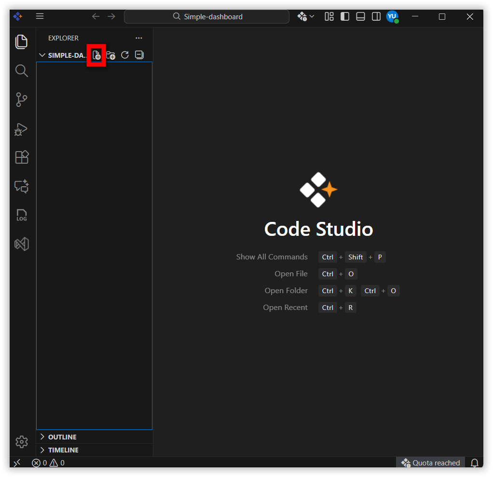
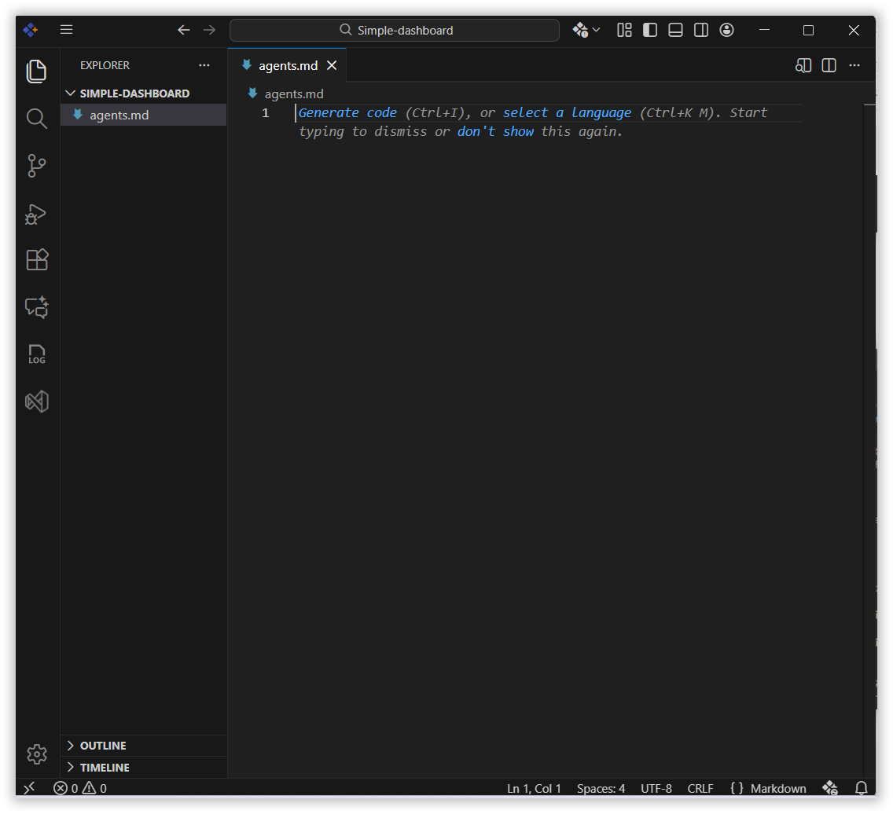
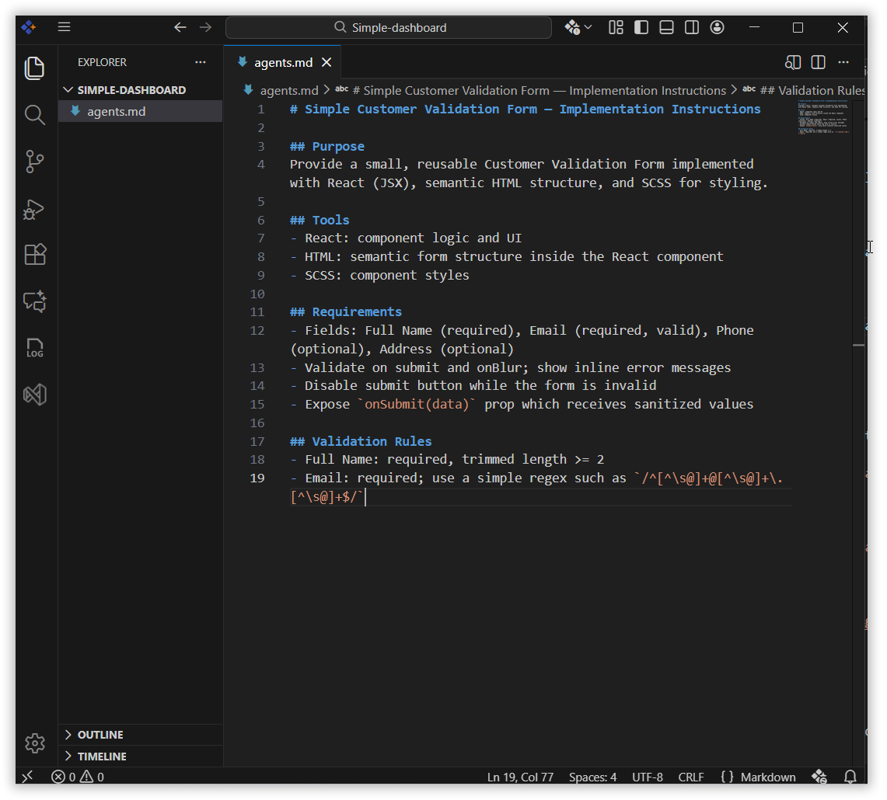
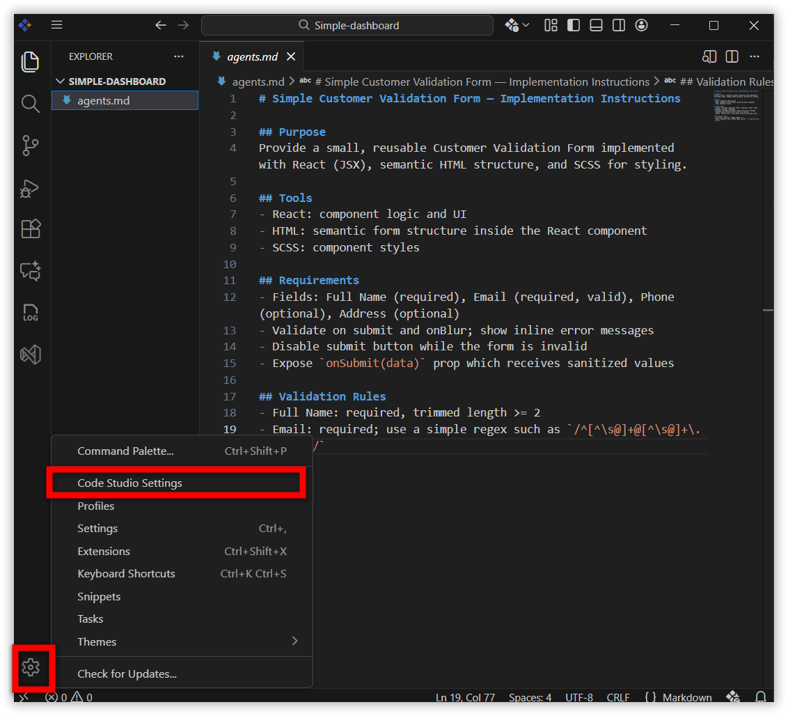
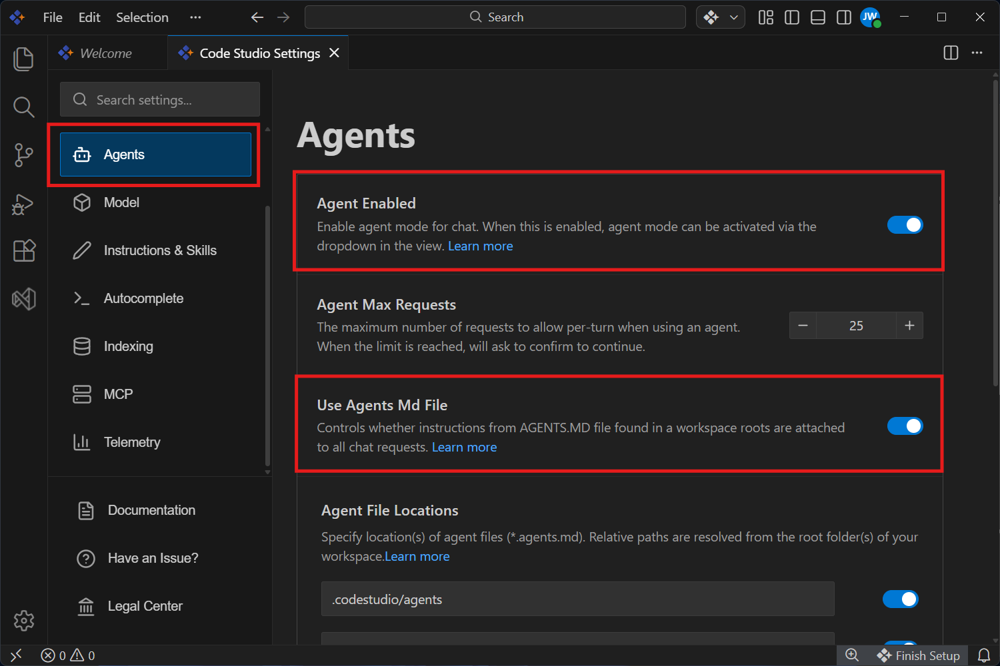
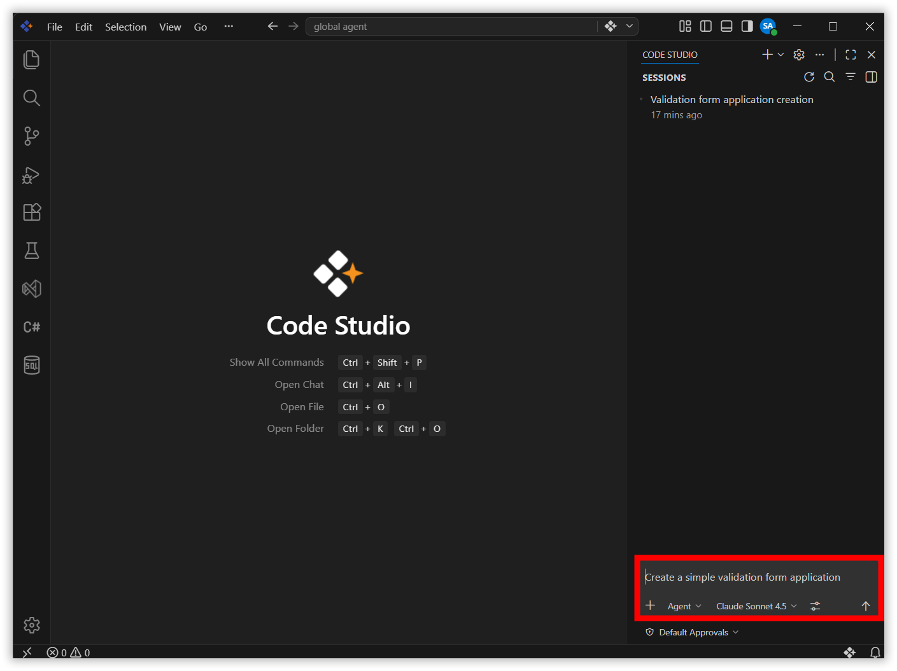
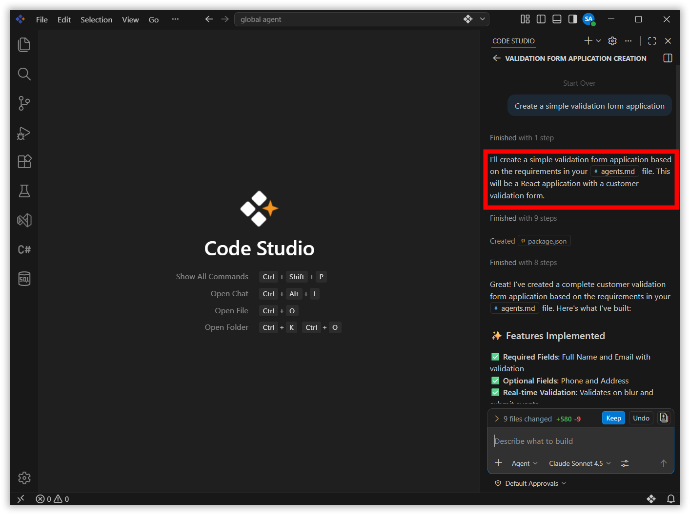

# Global Agents

## Overview
Global Agent refers to agents.md, an open-source, standardized file format designed to streamline collaboration between AI coding agents in **Syncfusion® Code**. It serves as a centralized instruction manual, similar to a `README.md`, but specifically tailored for machine interpretation and execution. By consolidating setup instructions, testing protocols, and coding guidelines into a single file, Global Agent simplifies workflows and ensures consistency across projects.  

## Use Cases
- Team Collaboration: Standardizes coding guidelines and workflows across multiple developers, ensuring AI agents interpret instructions consistently.

- AI-Assisted Code Reviews: Coding guidelines defined in agents.md help AI agents enforce style checks and best practices during reviews

- Testing & Validation: Embeds test cases and quality checks directly into agents.md, enabling automated, uniform validation.

- Cross-Project Reuse: Allows teams to reuse agents.md  across different projects, speeding up knowledge transfer and reducing duplication.

## How to Configure Global Agents
Using Global Agent in BoldCreate is straightforward:

1. Click Create File

    

2. Create an `agents.md` file in the root folder.

    

3. Add the proper instructions inside the `agents.md` file.

    

4. Go to Settings and click the BoldCreate Settings option.

    

5. Enable the **Agent Enabled** and **Use Agent MD File** option in the agents section.
    

6. Open a chat and send message.

    

7. The `agents.md` file will then be used as a reference.

    

## Related Features

- [Custom Agent](/code/customize/custom-agents) - Pre-configured AI agents for specific tasks that follow fixed rules, tools, and behaviors-ensuring consistent, repeatable workflows across teams.

- [Custom Prompt](/code/customize/custom-prompt) - Prompt files are on-demand, reusable Markdown prompts that standardize specific development tasks like code generation and reviews.