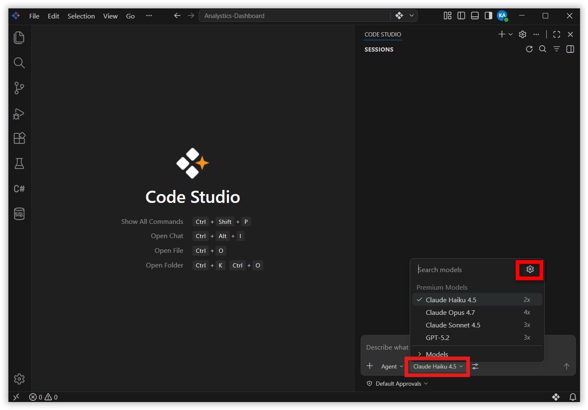
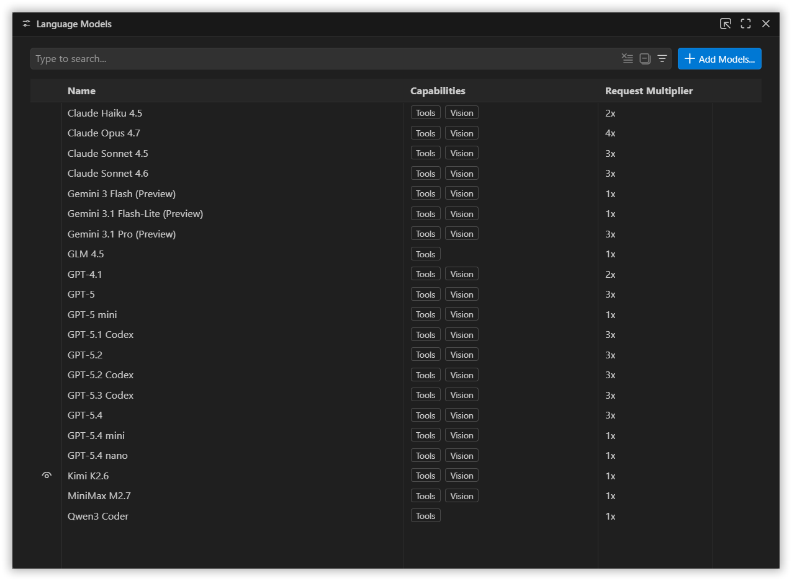
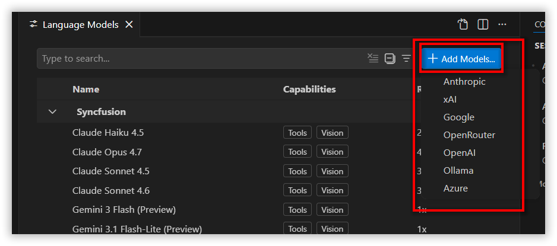
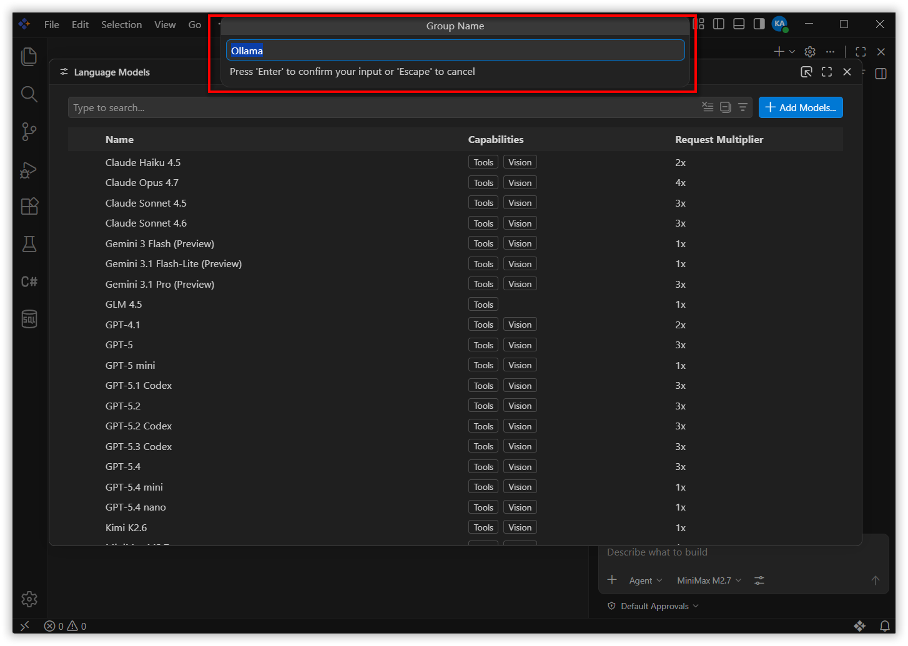
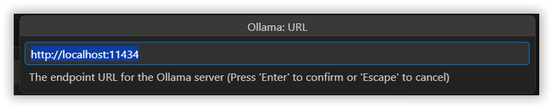
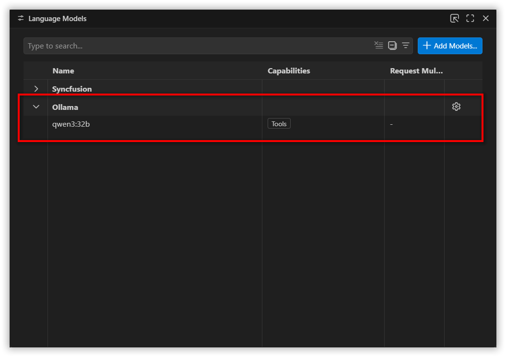
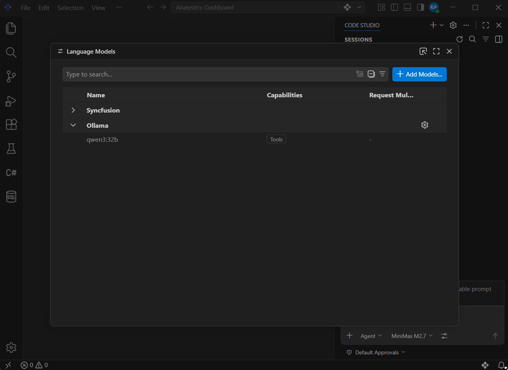
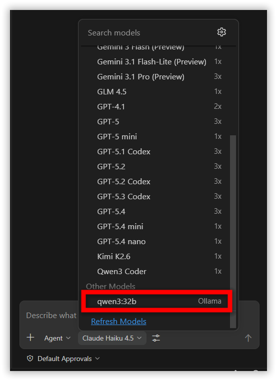

# How to Configure Ollama Models in BoldCreate
 
## Overview

This guide provides step-by-step instructions to configure and use **Ollama** models inside **BoldCreate**. By connecting Ollama, you can run powerful open-source language models locally on your machine. This enables private, offline-capable, and cost-free AI assistance without relying on external cloud providers or API keys.
 
## When to Use
- When you want free, unlimited usage with no API costs or rate limits – perfect for long coding sessions or agent workflows.

- When you prefer to work completely offline – your code or data must never leave your computer (sensitive projects, company policy, or offline work).

> **Note:**
The Ollama models are connected directly from Ollama (outside of Syncfusion). Model usage, behavior, performance, license terms, and any restrictions are the sole responsibility of the user. It is strongly recommended to review the corresponding model's official usage policy, license, and intended use cases before configuring and using it in your projects.
 
## Prerequisites
Before starting, ensure you have system requirements to install open-source models.

- Refer to this documentation for system requirements to install Ollama
  - [macOS](https://docs.ollama.com/macos)
  - [Windows](https://docs.ollama.com/windows)

- Minimum hardware guidance (approximate):
  - 8–16 GB RAM for small models; 32+ GB recommended for large models.
  - GPU recommended for best performance on large models (check provider docs for GPU requirements).

> **Note:** Ollama local models are optimized for macOS, where they perform well. They may work on high-configuration Windows machines, but their performance cannot be guaranteed. 
 
## Download and Install steps
Refer the ollama's official documentation below to download and install Ollama on your machine.
 
- [Ollama](https://docs.ollama.com/quickstart)
 
## Quick checklist before configuring

- At least one model downloaded/installed locally.

- Recommended models – [deepseek-r1](https://ollama.com/library/deepseek-r1), [qwen 2.5](https://ollama.com/library/qwen2.5)

- BoldCreate up-to-date (latest stable release recommended).
 
> **Note:** Ollama models currently work in Ask and Edit mode only in BoldCreate.
 
## Configure Ollama Model in BoldCreate
- Click the model dropdown in chat box and click 'Manage Models' option.

  
 
- A Language Models page will open. This page provides information about the configured Providers and their models in BoldCreate.

   

- Click the **Add Models** button. Choose Ollama from the list .

   
   
- Enter the Group Name. The group name is used to organize and display a set of models under a specific provider, based on the associated API key.

   

- Enter your **localhost URL** to configure the model.
  

- The available locally **installed models** will appear below the group name. 

  

- Make sure you enable the `Show in the chat model picker` icon in front of the model name to make it appear in the model dropdown.

  

- The selected Ollama model will now automatically appear in the main **model dropdown** under the **Other Models** section and you can start using it right away.

  
