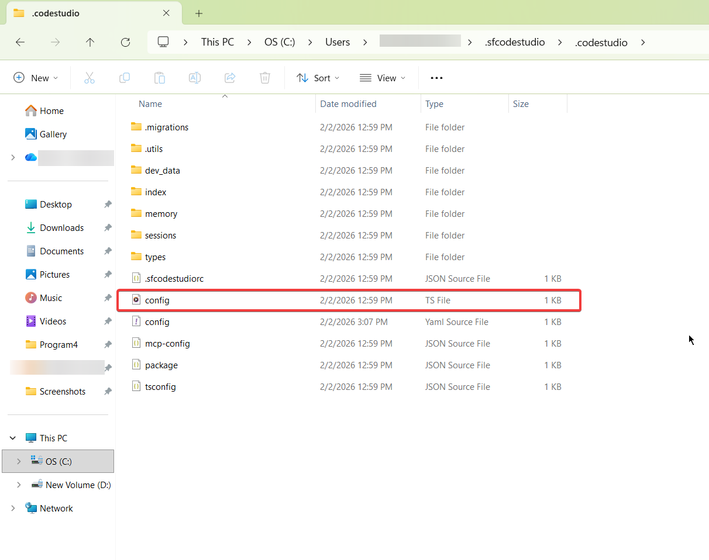
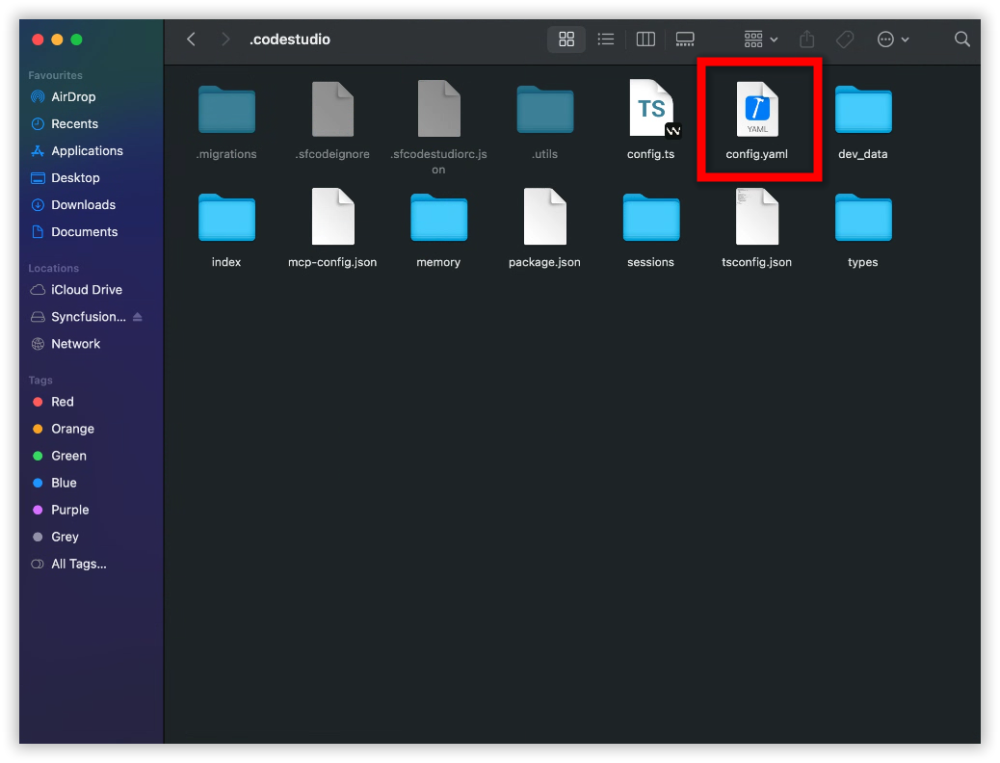
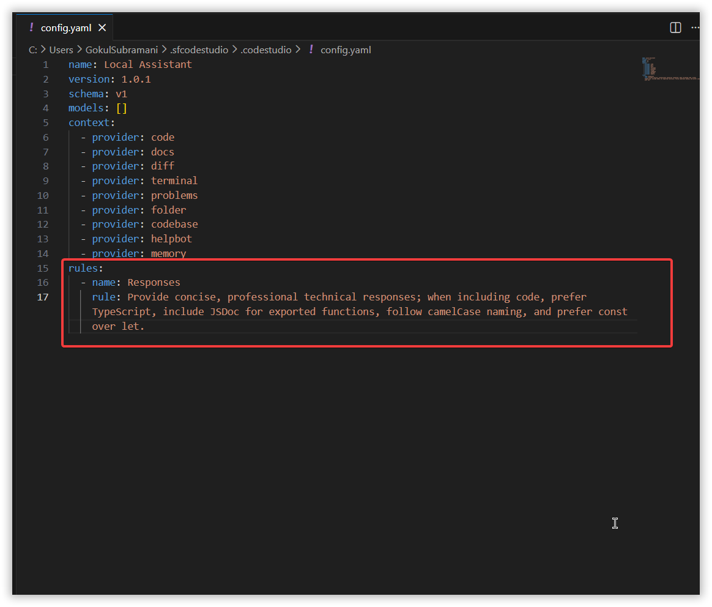
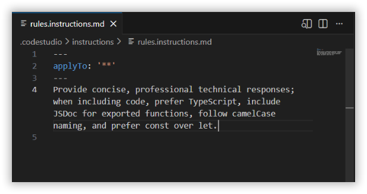
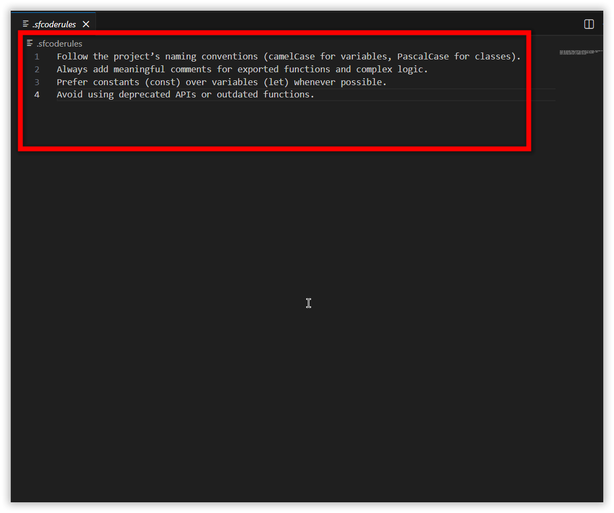
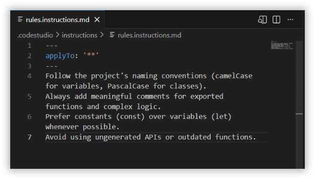
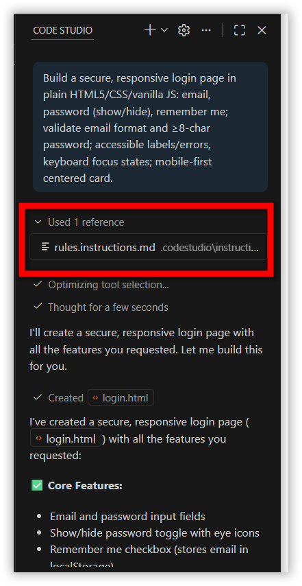

# How to Migrate BoldCreate Rules to Instructions

## Problem Summary
In versions prior to 2.0.0, BoldCreate stored rule configurations in two legacy formats: `config.yaml` and `.boldcreaterules`. Starting from version 2.0.0, these formats are no longer supported. All rule definitions must now be migrated to the Custom Instructions file structure to ensure BoldCreate continues applying them correctly.

## Possible Causes
- In earlier versions of BoldCreate, rules were stored in legacy locations (`config.yaml` and `.boldcreaterules`) and BoldCreate automatically used them.  Starting from version 2.0.0, these legacy files are no longer detected or processed.

## Resolution Steps

### Step 1: Create a New Instruction File

- Open BoldCreate.
- Create a new instruction file following the [Custom Instructions](/code/customize/custom-instructions)

> Note: Custom Instructions are supported only in version 2.0.0 or later.  If you are using an older version, please update to the latest version of BoldCreate.


### Step 2: Migrate Existing Rules

### If Your Rules Were in `config.yaml`

- Open the `config.yaml`.

**Windows**

```
C:\Users\<YourName>\.boldcreate\.boldcreate\config.yaml
```
<br/>

**macOS**

```
/Users/<YourName>/.boldcreate/.boldcreate/config.yaml
```
<br/>

- Locate the `rules:` section.  

<br/>

- Copy all rule descriptions.

- Paste them into the new instruction file below the `applyTo` section. 

<br/>

- Save the file.


### If Your Rules Were in `.boldcreaterules` File

- Open the `.boldcreaterules` file in the workspace.

<br/> 

- Copy all lines.

- Paste them into your new instruction file below the `applyTo` section.  

<br/>

- Save the file.


## How Instruction Files Will Work
Once your instructions file is saved, BoldCreate will:

- Automatically reference your new instructions
- Apply them to all future requests

<br/>