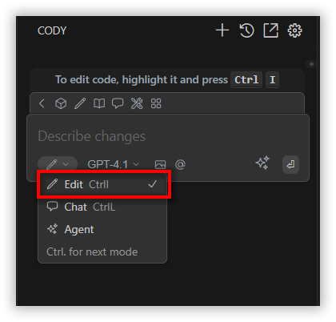
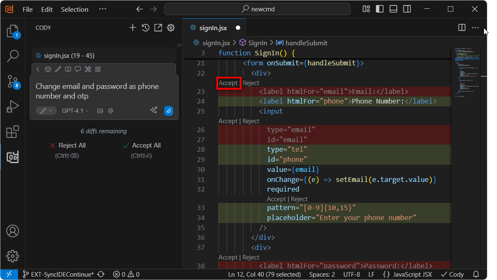
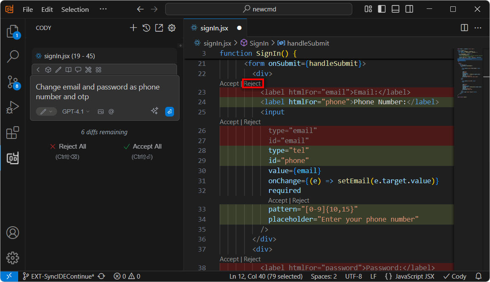

# Edit Feature Overview

Edit makes it easy to quickly update specific code or files. Just highlight the code you want to change, describe the update, and the changes will appear inline for you to **accept** or **reject**. It’s a fast and efficient way to make precise edits directly in your file.

---

## Code Selection & AI Assistance Feature

You can easily get AI help with specific code segments by:

- **Selecting any portion of code** in your editor and pressing:
  - `Command + I` (Mac)  
  - `Control + I` (Windows)

- This action will automatically send the selected code to the Cody via chat.

- You can then specify the update for the selected code and describe the changes you want the assistant (Cody) to apply.

---

### Reviewing Changes

- If you click the **Apply** button, Each change can be **reviewed and applied** individually.

---
 
- If you click the **Reject** button, Each change can be **reviewed and rejected** individually.

---

- You can also use the **Accept All** or **Reject All** buttons in the chat to apply or discard changes when diffs are available.
