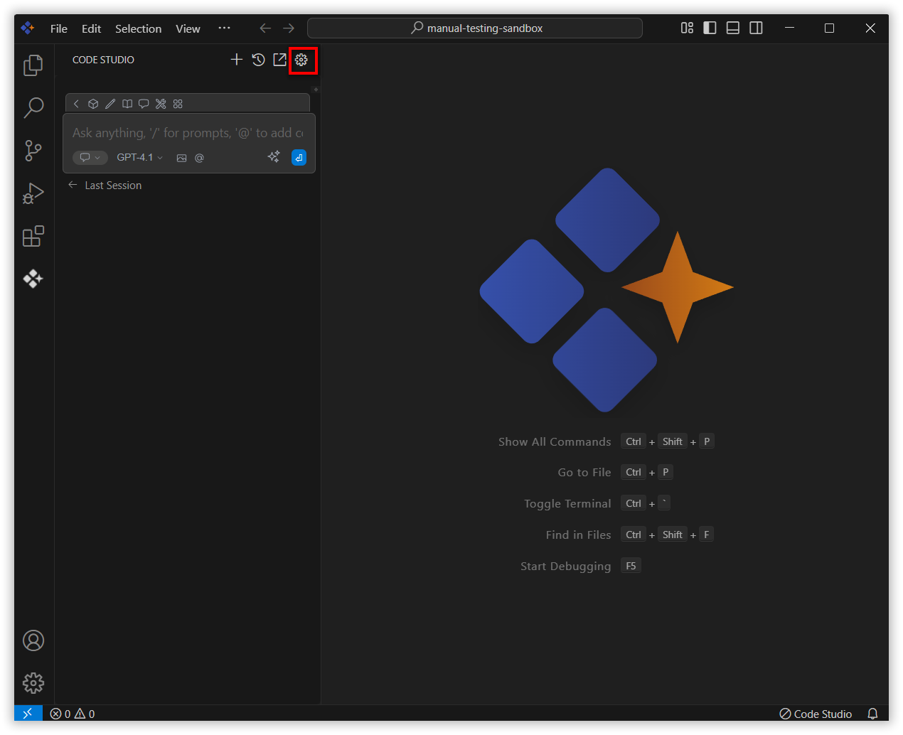
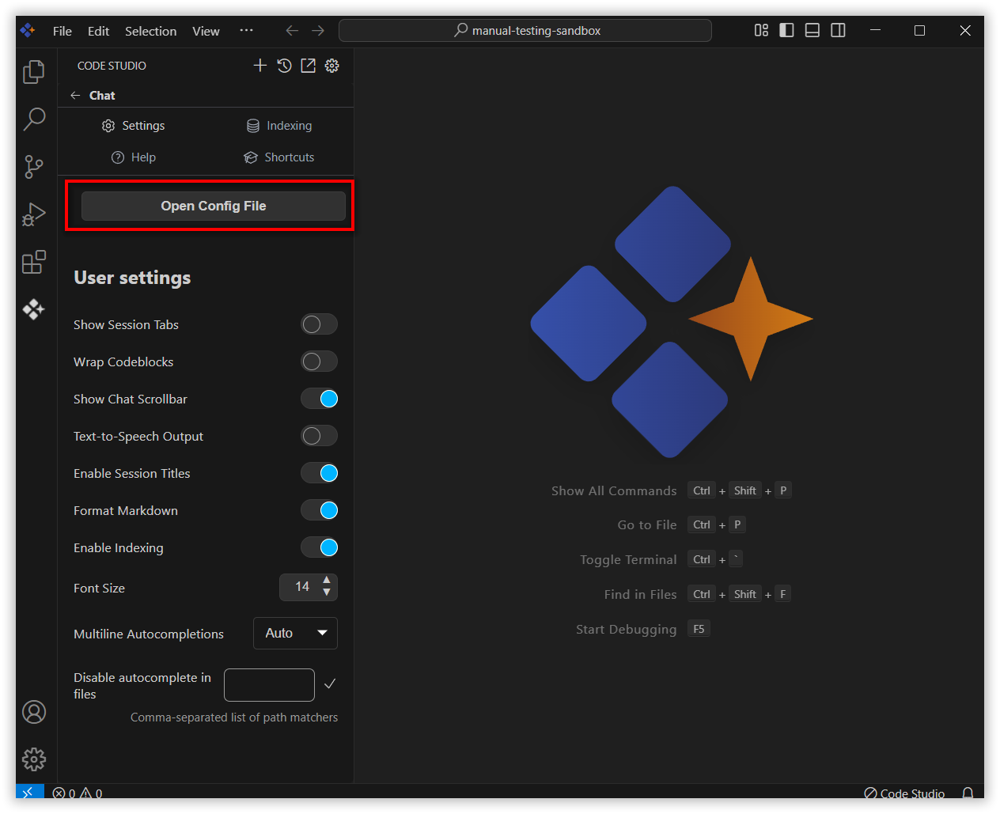
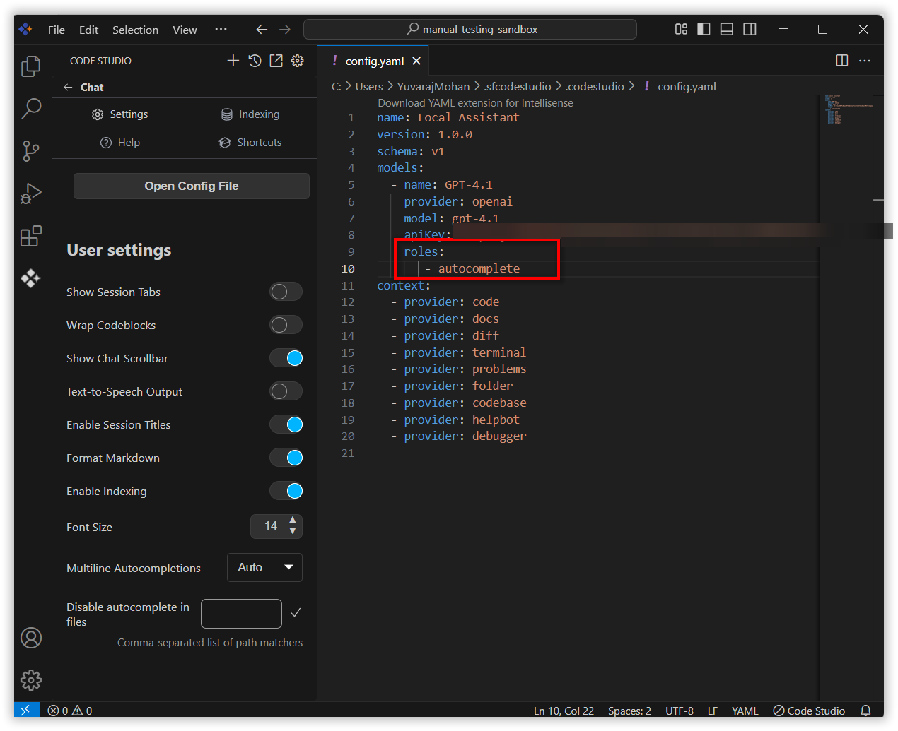
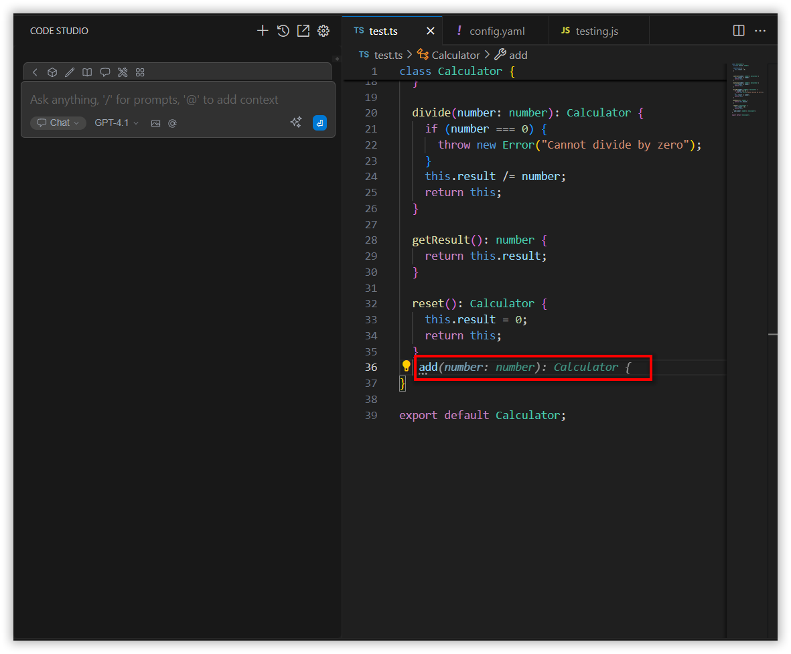

# Autocomplete

Autocomplete provides inline code suggestions as you type. It provides real-time, inline code suggestions as you type, helping you write code faster and with fewer errors. As you begin typing, it predicts and displays context-aware completions directly. This feature enhances productivity by reducing repetitive typing and offering intelligent suggestions based on your current code and project context.

## Steps to Integrate Autocomplete Feature:

**Step 1:** Open your `config.yaml` file by clicking the gear icon at the top of the chat.

**Step 2:** Then click the **"open config file"** button to open the `config.yaml` file.

**Step 3:** Inside the `config.yaml` file, add `roles` under the model which you are using in the `models` section. Inside `roles`, add `"autocomplete"`.

**Step 4:** Now if you type in the file, it will suggest code completions.

---

## Accepting a full suggestion:
Press the **"Tab"** key on your keyboard.

## Rejecting a full suggestion:
Press the **"Esc"** key on your keyboard.

## Partially accepting a suggestion:
Press **"Cmd/Ctrl + →"** on your keyboard to accept parts of the suggestion word-by-word.

