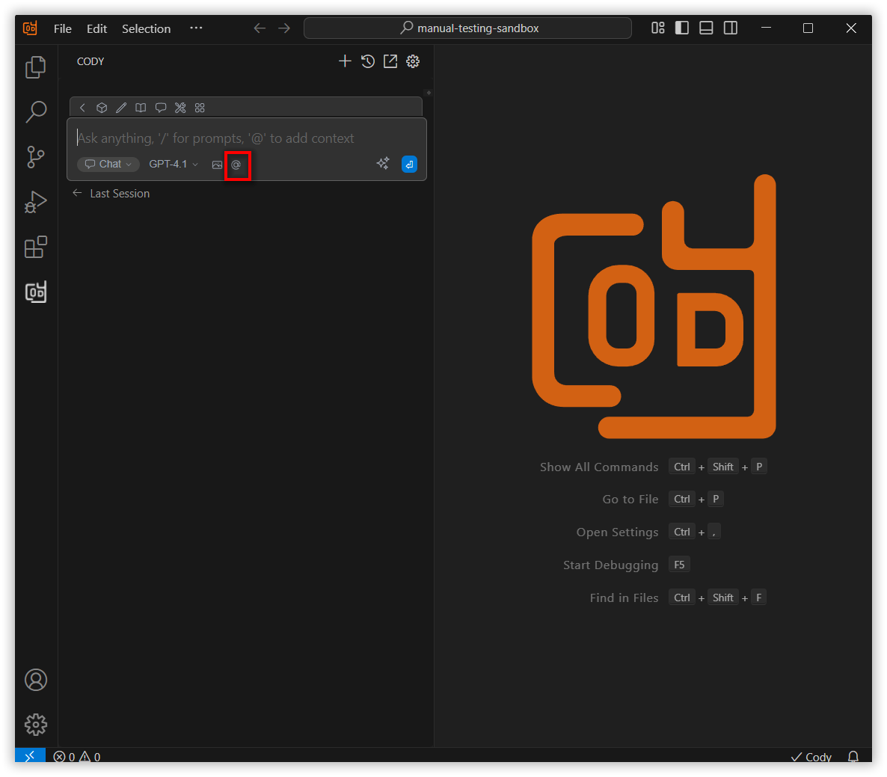
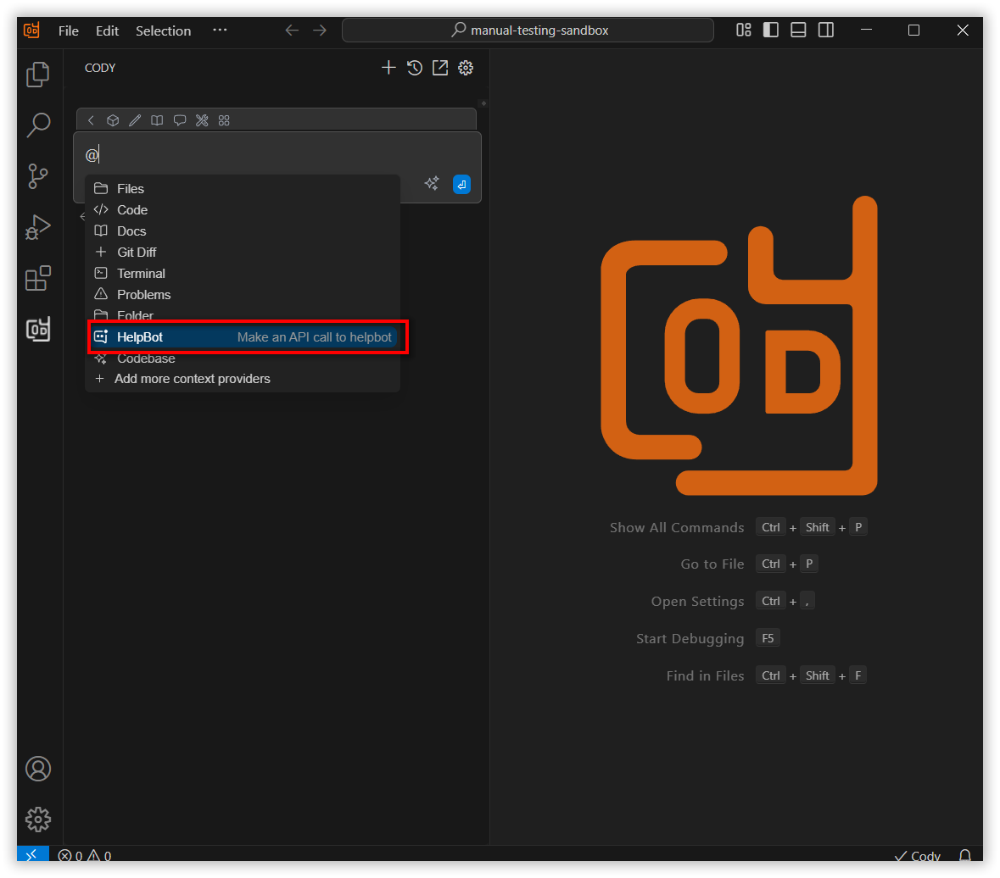
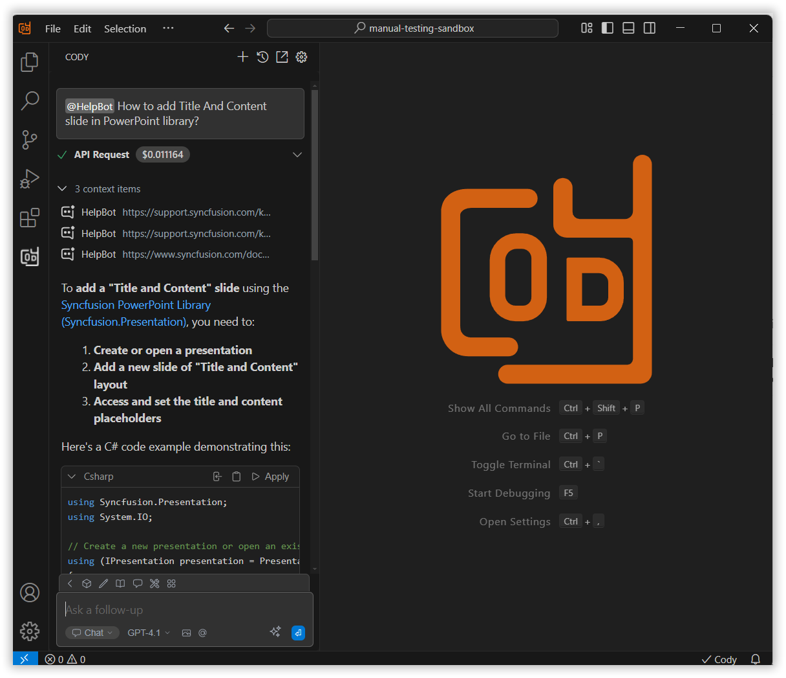

# HelpBot

The HelpBot context in Syncfusion Code Studio gives quick access to Syncfusion’s documentation. It checks user guides, API references, help articles, and forums to find useful information. This makes it easier to solve problems and understand Syncfusion documentation without leaving the editor.

## How to Use helpbot Context

### 1. Open the Chat Window

Click the Syncfusion Code Studio icon on the left toolbar to open the Syncfusion Code Studio chat window.

### 2. Select helpbot Context

In the chat window, click the `@` button.
> **Note:** If you cannot locate the helpbot context option in the list, you will need to add it manually by including this context provider in the config.yaml file. Please follow the steps outlined in this [link](https://help.syncfusioncody.com/syncfusion-code-studio/features/context-providers/add-more-contextproviders/How-to-configure-more-contextproviders) to do so.

From the context menu that appears, choose helpbot.

### 3. Use helpbot Context with Query

After choosing the HelpBot context, you can type a question to get helpful info from Syncfusion’s documentation.

For example, you can ask something like “How to add Title and Content slide in PowerPoint library?” Then press Enter.

HelpBot will search the documentation, retrieve relevant information, and display helpful results, giving you accurate answers based on your query.

