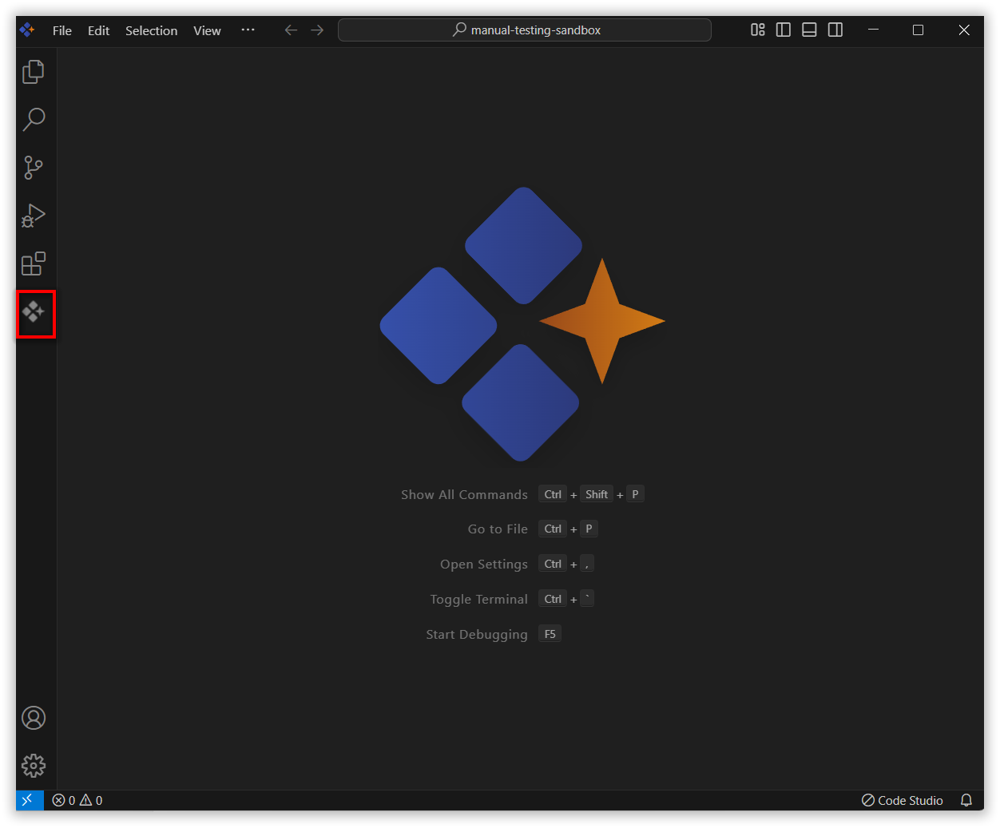
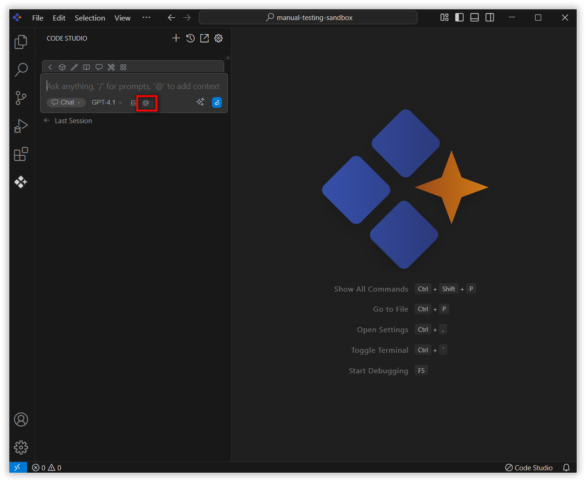
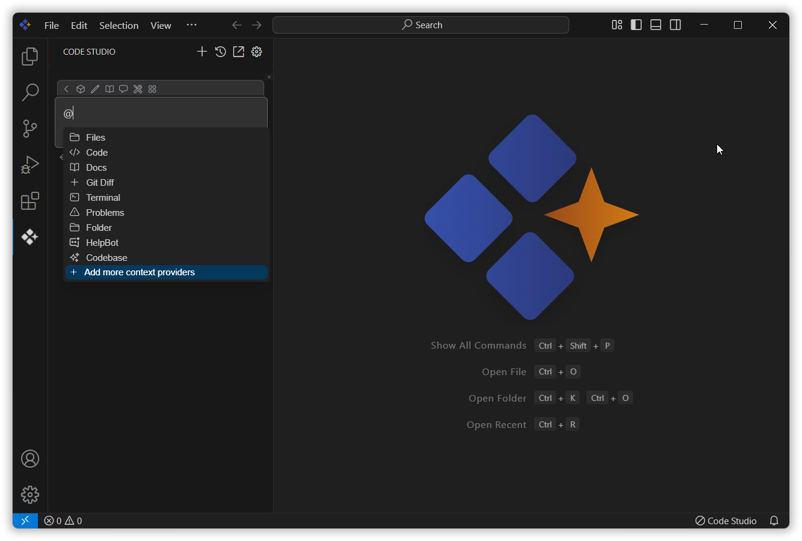

 
# How to configure more context providers
 
The Add More Context Provider feature lets you give the AI extra information to help it understand your project better.
 
## How to Use the Add more context providers
 
### 1. Open the Syncfusion Code Studio
 
In the Syncfusion Code Studio, the chat interface is located on the left-hand side. This is where you can interact with AI and ask questions or get assistance.


 
### 2. Select Add more Context Providers
 
In the chat window, click the `@` button.  
A menu will appear—select Add more context providers.  
This action automatically opens the `config.yaml` file in your editor.


 
### 3. Add Context Provider
 
After you click on "Add more context providers", the `config.yaml` file will open. You can then add the appropriate YAML object for the context provider you wish to use from the list below and insert it under context.
 


## Available Context Providers
 
### Files  
Reference any file within your current workspace.  
```yaml
- provider: files
```
### Problems
Get Problems from the current file.
```yaml
- provider: problems
```

### Terminal
Reference the most recent command executed in your Syncfusion code studio terminal along with its output.
```yaml
- provider: terminal
```

### Folders
Retrieves content from a single folder.
```yaml
- provider: folder
```

### Code
References specific functions or classes across your entire project.
```yaml 
- provider: code
```

### Codebase
References the most relevant code snippets from your codebase.
```yaml 
- provider: codebase
```

### Docs
Reference content from any documentation website.
```yaml 
- provider: docs
```

### OpenFiles
Reference the contents of all of your open files.
```yaml
- provider: open
```

### Database Tables
Reference table schemas from SQLite, PostgreSQL, MSSQL, and MySQL databases.
```yaml
- provider: database
  params:
    connections:
      - name: examplePostgres
        connection_type: postgres
        connection:
          user: username
          host: localhost
          database: exampleDB
          password: yourPassword
          port: 5432
```

### Git Diff
Reference all the changes made in your current branch.
```yaml 
- provider: diff
```
### GitHub Issue
Reference the conversation in a GitHub issue.
```yaml
- provider: issue
  params:
    repos:
      - owner: owner_name
        repo: repo_name
        githubToken: github_token
```

### Helpbot
Gives quick access to Syncfusion’s documentation.
```yaml 
- provider: helpbot
```

### Web
Reference relevant web pages automatically selected based on your input.
```yaml
- provider: web
```

### Commit
Reference specific Git commit metadata and diffs, or retrieve a list of recent commits.
```yaml
- provider: commit
```

### Clipboard
Reference recent clipboard items.
```yaml
- provider: clipboard
```

### Debugger  
Reference the contents of the local variables in the debugger.  
```yaml
- provider: debugger
  params:
    stackDepth: 3
```

### Postgres  
Reference the schema of a table and some sample rows from a PostgreSQL database.  
```yaml
- provider: postgres
  params:
    host: localhost
    port: 5436
    user: myuser
    password: catsarecool
    database: animals
    schema: public
    sampleRows: 3
```

### URL  
Reference the markdown-converted contents of a given URL.  
```yaml
- provider: url
```
### Search
Reference results from a code search
```yaml
- provider: search
```