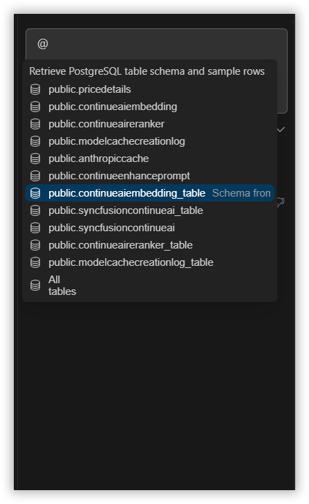
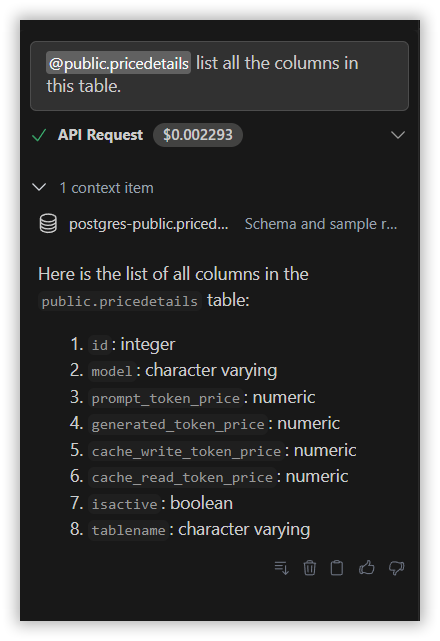

 
# PostgreSQL 
 
The PostgreSQL context provider in Syncfusion Code Studio enables seamless integration with PostgreSQL databases, allowing you to interact with your database directly from your development environment.
 
## How to Use the PostgreSQL Context
 
### 1. Open the Syncfusion Code Studio
 
In the Syncfusion Code Studio, the chat interface is located on the left-hand side. This is where you can interact with AI and ask questions or get assistance.

 
### 2. Select PostgreSQL context
 
In the chat window, click the `@` button.  
> **Note:** If you cannot locate the PostgreSQL context option in the list, you will need to add it manually to include this context provider. Please follow the steps outlined in this [link](https://help.syncfusioncody.com/syncfusion-code-studio/features/context-providers/add-more-contextproviders/How-to-configure-more-contextproviders) to do so.
 

A menu will appear—select PostgreSQL. This allows the AI to access your PostgreSQL database and utilize its data for context.

 
### 3. Select Required Table Schema
 
Select the table schemas from the list to enable the AI to access the connected database and deliver accurate, data-driven responses.

 
### 4. Describe the Query
 
Give the detailed query in the chat model window and click Enter.  
The AI will provide responses based on the PostgreSQL database context.
