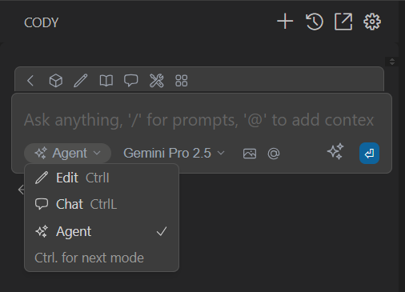
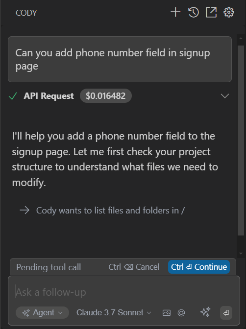
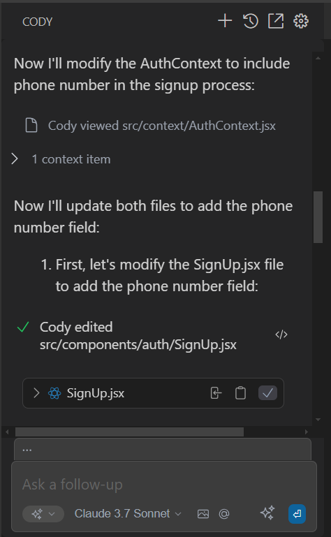

# Agent Mode

**Agent mode** in Cody is an AI coding assistant that works independently to explore your code, plan updates, and complete complex tasks. It’s designed to save you time by reading files, editing code, running commands, and using available tools — all with minimal input from you.

You can switch to **Agent mode** in the mode selector below the chat input box.

## Agent Capabilities

- **Autonomous Operation**  
  Automatically explores your code, finds the right files, and makes needed changes on its own.

- **Tool Access**  
  Uses all available tools to search, edit, create files, and run terminal commands.

- **Contextual Understanding**  
  Understands your existing codebase and its dependencies.

## Workflow of Agent

1. **Understand Request**  
   Analyzes your prompt and the current code to grasp the task and its goals.

2. **Explore Codebase**  
   Searches your code, documentation, or web to identify relevant files and understand the current implementation.

3. **Plan Changes**  
   Breaks the task into clear steps and prepares a change plan based on what it learns.

4. **Execute Changes**  
   Applies edits, adds code, suggests libraries or terminal commands, and performs required actions.

5. **Verify Results**  
   Checks the results, fixes any issues or linter errors, and ensures the code behaves as expected.

6. **Task Complete**  
   Summarizes all changes and hands back control once the task is completed.

## Giving Agent Permission

By default, Agent mode will ask for your permission before using any tool. Click **Continue** to approve the action, or **Cancel** to deny it.

Once tool permission is granted, Agent will proceed with the tool and provide the response in the chat output.

